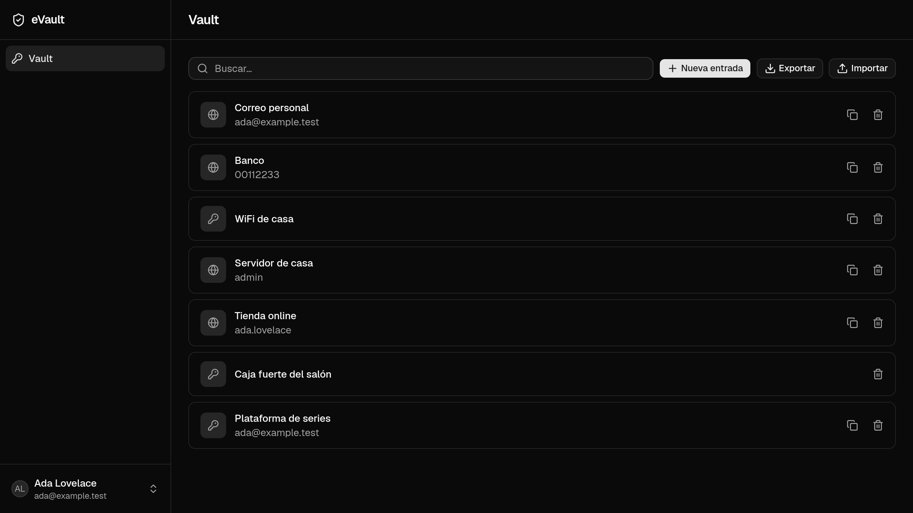

# eVault

A **zero-knowledge** password manager: encryption happens in your browser, and
the server only ever stores ciphertext it cannot open. Not the operator, not
someone with database access, not someone intercepting traffic.

> **About this project.** It is not a commercial product and does not aim to be.
> It started as a personal tool and is built in the open with two goals: to run
> it myself on my own instance, and to make the code and the reasoning behind it
> readable. It is designed to be self-hosted.

<!--
  MAIN SCREENSHOT — pending.
  Vault list with several items, dark theme, captured on localhost:5173.
  Save to docs/assets/vault.png and replace this comment with:
  
-->

<!--
  DEMO — pending deployment. Replace with:
  ## Live demo
  A demo instance runs at https://demo.yourdomain.app
  All data is fictional and is wiped automatically. Do not enter real
  passwords: it is a public demo.
-->

---

## What it does

- **An encrypted personal vault.** Create, edit, delete and search credentials.
  Everything meaningful — service name, username, password, URL and notes —
  travels encrypted, and the server never sees any of it in plaintext.
- **A password generator** with control over length and character sets.
- **Clipboard copy** without the password ever being rendered on screen.
- **Automatic locking.** Reloading the page locks the vault, because the
  encryption key lives in memory only and is never persisted anywhere.

## The security guarantee, concretely

This is the part that actually defines the project, so it is worth being precise
about what is promised and what is not.

**Your master password never leaves the device.** The browser derives two
separate values from it using PBKDF2-HMAC-SHA256 with 600,000 iterations, which
is OWASP's recommendation for this combination:

1. A **master key**, which stays in memory and never travels.
2. An **authentication hash**, derived from the master key using the password as
   salt, which is the only thing sent to the server. Reversing it would mean
   reversing HMAC-SHA256, so the server can verify who you are without ever being
   able to derive your key.

**The master key does not encrypt your data.** It wraps a random 256-bit vault
key, and that is what encrypts the content with AES-256-GCM. This indirection
buys two things: changing the master password becomes re-wrapping 32 bytes rather
than re-encrypting the entire vault, and sharing a vault between several people
fits the model without redesigning it — the same key is wrapped once per member.

**The server stores no readable metadata.** The `vault_items` table has no column
for name, username or URL. If the service name travelled in plaintext, the server
would know which sites you hold accounts with, which is precisely the metadata a
password manager must not leak. All the server knows is how many items exist and
when they were last touched.

**The session token is never persisted.** Not in `localStorage`, not in
`sessionStorage`, not in cookies, not in IndexedDB. The reason is not that
`localStorage` is insecure in the abstract, but that the encryption key cannot be
persisted by any means: a reload requires re-entering the master password
regardless, so persisting the token would only keep alive a session incapable of
displaying anything.

### Verify it yourself

None of the above has to be taken on trust. With the project running:

```bash
# Save a credential through the UI, then look at what reached the database.
# None of the strings you typed appear anywhere.
php artisan tinker --execute="dd(DB::table('vault_items')->first());"
```

And in your browser's developer tools: the network tab shows that the registration
and login request bodies carry a base64 hash where the password would be expected,
and the storage tab shows no token saved anywhere.

### What this does not protect against

No browser-based password manager protects against a compromised server serving
modified JavaScript: whoever controls the code running in your browser can capture
the master password before any derivation happens. Client-side encryption protects
the database and the traffic, not the integrity of the delivered code. This is the
underlying reason serious password managers ship a browser extension and a native
app, whose code is signed and distributed through a store.

## Architecture

A monorepo holding two projects that deploy separately and communicate only over
HTTP with bearer tokens:

| Directory | Contents |
|---|---|
| `api/` | Laravel 13 — stateless REST API |
| `web/` | React 19 — the SPA where all cryptography happens |
| `docs/` | Architecture, decisions and planning |

The API holds no session: vault context travels explicitly on every request, and
services validate membership without consulting any server-side state.
Authentication uses bearer tokens rather than cookies, which is what will let a
native app or a browser extension consume the same API unchanged.

### Decisions

Architecture decisions are recorded as ADRs, each with the alternatives that were
rejected and why. They are immutable: when a decision changes, a new ADR
supersedes the old one rather than editing it.

| ADR | Decision |
|---|---|
| [001](docs/architecture/decisions/ADR-001-zero-knowledge.md) | Zero-knowledge: encryption happens on the client |
| [002](docs/architecture/decisions/ADR-002-react-vault-filament-admin.md) | React for the vault, since server-side rendering would break the guarantee |
| [003](docs/architecture/decisions/ADR-003-monorepo-api-y-spa.md) | Monorepo with separate API and SPA |
| [004](docs/architecture/decisions/ADR-004-multi-tenancy-sin-spatie-teams.md) | Multi-tenancy with explicit context, without Spatie teams |
| [005](docs/architecture/decisions/ADR-005-arquitectura-self-hosteable.md) | Self-hostable from the first commit |
| [006](docs/architecture/decisions/ADR-006-typescript-6.md) | TypeScript 6 rather than 7, with a concrete blocker behind it |
| [007](docs/architecture/decisions/ADR-007-token-de-sesion-en-memoria.md) | The session token lives in memory only |
| [008](docs/architecture/decisions/ADR-008-arquitectura-de-claves.md) | Key architecture: a master key that wraps a vault key |
| [009](docs/architecture/decisions/ADR-009-proyecto-personal-y-publico.md) | No longer a SaaS: a self-hosted personal instance and a public repository |
| [010](docs/architecture/decisions/ADR-010-clave-de-recuperacion.md) | A recovery key that wraps the same vault key, so losing the master password has a way out |

## Stack

**API** — PHP 8.4, Laravel 13, Sanctum, MySQL 8 or SQLite. Tests with Pest 5,
static analysis with Larastan at level `max` with no baseline.

**Web** — React 19, TypeScript 6, Vite 8, Tailwind 4 with shadcn/ui, TanStack
Query, Zustand, Zod and React Router 8. Tests with Vitest 4 and Testing Library.

**Cryptography** — the browser's native WebCrypto, with no third-party
dependencies. PBKDF2-HMAC-SHA256 at 600,000 iterations and AES-256-GCM. Argon2id
was rejected because it would require third-party WebAssembly executing in the
same origin that holds the key, and that attack surface does not pay for the
improvement.

## Running it locally

Requirements: PHP 8.4, Composer, and **Node 24 or newer** — the 23.x line does not
satisfy the engine ranges several dependencies declare, and `npm install` will warn
repeatedly. There is an `.nvmrc`, so `nvm use` inside `web/` picks the right one. No
database server needed: it defaults to SQLite.

```bash
git clone git@github.com:ecamp0s/evault.git && cd evault
```

```bash
cd api && composer install && cp .env.example .env && php artisan key:generate && php artisan migrate && php artisan serve
```

`migrate` will notice that `database/database.sqlite` does not exist yet and offer
to create it — accept, the default is yes.

In a second terminal:

```bash
cd web && npm install && cp .env.example .env && npm run dev
```

Open **http://localhost:5173** and register.

> **Do not skip `cp .env.example .env`.** The SPA reads the API URL from the
> environment and refuses to start without it. If you skip it, the dev server stops
> with an explanation rather than serving a broken page.

> **The hostname matters.** The Web Crypto API only exists in secure contexts, so
> over plain `http://` the application needs a host that is `localhost` or ends in
> `.localhost` — otherwise there is no registration, no login and no encryption.
> Both are treated as trustworthy by the spec, which is why `app.evault.localhost`
> works without a certificate and why this project's own environment uses it. Any
> other hostname needs HTTPS.

## Quality

| | |
|---|---|
| API tests | 169, Pest against in-memory SQLite |
| Web tests | 283, Vitest and Testing Library |
| Static analysis | Larastan at level `max`, no baseline |
| CI | Lint, build, tests and analysis on every PR |

```bash
cd api && php artisan test && composer analyse
cd web && npm run test:run && npm run lint
```

Two rules followed here explain part of the suite: when the interface makes a
promise about security, a test is written that fails if that promise stops being
true; and watching a test pass is not treated as evidence that it works, so
critical tests are verified by deliberately breaking the code. That check has
already exposed tests that detected nothing.

## What it doesn't do, and why

- **There is no master password recovery.** This is not a missing feature, it is
  a direct consequence of the model: if the server could help you recover access,
  it could gain access itself. A client-generated recovery key is the planned
  mitigation, and its design is settled in
  [ADR-010](docs/architecture/decisions/ADR-010-clave-de-recuperacion.md): a random
  secret that wraps the same vault key, so the server still holds nothing it can
  open. It is not implemented yet.
- **There are no shared vaults or organisations.** The data model accommodates
  them without redesign, but they require asymmetric cryptography and there are
  no users who need them.
- **There are no native apps or browser extension** yet. The API is ready for
  them: token authentication and configurable origins.
- **There is no admin panel.** It was dropped once this stopped being a product
  with users to administer.

## Documentation

| Document | What it is |
|---|---|
| [docs/README.md](docs/README.md) | Index and reading order |
| [docs/architecture/FOUNDATION.md](docs/architecture/FOUNDATION.md) | Data model and the encrypted payload contract |
| [docs/architecture/decisions/](docs/architecture/decisions/) | The ten ADRs |
| [docs/development/SETUP.md](docs/development/SETUP.md) | Detailed development environment |
| [docs/planning/](docs/planning/) | Backlog, status and iteration history |

Note: this README is in English; the documentation it links to is written in
Spanish, as is the prose throughout the codebase. Identifiers, filenames and
types are in English.

## License

MIT — see [LICENSE](LICENSE).
