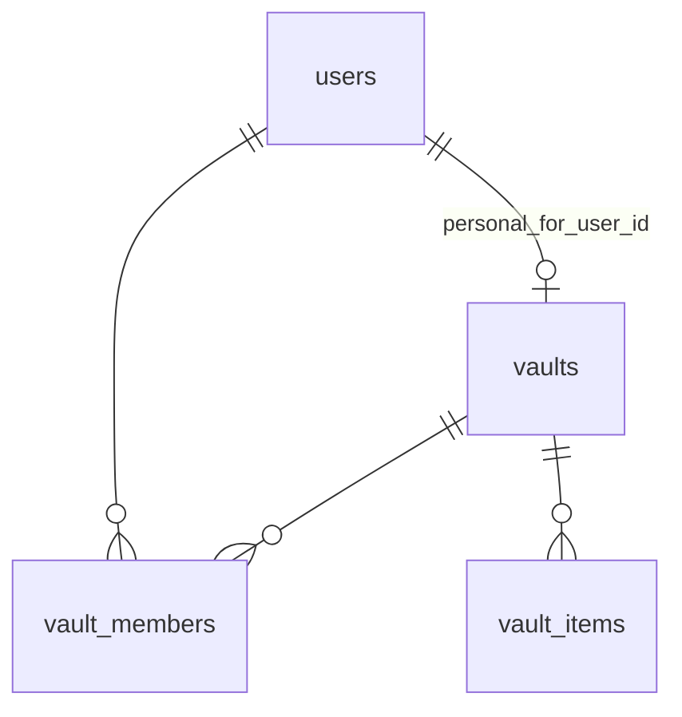

# eVault — Modelo de dominio

Actualizado: 2026-08-02

Qué hay en la base de datos, qué significa cada cosa y, sobre todo, **qué puede
leer el servidor y qué no**. Es el documento que hay que tener claro antes de
añadir una columna, un endpoint o un campo a una respuesta.

Las decisiones que hay detrás no se argumentan aquí: viven en los ADR, y este
documento las da por tomadas. En particular `ADR-001` (zero-knowledge) y
`ADR-004` (multi-tenancy por vault).

---

## 1) Las cuatro tablas



| Tabla | Qué es | Clave |
|---|---|---|
| `users` | La cuenta | Entero autoincremental |
| `vaults` | El tenant: un contenedor de secretos | UUIDv7 |
| `vault_members` | Quién pertenece a qué vault, con qué rol, y cómo la abre | Compuesta: `(vault_id, user_id)` |
| `vault_items` | Las entradas, opacas para el servidor | UUIDv7 |

### Por qué conviven dos tipos de identificador

`users` es de la Iteración 1 y usa entero autoincremental. Todo lo que cuelga de
un vault usa UUIDv7, y el motivo es de modelo de amenaza y no de estilo: un
entero secuencial en `vault_items` revelaría el número total de entradas del
sistema y su orden de creación, que es la misma clase de metadato que el resto
del diseño se esfuerza en no filtrar. Además estos identificadores viajan en la
URL, así que acaban en los logs del proxy.

El sello de tiempo que un UUIDv7 lleva dentro no añade ninguna fuga, porque
`created_at` ya está en claro en la misma fila.

### Vaults y pertenencia

El tenant personal es un vault. En la Iteración 2 todo usuario tiene exactamente
uno, creado dentro de la misma transacción que la cuenta, así que **cualquier
código posterior puede dar por hecho que existe**.

Ser el vault personal de alguien es la relación `personal_for_user_id`, no una
columna booleana. El índice único sobre esa columna convierte «un solo vault
personal por usuario» en una garantía de la base de datos. Es nula en las vaults
compartidas que traerá el plan Team.

`vault_members` lleva rol desde ya, aunque de momento solo exista `owner`. La
tabla no es un pivot puro y por eso no se llama `vault_user`: cuando existan las
organizaciones llevará además estado de invitación.

**Toda query que toque datos de usuario lleva `vault_id`.** Sin excepciones de
conveniencia; ver `ADR-004`.

### La clave envuelta

`vault_members` guarda además **la clave de la vault, envuelta**: el resultado de
cifrar la clave que abre el contenido con una clave derivada de la contraseña
maestra de ese miembro. Son dos columnas, `wrapped_key` y `wrapped_key_iv`, y para
el servidor son bytes opacos exactamente igual que `ciphertext`.

Las dos son `NOT NULL`, y no por rigor decorativo: un miembro sin clave envuelta es
alguien que no puede abrir su propia vault, y no hay forma de repararlo después
porque la clave vivía en su dispositivo y en ningún otro sitio. Hay un test que lo
comprueba saltándose la capa de aplicación, que es la única manera de saber que la
restricción existe de verdad.

Está en `vault_members` y no en `vaults` ni en `users` porque **no describe a una
vault ni a una persona, sino a la relación entre las dos**: es la respuesta a «cómo
abre esta persona esta vault». En `vaults` habría una sola copia por vault y habría
que rehacerlo al haber dos miembros; en `users`, una sola por persona, y no
admitiría más de una vault.

Consecuencia para quien escriba código: **la clave de la vault es una sola, y lo que
hay por miembro son envoltorios distintos de la misma clave.** Invitar a alguien a
una vault compartida será escribir una fila más, no recifrar nada. Y cambiar la
contraseña maestra reescribe esa fila y ningún item.

La clave envuelta se entrega en `GET /api/vaults`, junto al resto de lo que el
cliente necesita para situarse. El servidor no la valida ni la interpreta: no puede.

El cliente averigua qué vaults tiene con `GET /api/vaults`, que devuelve
identificador, nombre, si es el personal y el rol. Es el único endpoint que no
lleva vault en la URL, porque es el que sirve para descubrirlos. No se resolvió
añadiéndolo a `/api/auth/me`, que habría sido más barato mientras cada usuario
tenga uno solo, para no tocar un contrato que se mantiene estable hasta la
Iteración 3.

---

## 2) El contrato del blob

Es la parte del modelo que no se puede cambiar sin migrar datos de usuario que
nadie más que el usuario puede leer. Conviene leerla entera antes de tocar
`vault_items`.

### Qué NO tiene la tabla

No hay columna de nombre, ni de usuario, ni de URL, ni de notas, ni de tipo. No
es algo pendiente de una iteración futura.

El razonamiento: no basta con cifrar la contraseña de cada entrada. Si el nombre
de la entrada o su dirección viajaran en claro, el servidor sabría en qué
servicios tiene cuenta cada usuario. Ese metadato es, por sí solo, información
sensible: dice dónde atacar, y en algunos casos es más comprometedor que la
propia contraseña.

Por eso **todo lo que significa algo vive dentro del blob**, y el servidor
almacena bytes con los que no puede hacer nada: ni buscar, ni ordenar, ni
validar.

### Las columnas

| Columna | Tipo | Qué es |
|---|---|---|
| `id` | UUIDv7 | |
| `vault_id` | UUIDv7, FK con borrado en cascada | Obligatoria |
| `ciphertext` | `longText` | El texto cifrado en base64, tal y como lo mandó el cliente |
| `iv` | `string` | El nonce de AES-GCM, en base64 |
| `version` | `unsignedSmallInteger` | Versión del **esquema criptográfico**, no del item |
| `created_at`, `updated_at` | | |

`ciphertext` se guarda como el texto que llegó y no como binario decodificado. Si
el servidor lo decodificara para almacenarlo estaría interpretando el payload, y
cada conversión de ida y vuelta es una oportunidad de corromperlo.

Con AES-256-GCM la etiqueta de autenticación va concatenada al final del texto
cifrado, así que **no necesita columna propia**. Conviene saberlo para no añadirla
en la Iteración 3.

### Qué va dentro del blob

El cliente serializa a JSON, lo cifra entero y manda el resultado. La forma del
objeto es cosa del cliente y el servidor no la conoce, pero fijarla aquí evita
que cada cliente invente la suya:

```json
{
  "nombre": "GitHub",
  "usuario": "ada@example.com",
  "password": "…",
  "url": "https://github.com",
  "notas": "…"
}
```

Reglas de serialización: JSON UTF-8, claves ausentes en lugar de `null` para lo
que no se rellena, y ningún campo con valor semántico fuera de este objeto.

### Registro de versiones

| Versión | Esquema | Estado |
|---|---|---|
| 1 | **Codificación reversible, sin criptografía.** base64 del JSON en claro | Retirada. Las filas se borraron en la Iteración 3 |
| 2 | AES-256-GCM con la clave de la vault, que a su vez viaja envuelta con una clave derivada por PBKDF2 de la contraseña maestra | **Vigente** desde la Iteración 3. Ver `ADR-008` |

Matiz sobre la versión 2 que conviene no perder: la clave que cifra un item **no
es** la derivada de la contraseña maestra. Es la clave de la vault, aleatoria, y lo
que la contraseña maestra hace es abrir el envoltorio que la guarda. Eso es lo que
permite cambiar la contraseña maestra sin tocar un solo item, y lo que hará posible
que dos personas lean la misma vault sin compartir contraseña.

Los datos escritos con la versión 1 **no se migran**: se descartan. No existe ruta
desde una contraseña que hasheó el servidor hacia una clave derivada en el cliente,
y lo hace legítimo la condición de no haber desplegado nunca con datos reales. El
cliente ya tolera un `version` que no sabe leer sin romper la lista, así que una
fila superviviente aparece como ilegible en vez de tumbar la pantalla.

**La versión 1 no era cifrado.** Fue la excepción deliberada de la Iteración 2: el
contrato quedaba en su forma definitiva desde el primer día y lo que cambiaba
después era solo el cliente, porque para el servidor siempre son bytes opacos. Es
el mismo patrón que se usó con la autenticación convencional de la Iteración 1, y
funcionó: al llegar el cifrado real no hubo que tocar ni la tabla ni la API.

La apuesta se pagó **retirando la excepción, no ampliándola**. La condición que la
acompañaba —no desplegar con datos reales hasta que la Iteración 3 cerrase— se
respetó, y por eso las filas de la versión 1 se pudieron borrar sin más: no eran
recuperables, porque recifrarlas habría exigido una clave que solo tiene el usuario,
y dejarlas habría llenado la vault de entradas ilegibles para siempre. Lo hace la
migración `descartar_vault_items_sin_cifrar`.

El registro está en la fila, y no en la configuración, precisamente para que la
migración a la versión 2 pueda ser progresiva: el cliente lee la versión de cada
item, decide cómo descifrarlo y lo reescribe con la nueva cuando le toque. No
hace falta una migración que reescriba la tabla entera de golpe, que además sería
imposible: el servidor no tiene las claves.

El servidor **no valida** la versión. Un cliente más nuevo tiene que poder
escribir un esquema que este servidor no conoce; opinar sobre criptografía que no
puede ejecutar solo serviría para bloquear despliegues escalonados. Hay un test
que lo fija.

---

## 3) Lo que el servidor sí sabe

Enumerado a propósito, porque es la superficie de metadatos que queda expuesta y
conviene que sea una lista corta y consciente en vez de una sorpresa:

- Cuántas vaults hay y a qué usuarios pertenecen
- El nombre de cada vault
- **Cuántos items tiene cada vault**
- Cuándo se creó y cuándo se modificó cada item
- El tamaño aproximado de cada item
- Que existe una clave envuelta por miembro, y cuándo se escribió por última vez.
  Su contenido, no: abrirla exige la contraseña maestra de ese miembro. Lo que sí
  delata es **cuándo alguien cambió su contraseña maestra**, que es la única
  operación que reescribe esa fila

Es inherente al modelo mientras las filas existan, y se asume igual que lo asume
Bitwarden. Ninguna de esas cosas revela contenido, pero sí patrones de uso.

Aviso sobre el nombre del vault: hoy es siempre el literal `Personal`, así que no
dice nada. Cuando lleguen las vaults compartidas será un texto escrito por el
usuario, y **entonces habrá que decidir si entra en el blob**. Es una decisión
pendiente, no un descuido.

---

## 4) Consecuencias para quien escriba código

- **El cliente se sincroniza la vault entera** y descifra en memoria. No hay
  paginación ni búsqueda en servidor, porque el servidor no puede filtrar lo que
  no puede leer. Eso acota cuántos items se pueden manejar con comodidad, y es
  una consecuencia asumida en `ADR-001`.
- **Ningún endpoint recibe ni devuelve un secreto descifrado.**
- **Ninguna lógica de servidor puede depender del contenido de un item.** Si una
  funcionalidad lo necesita, se rediseña la funcionalidad.
- Añadir una columna a `vault_items` es una decisión de seguridad, no de esquema.
  Hay un test que enumera las columnas existentes y falla al añadir cualquiera:
  está para forzar esa conversación, no para actualizarlo sin pensar.

### 404 y nunca 403

Pedir algo a lo que no se tiene acceso responde **404**, no 403, tanto si el
identificador no existe como si existe y pertenece a otro. Un 403 confirmaría que
el identificador es real, y con eso se pueden enumerar vaults e items ajenos sin
llegar a leer ninguno.

La propiedad que hay que conservar al añadir endpoints: **un recurso ajeno y uno
inexistente tienen que responder exactamente lo mismo**, mismo código y mismo
cuerpo. Hay tests que comparan las dos respuestas entre sí en lugar de comprobar
cada una por su lado, porque lo que importa es que sean indistinguibles.

### El double guard, en la práctica

La pertenencia al vault se comprueba **dos veces**, y no es redundancia
decorativa:

1. En presentación, con el middleware `EnsureVaultMembership`, que cubre todo el
   grupo de rutas para que una ruta nueva quede protegida sin que nadie se acuerde.
2. En la capa de aplicación, dentro de cada servicio, que no da por hecho el
   trabajo del middleware.

Lo que la segunda barrera protege es el día en que un comando de consola, un job
en cola o un endpoint nuevo llamen a un servicio sin pasar por el middleware. Hay
un test por servicio que lo llama directamente para comprobarlo.

Además, el acotado por `vault_id` al buscar un item vive en un solo sitio,
`VaultItemLocator`. Repetir esa consulta en cada servicio sería repartir por el
código tres oportunidades de olvidar el `where`, que es exactamente el fallo que
`ADR-004` señala como el más grave posible.
