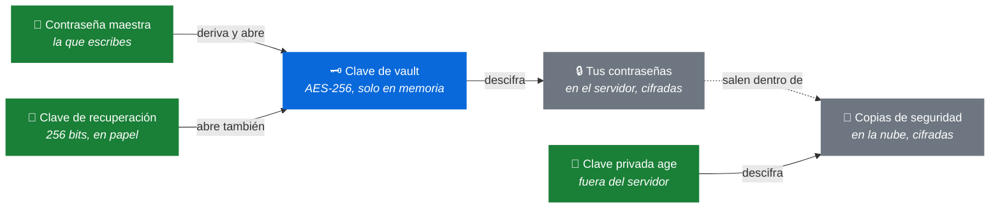

# eVault — Mapa de los secretos

**Qué es esto.** Un mapa de dónde está cada llave y qué abre. Para consultar, no para
decidir: si lo que buscas es *por qué* está montado así, los ADR del final tienen el
razonamiento entero y las opciones que se descartaron.

Existe porque hay **cuatro secretos distintos** y su explicación estaba repartida entre
tres ADR, que son documentos de decisión y no de consulta. Ver el issue #246.

---

## Los cuatro secretos

| | Dónde vive | Qué abre | Si lo pierdes | Si te lo roban |
|---|---|---|---|---|
| **Contraseña maestra** | En tu cabeza. No se guarda en ninguna parte | La clave de vault | Usas la clave de recuperación | Entran a tu vault |
| **Clave de recuperación** | Fuera del dispositivo: papel, caja fuerte | La misma clave de vault | Nada, mientras recuerdes la contraseña | Entran a tu vault, **sin segundo factor** |
| **Clave de vault** | Solo en la memoria del navegador. Nunca la ves ni la escribes | Tus contraseñas guardadas | — no la manejas tú | — no sale del dispositivo |
| **Clave privada de las copias** | Fuera del servidor. En otro sitio que tus copias | Las copias de seguridad | Las copias son ilegibles para siempre | Leen tus copias |

---

## Qué abre qué

**En verde, lo que custodias tú.** En azul, lo que se deriva solo y nunca tocas. En
gris, los datos.

Las dos claves de arriba **abren lo mismo por caminos distintos**, y de ahí salen casi
todas las confusiones. La de `age` es de otra familia: no tiene nada que ver con la
vault, solo con sus copias.

---

## Las cinco preguntas

### Si pierdo la contraseña maestra, ¿qué hago?

Usar la clave de recuperación. Te dejará entrar y **te obligará a fijar una contraseña
maestra nueva** antes de terminar — no se puede quedar a medias.

Si tampoco tienes la clave de recuperación, **la vault se pierde**. No es un fallo: el
servidor no puede ayudarte porque no tiene nada con qué. Está decidido en `ADR-001` §5.1
y es el precio del modelo entero.

### Si pierdo el papel de la clave de recuperación, ¿qué pierdo?

La red de seguridad, no el acceso. Sigues entrando con tu contraseña maestra como
siempre.

Genera una nueva en cuanto puedas: hasta entonces, olvidar la contraseña maestra pasa a
ser definitivo.

### Si alguien entra en el servidor, ¿qué ve?

**Nada legible de tus contraseñas.** Ve blobs cifrados con AES-256-GCM, y ni la clave de
vault ni la contraseña maestra están ahí — la primera vive solo en la memoria de tu
navegador y la segunda no se guarda en ningún sitio.

Lo que sí ve, y conviene saberlo en vez de creer que no hay nada:

- **Los hashes de autenticación**, con los que el servidor te reconoce. No descifran
  nada, pero son material para intentar adivinar tu contraseña maestra sin límite de
  intentos. Es caro —600.000 iteraciones de PBKDF2 por intento— pero no imposible.
- **Las claves de vault envueltas**, que sin tu contraseña maestra o tu clave de
  recuperación no se abren.
- **Tampoco puede leer las copias que ya subió**, porque la clave que las descifra no
  está en el servidor.

### Si alguien entra en mi nube de copias, ¿qué ve?

Ficheros cifrados con `age` y nada más. Sin la clave privada no hay forma de abrirlos.

**Con una condición que es fácil de romper sin darse cuenta:** la clave privada **no
puede estar en ese mismo proveedor**. Si las copias están en un servicio y la clave en
ese mismo servicio, ese proveedor tiene a la vez el candado y la llave, y el cifrado
deja de protegerte **de él** — que era medio motivo de cifrarlo.

### Si pierdo la clave privada de las copias, ¿qué dejo de poder hacer?

Restaurar desde una copia. **Todas las copias existentes quedan ilegibles**, las de
antes y las de después, porque todas están cifradas para esa clave.

No pierdes la vault: sigue funcionando con tu contraseña maestra. Pierdes la red que te
protege de perder el servidor.

---

## Las dos asimetrías que más se malinterpretan

**Rotar la contraseña maestra NO invalida la clave de recuperación.** Cambiar la
contraseña reenvuelve la clave de vault, pero la clave de vault **es la misma**, y el
envoltorio de recuperación no se toca.

> Corolario incómodo: si sospechas que te han robado la clave de recuperación, cambiar
> la contraseña maestra **no cierra esa puerta**. Hay que generar una clave de
> recuperación nueva, que es otra operación.

**Cambiar el correo SÍ la invalida.** El correo no es un dato de perfil: es el *salt*
del que se derivan las claves, incluida la de recuperación. Al cambiarlo, la clave que
tienes en papel deja de abrir nada, y por eso esa operación no termina hasta entregarte
una nueva (`ADR-014`).

---

## Las dos reglas que explican la forma de todo lo demás

**1. La clave de vault nunca sale de tu navegador.** Ni al servidor, ni a disco, ni a
`localStorage`. Por eso recargar la página bloquea la vault —no es un fallo, es la
consecuencia— y por eso el servidor no puede leer nada aunque quiera.

**2. La clave privada de las copias nunca está en el servidor.** El servidor lleva solo
la pública, así que puede cifrar copias y no puede abrirlas. Por eso quien comprometa la
máquina no obtiene las copias anteriores.

Cada regla es el motivo de que algo **no pueda** leer algo. Si alguna se rompe, lo que
se cae no es una funcionalidad: es la garantía.

---

## Los números, para quien los busque

| | |
|---|---|
| Derivación de la clave maestra | PBKDF2-SHA256, **600.000 iteraciones**, salt = tu correo normalizado |
| Clave de vault | **AES-256-GCM**, aleatoria, envuelta con la clave maestra |
| Clave de recuperación | **256 bits** aleatorios, mostrados como 52 caracteres de un alfabeto sin `I`, `L`, `O` ni `U` |
| Derivación desde la clave de recuperación | HKDF-SHA256, salt = tu correo normalizado |
| Copias de seguridad | `age`, cifrado asimétrico **X25519** |
| Formato del blob | `version 2` |

---

## Dónde está el porqué

Este documento dice **dónde está cada cosa**. El razonamiento, las alternativas que se
descartaron y sus tradeoffs están en los ADR:

| | |
|---|---|
| [`ADR-001`](decisions/ADR-001-zero-knowledge.md) | Por qué el servidor no puede leer nada, y qué se pierde a cambio |
| [`ADR-007`](decisions/ADR-007-token-de-sesion-en-memoria.md) | Por qué recargar bloquea la vault |
| [`ADR-008`](decisions/ADR-008-arquitectura-de-claves.md) | Por qué la contraseña maestra no cifra los items, sino que envuelve otra clave |
| [`ADR-010`](decisions/ADR-010-clave-de-recuperacion.md) | Por qué existe la clave de recuperación y qué amplía |
| [`ADR-013`](decisions/ADR-013-operacion-de-la-instancia-personal.md) | Por qué las copias se cifran con clave pública |
| [`ADR-014`](decisions/ADR-014-cambio-de-correo-electronico.md) | Por qué cambiar el correo invalida la clave de recuperación |

Y el formato del contenido cifrado, en [`FOUNDATION.md`](FOUNDATION.md).
