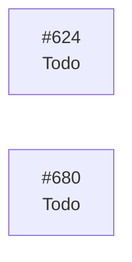

# eVault — Estado del Backlog

> **Documento generado. No editar a mano.**
> Se regenera con `scripts/status.sh` leyendo GitHub, que es la única fuente
> de verdad del estado. Si algo aquí no refleja la realidad, corregirlo en
> GitHub y volver a generar. Las secciones delimitadas como manuales sí se
> editan a mano y el generador las preserva. Ver `docs/GUIDE.md`.

Generado: 2026-09-21
Fuente: [ecamp0s/evault](https://github.com/ecamp0s/evault/issues) y Project «eVault»
Issues: 338 en total, 333 cerrados, 5 abiertos

---

## 1) Objetivo de la iteración

<!-- manual:objetivo -->
**Iteración 19: sin planificar.** La 18 se cerró el 16 de septiembre de 2026 con su objetivo cumplido —la vault se abre desde la barra del navegador— y su detalle está en [docs/planning/archive/ITERACION_18.md](archive/ITERACION_18.md).

**Los candidatos, para quien la planifique**, sin orden decidido:

- [#680](https://github.com/ecamp0s/evault/issues/680), **la extensión en Firefox.** Firefox en Windows ya da PRF a la web; falta medirlo desde una extensión y decidir dónde se custodia la clave, porque no tiene documentos *offscreen*. Pide un ADR o una revisión de `ADR-023`.
- **La deuda del cierre de la 18**, tres issues: [#694](https://github.com/ecamp0s/evault/issues/694), `verify-extension` no comprueba rellenar; [#695](https://github.com/ecamp0s/evault/issues/695), `verify-auto-lock` mira el aviso con seis segundos de margen y salió dos veces en rojo sin fallo del código; y [#696](https://github.com/ecamp0s/evault/issues/696), el aviso «Encountered a script tag» que React 19.3 imprime por `next-themes`.
- [#624](https://github.com/ecamp0s/evault/issues/624), **reconciliar sin red**, que viene de la 17.
- **La papelera de `ADR-018`**, que sigue diferida y no tiene issue. La 18 la dejó para decidirla «con la extensión delante», y la extensión ya existe. **De su sección 2.5 solo queda el endpoint para cerrar las demás sesiones**: la caducidad de 12 horas está en vigor desde el #177, aunque `ADR-018` y `ADR-023` la den por diferida.
- **Lo que la extensión dejó escrito como fuera de alcance**, por si alguno deja de estarlo: escribir en la vault, un atajo de teclado —`ADR-023` lo admite, pero la clave vive en el documento *offscreen* y el atajo la usaría desde el service worker— y detectar un campo tapado por otro elemento o recortado con `clip-path` al rellenar.

**Y lo que no es de una iteración sino de quien tiene la vault:** 512 de 660 contraseñas con algo que corregir, 24 entradas sin confirmar, y decidir si olvida el historial de la vault real ahora que se puede (#646).
<!-- /manual:objetivo -->

## 2) Qué se puede tomar ahora

Issues abiertos sin ningún bloqueante abierto, ordenados por prioridad. El primero de la lista es lo siguiente a tomar.

1. [#680](https://github.com/ecamp0s/evault/issues/680) feat(extension): la extensión en Firefox (Medium)
1. [#694](https://github.com/ecamp0s/evault/issues/694) chore(repo): verify-extension también comprueba rellenar (Medium)
1. [#695](https://github.com/ecamp0s/evault/issues/695) chore(repo): verify-auto-lock vigila el aviso en vez de mirarlo a los 14:45 (Medium)
1. [#696](https://github.com/ecamp0s/evault/issues/696) chore(web): quitar el aviso «Encountered a script tag» de React 19.3 (Medium)
1. [#624](https://github.com/ecamp0s/evault/issues/624) feat(web): reconciliar sin red (Low)

## 3) Backlog

Lo abierto y todo lo de las iteraciones que siguen abiertas.

| Issue | Título | Labels | Estado | Prioridad | Bloqueada por | Bloquea a |
| --- | --- | --- | --- | --- | --- | --- |
| [#624](https://github.com/ecamp0s/evault/issues/624) | feat(web): reconciliar sin red | `feat` `web` `s19` | Todo | Low | #619 | — |
| [#680](https://github.com/ecamp0s/evault/issues/680) | feat(extension): la extensión en Firefox | `feat` `extension` `s19` | Todo | Medium | #675 | — |
| [#694](https://github.com/ecamp0s/evault/issues/694) | chore(repo): verify-extension también comprueba rellenar | `chore` `deuda` `extension` `s19` | Todo | Medium | — | — |
| [#695](https://github.com/ecamp0s/evault/issues/695) | chore(repo): verify-auto-lock vigila el aviso en vez de mirarlo a los 14:45 | `chore` `web` `deuda` `s19` | Todo | Medium | — | — |
| [#696](https://github.com/ecamp0s/evault/issues/696) | chore(web): quitar el aviso «Encountered a script tag» de React 19.3 | `chore` `web` `deuda` `s19` | Todo | Medium | — | — |

Las iteraciones cerradas no se pintan aquí: sus issues están en GitHub y lo que se aprendió, en `docs/planning/archive/`. Cada issue cuenta en la última iteración que lo lleva, así que el enlace de una puede enseñar alguno más: los que empezaron en ella y se cerraron en otra.

| Iteración | Issues | Dónde verlos |
| --- | --- | --- |
| 18 | 16 | [label `s18`](https://github.com/ecamp0s/evault/issues?q=is%3Aissue+label%3As18) |
| 17 | 24 | [label `s17`](https://github.com/ecamp0s/evault/issues?q=is%3Aissue+label%3As17) |
| 16 | 26 | [label `s16`](https://github.com/ecamp0s/evault/issues?q=is%3Aissue+label%3As16) |
| 15 | 26 | [label `s15`](https://github.com/ecamp0s/evault/issues?q=is%3Aissue+label%3As15) |
| 14 | 22 | [label `s14`](https://github.com/ecamp0s/evault/issues?q=is%3Aissue+label%3As14) |
| 13 | 23 | [label `s13`](https://github.com/ecamp0s/evault/issues?q=is%3Aissue+label%3As13) |
| 12 | 20 | [label `s12`](https://github.com/ecamp0s/evault/issues?q=is%3Aissue+label%3As12) |
| 11 | 13 | [label `s11`](https://github.com/ecamp0s/evault/issues?q=is%3Aissue+label%3As11) |
| 10 | 16 | [label `s10`](https://github.com/ecamp0s/evault/issues?q=is%3Aissue+label%3As10) |
| 9 | 16 | [label `s9`](https://github.com/ecamp0s/evault/issues?q=is%3Aissue+label%3As9) |
| 8 | 10 | [label `s8`](https://github.com/ecamp0s/evault/issues?q=is%3Aissue+label%3As8) |
| 7 | 19 | [label `s7`](https://github.com/ecamp0s/evault/issues?q=is%3Aissue+label%3As7) |
| 6 | 16 | [label `s6`](https://github.com/ecamp0s/evault/issues?q=is%3Aissue+label%3As6) |
| 5 | 12 | [label `s5`](https://github.com/ecamp0s/evault/issues?q=is%3Aissue+label%3As5) |
| 4 | 19 | [label `s4`](https://github.com/ecamp0s/evault/issues?q=is%3Aissue+label%3As4) |
| 3 | 14 | [label `s3`](https://github.com/ecamp0s/evault/issues?q=is%3Aissue+label%3As3) |
| 2 | 13 | [label `s2`](https://github.com/ecamp0s/evault/issues?q=is%3Aissue+label%3As2) |
| 1 | 19 | [label `s1`](https://github.com/ecamp0s/evault/issues?q=is%3Aissue+label%3As1) |
| sin iteración | 9 | [sin label de iteración](https://github.com/ecamp0s/evault/issues?q=is%3Aissue+-label%3As19+-label%3As18+-label%3As17+-label%3As16+-label%3As15+-label%3As14+-label%3As13+-label%3As12+-label%3As11+-label%3As10+-label%3As9+-label%3As8+-label%3As7+-label%3As6+-label%3As5+-label%3As4+-label%3As3+-label%3As2+-label%3As1) |

## 4) Grafo de dependencias

La flecha va del bloqueante al bloqueado. En verde, lo ya cerrado.

## 5) Criterios de salida de la iteración

<!-- manual:salida -->
### Iteración 19, sin planificar

**Todavía no tiene criterios de salida.** Los de la 18, evaluados uno a uno, están en [docs/planning/archive/ITERACION_18.md](archive/ITERACION_18.md).
<!-- /manual:salida -->

## 6) Riesgos

<!-- manual:riesgos -->
| Riesgo | Estado | Detalle |
| --- | --- | --- |
| **Una pestaña abierta desde antes de un despliegue sigue con el código viejo** | `Abierto, heredado de la 17` | El service worker nuevo toma el control, pero una página ya cargada ejecuta su código hasta que se recarga. No se puede cerrar: es un paso de cada despliegue, y el de la 18 lo llevó. **Con la extensión se suma otro caso del mismo tipo**: no se actualiza sola al desplegar (`ADR-023` §5.3), y la que esté cargada puede ir por detrás de la web. Que sea de solo lectura es lo que impide que eso cueste datos. |
| **El historial guarda contraseñas viejas, que son secretos** | `Mitigado desde el #646` | La vault custodia más secretos de los que su dueño metió (`ADR-018` §5.1). Desde la 18 se pueden olvidar todos de una vez, con un aviso aparte para las 24 entradas sin confirmar; hacerlo sobre la vault real lo decide quien la tiene. |
| **Un cierre de golpe del navegador deja un token vivo** | `Asumido en ADR-023 §5.6` | La extensión revoca su token al bloquear, pero si el navegador muere de golpe el documento *offscreen* no llega a hacerlo. El token sigue valiendo hasta que caduca, a las 12 horas, y se barre en el siguiente desbloqueo. Lo mismo le pasa a la web. |
| **El rellenado no tiene verificador de navegador** | `Abierto, deuda en el #694` | Se verificó en navegador con una sonda y a mano, pero ningún comando lo repite, y es el camino donde el navegador encontró lo que jsdom no ve (#673). |
| **`verify-auto-lock` puede salir en rojo sin que el código falle** | `Abierto, deuda en el #695` | Los casos 7, 8 y 9 miran el aviso a los 14:45 y la vault se bloquea a los 15. En el cierre de la 18 salió dos veces 2 de 8 con los textos correctos, porque la máquina se paró un minuto. Hasta el #695, un rojo en esos casos se lee con la captura antes de creerlo. |
| **El límite de desbloqueos con passkey se comparte** | `Asumido en ADR-023 §5.5` | Cinco por hora y cuenta, entre la web, la extensión y todos los dispositivos. Con quince minutos de inactividad, un uso salteado puede acercarse a él. Si pasa, el popup dice que hay que esperar y no culpa a la red. |
<!-- /manual:riesgos -->
