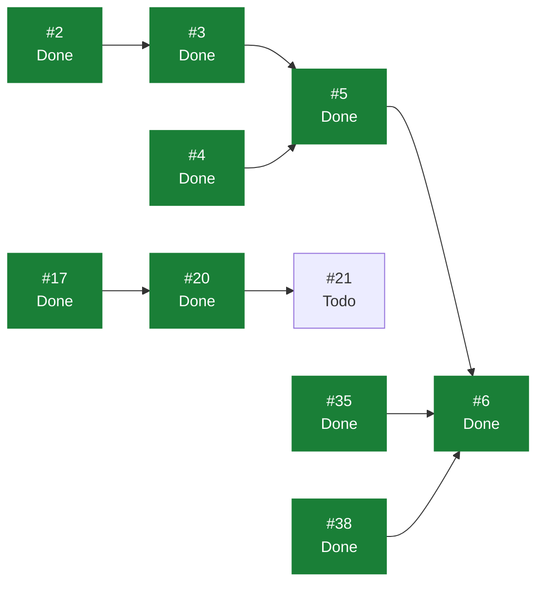

# eVault — Estado del Backlog

> **Documento generado. No editar a mano.**
> Se regenera con `scripts/status.sh` leyendo GitHub, que es la única fuente
> de verdad del estado. Si algo aquí no refleja la realidad, corregirlo en
> GitHub y volver a generar. Las secciones delimitadas como manuales sí se
> editan a mano y el generador las preserva. Ver `docs/GUIDE.md`.

Generado: 2026-07-31
Fuente: [ecamp0s/evault-claude](https://github.com/ecamp0s/evault-claude/issues) y Project «eVault»
Issues: 23 en total, 16 cerrados, 7 abiertos

---

## 1) Objetivo de la iteración

<!-- manual:objetivo -->
**Iteración 1: cerrada el 30 de julio de 2026.** El ciclo completo de autenticación funciona de punta a punta contra la API real: la SPA registra, entra, mantiene la sesión tras recargar, y sale revocando el token en el servidor. Un 401 en cualquier petición expulsa solo.

El objetivo no era la funcionalidad en sí, que es convencional, sino **validar el stack completo** —API, SPA, tokens, CORS, tests, análisis estático y CI— antes de introducir criptografía en el cliente en la Iteración 3. Se cumplió.

Lo que queda abierto no pertenece a esa validación: es deuda reconocida (`label:deuda`), cierre documental, o está bloqueado por el plan de GitHub.

**Iteración 2: sin planificar.** Su alcance —modelo de vaults y organizaciones del ADR-004, y CRUD de vault items— se decide antes de escribir código.
<!-- /manual:objetivo -->

## 2) Qué se puede tomar ahora

Issues abiertos sin ningún bloqueante abierto, ordenados por prioridad. El primero de la lista es lo siguiente a tomar.

1. [#43](https://github.com/ecamp0s/evault-claude/issues/43) chore(web): decidir dónde vive el token de sesión antes de la Iteración 3 (High)
1. [#21](https://github.com/ecamp0s/evault-claude/issues/21) chore(repo): proteger master con un ruleset (Medium)
1. [#46](https://github.com/ecamp0s/evault-claude/issues/46) feat(web): shell usable en móvil (Medium)
1. [#47](https://github.com/ecamp0s/evault-claude/issues/47) docs: cerrar formalmente la Iteración 1 en STATUS.md (Medium)
1. [#48](https://github.com/ecamp0s/evault-claude/issues/48) docs: partir SPRINT_CONTEXT y fijar las reglas de gestión de deuda (Medium)
1. [#44](https://github.com/ecamp0s/evault-claude/issues/44) chore(web): que /styleguide no viaje al build de producción (Low)
1. [#45](https://github.com/ecamp0s/evault-claude/issues/45) chore(web): reducir el bundle, hoy en 595 kB en un solo chunk (Low)

## 3) Backlog completo

| Issue | Título | Labels | Estado | Prioridad | Bloqueada por | Bloquea a |
| --- | --- | --- | --- | --- | --- | --- |
| [#1](https://github.com/ecamp0s/evault-claude/issues/1) | chore(api): stack de calidad — Pest, Larastan y CI | `s1` `chore` `api` | Done | — | — | — |
| [#2](https://github.com/ecamp0s/evault-claude/issues/2) | chore(api): Sanctum y CORS para consumo desde SPA | `s1` `chore` `api` | Done | High | — | #3 |
| [#3](https://github.com/ecamp0s/evault-claude/issues/3) | feat(api): endpoints de registro, login y sesión | `s1` `feat` `api` | Done | Medium | #2 | #5 |
| [#4](https://github.com/ecamp0s/evault-claude/issues/4) | chore(web): shadcn/ui y sistema de diseño base | `s1` `chore` `web` | Done | — | — | #5 |
| [#5](https://github.com/ecamp0s/evault-claude/issues/5) | feat(web): pantallas de login y registro | `s1` `feat` `web` | Done | Medium | #3, #4 | #6 |
| [#6](https://github.com/ecamp0s/evault-claude/issues/6) | feat(web): shell autenticado y rutas protegidas | `s1` `feat` `web` | Done | Low | #5, #35, #38 | — |
| [#9](https://github.com/ecamp0s/evault-claude/issues/9) | docs: fundación documental — índice, ADRs y STATUS.md generado | `s1` `chore` `documentation` | Done | High | — | — |
| [#11](https://github.com/ecamp0s/evault-claude/issues/11) | ci: regenerar STATUS.md automáticamente al mergear en master | `s1` `chore` `documentation` | Done | — | — | — |
| [#15](https://github.com/ecamp0s/evault-claude/issues/15) | fix(ci): localizar el Project por vinculación al repo, no por su nombre | `s1` `chore` `documentation` | Done | — | — | — |
| [#17](https://github.com/ecamp0s/evault-claude/issues/17) | ci(web): lint y build del frontend en cada PR | `s1` `chore` `web` | Done | High | — | #20 |
| [#18](https://github.com/ecamp0s/evault-claude/issues/18) | chore(repo): plantillas de issue en .github/ISSUE_TEMPLATE | `s1` `chore` `documentation` | Done | Low | — | — |
| [#19](https://github.com/ecamp0s/evault-claude/issues/19) | chore(repo): Dependabot para composer, npm y GitHub Actions | `s1` `chore` | Done | Low | — | — |
| [#20](https://github.com/ecamp0s/evault-claude/issues/20) | ci: mover el filtrado de paths del trigger a los jobs | `s1` `chore` | Done | Medium | #17 | #21 |
| [#21](https://github.com/ecamp0s/evault-claude/issues/21) | chore(repo): proteger master con un ruleset | `s1` `chore` | Todo | Medium | #20 | — |
| [#25](https://github.com/ecamp0s/evault-claude/issues/25) | chore(api): rate limiting en los endpoints de autenticación | `s1` `chore` `api` | Done | Medium | — | — |
| [#35](https://github.com/ecamp0s/evault-claude/issues/35) | chore(web): evaluar la migración a React Router 8 | `s1` `chore` `web` | Done | High | — | #6 |
| [#38](https://github.com/ecamp0s/evault-claude/issues/38) | chore(web): suite de tests de frontend con Vitest y Testing Library | `s1` `chore` `web` | Done | High | — | #6 |
| [#43](https://github.com/ecamp0s/evault-claude/issues/43) | chore(web): decidir dónde vive el token de sesión antes de la Iteración 3 | `chore` `web` `deuda` | Todo | High | — | — |
| [#44](https://github.com/ecamp0s/evault-claude/issues/44) | chore(web): que /styleguide no viaje al build de producción | `chore` `web` `deuda` | Todo | Low | — | — |
| [#45](https://github.com/ecamp0s/evault-claude/issues/45) | chore(web): reducir el bundle, hoy en 595 kB en un solo chunk | `chore` `web` `deuda` | Todo | Low | — | — |
| [#46](https://github.com/ecamp0s/evault-claude/issues/46) | feat(web): shell usable en móvil | `feat` `web` `deuda` | Todo | Medium | — | — |
| [#47](https://github.com/ecamp0s/evault-claude/issues/47) | docs: cerrar formalmente la Iteración 1 en STATUS.md | `s1` `chore` `documentation` | Todo | Medium | — | — |
| [#48](https://github.com/ecamp0s/evault-claude/issues/48) | docs: partir SPRINT_CONTEXT y fijar las reglas de gestión de deuda | `s1` `chore` `documentation` | Todo | Medium | — | — |

## 4) Grafo de dependencias

La flecha va del bloqueante al bloqueado. En verde, lo ya cerrado.

## 5) Criterios de salida de la iteración

<!-- manual:salida -->
Los seis criterios de la Iteración 1, todos cumplidos:

1. ✅ **Registro, login, logout y sesión activa contra la API.** Cuatro endpoints bajo `/api/auth` (#3), con logout que revoca el token en el servidor (#6).
2. ✅ **La SPA completa el ciclo en navegador, no solo en tests.** Verificado de extremo a extremo en #5 y #6, incluida la expulsión automática tras revocar el token en la base de datos.
3. ✅ **Rutas protegidas y expulsión ante un 401.** Guards con estado de hidratación e interceptor de respuesta (#6).
4. ✅ **Pest en verde y `composer analyse` sin errores.** 72 tests en la API, y Larastan en nivel `max` sin baseline.
5. ✅ **CI en verde en el PR de cada issue.** Cinco checks, con filtrado por área que reporta siempre (#17, #20).
6. ✅ **Contrato de la API documentado y estable.** Forma de respuestas y de errores fijada en #3, con la política de idioma anotada en #5.

Extra no previsto en los criterios: 44 tests de frontend (#38) y rate limiting en los endpoints públicos (#25).
<!-- /manual:salida -->

## 6) Riesgos

<!-- manual:riesgos -->
| Riesgo | Estado | Detalle |
| --- | --- | --- |
| La autenticación de la Iteración 1 **no es zero-knowledge**: la contraseña viaja al servidor | `Aceptado` | Deliberado y temporal. Se sustituye en la Iteración 3. El contrato de la API se mantiene estable para que el cambio sea mínimo. Ver `ADR-001` |
| Orígenes CORS mal configurados degradando a permisivo | `Mitigado` | Cerrado en #2. El parseo es fail-closed y descarta el comodín incluso escrito a propósito; sin orígenes, la API aborta con un mensaje explícito en vez de abrirse |
| Fuerza bruta contra el login | `Mitigado` | Cerrado en #25. Cinco intentos por minuto y combinación de IP y correo, más límite por IP en el registro |
| Un cambio de contrato en la Iteración 3 obligue a reescribir los clientes | `Open` | Rutas, forma de request/response y gestión de tokens ya fijadas. El riesgo persiste hasta que la Iteración 3 lo confirme en la práctica |
| El token en `localStorage` es accesible a un XSS | `Open` | Aceptado mientras la API no guarde secretos. **Ese razonamiento caduca en la Iteración 3.** Tiene issue: #43 |
| Cifrado en cliente con fallo silencioso: pérdida de datos irreversible | `Open` | Tests criptográficos dedicados antes de la Iteración 3. Ver `ADR-001` |
| Query sin `vault_id` filtrando datos entre tenants | `Open` | No aplica todavía: no hay modelo de vaults. Double guard más tests de aislamiento obligatorios cuando llegue. Ver `ADR-004` |
| Nivel `max` de Larastan insostenible al aparecer código de dominio | `Open` | Aguantó la Iteración 1 sin baseline. Bajar a 8 sigue siendo aceptable si llega el caso |
| `master` sin protección: un push directo o un force push no los impide nada | `Open` | **No se puede mitigar**: GitHub no permite rulesets en repos privados de cuentas Free. Ver #21. Mitigación parcial con el hook `pre-push`, que vive en el clon y se salta con `--no-verify` |
<!-- /manual:riesgos -->
