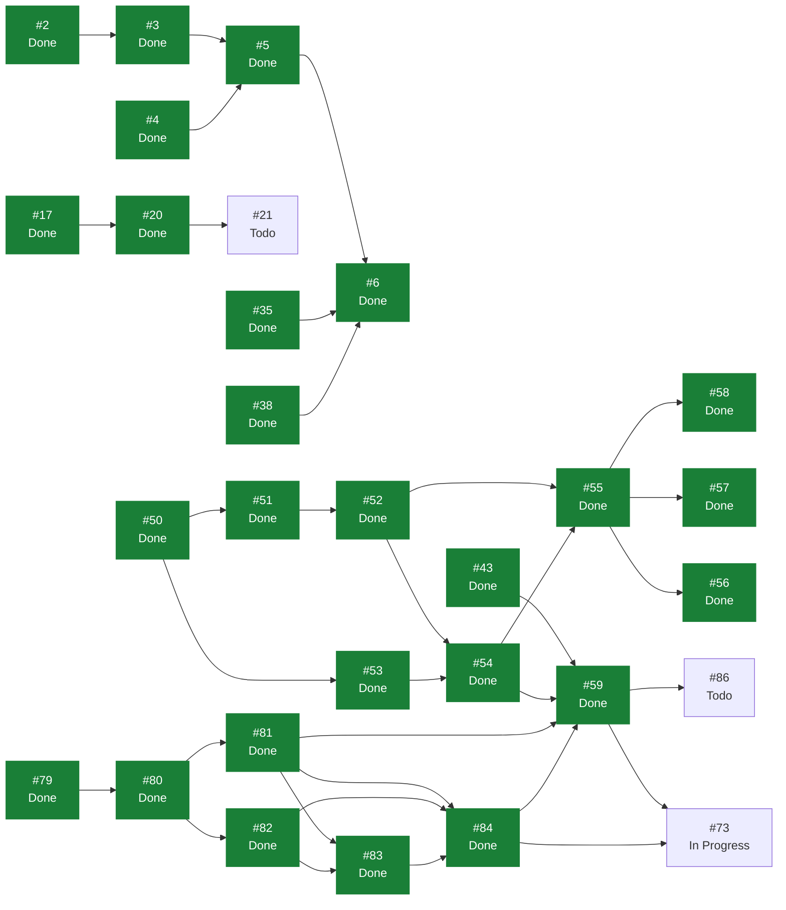

# eVault — Estado del Backlog

> **Documento generado. No editar a mano.**
> Se regenera con `scripts/status.sh` leyendo GitHub, que es la única fuente
> de verdad del estado. Si algo aquí no refleja la realidad, corregirlo en
> GitHub y volver a generar. Las secciones delimitadas como manuales sí se
> editan a mano y el generador las preserva. Ver `docs/GUIDE.md`.

Generado: 2026-08-02
Fuente: [ecamp0s/evault-claude](https://github.com/ecamp0s/evault-claude/issues) y Project «eVault»
Issues: 47 en total, 38 cerrados, 9 abiertos

---

## 1) Objetivo de la iteración

<!-- manual:objetivo -->
**Iteración 3: en curso desde el 2 de agosto de 2026.** Objetivo: *el servidor deja de poder leer nada del usuario, y la vault se bloquea y se desbloquea con la contraseña maestra.*

Es la iteración que cumple `ADR-001`. Las dos anteriores construyeron el producto sobre dos excepciones deliberadas al principio fundamental —autenticación convencional en la Iteración 1, contenido sin cifrar en la Iteración 2—, tomadas para fijar y validar el contrato antes de introducir criptografía. Esta las retira las dos, y las retira juntas porque comparten la derivación de clave.

**Advertencia vigente, y es la más importante del proyecto hasta que cierre #59.** El contenido de los vault items **no está cifrado**: viaja con una codificación reversible que cualquiera puede deshacer. La condición que va con ella no es negociable: **no se despliega con datos reales hasta que cierre la Iteración 3.**

Doce issues, ocho nuevos y cuatro arrastrados. La columna vertebral es una cadena de dependencias que va de la decisión al código y del código a la interfaz: `ADR-008` fija la arquitectura de claves (#80), el módulo criptográfico y sus tests son el suelo (#81), el servidor aprende a guardar la clave de vault envuelta (#82), y encima van registro (#83), login (#84), cifrado real de los items (#59) y bloqueo de la vault (#73). Fuera de esa cadena entran la CSP (#77), el trigger del workflow `status` (#63), el generador de contraseñas (#85) y la búsqueda de items (#86).

**La arquitectura de claves, decidida al planificar y pendiente de argumentar en `ADR-008`:** PBKDF2 deriva una clave maestra que no cifra items, solo envuelve una clave de vault aleatoria que es la que cifra. Cambiar la contraseña maestra pasa a ser reenvolver un blob en vez de recifrar la vault entera, y es el único camino que admite las vaults compartidas del plan Team sin rediseñar el modelo.

Fuera de la iteración a propósito: #45, el bundle en un solo chunk, que es lo primero que caería si el sprint se llena; #62, comprobaciones de documentación en los PR; y el cambio de contraseña maestra, que la clave envuelta abarata pero que no hace falta para cumplir `ADR-001`.

**Iteración 2: cerrada el 2 de agosto de 2026.** Objetivo cumplido: *un usuario guarda, consulta, edita y borra credenciales en su vault personal*. Su historial, sus lecciones y sus criterios de salida están en `docs/planning/archive/ITERACION_2.md`.

**Iteración 1: cerrada el 30 de julio de 2026.** Ver `docs/planning/archive/ITERACION_1.md`.
<!-- /manual:objetivo -->

## 2) Qué se puede tomar ahora

Issues abiertos sin ningún bloqueante abierto, ordenados por prioridad. El primero de la lista es lo siguiente a tomar.

1. [#63](https://github.com/ecamp0s/evault-claude/issues/63) fix(ci): el workflow status escribe en master fuera de los disparadores declarados (High)
1. [#73](https://github.com/ecamp0s/evault-claude/issues/73) chore(web): dejar de persistir el token de sesión (ADR-007) (High) — **en curso**
1. [#21](https://github.com/ecamp0s/evault-claude/issues/21) chore(repo): proteger master con un ruleset (Medium)
1. [#62](https://github.com/ecamp0s/evault-claude/issues/62) ci: comprobaciones de documentación en los PR (Medium)
1. [#77](https://github.com/ecamp0s/evault-claude/issues/77) chore(web): definir y servir una Content-Security-Policy (Medium)
1. [#85](https://github.com/ecamp0s/evault-claude/issues/85) feat(web): generador de contraseñas (Medium)
1. [#86](https://github.com/ecamp0s/evault-claude/issues/86) feat(web): búsqueda de items en la vault (Medium)
1. [#91](https://github.com/ecamp0s/evault-claude/issues/91) chore(dev): el entorno local no puede ejecutar crypto.subtle (Medium)
1. [#45](https://github.com/ecamp0s/evault-claude/issues/45) chore(web): reducir el bundle, que va en un solo chunk (Low)

## 3) Backlog completo

| Issue | Título | Labels | Estado | Prioridad | Bloqueada por | Bloquea a |
| --- | --- | --- | --- | --- | --- | --- |
| [#1](https://github.com/ecamp0s/evault-claude/issues/1) | chore(api): stack de calidad — Pest, Larastan y CI | `s1` `chore` `api` | Done | — | — | — |
| [#2](https://github.com/ecamp0s/evault-claude/issues/2) | chore(api): Sanctum y CORS para consumo desde SPA | `s1` `chore` `api` | Done | High | — | #3 |
| [#3](https://github.com/ecamp0s/evault-claude/issues/3) | feat(api): endpoints de registro, login y sesión | `s1` `feat` `api` | Done | Medium | #2 | #5 |
| [#4](https://github.com/ecamp0s/evault-claude/issues/4) | chore(web): shadcn/ui y sistema de diseño base | `s1` `chore` `web` | Done | — | — | #5 |
| [#5](https://github.com/ecamp0s/evault-claude/issues/5) | feat(web): pantallas de login y registro | `s1` `feat` `web` | Done | Medium | #3, #4 | #6 |
| [#6](https://github.com/ecamp0s/evault-claude/issues/6) | feat(web): shell autenticado y rutas protegidas | `s1` `feat` `web` | Done | Low | #5, #35, #38 | — |
| [#9](https://github.com/ecamp0s/evault-claude/issues/9) | docs: fundación documental — índice, ADRs y STATUS.md generado | `s1` `chore` `documentation` | Done | High | — | — |
| [#11](https://github.com/ecamp0s/evault-claude/issues/11) | ci: regenerar STATUS.md automáticamente al mergear en master | `s1` `chore` `documentation` | Done | — | — | — |
| [#15](https://github.com/ecamp0s/evault-claude/issues/15) | fix(ci): localizar el Project por vinculación al repo, no por su nombre | `s1` `chore` `documentation` | Done | — | — | — |
| [#17](https://github.com/ecamp0s/evault-claude/issues/17) | ci(web): lint y build del frontend en cada PR | `s1` `chore` `web` | Done | High | — | #20 |
| [#18](https://github.com/ecamp0s/evault-claude/issues/18) | chore(repo): plantillas de issue en .github/ISSUE_TEMPLATE | `s1` `chore` `documentation` | Done | Low | — | — |
| [#19](https://github.com/ecamp0s/evault-claude/issues/19) | chore(repo): Dependabot para composer, npm y GitHub Actions | `s1` `chore` | Done | Low | — | — |
| [#20](https://github.com/ecamp0s/evault-claude/issues/20) | ci: mover el filtrado de paths del trigger a los jobs | `s1` `chore` | Done | Medium | #17 | #21 |
| [#21](https://github.com/ecamp0s/evault-claude/issues/21) | chore(repo): proteger master con un ruleset | `s1` `chore` | Todo | Medium | #20 | — |
| [#25](https://github.com/ecamp0s/evault-claude/issues/25) | chore(api): rate limiting en los endpoints de autenticación | `s1` `chore` `api` | Done | Medium | — | — |
| [#35](https://github.com/ecamp0s/evault-claude/issues/35) | chore(web): evaluar la migración a React Router 8 | `s1` `chore` `web` | Done | High | — | #6 |
| [#38](https://github.com/ecamp0s/evault-claude/issues/38) | chore(web): suite de tests de frontend con Vitest y Testing Library | `s1` `chore` `web` | Done | High | — | #6 |
| [#43](https://github.com/ecamp0s/evault-claude/issues/43) | chore(web): decidir dónde vive el token de sesión antes de la Iteración 3 | `s2` `chore` `web` `deuda` | Done | High | — | #59 |
| [#44](https://github.com/ecamp0s/evault-claude/issues/44) | chore(web): que /styleguide no viaje al build de producción | `s2` `chore` `web` `deuda` | Done | Low | — | — |
| [#45](https://github.com/ecamp0s/evault-claude/issues/45) | chore(web): reducir el bundle, que va en un solo chunk | `chore` `web` `deuda` | Todo | Low | — | — |
| [#46](https://github.com/ecamp0s/evault-claude/issues/46) | feat(web): shell usable en móvil | `s2` `feat` `web` `deuda` | Done | Medium | — | — |
| [#47](https://github.com/ecamp0s/evault-claude/issues/47) | docs: cerrar formalmente la Iteración 1 en STATUS.md | `s1` `chore` `documentation` | Done | Medium | — | — |
| [#48](https://github.com/ecamp0s/evault-claude/issues/48) | docs: partir SPRINT_CONTEXT y fijar las reglas de gestión de deuda | `s1` `chore` `documentation` | Done | Medium | — | — |
| [#50](https://github.com/ecamp0s/evault-claude/issues/50) | feat(api): modelo de dominio de vaults y pertenencia | `s2` `feat` `api` | Done | High | — | #51, #53 |
| [#51](https://github.com/ecamp0s/evault-claude/issues/51) | feat(api): modelo de vault items con payload opaco | `s2` `feat` `api` | Done | High | #50 | #52 |
| [#52](https://github.com/ecamp0s/evault-claude/issues/52) | feat(api): CRUD de vault items con contexto de vault explícito | `s2` `feat` `api` | Done | High | #51 | #54, #55 |
| [#53](https://github.com/ecamp0s/evault-claude/issues/53) | feat(api): listado de los vaults del usuario | `s2` `feat` `api` | Done | Medium | #50 | #54 |
| [#54](https://github.com/ecamp0s/evault-claude/issues/54) | chore(web): capa de datos de la vault con TanStack Query | `s2` `chore` `web` | Done | Medium | #52, #53 | #55, #59 |
| [#55](https://github.com/ecamp0s/evault-claude/issues/55) | feat(web): lista de items de la vault | `s2` `feat` `web` | Done | High | #52, #54 | #56, #57, #58 |
| [#56](https://github.com/ecamp0s/evault-claude/issues/56) | feat(web): crear y editar un item de la vault | `s2` `feat` `web` | Done | High | #55 | — |
| [#57](https://github.com/ecamp0s/evault-claude/issues/57) | feat(web): borrar un item con confirmación | `s2` `feat` `web` | Done | Medium | #55 | — |
| [#58](https://github.com/ecamp0s/evault-claude/issues/58) | feat(web): mostrar, ocultar y copiar la contraseña | `s2` `feat` `web` | Done | Medium | #55 | — |
| [#59](https://github.com/ecamp0s/evault-claude/issues/59) | chore(web): sustituir la codificación temporal del payload por cifrado real | `s3` `chore` `web` `deuda` | Done | High | #43, #54, #81, #84 | #73, #86 |
| [#60](https://github.com/ecamp0s/evault-claude/issues/60) | docs: planificar la Iteración 2 | `s2` `chore` `documentation` | Done | — | — | — |
| [#62](https://github.com/ecamp0s/evault-claude/issues/62) | ci: comprobaciones de documentación en los PR | `s2` `chore` `documentation` | Todo | Medium | — | — |
| [#63](https://github.com/ecamp0s/evault-claude/issues/63) | fix(ci): el workflow status escribe en master fuera de los disparadores declarados | `s2` `s3` `chore` `documentation` | Todo | High | — | — |
| [#73](https://github.com/ecamp0s/evault-claude/issues/73) | chore(web): dejar de persistir el token de sesión (ADR-007) | `s3` `chore` `web` `deuda` | In Progress | High | #59, #84 | — |
| [#77](https://github.com/ecamp0s/evault-claude/issues/77) | chore(web): definir y servir una Content-Security-Policy | `s3` `chore` `web` | Todo | Medium | — | — |
| [#79](https://github.com/ecamp0s/evault-claude/issues/79) | docs: planificar la Iteración 3 | `s3` `chore` `documentation` | Done | High | — | #80 |
| [#80](https://github.com/ecamp0s/evault-claude/issues/80) | docs: ADR-008 — arquitectura de claves de la vault | `s3` `chore` `documentation` | Done | High | #79 | #81, #82 |
| [#81](https://github.com/ecamp0s/evault-claude/issues/81) | feat(web): módulo criptográfico con PBKDF2 y AES-256-GCM | `s3` `feat` `web` | Done | High | #80 | #59, #83, #84 |
| [#82](https://github.com/ecamp0s/evault-claude/issues/82) | feat(api): almacenar la clave de vault envuelta | `s3` `feat` `api` | Done | High | #80 | #83, #84 |
| [#83](https://github.com/ecamp0s/evault-claude/issues/83) | feat(web): registro con derivación en cliente | `s3` `feat` `web` | Done | High | #81, #82 | #84 |
| [#84](https://github.com/ecamp0s/evault-claude/issues/84) | feat(web): login con hash de autenticación derivado | `s3` `feat` `web` | Done | High | #81, #82, #83 | #59, #73 |
| [#85](https://github.com/ecamp0s/evault-claude/issues/85) | feat(web): generador de contraseñas | `s3` `feat` `web` | Todo | Medium | — | — |
| [#86](https://github.com/ecamp0s/evault-claude/issues/86) | feat(web): búsqueda de items en la vault | `s3` `feat` `web` | Todo | Medium | #59 | — |
| [#91](https://github.com/ecamp0s/evault-claude/issues/91) | chore(dev): el entorno local no puede ejecutar crypto.subtle | `s3` `chore` `deuda` | Todo | Medium | — | — |

## 4) Grafo de dependencias

La flecha va del bloqueante al bloqueado. En verde, lo ya cerrado.

## 5) Criterios de salida de la iteración

<!-- manual:salida -->
Los ocho criterios de la Iteración 3. Los cinco primeros son la definición de que el producto cumple `ADR-001`; los tres últimos son lo que impide darlo por bueno sin comprobarlo.

1. ⬜ **Inspeccionando la base de datos no se puede leer ningún dato de usuario.** Comprobado abriendo la fila en MySQL, igual que se comprobó en la Iteración 2 que no había columnas con significado. Es el criterio que da nombre a la iteración (#59).
2. ⬜ **La contraseña maestra no aparece en ninguna petición**, verificado en la pestaña de red del navegador y no solo por lectura del código (#83, #84).
3. ⬜ **El token de sesión no está en `localStorage`, `sessionStorage`, cookies ni IndexedDB.** Tampoco la clave de cifrado, en ninguna forma, incluida `CryptoKey` no extraíble (#73, `ADR-007`).
4. ⬜ **Recargar bloquea la vault, y la interfaz lo presenta como bloqueo y no como expulsión.** El usuario sigue siendo el mismo; lo que falta es la contraseña maestra (#73).
5. ⬜ **Un fallo de descifrado se comunica y nunca escribe datos corruptos encima de los buenos.** Es el criterio que cubre el riesgo que `ADR-001` señala como pérdida irreversible (#81, #59).
6. ⬜ **La estructura de `vault_items` no cambia respecto a la Iteración 2**, y `version` distingue el esquema nuevo del anterior. El test que enumera sus columnas sigue pasando sin tocarlo (#59, #82).
7. ⬜ **La aplicación sirve una Content-Security-Policy** y la consola no reporta violaciones en el uso normal, con `npm run dev` y HMR funcionando (#77).
8. ⬜ **Pest, Vitest, Larastan y CI en verde**, con `composer analyse` en nivel `max` y sin baseline.

Los criterios de las iteraciones cerradas están en `docs/planning/archive/`.
<!-- /manual:salida -->

## 6) Riesgos

<!-- manual:riesgos -->
| Riesgo | Estado | Detalle |
| --- | --- | --- |
| **El contenido de los vault items no está cifrado** | `Aceptado, con condición` | Deliberado y temporal. El servidor puede leer las contraseñas. La condición operativa mientras dure: **no desplegar con datos reales**. Es el objetivo de esta iteración: #59 |
| **Cifrado en cliente con fallo silencioso: pérdida de datos irreversible** | `Open, activo` | Pasa a ser el riesgo vivo de la iteración. Nadie puede recuperar lo que solo el usuario podía descifrar. Mitigación: el módulo criptográfico y sus tests se escriben antes que cualquier pantalla que lo use, contra el módulo desnudo y no a través de la interfaz (#81). Ver `ADR-001` |
| Una contraseña maestra olvidada es pérdida definitiva | `Aceptado, por diseño` | No es un fallo: `ADR-001` descarta la recuperación. El riesgo real es que el usuario no lo sepa a tiempo, y hoy la interfaz no lo dice en ninguna parte. `ADR-001` exige comunicarlo de forma inequívoca **antes** de crear la vault, con test que falle si el aviso desaparece (#83) |
| Los parámetros KDF quedan fijos en el cliente | `Aceptado, con trigger` | Consecuencia de usar el email como salt para evitar un endpoint de prelogin, que sería un oráculo de enumeración de cuentas. El precio: subir las iteraciones más adelante exigirá construir ese endpoint igualmente y re-derivar. Se argumenta y se le pone trigger de reevaluación en `ADR-008` (#80) |
| No hay migración desde la versión 1 del blob | `Aceptado` | Los datos de desarrollo se descartan con `migrate:fresh`: no existe ruta honesta desde una contraseña hasheada por el servidor hacia una clave derivada en cliente. Lo hace legítimo la condición de no desplegar con datos reales. El cliente ya tolera un `version` desconocido sin romper la lista |
| El token en `localStorage` es accesible a un XSS | `Decidido, en implementación` | `ADR-007` resuelve que pasa a vivir solo en memoria. Se implementa en esta iteración junto al desbloqueo, que es lo que lo hace tolerable. Tiene issue: #73 |
| Query sin `vault_id` filtrando datos entre tenants | `Mitigado` | El acotado vive en un único sitio, `VaultItemLocator`, y hay tests de aislamiento obligatorios por `ADR-004`. El patrón que salió de #52 es el que copiarán los servicios posteriores |
| Un 403 convirtiendo la API en oráculo de enumeración | `Mitigado` | Todo lo inaccesible responde 404. Los tests comparan la respuesta de un recurso ajeno con la de uno inexistente, en vez de comprobar cada una por su lado |
| El vaciado del portapapeles no ocurre sin https | `Aceptado` | `execCommand` exige un gesto del usuario, así que en contexto no seguro no puede vaciar. La interfaz deja de prometerlo en vez de fingirlo. Solo funcionará en producción |
| La validación de un item es solo de cliente | `Aceptado` | Excepción real al double guard, no descuido: el servidor no puede validar lo que no puede leer. Lo que no se valide en `esquema.ts` no lo valida nadie |
| Un cambio de contrato en la Iteración 3 obligue a reescribir los clientes | `Acotado` | Ya se sabe qué cambia y es aditivo: `register` gana dos campos de entrada y `GET /api/vaults` dos de salida. `login` y `me` no cambian, y el hash de autenticación viaja en el campo `password` que ya existe. Los tests que fijan las claves exactas de las respuestas de `register` y `me` siguen valiendo sin tocarlos (#82) |
| Nivel `max` de Larastan insostenible al aparecer código de dominio | `Mitigado` | Aguantó la iteración con dominio real y sin baseline. Encontró dos fallos que habrían pasado desapercibidos |
| El bundle crece sin control | `Open, fuera del sprint` | De 595 a 651 kB en un solo chunk. `WebCrypto` es nativo, así que la criptografía no lo empeora, y por eso #45 se queda fuera sin coste. Sigue siendo el primero de la lista para la siguiente |
| Sin CSP en ninguna parte | `En la iteración` | Entra ahora por el argumento del propio `ADR-007`: a partir de esta iteración el cliente tiene la clave de cifrado en memoria, y el origen de la SPA pasa a ser donde un script ajeno hace más daño. Empezando en `Report-Only`. Tiene issue: #77 |
| `master` sin protección | `Open` | **No se puede mitigar**: GitHub no permite rulesets en repos privados de cuentas Free. Ver #21. Mitigación parcial con el hook `pre-push` |
<!-- /manual:riesgos -->
