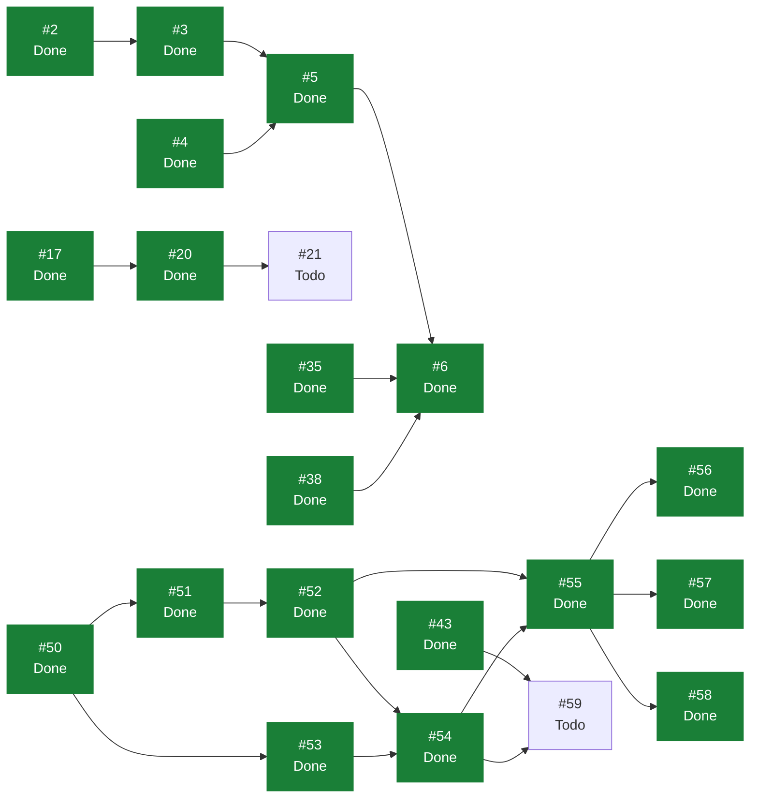

# eVault — Estado del Backlog

> **Documento generado. No editar a mano.**
> Se regenera con `scripts/status.sh` leyendo GitHub, que es la única fuente
> de verdad del estado. Si algo aquí no refleja la realidad, corregirlo en
> GitHub y volver a generar. Las secciones delimitadas como manuales sí se
> editan a mano y el generador las preserva. Ver `docs/GUIDE.md`.

Generado: 2026-08-02
Fuente: [ecamp0s/evault-claude](https://github.com/ecamp0s/evault-claude/issues) y Project «eVault»
Issues: 38 en total, 31 cerrados, 7 abiertos

---

## 1) Objetivo de la iteración

<!-- manual:objetivo -->
**Iteración 2: cerrada el 2 de agosto de 2026.** Objetivo cumplido: *un usuario guarda, consulta, edita y borra credenciales en su vault personal*, de punta a punta y verificado en navegador.

La Iteración 1 validó el stack pero no entregó producto. Esta introdujo el primer modelo de dominio —`Vault`, `VaultItem` y la pertenencia, según `ADR-004`—, el CRUD completo con aislamiento cross-tenant, y las cuatro pantallas que lo usan. Se cerró además la deuda que entró en el sprint: `ADR-007` sobre dónde vive el token (#43), el shell usable en móvil (#46) y `/styleguide` fuera del build (#44).

Su historial y sus lecciones están en `docs/planning/archive/ITERACION_2.md`.

**Advertencia vigente, y es la más importante del proyecto ahora mismo.** El contenido de los vault items **no está cifrado**: viaja con una codificación reversible que cualquiera puede deshacer. Fue una decisión de alcance deliberada, la misma jugada que se hizo con la autenticación en la Iteración 1, para fijar el contrato antes de meter criptografía. La condición que va con ella no es negociable: **no se despliega con datos reales hasta que cierre la Iteración 3.** Está registrada en #59.

**Iteración 3: sin planificar.** Su núcleo ya está decidido: cifrado real en cliente (#59) y sustitución de la autenticación por el modelo derivado con PBKDF2, más la implementación de `ADR-007` (#73), que va junto al desbloqueo por contraseña maestra.

**Iteración 1: cerrada el 30 de julio de 2026.** Ver `docs/planning/archive/ITERACION_1.md`.
<!-- /manual:objetivo -->

## 2) Qué se puede tomar ahora

Issues abiertos sin ningún bloqueante abierto, ordenados por prioridad. El primero de la lista es lo siguiente a tomar.

1. [#59](https://github.com/ecamp0s/evault-claude/issues/59) chore(web): sustituir la codificación temporal del payload por cifrado real (High)
1. [#73](https://github.com/ecamp0s/evault-claude/issues/73) chore(web): dejar de persistir el token de sesión (ADR-007) (High)
1. [#21](https://github.com/ecamp0s/evault-claude/issues/21) chore(repo): proteger master con un ruleset (Medium)
1. [#62](https://github.com/ecamp0s/evault-claude/issues/62) ci: comprobaciones de documentación en los PR (Medium)
1. [#63](https://github.com/ecamp0s/evault-claude/issues/63) fix(ci): el workflow status escribe en master fuera de los disparadores declarados (Medium)
1. [#77](https://github.com/ecamp0s/evault-claude/issues/77) chore(web): definir y servir una Content-Security-Policy (Medium)
1. [#45](https://github.com/ecamp0s/evault-claude/issues/45) chore(web): reducir el bundle, que va en un solo chunk (Low)

## 3) Backlog completo

| Issue | Título | Labels | Estado | Prioridad | Bloqueada por | Bloquea a |
| --- | --- | --- | --- | --- | --- | --- |
| [#1](https://github.com/ecamp0s/evault-claude/issues/1) | chore(api): stack de calidad — Pest, Larastan y CI | `s1` `chore` `api` | Done | — | — | — |
| [#2](https://github.com/ecamp0s/evault-claude/issues/2) | chore(api): Sanctum y CORS para consumo desde SPA | `s1` `chore` `api` | Done | High | — | #3 |
| [#3](https://github.com/ecamp0s/evault-claude/issues/3) | feat(api): endpoints de registro, login y sesión | `s1` `feat` `api` | Done | Medium | #2 | #5 |
| [#4](https://github.com/ecamp0s/evault-claude/issues/4) | chore(web): shadcn/ui y sistema de diseño base | `s1` `chore` `web` | Done | — | — | #5 |
| [#5](https://github.com/ecamp0s/evault-claude/issues/5) | feat(web): pantallas de login y registro | `s1` `feat` `web` | Done | Medium | #3, #4 | #6 |
| [#6](https://github.com/ecamp0s/evault-claude/issues/6) | feat(web): shell autenticado y rutas protegidas | `s1` `feat` `web` | Done | Low | #5, #35, #38 | — |
| [#9](https://github.com/ecamp0s/evault-claude/issues/9) | docs: fundación documental — índice, ADRs y STATUS.md generado | `s1` `chore` `documentation` | Done | High | — | — |
| [#11](https://github.com/ecamp0s/evault-claude/issues/11) | ci: regenerar STATUS.md automáticamente al mergear en master | `s1` `chore` `documentation` | Done | — | — | — |
| [#15](https://github.com/ecamp0s/evault-claude/issues/15) | fix(ci): localizar el Project por vinculación al repo, no por su nombre | `s1` `chore` `documentation` | Done | — | — | — |
| [#17](https://github.com/ecamp0s/evault-claude/issues/17) | ci(web): lint y build del frontend en cada PR | `s1` `chore` `web` | Done | High | — | #20 |
| [#18](https://github.com/ecamp0s/evault-claude/issues/18) | chore(repo): plantillas de issue en .github/ISSUE_TEMPLATE | `s1` `chore` `documentation` | Done | Low | — | — |
| [#19](https://github.com/ecamp0s/evault-claude/issues/19) | chore(repo): Dependabot para composer, npm y GitHub Actions | `s1` `chore` | Done | Low | — | — |
| [#20](https://github.com/ecamp0s/evault-claude/issues/20) | ci: mover el filtrado de paths del trigger a los jobs | `s1` `chore` | Done | Medium | #17 | #21 |
| [#21](https://github.com/ecamp0s/evault-claude/issues/21) | chore(repo): proteger master con un ruleset | `s1` `chore` | Todo | Medium | #20 | — |
| [#25](https://github.com/ecamp0s/evault-claude/issues/25) | chore(api): rate limiting en los endpoints de autenticación | `s1` `chore` `api` | Done | Medium | — | — |
| [#35](https://github.com/ecamp0s/evault-claude/issues/35) | chore(web): evaluar la migración a React Router 8 | `s1` `chore` `web` | Done | High | — | #6 |
| [#38](https://github.com/ecamp0s/evault-claude/issues/38) | chore(web): suite de tests de frontend con Vitest y Testing Library | `s1` `chore` `web` | Done | High | — | #6 |
| [#43](https://github.com/ecamp0s/evault-claude/issues/43) | chore(web): decidir dónde vive el token de sesión antes de la Iteración 3 | `s2` `chore` `web` `deuda` | Done | High | — | #59 |
| [#44](https://github.com/ecamp0s/evault-claude/issues/44) | chore(web): que /styleguide no viaje al build de producción | `s2` `chore` `web` `deuda` | Done | Low | — | — |
| [#45](https://github.com/ecamp0s/evault-claude/issues/45) | chore(web): reducir el bundle, que va en un solo chunk | `chore` `web` `deuda` | Todo | Low | — | — |
| [#46](https://github.com/ecamp0s/evault-claude/issues/46) | feat(web): shell usable en móvil | `s2` `feat` `web` `deuda` | Done | Medium | — | — |
| [#47](https://github.com/ecamp0s/evault-claude/issues/47) | docs: cerrar formalmente la Iteración 1 en STATUS.md | `s1` `chore` `documentation` | Done | Medium | — | — |
| [#48](https://github.com/ecamp0s/evault-claude/issues/48) | docs: partir SPRINT_CONTEXT y fijar las reglas de gestión de deuda | `s1` `chore` `documentation` | Done | Medium | — | — |
| [#50](https://github.com/ecamp0s/evault-claude/issues/50) | feat(api): modelo de dominio de vaults y pertenencia | `s2` `feat` `api` | Done | High | — | #51, #53 |
| [#51](https://github.com/ecamp0s/evault-claude/issues/51) | feat(api): modelo de vault items con payload opaco | `s2` `feat` `api` | Done | High | #50 | #52 |
| [#52](https://github.com/ecamp0s/evault-claude/issues/52) | feat(api): CRUD de vault items con contexto de vault explícito | `s2` `feat` `api` | Done | High | #51 | #54, #55 |
| [#53](https://github.com/ecamp0s/evault-claude/issues/53) | feat(api): listado de los vaults del usuario | `s2` `feat` `api` | Done | Medium | #50 | #54 |
| [#54](https://github.com/ecamp0s/evault-claude/issues/54) | chore(web): capa de datos de la vault con TanStack Query | `s2` `chore` `web` | Done | Medium | #52, #53 | #55, #59 |
| [#55](https://github.com/ecamp0s/evault-claude/issues/55) | feat(web): lista de items de la vault | `s2` `feat` `web` | Done | High | #52, #54 | #56, #57, #58 |
| [#56](https://github.com/ecamp0s/evault-claude/issues/56) | feat(web): crear y editar un item de la vault | `s2` `feat` `web` | Done | High | #55 | — |
| [#57](https://github.com/ecamp0s/evault-claude/issues/57) | feat(web): borrar un item con confirmación | `s2` `feat` `web` | Done | Medium | #55 | — |
| [#58](https://github.com/ecamp0s/evault-claude/issues/58) | feat(web): mostrar, ocultar y copiar la contraseña | `s2` `feat` `web` | Done | Medium | #55 | — |
| [#59](https://github.com/ecamp0s/evault-claude/issues/59) | chore(web): sustituir la codificación temporal del payload por cifrado real | `chore` `web` `deuda` | Todo | High | #43, #54 | — |
| [#60](https://github.com/ecamp0s/evault-claude/issues/60) | docs: planificar la Iteración 2 | `s2` `chore` `documentation` | Done | — | — | — |
| [#62](https://github.com/ecamp0s/evault-claude/issues/62) | ci: comprobaciones de documentación en los PR | `s2` `chore` `documentation` | Todo | Medium | — | — |
| [#63](https://github.com/ecamp0s/evault-claude/issues/63) | fix(ci): el workflow status escribe en master fuera de los disparadores declarados | `s2` `chore` `documentation` | Todo | Medium | — | — |
| [#73](https://github.com/ecamp0s/evault-claude/issues/73) | chore(web): dejar de persistir el token de sesión (ADR-007) | `chore` `web` `deuda` | Todo | High | — | — |
| [#77](https://github.com/ecamp0s/evault-claude/issues/77) | chore(web): definir y servir una Content-Security-Policy | `chore` `web` | Todo | Medium | — | — |

## 4) Grafo de dependencias

La flecha va del bloqueante al bloqueado. En verde, lo ya cerrado.

## 5) Criterios de salida de la iteración

<!-- manual:salida -->
Los siete criterios de la Iteración 2, todos cumplidos:

1. ✅ **Un usuario crea, ve, edita y borra una credencial en navegador**, contra la API real. Verificado issue a issue, no solo al final (#55 a #58).
2. ✅ **El servidor no tiene ninguna columna con significado.** `vault_items` son `id`, `vault_id`, `ciphertext`, `iv`, `version` y timestamps. Comprobado inspeccionando la fila en MySQL, y con un test que enumera las columnas y falla si aparece una nueva (#51).
3. ✅ **Tests de aislamiento cross-tenant en todos los servicios que tocan datos de vault.** En `VaultItemsAislamientoTest`, más un test por servicio que lo llama directamente saltándose el controlador (#52).
4. ✅ **El contexto de vault viaja explícito en cada endpoint de dominio.** `/api/vaults/{vault}/items`; nada se infiere de estado previo (#52).
5. ✅ **El contrato de `/api/auth` no ha cambiado.** Hay tests que fijan la lista exacta de claves de las respuestas de registro y de `me` (#50, #53).
6. ✅ **Pest, Vitest, Larastan y CI en verde.** 146 tests en la API y 133 en la web; `composer analyse` en nivel `max` sin baseline.
7. ✅ **La codificación del payload vive en un solo módulo del cliente**, `web/src/lib/vault/sinCifrar.ts`, cuyo nombre dice que hoy no cifra (#54).

Extra no previsto en los criterios: `docs/architecture/FOUNDATION.md`, que documenta el modelo de dominio y el contrato del blob; y `ADR-007`.

Los criterios de la Iteración 1 están en `docs/planning/archive/ITERACION_1.md`.
<!-- /manual:salida -->

## 6) Riesgos

<!-- manual:riesgos -->
| Riesgo | Estado | Detalle |
| --- | --- | --- |
| **El contenido de los vault items no está cifrado** | `Aceptado, con condición` | Deliberado y temporal. El servidor puede leer las contraseñas. La condición operativa mientras dure: **no desplegar con datos reales**. Tiene issue: #59 |
| El token en `localStorage` es accesible a un XSS | `Decidido, pendiente de implementar` | `ADR-007` resuelve que pasa a vivir solo en memoria. No se implementó ya porque expulsaría en cada recarga sin existir aún el desbloqueo. Tiene issue: #73 |
| Query sin `vault_id` filtrando datos entre tenants | `Mitigado` | El acotado vive en un único sitio, `VaultItemLocator`, y hay tests de aislamiento obligatorios por `ADR-004`. El patrón que salió de #52 es el que copiarán los servicios posteriores |
| Un 403 convirtiendo la API en oráculo de enumeración | `Mitigado` | Todo lo inaccesible responde 404. Los tests comparan la respuesta de un recurso ajeno con la de uno inexistente, en vez de comprobar cada una por su lado |
| El vaciado del portapapeles no ocurre sin https | `Aceptado` | `execCommand` exige un gesto del usuario, así que en contexto no seguro no puede vaciar. La interfaz deja de prometerlo en vez de fingirlo. Solo funcionará en producción |
| La validación de un item es solo de cliente | `Aceptado` | Excepción real al double guard, no descuido: el servidor no puede validar lo que no puede leer. Lo que no se valide en `esquema.ts` no lo valida nadie |
| Cifrado en cliente con fallo silencioso: pérdida de datos irreversible | `Open` | Sigue pendiente y es el riesgo mayor de la Iteración 3. Tests criptográficos dedicados antes de tocar nada. Ver `ADR-001` |
| Un cambio de contrato en la Iteración 3 obligue a reescribir los clientes | `Open` | El contrato aguantó la Iteración 2 sin cambios, que es evidencia a favor. El riesgo persiste hasta que la Iteración 3 lo confirme |
| Nivel `max` de Larastan insostenible al aparecer código de dominio | `Mitigado` | Aguantó la iteración con dominio real y sin baseline. Encontró dos fallos que habrían pasado desapercibidos |
| El bundle crece sin control | `Open` | De 595 a 651 kB en un solo chunk. Medirlo antes de la iteración habría sido medir un número que iba a cambiar; ahora ya se puede. Tiene issue: #45 |
| Sin CSP en ninguna parte | `Open` | Salió al evaluar `ADR-007`. No bloquea nada hoy, pero es defensa en profundidad que el producto acabará necesitando, sobre todo cuando el cliente tenga la clave de cifrado en memoria. Tiene issue: #77 |
| `master` sin protección | `Open` | **No se puede mitigar**: GitHub no permite rulesets en repos privados de cuentas Free. Ver #21. Mitigación parcial con el hook `pre-push` |
<!-- /manual:riesgos -->
