# eVault — Estado del Backlog

> **Documento generado. No editar a mano.**
> Se regenera con `scripts/status.sh` leyendo GitHub, que es la única fuente
> de verdad del estado. Si algo aquí no refleja la realidad, corregirlo en
> GitHub y volver a generar. Las secciones delimitadas como manuales sí se
> editan a mano y el generador las preserva. Ver `docs/GUIDE.md`.

Generado: 2026-09-01
Fuente: [ecamp0s/evault](https://github.com/ecamp0s/evault/issues) y Project «eVault»
Issues: 215 en total, 207 cerrados, 8 abiertos

---

## 1) Objetivo de la iteración

<!-- manual:objetivo -->
**Iteración 13: en curso desde el 31 de agosto de 2026.** Objetivo: *la vault guarda el segundo factor, y empieza a decir qué hay mal dentro de ella.*

Es la segunda iteración que **elige** su objetivo en vez de heredarlo —la primera fue la 7—, y puede hacerlo porque la 12 cerró con el backlog vacío: 195 issues, 195 cerrados. `ADR-009` §4 agotó sus dos primeras columnas —fiabilidad y legibilidad— entre las Iteraciones 7 y 11, así que lo que toca es funcionalidad nueva, que es su tercera y última.

Y no empieza por una decisión, que es lo inusual: `ADR-017` se escribió el 28 de agosto **primero y solo**, precisamente para que guardar semillas TOTP no entrara en un commit de funcionalidad. La decisión está tomada y lo que falta es escribirla en código.

**Quince issues en seis bloques.** Bloque 0, la planificación: #411. Bloque 1, lo que arrastra la 12: #412 y #413. Bloque 2, el contrato dice la verdad: #414. Bloque 3, TOTP: #415, #416, #417, #418, #419 y #420. Bloque 4, la auditoría: #421 y #422. Bloque 5, la verificación en navegador: #423. Bloque 6, la deuda y el cierre: #424 y #425.

**No hace falta ADR nuevo, y eso se decide en la planificación en vez de por omisión.** `ADR-017` cubre entero lo único de esta iteración que cambiaba el modelo de amenaza. La auditoría de contraseñas se resuelve **enteramente dentro del dispositivo** —repetidas, débiles y cortas, sobre los items ya descifrados en memoria—, así que no sale nada del navegador y el modelo no cambia ni una línea. Consultar brechas ajenas con k-anonimato —los cinco primeros caracteres del SHA-1 de cada contraseña hacia un servicio externo— **sí** habría exigido ADR propio antes de una línea de código, y se descarta por escrito para que la próxima sesión no lo implemente sin decidirlo.

**La decisión de secuenciación, que es la apuesta de esta iteración: el despliegue va primero, y no por comodidad.** #412 no es «poner al día una máquina»: es lo único que permite ejecutar una mitigación que se aceptó por escrito y que hoy es inaplicable. Las etiquetas se eligieron sobre las carpetas con un argumento razonable y el riesgo se asumió con una salida concreta —«si hacen falta carpetas, se verá usándolas»—, y **no hay etiquetas que usar** porque el código de la 12 no está en kastor. Poner el despliegue al final habría dejado esa comprobación para la 14, que es como se posponen tres iteraciones seguidas.

**Las mediciones que sostienen el plan**, tomadas al planificar el 31 de agosto de 2026 y no heredadas: **0 issues abiertos**, **558 tests** en la web (45 ficheros), **263** en la API con 2.720 aserciones, **101** del utillaje —**922** en total—, cobertura del **93,95 %** global, CI en verde en los tres workflows, `check-docs.py` y `check-comment-language.py --all` en cero, **cero** PRs abiertos y **cero** alertas de Dependabot abiertas (hay diez, las diez `fixed`). El chunk mayor del bundle son 342 kB, 110 kB gzip.

**Lo que apareció al medir y no estaba en ningún documento.** Cuatro hallazgos, y los dos primeros son el patrón que este proyecto arrastra desde el criterio 7 de la Iteración 4 — **una afirmación escrita en un documento que le da autoridad y que nadie volvió a comprobar**:

1. **`FOUNDATION.md` no documenta `favorito` ni `etiquetas`.** El contrato del blob sigue siendo los cinco campos originales, mientras `web/src/lib/vault/types.ts` dice «The contract is fixed in docs/architecture/FOUNDATION.md» y `ADR-017` §4 manda documentar **ahí** el campo TOTP. La Iteración 12 añadió dos campos al blob y no tocó el documento que se los fija; `grep -c favorito` sobre él devuelve `0`. Sale a #414, y lo que lo hace notable es que la iteración que empieza iba a remitir a ese documento por tercera vez.
2. ~~**La vault real va una iteración por detrás.**~~ **ERA FALSO, comprobado el 1 de septiembre de 2026 al ejecutar #412.** Se escribió que el último despliegue fue #373 con el código de la Iteración 11, y de ahí que las etiquetas no estuvieran en kastor y su mitigación —«si hacen falta carpetas, se verá usándolas»— fuera inaplicable. **kastor corría `acffc0d` (#409), casi el final de la Iteración 12, desplegado el 28 de agosto a las 21:05**, con `evault-web:latest` construida a esa misma hora. Hubo un despliegue a mano, sin issue. **El fallo de método es la inferencia y no el dato**: se dedujo «no hay issue de despliegue después del #373, luego no hubo despliegue». Es el patrón que esta misma lista enumera —una afirmación puesta en un documento que le da autoridad y que nadie volvió a comprobar—, cometido dentro de la planificación que lo denuncia; se marcó como no verificado y aun así se propagó a `SPRINT_CONTEXT.md` y al cuerpo de #412. **Lo que sí se midió al desplegar responde la misma pregunta mejor**: la última escritura de la vault principal es del 28 de agosto a las 09:05 y la de la segunda de ese día a las 19:20, las dos **anteriores al despliegue**. En los cuatro días que las etiquetas llevaban disponibles no se escribió ni un solo item, y cualquier etiquetado habría movido `updated_at`. No es evidencia contra las etiquetas: es que no hubo uso que observar.
3. **Nada puede calcular «esta contraseña es antigua».** `updated_at` es la fecha en que se reescribió el blob, así que renombrar una entrada la rejuvenece y no dice nada de cuándo cambió la contraseña. El cuarto aviso clásico de una auditoría es hoy **incalculable**, y hacerlo bien exige una fecha dentro del blob, que es una decisión de esquema. **Se deja fuera a propósito** y se anota, en vez de implementarlo mal sobre el dato que hay a mano.
4. **El chunk de `/styleguide` se publica en producción** aunque la ruta solo exista con `import.meta.env.DEV`: `dist/assets/StyleGuide-KHIcJiji.js`, 3.359 bytes en un build de producción. Nunca se descarga —la ruta no está registrada—, así que el coste real es cero bytes transferidos; lo que queda es una pantalla de desarrollo dentro del artefacto que sirve la instancia con las contraseñas reales. Sale a #424 con prioridad baja. Apareció midiendo el bundle para decidir si adelgazarlo entraba en el alcance.

**Lo que queda fuera a propósito.** Adelgazar el bundle, que no lo pide ninguna medida: 110 kB gzip en el chunk mayor y las rutas ya van diferidas desde la Iteración 6. Leer una semilla desde un código QR, decidido al planificar: `BarcodeDetector` solo existe en Chrome y Android —y el iPhone es el dispositivo desde el que se usa esta vault—, y una librería sería una dependencia más en el cliente que sirve el JavaScript que cifra las contraseñas, justo lo que `ADR-017` §5.5 subraya como parte de por qué la decisión se aprobó. Las semillas entran pegando una URI `otpauth://` o una base32, que es la opción «no puedo escanear» que todos los servicios ofrecen. Y las carpetas, que las etiquetas cubren y que #412 pone en condiciones de decidirse con la vault delante.

**Iteración 12: cerrada el 28 de agosto de 2026.** Objetivo cumplido: *la vault de 370 entradas deja de ser una lista plana — lo que se usa a diario está arriba, y el resto se encuentra sin escribir.* El historial y las lecciones, en [docs/planning/archive/ITERACION_12.md](archive/ITERACION_12.md).

**Diecinueve issues cerrados**, catorce del plan y **cinco que aparecieron por el camino** — y ninguno de esos cinco lo encontró una herramienta: los encontró alguien usando la aplicación o leyendo un fichero por otro motivo.

| | Al planificar | Al cerrar |
|---|---|---|
| Tests | 486 web · 260 API · 95 utillaje = **841** | 557 · 263 · 101 = **921** |
| Cobertura global | 93,4 % | **93,95 %** |
| Cobertura de `lib/vault` | 98,72 % | **98,77 %** |
| Issues abiertos | 4, todos `deuda` | **1**, el del cierre |
| ADR | 16 | **17** |

**Siete de los ocho criterios cumplidos y uno no**, que se dice en vez de estirar la definición. El que falta es el 6: importar un CSV **real** de Firefox. Sus cabeceras se verificaron carácter a carácter contra un export real y las nueve columnas tienen destino decidido, pero la ida y vuelta con datos dentro exige un fichero con contraseñas en claro que no debe salir de la máquina de su dueño.

**El criterio 4 sí se hizo como pedía**, y merece decirse porque era el más fácil de falsear: se exportó a `.evault`, se cerró sesión, se registró **otra cuenta con otra contraseña maestra**, y las etiquetas llegaron. Un test unitario no habría valido, y el criterio lo decía.

## Las lecciones, que son de método

**Dos veces un test verde no significó nada.** En #389, quitar el `ErrorBoundary` y renderizar un `lazy` que rechaza deja al hermano **vivo** en jsdom, así que la suite no puede ver la catástrofe que el arreglo evita. En #360 fue peor: el test del retorno del foco pasaba con el arreglo **y con el arreglo mutado**. Se tiró, y el guardián se fue al verificador de navegador — que ahora tiene **siete** límites.

**Y una mutación hay que comprobar que se aplicó.** La primera vez que se mutó el arreglo de #360 no se verificó el reemplazo. Una mutación que no se aplica produce exactamente la misma tranquilidad falsa que el defecto que busca.

**Medir cambió la decisión dos veces, y en contra de la intuición.** En #393, `y` parecía la compañera obvia de `con` en la lista de palabras: medida contra 8.103 líneas de prosa inglesa real, **no aportaba nada** y arriesgaba con `space-y-2`. En #401, derivar el nombre de una fila de Chrome sin él parecía obviamente mejor: sobre un export real de **618 credenciales**, cero filas lo tienen vacío.

**Extraer un corpus puede reproducir el defecto que viene a arreglar.** En #332, el primer intento leyó de un commit que ya había pasado la primera capa de conversión y produjo un corpus «español» lleno de inglés, con un 39,2 % que parecía un hallazgo. Se cazó mirando qué líneas quedaban sin detectar.

**El comprobador de idioma tenía cuatro agujeros, y son de dos clases.** #184, #324, #366 y #395 son de **dónde mira**. #393 es de **qué reconoce** — y esa no se cierra del todo: un nombre de test sin acentos ni palabras funcionales es invisible por diseño, y hubo que verlo leyendo.

**Una afirmación puede ser cierta y ciega a la vez.** La frase de `CLAUDE.md` sobre el arrastre de identificadores era cierta del arrastre **nuevo** —cero añadidos desde el 21 de agosto, medido— y muda sobre los supervivientes, que eran diez. Queda **acotada**, no retirada.

**Y un comentario puede argumentar desde algo que no existe.** `ItemRow.tsx` descartaba un menú desplegable porque «el diálogo devuelve el foco al elemento que lo abrió», y ninguno lo devolvía. Desde #360 es cierto.

**Lo que queda fuera a propósito:** el código de TOTP, que entra en la 13 con `ADR-017` ya escrito; la auditoría de contraseñas; y las carpetas, que las etiquetas cubren sin obligar a que una entrada esté en un solo sitio.

**Iteración 11: cerrada el 27 de agosto de 2026.** Objetivo cumplido: *la vault de 370 contraseñas se maneja como una vault de verdad.* El historial y las lecciones, en [docs/planning/archive/ITERACION_11.md](archive/ITERACION_11.md).

| Sobre 370 entradas | Al planificar | Al cerrar |
|---|---|---|
| Menú de usuario | a **27.464 px**, ventana de 900 | a **840 px** |
| Nodos del DOM | **7.839** | **487** (289 con diez entradas) |
| Pintar la lista | **668 ms** | **~156 ms** |
| Buscar | **272 ms** | **~46 ms** |
| Borrar una entrada | **2 peticiones**, 437 ms | **1 petición**, ~110 ms |
| Importar 370 | **740 peticiones**, 4 min 19 s | **370 peticiones**, 15,7 s |

**Trece issues cerrados**, once del plan y dos que aparecieron verificando. Bloque 0, la planificación: #347. Bloque 1, el comando que mide: #348. Bloque 2, la lista larga: #349, #350 y #351. Bloque 3, la escritura: #352, #354 y #353. Bloque 4, lo que apareció de paso: #355, #356 y #329. Bloque 5, el cierre: #357. Fuera de plan y hecho dentro: #366.

**El objetivo no salió de un plan sino de usar la aplicación con 370 entradas dentro**, que es algo que nadie había hecho. `ADR-009` §4 ponía la funcionalidad nueva en tercer lugar y las tres columnas anteriores estaban agotadas, así que tocaba TOTP y organizar la vault. No tocó: aparecieron seis defectos medidos, **ninguno visible para nada de lo que el repositorio ya tenía** — la suite pasa en verde con los seis dentro, porque los tests de la lista montan tres items.

**Y el primero lo reportó quien usa la vault a diario, no una herramienta.**

**Lo que hizo posible el resto fue escribir el banco primero.** #348 nació en rojo con sus seis límites sobre `master`, a propósito, y esa es la mitad que da sentido a la otra. Su decisión de diseño hay que conocerla antes de fiarse de un verde: **los recuentos deciden y los relojes solo informan**, porque un umbral en milisegundos medido en un portátil sale rojo en otro sin que nada esté peor.

**Lo que la suite no puede ver, y está escrito donde toca:** jsdom no aplica CSS ni hace layout, así que la virtualización no se verifica ahí — allí el virtualizador pinta 159 filas de 300 y empieza por la 141. Lo que verifica de verdad es el navegador, y por eso el banco existe.

**Un comprobador declaró terminado lo que nunca miró**, y es el hallazgo que más lejos llega (#366): `check-comment-language.py` no leía los comentarios JSX ni las continuaciones de bloque —**196 líneas en 16 ficheros**— y **nueve seguían en español**, supervivientes de la conversión de la Iteración 10 por ser invisibles a la herramienta que la declaró acabada.

**Iteración 10: cerrada el 21 de agosto de 2026.** Objetivo cumplido: *el repositorio se lee entero en un idioma, y el andamiaje que lo vigilaba se jubila.* No queda una línea de prosa española pegada a código, y `check-comment-language.py --all` sale en verde sobre el árbol entero en cada PR. El historial y las lecciones, en [docs/planning/archive/ITERACION_10.md](archive/ITERACION_10.md).

`ADR-009` §4 fija el orden —primero lo que hace el producto fiable para quien lo usa de verdad, después lo que lo hace legible, y solo después funcionalidad nueva— y **las Iteraciones 7, 8 y 9 agotaron la primera columna**: hay 370 contraseñas reales dentro, se ha restaurado una copia y leído los items descifrados, y la vault se alcanza desde fuera de casa con el ciclo entero verificado desde la calle con el wifi apagado. Toca la segunda, y ahí lo que pesa es #290: **3.993 líneas de comentario en español en 216 ficheros**, y **442 nombres de test**.

Es además la deuda que **jubila infraestructura en vez de añadirla**. Al terminar, `check-identifiers.py`, su lista de 713 palabras, sus dos extractores y sus tests salen del repositorio, porque con la frontera entre idiomas pasando *entre* ficheros no queda nada que comprobar: la regla es evidente al abrir uno. **Medido al borrarlas: 1.885 líneas**, no las 1.860 del issue — `english.txt` tenía 773 y no 748.

**Quince issues planificados en seis bloques; dieciséis cerrados.** Bloque 0, la planificación: #315. Bloque 1, los dos avisos que faltan: #303 y #309. Bloque 2, la conversión: el censo en #316 y después las seis capas, #317, #318, #319, #320, #321 y #322, que cierran #290. Bloque 3, la jubilación: #323. Bloque 4, lo que apareció al medir: #324 y #325. Bloque 5, el cierre: #326. Fuera de plan salió #342, abierto y cerrado dentro.

> **Y ese conteo también falló al escribirse.** Esta sección decía «catorce» sobre los mismos bloques, que son quince contando #290. Es la cifra número seis de esta iteración que no cuadraba, en el documento que las lista.

**No hace falta ADR.** La decisión de idioma se tomó el 17 de agosto de 2026 en #253 y #251 la cerró con sus tres cabos sueltos; esta iteración la ejecuta. La única rama que habría necesitado uno es la opción del borrador de #303 —guardar fuera de la clave contenido escrito dentro de la vault, que es justo lo que `ADR-001` regula— y no es la que se elige: se elige avisar.

**El desglose de la conversión, medido al planificar y no heredado:**

| Capa | Líneas | Ficheros | Issue |
|---|---|---|---|
| `web/src/lib/vault` | 907 | 32 | #317 |
| `api/app` + `routes`/`config`/`bootstrap` | 811 | 63 | #318 |
| `api/tests` + `api/database` | 677 | 41 | #319 |
| `web/src/pages` | 584 | 35 | #320 |
| `web/src/lib` (resto) + `components` | 574 | 27 | #321 |
| `scripts`, `scripts/tests`, `docker` y el resto de `web/` | 440 | 18 | #322 |

Los 442 nombres de test en español —de 795 totales, en 69 ficheros— caen dentro de esas mismas capas y van con ellas. Y **158 de las 440 líneas de la última capa no se traducen: se van con el andamiaje** en #323, así que la capa que cierra es de 282 líneas reales.

**La decisión de secuenciación, que es la apuesta de esta iteración.**

**El censo va primero, antes de convertir una sola línea.** El modo de fallo aquí no es traducir mal: es **traducir borrando**. Si un comentario español desaparece en vez de convertirse, el hallazgo desaparece con él y `check-comment-language.py` da verde — **la única red que hay premia el peor resultado posible**, sobre 3.993 líneas repartidas en seis PR que nadie va a leer línea a línea. Y este repositorio ya sabe qué pasa con las redes que llegan al final: es el hallazgo 1 de abajo, con 65 líneas de nombre.

**`lib/vault` va primero y solo**, como #153 en la 5, #214 en la 7 y `ADR-015` en la 9. Es el núcleo criptográfico y lo que abre antes que nada quien lea este repositorio evaluando criterio técnico; son 907 líneas donde los comentarios explican *por qué* PBKDF2 envuelve una clave en vez de cifrar los items. Ahí se fija el criterio que copian las cinco capas siguientes —**traducir es reescribir el argumento en inglés, no pasar el texto por un traductor**— con la cabeza fresca y no con tres mil líneas de fatiga encima.

**`api` va antes que `web/src/pages`**, invirtiendo el orden de tamaño a propósito: en la API los comentarios son argumento —por qué `AttemptKey` combina IP y correo, por qué el aislamiento se comprueba dos veces—, y las pantallas son sobre todo descripción y toleran mejor el cansancio.

**Y el paso a `--all` va en el mismo PR que deja el árbol limpio, no antes.** Un check que nace en rojo se acaba ignorando entero, que es la lección de #62 y la razón de que #291 mirara lo añadido y no el árbol. **Al ejecutar el plan resultó ser el PR de #323 y no el de #322**, y por una razón aritmética: al terminar la última capa quedan exactamente 158 líneas de prosa española, y las cuatro que las contienen son las que #323 borra. `--all` entra en verde en el commit que las retira, que es lo que la regla pedía.

**Lo que apareció al medir, y no estaba en ningún documento.** Cinco hallazgos, y cuatro son el patrón que este proyecto arrastra desde el criterio 7 de la Iteración 4 — **una afirmación escrita en un documento que le da autoridad y que nadie volvió a comprobar**:

1. **La deuda de #290 creció 65 líneas durante la Iteración 9, y la red llegó al final de ella.** `./scripts/check-comment-language.py --base 454cce0` —la planificación de la 9— marca **65 líneas** de prosa española añadidas desde entonces. `SPRINT_CONTEXT.md` afirma que «ya no crece sin que nadie lo vea», y es cierto **a partir del 19 de agosto**: sobre `ec8046d`, el commit de #291, el comprobador sale limpio. Pero la iteración que escribió esa frase aportó 65 líneas a lo que dice haber contenido, y eso no está en ninguna parte. **Es la forma nueva del patrón**: no una afirmación falsa, sino una cierta que oculta lo que pasó antes de serlo.
2. **Tres cifras de la misma deuda en tres documentos.** 3.904 en `CLAUDE.md` y en la cabecera de `check-identifiers.py`, 3.950 en `SPRINT_CONTEXT.md`, y **3.993 en 216 ficheros** medido hoy con la propia herramienta. Es la tercera vuelta sobre esta cifra concreta: ya se corrigió al planificar la Iteración 8 —el 68 % del volumen real— y otra vez al planificar la 9.
3. **El panel Filament lo sacó del alcance `ADR-009` §4, y tres documentos lo seguían prometiendo como futuro** — retirado en #324 el 21 de agosto de 2026. `CLAUDE.md` líneas 11 y 73, y `docs/development/SETUP.md` líneas 17 y 91. **Filament no está en `api/composer.json` ni hay directorio `api/app/Filament`**, y el ADR dice literalmente que el panel de administración de plataforma «sale del alcance». Con dos agravantes sobre el patrón habitual: está en los dos documentos que se leen al empezar cada sesión, y **no es que nadie lo comprobara, es que una decisión ya había decidido lo contrario**. **Y no estaba sola**: `scripts/hooks/pre-push` afirmaba en su cabecera que «el issue #21 está bloqueado» porque GitHub no permitiría rulesets, y #21 se cerró el 3 de agosto de 2026 — el repositorio es público y el ruleset existe. Ese texto además solo se abre cuando algo falla, que es el peor momento para leer algo falso. **El hook no sobra por ello y eso va escrito en el issue**: el ruleset cubre lo irreversible —borrar `master`, reescribir su historia— pero **no exige pull request**, porque GitHub no admite bypass a Actions en un repositorio personal y el workflow `status` escribe `STATUS.md` en `master`; el push directo lo sigue cubriendo solo el hook, y eso es lo que dice ahora su cabecera (#324).
4. **Las cifras del andamiaje tampoco cuadran.** `english.txt` tiene **713** palabras y `CLAUDE.md` y el propio comprobador dicen 692. Y lo que la conversión jubila son **1.860 líneas** —el comprobador, la lista, los dos extractores y sus tests—, no las 1.585 de `CLAUDE.md` ni las 1.604 de esta misma sección. Ni contando solo los tres ficheros que `CLAUDE.md` nombra sale su número: son 1.636 (#323).
5. **`web/README.md` era la plantilla de Vite sin tocar y `api/README.md` la de Laravel**, en un repositorio público cuyo segundo propósito, por `ADR-009` §1, es que alguien lo lea evaluando criterio técnico. Son lo primero que GitHub muestra al entrar en esos directorios. El de la raíz, en cambio, estaba cuidado. La vuelta nueva: **ni siquiera los escribió este proyecto** — los escribió un generador, y llevaban ahí desde la Iteración 1. **Reescritos el 21 de agosto de 2026**, y desde entonces `check-docs.py` comprueba que todo README nombre el proyecto: una propiedad positiva y no una lista de plantillas conocidas, porque una lista de prohibidos falla en silencio con el generador que nadie apuntó (#325).

**Las mediciones que sostienen el plan**, tomadas al planificar y no heredadas: **3 issues abiertos** al empezar, **437 tests en la web, 260 en la API y 91 del utillaje**, cobertura del **93,12 %** global y **98,64 %** en `lib/vault`, CI en verde, **cero alertas de Dependabot abiertas** —diez corregidas— y cero PRs abiertos.

**Y remedidas al cerrar**, que es donde este proyecto se equivoca más: **458 tests en la web, 260 en la API y 73 del utillaje** —791 en total—, cobertura del **93,24 %** global y **98,68 %** en `lib/vault`, las dos por encima de donde estaban. El utillaje baja de 91 a 73 porque los 384 tests de `check-identifiers.py` se fueron con él en #323 y llegaron los siete del volcado y los cuatro de los READMEs. De la conversión: **3.994 líneas de comentario y 461 nombres de test en 217 ficheros** al medir hoy sobre el árbol de la planificación, de las cuales **3.836 convertidas** y **158 retiradas** con el andamiaje. Los números de arriba y los de aquí no son comparables sin más, **y eso también es un hallazgo**: el comprobador cambió por el camino —#317 le enseñó a ignorar el texto entre comillas angulares y #324 a mirar los ejecutables sin extensión—, así que medir hoy un árbol de hace cinco días no devuelve el número de entonces.

La caída respecto a los 442 y 270 de la Iteración 9 **no es una pérdida silenciosa**, y se comprueba en `990662c`: `api/tests/Unit/CorsOriginsTest.php` se borró y siete tests de web se retiraron en #298, al desaparecer CORS del proyecto. El utillaje sube de 73 a 91 por los tests de #291.

**Lo que queda fuera a propósito.** **La carga de los 370 items sin paginar**: `GET /items` devuelve la lista entera y `listItems` la descifra completa en cada carga. Apareció al medir, no está roto, y **nadie ha medido qué tarda en el iPhone por la tailnet**, que es el uso real. Meterlo aquí sería la inercia que este plan evita. Y las tres señales del hosting compartido, que no son una tarea sino algo que se mira tras unas semanas de uso, con el disparador de `ADR-013` §6.

**Iteración 9: cerrada el 19 de agosto de 2026.** Objetivo cumplido: *la vault se puede consultar desde fuera de casa, y lo que lleva dos iteraciones sin verificarse queda verificado.*

**Quince issues cerrados**, cinco de ellos abiertos por el camino, sobre un plan de doce. El bloque 2 creció de tres a cinco porque **#286 resultó no ser ejecutable**: Tailscale da un solo nombre DNS por máquina y el despliegue usaba dos, así que hizo falta `ADR-016` y un cambio del frontal antes de poder tocar la máquina.

**Lo que cambió de fondo:** la vault se alcanza desde fuera sin abrir un puerto del router, con certificado de Let's Encrypt y sin instalar ninguna CA. Eso cierra lo que `ADR-013` registraba como el riesgo real al propósito número uno. Y dos cosas no planificadas que valen tanto: **CORS desapareció del proyecto** y **el artefacto de la SPA dejó de estar atado a un hostname**.

Su historial y sus lecciones están en `docs/planning/archive/ITERACION_9.md`. La que más se repite, con una vuelta nueva: **una afirmación escrita en un documento con autoridad que nadie volvió a comprobar** — ocho veces, y la mayoría **escritas durante esta misma iteración**, no heredadas. La más instructiva es la de `ADR-015`, porque poner la decisión delante del código **no evitó el error**: hizo que apareciera en un documento en vez de en una máquina con 370 contraseñas dentro.

Y una segunda, en utillaje propio y cuatro veces: **una comprobación puede pasar o fallar por el motivo equivocado**. Las cuatro se encontraron aplicando su mutación, ninguna leyendo el código.

Objetivo original:

La Iteración 7 metió 370 contraseñas reales en una instancia propia y la 8 demostró que se pueden recuperar. Lo que ninguna de las dos hizo es que se puedan **usar**: la instancia vive en la red local, y una contraseña se necesita justo cuando no se está en casa. `ADR-013` registra eso como el riesgo que de verdad amenaza el propósito número uno — que empuja a seguir usando el gestor anterior en paralelo, y entonces la vault propia no sirve para lo que se construyó.

El orden lo fija `ADR-009` §4: primero lo que hace el producto fiable para quien lo usa de verdad, después lo que lo hace legible. Por eso el acceso remoto va delante de la conversión del código a inglés, que es la deuda más grande pero es legibilidad.

**Catorce issues en seis bloques.** Bloque 0, la planificación: #284. Bloque 1, la decisión antes del código: `ADR-015` en #285. Bloque 2, la vault se usa desde fuera de casa: `ADR-016` en #295, su implementación en #296, y después #286, #287 y #288, que cierran la deuda #229. Bloque 3, lo que lleva dos iteraciones sin verificarse: #281, #260 y #289. Bloque 4, la deuda que apareció al planificar: #251 y #291. Bloque 5, el cierre: #292.

**El bloque 2 creció de tres issues a cinco el 19 de agosto**, y no por alcance añadido sino porque #286 resultó no ser ejecutable. Ver el hallazgo 8.

**La vía está elegida y es Tailscale**, por un criterio que no admite mitigación: **no ve el JavaScript servido**. Quien controla el JavaScript controla el cifrado en el cliente, porque puede servir una versión que se quede la contraseña maestra — es el único agujero que el README reconoce como no cubierto y del que `ADR-001` no protege. Eso descarta Cloudflare Tunnel y el hosting compartido, que sí lo ven. Frente a una VPN propia, Tailscale además no abre puertos y emite certificado válido dentro de la tailnet, lo que elimina instalar la CA interna a mano en cada dispositivo.

**La decisión de secuenciación, que es la apuesta de esta iteración.** El `ADR-015` va **primero y solo**, como #153 en la 5 y #214 en la 7: la vía está elegida, pero tocar el TLS de la instancia con las contraseñas reales sin la decisión escrita es cómo se acaba con una configuración que nadie sabe por qué es así. Y `ADR-013` §1 dejó ese hueco a propósito —«esa decisión merece su propio ADR»—, así que el `ADR-015` no corrige nada: **decide**. Y el bloque 3 va **después** del 2 y no antes, porque #281 necesita una instancia desechable y montarla sale más barato con el acceso ya resuelto.

**Lo que apareció al medir, y no estaba en ningún documento.** Ocho hallazgos, y siete son el mismo patrón que el proyecto arrastra desde el criterio 7 de la Iteración 4 — **una afirmación escrita en un documento que le da autoridad y que nadie volvió a comprobar**:

1. **El issue de conversión a inglés no existe.** `CLAUDE.md` línea 170 dice que la conversión «es un issue aparte»; no había ninguno. #251 es de *decidir*, y su propio cuerpo dice «No es una propuesta de migrar». `SPRINT_CONTEXT.md` lo trataba como si fuera el de conversión. **Es palabra por palabra lo que #229 encontró en `ADR-012` §2.4**, y esta vez el documento es el que se lee al empezar cada sesión. Creado como #290.
2. **#251 seguía abierto pidiendo una decisión ya tomada** el 17 de agosto de 2026 en #253. Tres de sus cuatro casillas estaban resueltas; la cuarta no: `auto` y `cursor` siguen en `english.txt`, líneas 58 y 582.
3. **«Probar la clave de recuperación» estaba en el SIGUIENTE PASO de `SPRINT_CONTEXT.md` sin issue.** Es el criterio de salida 5 de la Iteración 7, implementado y probado con 41 tests pero nunca ejecutado sobre una instancia real. Creado como #289.
4. **Nada comprueba la mitad nueva de la regla de idioma.** `check-identifiers.py` mira identificadores, no comentarios ni nombres de test. En los **dos primeros días** de la regla se añadieron **14 líneas de comentario en español** sin que nada las señalara. La regla se incumple sin coste, que es exactamente por lo que afirmar la anterior no bastó tres veces (#153, #160, #189). Sale a #291.
5. **La cabecera del propio comprobador está desactualizada**: `check-identifiers.py` línea 12 sigue citando «547 nombres de test», cifra corregida a 805 al planificar la Iteración 8.
6. **La regla no dice qué hacer al editar un fichero que ya está en español.** «Todo lo nuevo en inglés» y «lo ya escrito se queda hasta su conversión» chocan ahí. Se resolvió a mano en #271 y el razonamiento quedó **en un comentario de un fichero de tests**, no en `CLAUDE.md`.
7. **#229 pide aplicar una corrección a `ADR-012` §2.3 que `ADR-013` §1 ya había aplicado**, el mismo día en que #229 se escribió: la tabla de las cuatro vías está ahí, con el criterio del JavaScript servido y con «`ADR-012` no se supersede por esto». Y el hallazgo tiene una vuelta que los seis anteriores no tienen: **esta planificación lo copió de #229 sin comprobarlo**, y lo escribió en el primer issue del plan y en esta misma sección antes de verificarlo al redactar el `SPRINT_CONTEXT`. Es el fallo que el repositorio lleva cinco iteraciones documentando, cometido mientras se documentaba. Corregido en #285 y en #229.
8. **`ADR-015` decidió algo que no se podía implementar, y lo destapó la primera hora de #286.** Tailscale da **exactamente un nombre DNS por máquina**; el despliegue usa **dos hostnames**, `evault.local` y `evault-api.local`; y la URL de la API **se hornea en el bundle en tiempo de build**. No hay dónde poner el segundo host, y aunque lo hubiera, un artefacto apunta a una sola API — así que los dos caminos que su decisión 4 quería conservar no podían convivir. Sale a `ADR-016` (#295) y su implementación (#296), y #286 se replanteó para depender de ellos. **La vuelta nueva del patrón:** no es una afirmación heredada de un documento viejo, es una escrita el día anterior; poner la decisión delante del código no evitó el error, pero hizo que apareciera en un documento en vez de en una máquina con 370 contraseñas dentro.

**Las mediciones que sostienen el plan**, tomadas al planificar y no heredadas: 4 issues abiertos al empezar, 442 tests en web, 270 en la API, 73 del utillaje, cobertura del 93,09 % global y 98,64 % en `lib/vault`, CI en verde, cero alertas de Dependabot y cero PRs abiertos.

**Y el volumen de la conversión, remedido**: **3.904 líneas de comentario en español en 214 ficheros** —`web/src` 2.085 en 99, `api` 1.550 en 104, `scripts` 269 en 11— y **~754 nombres de test**. Jubila **1.604 líneas** de infraestructura.

**Lo que queda fuera a propósito.** La conversión del código a inglés (#290), por `ADR-009` §4: es legibilidad y va detrás de la fiabilidad. Sale de esta iteración con su issue creado por fin y con la red que impide que siga creciendo, que es lo que la hace esperable sin coste. Y el punto flojo de `RecoveryKey.tsx`, al 61 % de sentencias y 50 % de funciones: se anota porque apareció al medir, pero cubrir una pantalla no es el objetivo de esta iteración y no se mete por inercia.

**Iteración 8: cerrada el 18 de agosto de 2026.** Objetivo cumplido: *lo que ya guarda contraseñas reales se puede comprobar, en vez de darse por bueno.*

**Ocho issues cerrados**, tres de ellos abiertos por el camino: #276 —un segundo clon podía borrar los datos del primero—, #277 —que resultó ser un falso positivo por una consulta mal hecha— y #281, automatizar el criterio que lleva dos iteraciones sin cumplirse.

**Lo que cambió de fondo:** las copias dejaron de ser un acto de fe. Existían, salían cifradas de la máquina y nadie había abierto una vault desde ninguna; ahora se restauró una con las 370 contraseñas dentro y se leyeron items descifrados en un navegador. Y `ADR-008` dejó de ser un argumento para ser una medición: **rotar la contraseña maestra sobre 370 contraseñas reales tardó dos segundos**, con el ciphertext de los items idéntico byte a byte antes y después.

Su historial y sus lecciones están en `docs/planning/archive/ITERACION_8.md`. La que más se repite, y con dos apariciones en el mismo repositorio: **la información que detectaría el problema se produce y se descarta** — `BackupCommand` calculaba las filas copiadas y el guion lo invocaba con `>/dev/null`, que es palabra por palabra el fallo que dejó a #259 sin identificar una iteración entera.

Objetivo original:

La Iteración 7 metió 370 contraseñas reales en una instancia propia y con eso cambió de categoría todo lo demás: hasta entonces cualquier fallo era reproducible, y desde el 18 de agosto no lo es. Lo que esa iteración **no** hizo —y lo dijo al cerrarse, en vez de estirar la definición— es comprobar que las tres cosas que protegen esos datos funcionan de verdad: la copia de seguridad, la rotación de la contraseña maestra y el bloqueo por inactividad. Dos de sus ocho criterios de salida se quedaron ahí.

No es funcionalidad nueva y es deliberado: `ADR-009` §4 pone «lo que hace el producto fiable para quien lo usa de verdad» por delante de todo lo demás, y ahora mismo hay un usuario con todas sus contraseñas dentro.

**Nueve issues en cinco bloques.** Bloque 0, la planificación: #262. Bloque 1, que el verde vuelva a significar algo: #259. Bloque 2, que las copias demuestren que sirven: #263, #264 y #265. Bloque 3, verificarlo sobre los datos reales: #266, #267 y #260. Bloque 4, el cierre: #268. No hace falta ADR: `ADR-013` §5.2 ya decidió que las copias se comprueban restaurando y no el día que hagan falta, y esta iteración es aplicar esa decisión.

**La decisión de secuenciación, que es la apuesta de esta iteración: restaurar va antes que rotar.** Rotar la contraseña maestra sobre 370 items reales es la operación más peligrosa del plan —si se queda a medias, el acceso se pierde—, así que no se hace hasta haber restaurado de verdad una copia y haber visto la vault abrirse desde ella. Es la forma de la Iteración 7, el bloque de fiabilidad antes del despliegue, aplicada ahora a una máquina donde el fallo ya no es reproducible. Y **#259 va antes que todo**, porque comprobar el backup contra una suite que falla dos de cada tres veces bajo carga es construir sobre arena.

**Lo que apareció al planificar, y que no estaba en ningún documento.** Cuatro hallazgos. Los tres primeros son de la misma familia que la lección central de la Iteración 7 —algo plausible escrito en un sitio con autoridad que nadie volvió a comprobar— y **dos de ellos son literalmente el mismo fallo de método**:

1. **El intermitente de #259 está reproducido, y no era ninguno de los tres candidatos que el issue listaba.** Treinta pasadas capturando la salida entera: **20 en rojo y 10 en verde**, y no repartidas al azar — las rojas caen exactamente en la ventana en que la máquina estaba ocupada con las otras mediciones de esta planificación, y la suite volvió sola al verde al retirarlas, sin tocar una línea de código. La causa es **presión de CPU contra unos timeouts sin configurar**: el de Vitest estaba en su valor por defecto de 5.000 ms y el test más lento tarda **916 ms en máquina ociosa y 2.643 ms con carga**, un margen que la contención se come. El error dominante es `Test timed out in 5000ms`, 52 veces. **Corregido sobre la marcha al empezar #259, porque la primera explicación era falsa**: se escribió que los ocho ficheros derivaban claves con PBKDF2 sin sustituir, y el helper que usan importa 32 bytes justamente para evitarlo — el más frágil de todos no deriva nada. Lo que tienen en común no es criptografía sino que renderizan React en jsdom y teclean con `userEvent`; ninguno está en `lib/`. Y el nombre que faltaba: `ItemDialog.test.tsx > crear > guarda una entrada nueva con lo que se ha escrito`, en 20 de las 30 pasadas. Importa más de lo que parecía porque **los runners de CI tienen 2 núcleos**: lo que aquí hay que provocar, allí es la condición normal.
2. **El backup sube copias vacías sin protestar.** En el destino remoto hay ocho copias: siete de **2.378 bytes** —la vault vacía— y una de **210.855**, que es la única con las contraseñas dentro y se hizo a mano. `offsite-backup.sh` comprueba cuatro cosas y ninguna mira si la copia contiene algo, así que una base de datos vacía pasa las cuatro y escribe el mismo «copia cifrada y subida». Con `KEEP_REMOTE=30` y un cron diario, **un vaciado que nadie note en 30 días rota las 30 copias buenas**. Y el detalle que lo convierte en la misma lección: `BackupCommand` **sí** calcula las filas copiadas y las imprime, pero el script lo invoca con `>/dev/null` — la información que detectaría el problema se produce y se descarta, que es palabra por palabra el fallo que dejó a #259 sin identificar durante una iteración (#263).
3. **La evidencia de que el backup corre vive en `/tmp`.** El crontab escribe ahí, y `ADR-013` decide que esa máquina se apaga a propósito. La pregunta «¿cuándo fue la última copia buena?» no tiene forma de responderse en la máquina (#264). Al lado, el caso que nadie cubre: **que el cron no llegue a correr** no produce ningún efecto visible (#265).
4. **#251 dimensiona su trabajo con el 68 % del volumen real**, y se corrige ahora que está medido para que la Iteración 9 lo tome con la cifra buena: **805 nombres de test en español** y no 547, porque faltaban los 260 de `api`; **214 ficheros** con prosa española y no 192, porque faltaban `api/app` entero y `scripts` entero; **~3.870 líneas de comentario**, cifra que no constaba en ningún sitio; y **1.600 líneas** de infraestructura a jubilar, no 1.585.

**Lo que queda fuera a propósito.** La conversión del código a inglés (#251), que da para una iteración entera y va a la 9. Y el acceso a la vault desde fuera de la red local (#229), con el mismo criterio con que se dejó fuera de la 7: su decisión es de alcance y no de esta iteración.

**Iteración 7: cerrada el 18 de agosto de 2026.** Objetivo cumplido: *eVault deja de ser un proyecto que funciona y pasa a ser la vault donde están mis contraseñas de verdad.*

Es el propósito número uno de `ADR-009` §1 y llevaba esperando desde la Iteración 4. Lo que lo hizo esperar ya no existe: la guía de despliegue está verificada desde la Iteración 5, y al planificar esta el backlog estaba **vacío por primera vez** — 100 issues de 100 cerrados, cero deuda con issue, CI en verde y cero alertas de Dependabot. Es la primera iteración desde la 3 que elige su objetivo en vez de heredarlo.

**Dieciocho issues cerrados**, seis de ellos abiertos por el camino y siendo buena parte del valor: #230 el generador de `STATUS.md` truncando a 100 issues, #232 los PR de Dependabot invisibles, #246 el mapa de los secretos que su autor pidió por no aclararse, #251 el cambio de la regla de idioma, #255 el `engine-strict` y #259 un test intermitente sin identificar.

**Lo que cambió de fondo:** hay 370 contraseñas reales dentro. Hasta esta iteración cualquier fallo del proyecto era reproducible —bases de datos de prueba, ficheros de ejemplo, despliegues que se podían tirar—; a partir de ahora no, y el servidor no puede repararlo porque no puede leer nada. Eso es lo que la iteración entera venía preparando, y la razón de que la migración fuera lo último.

Su historial y sus lecciones están en `docs/planning/archive/ITERACION_7.md`. La que más se repite, y ya con nombre propio: **una afirmación escrita en un documento que le da autoridad es la forma más cara de este fallo** — y esta vez dos de las cinco vivían en un ADR y en un issue cerrado, que son los dos sitios que el proyecto trata como definitivos.

**Diecinueve issues planificados en cinco bloques.** Bloque 0, las decisiones antes del código: #214, `ADR-013` en #215 y `ADR-014` en #216. Bloque 1, la fiabilidad que falta antes de meter contraseñas reales: #217, #218, #219 y #220. Bloque 2, el cambio de correo: #221 y #222. Bloque 3, la instancia: #223, #224, #225 y #226. Bloque 4, el punto de no retorno y el cierre: #227 y #228. Fuera de bloque, lo que salió al planificar: #229 y #232 como deuda, y #230 ya cerrado.

**La decisión de secuenciación, que es la apuesta de esta iteración.** El bloque 1 va **antes** del despliegue y la migración de contraseñas reales va **última**, con seis bloqueantes declarados. No se le confían contraseñas reales a una vault cuya rotación no está verificada, y una vez migradas un fallo cuesta datos que no están en ningún otro sitio. **Es la primera iteración en la que eso es cierto**: hasta ahora todo era reproducible. El umbral de cobertura (#219) va además después de los dos issues de tests, por la lección de #62 — un check que nace en rojo se acaba ignorando entero.

**Lo que apareció al planificar, y que no estaba en ningún documento.** Cinco hallazgos, los cinco del mismo patrón y todos con issue:

1. **Los dos módulos que tocan el material que abre la vault tienen cero cobertura.** `masterPassword.ts` a 0 de 40 líneas y `recovery.ts` a 0 de 107, porque los tests de sus pantallas los sustituyen con `vi.spyOn`. No se veía en el total, que está al 89,2 %. Y **#202 había afirmado por escrito que `masterPassword.ts` estaba cubierto**, usándolo como argumento para dejar la auditoría fuera de su alcance — mientras pedía en su propio texto «si se quiere esa auditoría, es otro issue y empieza midiendo» (#217, #218).
2. **La clave de la vault no vence nunca** mientras la pestaña siga abierta. Los tokens caducan a las 12 horas desde #149; la clave que descifra, no (#220).
3. **El generador de `STATUS.md` solo leía 100 issues y decía que el documento estaba al día.** El repositorio tenía exactamente 100, así que funcionaba por casualidad. Cerrado en #230, y con los primeros tests que `status.py` ha tenido nunca.
4. **Dos PR de Dependabot llevaban días abiertos y nada los reportaba**, porque `STATUS.md` solo lee issues (#232).
5. **`ADR-012` §2.4 afirma que «queda issue abierto» para verificar el hosting compartido, y ese issue no existe.** Nunca se creó (#229).

Los cinco son **afirmaciones escritas en documentos que les daban autoridad y que nadie volvió a comprobar**, que es la lección que este proyecto arrastra desde el criterio 7 de la Iteración 4. La vuelta nueva que aporta esta planificación: dos de las cinco estaban **en un ADR y en un issue cerrado**, es decir en los dos sitios que el proyecto trata como definitivos.

**Lo que se dejó fuera a propósito.** El acceso a la vault desde fuera de la red local (#229): puede acabar resolviéndose con una instancia en hosting compartido en vez de con un túnel, y esa decisión no es de esta iteración. Queda con la distinción entre Tailscale, Cloudflare Tunnel, VPN propia y hosting compartido ya razonada por quién termina el TLS y quién ve el JavaScript servido — que es la parte que `ADR-012` §2.3 mete en un solo saco y que solo es cierta de una de las cuatro. Fuera también el borrado de cuenta, que en una instancia de un usuario con acceso a la base de datos no aporta nada, y el TOTP nativo, que es funcionalidad nueva y `ADR-009` §4 la pone en último lugar.

**Iteración 6: cerrada el 16 de agosto de 2026.** Objetivo cumplido: *lo que el repositorio afirma sobre sí mismo se puede comprobar ejecutando un comando.*

Catorce issues cerrados, tres de ellos abiertos por el camino: #195, la séptima capa del renombrado que ningún inventario había visto; #197, el hueco de gramática del comprobador; y #202, que `ExportDialog` no tiene ninguna cobertura.

**Lo que cambió de fondo:** las afirmaciones del repositorio sobre sí mismo dejaron de ser prosa. Había tres cifras del inventario de identificadores en español y ninguna coincidía —101, 103 y 105—; al medir con el analizador real de cada lenguaje eran **240 en producción y 256 en los tests**, y al cerrar son **cero y cero** en las seis áreas. Y no se cerró afirmándolo: se cierra con `./scripts/check-identifiers.py --all`, que cualquiera puede ejecutar.

**La lección que la abrió, y que es la tercera vuelta del mismo fallo.** La Iteración 4 dio por cumplido un criterio sin ejecutarlo. La 5 lo rectificó y decidió que un criterio comprobable con un comando **es** ese comando. Al planificar la 6 apareció que ese comando no existía: `ITERACION_5.md` afirmaba que «existe y funciona» y no estaba en ninguna parte. **Escribir la mitigación no es aplicarla.**

**Lo que se construyó para que no haya una cuarta vuelta:** `check-identifiers.py` con sus extractores por AST, `check-docs.py` con las comprobaciones de documentación, `dump-ui-text.mjs` para comparar el texto visible antes y después de un renombrado, 52 tests del propio utillaje, y el workflow `repositorio` que ejecuta todo en cada PR — con dos jobs que corren **siempre y sin filtro de paths**, porque el problema nunca fue que faltaran checks sino que su ausencia no significaba nada.

Y el bundle, que llevaba tres iteraciones fuera: las rutas se cargan de forma diferida y la pantalla de registro aparece en **4.295 ms en vez de 8.820** con Slow 3G y caché fría.

Su historial y sus lecciones están en `docs/planning/archive/ITERACION_6.md`. La que más se repite, y ya con nombre propio: **un punto ciego no se ve desde dentro de la herramienta que lo tiene** — al extractor le faltaban los accessors, y `check-docs.py` no se veía a sí mismo hasta que llegó a CI.

**Iteración 5: cerrada el 7 de agosto de 2026.** Objetivo cumplido: *eVault se levanta desde un clon con un comando, se despliega con una guía verificada, y quien lo abra ve una vault con contenido en menos de un minuto.*

Once issues cerrados: ocho de los planificados más tres que salieron por el camino y que son buena parte del valor de la iteración —#184, un byte NUL que hacía invisible un fichero para `grep`; #186, dos tests que dependían del orden de resolución; y #153, la rectificación con la que empezó todo.

**Lo que cambió de fondo:** eVault dejó de ser un proyecto que solo corría en la máquina de su autor. Ahora se levanta con un comando, se despliega con una guía verificada ejecutándola, y tiene portada. `ADR-005` decía desde el primer commit que el proyecto era self-hosteable, y era cierto en el código, pero no había forma documentada de hacerlo — la mayor distancia que había entre lo que el repositorio prometía y lo que entregaba.

**Lo que no se hizo**, y se dice porque esta iteración empezó rectificando un criterio mal dado por cumplido: el renombrado de los 103 identificadores en español. Pasa a la Iteración 6 partido en seis capas, con el inventario ya medido y verificado por dos vías independientes.

Su historial y sus lecciones están en `docs/planning/archive/ITERACION_5.md`. La que más se repite, cinco veces en once issues: **el camino que nadie recorre es el que está roto.** Y la más cara de aprender: **cuando dos medidas discrepan, la primera hipótesis no puede ser que la rara es la propia** — se dio por buena a `grep` frente a un extractor propio, y `grep` era el que mentía.

No fue funcionalidad nueva y fue deliberado. `ADR-009` §4 pone «despliegue reproducible» en la primera categoría de prioridad, por delante de la legibilidad y de la funcionalidad, y al empezar la iteración **no existía**: ni `Dockerfile`, ni Compose, ni guía, mientras `ADR-005` decidía desde el primer commit que el proyecto fuera self-hosteable y el README lo afirmaba. Era la mayor distancia entre lo que el proyecto prometía y lo que entregaba.

**El hallazgo que decidió la forma del bloque de datos de ejemplo:** el servidor no puede sembrar una demo. No es una limitación de implementación, es el zero-knowledge funcionando — un seeder no puede crear items con contenido porque el cifrado ocurre en el cliente con una clave derivada de una contraseña que el servidor nunca ve. `DatabaseSeeder` lo confirma sin decirlo: crea un usuario con su vault y cero items, porque no le es posible crear ninguno. Así que la siembra es un fichero `.evault` pre-generado con contraseña publicada, importado desde la interfaz, reutilizando el formato de `ADR-011` y el import de #123. La consecuencia útil es que la propia siembra demuestra el modelo en vez de explicarlo.

Siete bloques planificados. Bloque 0, rectificar el criterio de salida 7 de la Iteración 4: #153. Bloque 1, la decisión antes del código: `ADR-012` en #154. Bloque 2, levantar con un comando: #155 y #156. Bloque 3, algo que enseñar: #157 y #158. Bloque 4, desplegar de verdad: #159. Bloque 5, la deuda: #149 y #62. Bloque 6, la deuda que destapó #153: #160. Cierre: #162.

Se completaron los bloques 0 a 4 y la mitad del 5. El 6 no llegó a empezar.

**La secuenciación salió bien**, y fue la misma apuesta que en la 4: #153 fue primero y solo, porque era lo único que estaba mintiendo en un repositorio público y costaba una tarde de documentación, no de código. Empezar por ahí puso además el listón del resto de la iteración.

**#45 quedó fuera otra vez**, con el mismo criterio de `ADR-009` §4 que la dejó fuera de la 4: sin instancia pública expuesta, un bundle grande es pulido y no fiabilidad. Su medición sí está al día: 689 kB, no 663.

**Iteración 4: cerrada el 5 de agosto de 2026.** Objetivo cumplido: *eVault deja de ser una vault en la que da miedo meter contraseñas reales: se puede sacar lo que hay dentro, entrar si se pierde la contraseña, y rotarla sin recifrar nada.*

Diecinueve issues cerrados, los dieciocho planificados más #133, que salió al revisar lo que ahora lee cualquiera. Se cerraron con ellos dos deudas: #21, `master` sin protección, y #97, los identificadores en dos idiomas — pero **#97 se cerró antes de tiempo**, como descubrió #153 al día siguiente: quedaban 25 identificadores en español en producción. Ver el criterio de salida 7. Deja tres deudas, entonces: #149, #160 y #161.

**Lo que cambió de fondo:** olvidar la contraseña maestra ya no es necesariamente perderlo todo. Era el único agujero duro del modelo y `ADR-001` §5.1 dejó prometida su mitigación desde la Iteración 1. La clave de recuperación la cumple sin tocar el principio, porque envuelve la misma clave de vault y el servidor sigue sin guardar nada que pueda abrir. A cambio, el proyecto amplía por primera vez a propósito su superficie de ataque: ahora hay dos caminos completos a la vault y el segundo no tiene segundo factor.

Su historial y sus lecciones están en `docs/planning/archive/ITERACION_4.md`. Las dos que más caras salieron: **el middleware `ability` de Sanctum no sirve para restringir**, porque un token normal lleva la capacidad `*` y `*` satisface cualquier comprobación; y **el texto de la interfaz se rompe cruzando saltos de línea**, así que una auditoría línea a línea no lo ve — tres frases rotas estuvieron en `master` dos issues seguidos y las encontró abrir el navegador.

No fue un objetivo inventado para llenar un sprint. `ADR-001` §6 planificó el proyecto por fases durante la Iteración 1, y su fase 4 dice «clave de recuperación, rotación de contraseña maestra y criptografía asimétrica para vaults compartidas». Esta iteración fue esa fase, menos la parte asimétrica que `ADR-009` sacó del alcance al dejar el proyecto de ser un SaaS. El orden lo fijó el criterio de `ADR-009` §4: primero lo que hace el producto fiable para quien lo usa de verdad, después lo que lo hace legible, y solo después funcionalidad nueva.

Siete bloques, planificados en #114. Bloque 0, el repositorio público: #110, que cierra #21. Bloque 1, la migración de identificadores a inglés: #115 a #119, que cierran #97. Bloque 2, las decisiones antes del código: `ADR-010` en #120 y `ADR-011` en #121. Bloque 3, sacar los datos: #122 y #123. Bloque 4, rotar la contraseña maestra: #124 y #125. Bloque 5, la clave de recuperación: #126, #127 y #128. Bloque 6, backup y restauración: #129. Cierre: #130.

**La decisión de secuenciación que no se ve en el grafo, y que salió bien:** la migración de idiomas fue antes que el código nuevo. Los bloques 3, 4 y 5 tocan `lib/vault/`, `lib/`, `pages/vault/` y `pages/auth/`, que eran exactamente las capas en español; migrar después habría sido renombrar código recién escrito y resolver conflictos entre PR grandes.

**Iteración 3: cerrada el 3 de agosto de 2026.** Objetivo cumplido: *el servidor deja de poder leer nada del usuario, y la vault se bloquea y se desbloquea con la contraseña maestra.*

Es la iteración que cumple `ADR-001`. Las dos anteriores construyeron el producto sobre dos excepciones deliberadas al principio fundamental —autenticación convencional en la Iteración 1, contenido sin cifrar en la Iteración 2—, tomadas para fijar y validar el contrato antes de introducir criptografía. Esta las retiró las dos.

**La advertencia que encabezaba este documento durante dos iteraciones ya no aplica.** El contenido está cifrado con AES-256-GCM y la condición de no desplegar con datos reales queda levantada. La apuesta salió bien y conviene decirlo: al llegar el cifrado real no hubo que tocar ni `vault_items` ni ninguna ruta. `register` ganó dos campos de entrada, `GET /api/vaults` dos de salida, y eso fue todo.

Doce issues, ocho nuevos y cuatro arrastrados. La columna vertebral fue una cadena que va de la decisión al código y del código a la interfaz: `ADR-008` fijó la arquitectura de claves (#80), el módulo criptográfico y sus tests fueron el suelo (#81), el servidor aprendió a guardar la clave de vault envuelta (#82), y encima fueron registro (#83), login (#84), cifrado real (#59) y bloqueo de la vault (#73). Fuera de esa cadena: la CSP (#77), el trigger del workflow `status` (#63), el generador de contraseñas (#85) y la búsqueda de items (#86).

Su historial y sus lecciones están en `docs/planning/archive/ITERACION_3.md`. Lo que más se repite ahí: **ver pasar un test no demuestra que sirva.** Se comprobó dos veces rompiendo el código a propósito, y en el generador de contraseñas dos de cuatro mutaciones no se detectaban.

**Iteración 2: cerrada el 2 de agosto de 2026.** Ver `docs/planning/archive/ITERACION_2.md`.

**Iteración 1: cerrada el 30 de julio de 2026.** Ver `docs/planning/archive/ITERACION_1.md`.
<!-- /manual:objetivo -->

## 2) Qué se puede tomar ahora

Issues abiertos sin ningún bloqueante abierto, ordenados por prioridad. El primero de la lista es lo siguiente a tomar.

1. [#419](https://github.com/ecamp0s/evault/issues/419) feat(web): el import mapea la columna TOTP de Bitwarden en vez de arrastrarla a las notas (High)
1. [#421](https://github.com/ecamp0s/evault/issues/421) feat(web): la auditoría de contraseñas, calculada en el cliente (High)
1. [#418](https://github.com/ecamp0s/evault/issues/418) fix(web): un reloj desviado produce códigos que el servicio rechaza, y eso se lee como «eVault está roto» (Medium)
1. [#442](https://github.com/ecamp0s/evault/issues/442) chore(web): la previsualización del import no ve dos filas repetidas dentro del mismo fichero (Medium)
1. [#424](https://github.com/ecamp0s/evault/issues/424) chore(web): el chunk de /styleguide se publica en producción aunque la ruta solo exista en DEV (Low)

## 3) Backlog completo

| Issue | Título | Labels | Estado | Prioridad | Bloqueada por | Bloquea a |
| --- | --- | --- | --- | --- | --- | --- |
| [#1](https://github.com/ecamp0s/evault/issues/1) | chore(api): stack de calidad — Pest, Larastan y CI | `s1` `chore` `api` | Done | — | — | — |
| [#2](https://github.com/ecamp0s/evault/issues/2) | chore(api): Sanctum y CORS para consumo desde SPA | `s1` `chore` `api` | Done | High | — | #3 |
| [#3](https://github.com/ecamp0s/evault/issues/3) | feat(api): endpoints de registro, login y sesión | `s1` `feat` `api` | Done | Medium | #2 | #5 |
| [#4](https://github.com/ecamp0s/evault/issues/4) | chore(web): shadcn/ui y sistema de diseño base | `s1` `chore` `web` | Done | — | — | #5 |
| [#5](https://github.com/ecamp0s/evault/issues/5) | feat(web): pantallas de login y registro | `s1` `feat` `web` | Done | Medium | #3, #4 | #6 |
| [#6](https://github.com/ecamp0s/evault/issues/6) | feat(web): shell autenticado y rutas protegidas | `s1` `feat` `web` | Done | Low | #5, #35, #38 | — |
| [#9](https://github.com/ecamp0s/evault/issues/9) | docs: fundación documental — índice, ADRs y STATUS.md generado | `s1` `chore` `documentation` | Done | High | — | — |
| [#11](https://github.com/ecamp0s/evault/issues/11) | ci: regenerar STATUS.md automáticamente al mergear en master | `s1` `chore` `documentation` | Done | — | — | — |
| [#15](https://github.com/ecamp0s/evault/issues/15) | fix(ci): localizar el Project por vinculación al repo, no por su nombre | `s1` `chore` `documentation` | Done | — | — | — |
| [#17](https://github.com/ecamp0s/evault/issues/17) | ci(web): lint y build del frontend en cada PR | `s1` `chore` `web` | Done | High | — | #20 |
| [#18](https://github.com/ecamp0s/evault/issues/18) | chore(repo): plantillas de issue en .github/ISSUE_TEMPLATE | `s1` `chore` `documentation` | Done | Low | — | — |
| [#19](https://github.com/ecamp0s/evault/issues/19) | chore(repo): Dependabot para composer, npm y GitHub Actions | `s1` `chore` | Done | Low | — | — |
| [#20](https://github.com/ecamp0s/evault/issues/20) | ci: mover el filtrado de paths del trigger a los jobs | `s1` `chore` | Done | Medium | #17 | #21 |
| [#21](https://github.com/ecamp0s/evault/issues/21) | chore(repo): proteger master con un ruleset | `s1` `chore` | Done | Medium | #20, #110 | — |
| [#25](https://github.com/ecamp0s/evault/issues/25) | chore(api): rate limiting en los endpoints de autenticación | `s1` `chore` `api` | Done | Medium | — | — |
| [#35](https://github.com/ecamp0s/evault/issues/35) | chore(web): evaluar la migración a React Router 8 | `s1` `chore` `web` | Done | High | — | #6 |
| [#38](https://github.com/ecamp0s/evault/issues/38) | chore(web): suite de tests de frontend con Vitest y Testing Library | `s1` `chore` `web` | Done | High | — | #6 |
| [#43](https://github.com/ecamp0s/evault/issues/43) | chore(web): decidir dónde vive el token de sesión antes de la Iteración 3 | `s2` `chore` `web` `deuda` | Done | High | — | #59 |
| [#44](https://github.com/ecamp0s/evault/issues/44) | chore(web): que /styleguide no viaje al build de producción | `s2` `chore` `web` `deuda` | Done | Low | — | — |
| [#45](https://github.com/ecamp0s/evault/issues/45) | chore(web): reducir el bundle, que va en un solo chunk | `chore` `web` `deuda` `s6` | Done | Low | #160 | #190 |
| [#46](https://github.com/ecamp0s/evault/issues/46) | feat(web): shell usable en móvil | `s2` `feat` `web` `deuda` | Done | Medium | — | — |
| [#47](https://github.com/ecamp0s/evault/issues/47) | docs: cerrar formalmente la Iteración 1 en STATUS.md | `s1` `chore` `documentation` | Done | Medium | — | — |
| [#48](https://github.com/ecamp0s/evault/issues/48) | docs: partir SPRINT_CONTEXT y fijar las reglas de gestión de deuda | `s1` `chore` `documentation` | Done | Medium | — | — |
| [#50](https://github.com/ecamp0s/evault/issues/50) | feat(api): modelo de dominio de vaults y pertenencia | `s2` `feat` `api` | Done | High | — | #51, #53 |
| [#51](https://github.com/ecamp0s/evault/issues/51) | feat(api): modelo de vault items con payload opaco | `s2` `feat` `api` | Done | High | #50 | #52 |
| [#52](https://github.com/ecamp0s/evault/issues/52) | feat(api): CRUD de vault items con contexto de vault explícito | `s2` `feat` `api` | Done | High | #51 | #54, #55 |
| [#53](https://github.com/ecamp0s/evault/issues/53) | feat(api): listado de los vaults del usuario | `s2` `feat` `api` | Done | Medium | #50 | #54 |
| [#54](https://github.com/ecamp0s/evault/issues/54) | chore(web): capa de datos de la vault con TanStack Query | `s2` `chore` `web` | Done | Medium | #52, #53 | #55, #59 |
| [#55](https://github.com/ecamp0s/evault/issues/55) | feat(web): lista de items de la vault | `s2` `feat` `web` | Done | High | #52, #54 | #56, #57, #58 |
| [#56](https://github.com/ecamp0s/evault/issues/56) | feat(web): crear y editar un item de la vault | `s2` `feat` `web` | Done | High | #55 | — |
| [#57](https://github.com/ecamp0s/evault/issues/57) | feat(web): borrar un item con confirmación | `s2` `feat` `web` | Done | Medium | #55 | — |
| [#58](https://github.com/ecamp0s/evault/issues/58) | feat(web): mostrar, ocultar y copiar la contraseña | `s2` `feat` `web` | Done | Medium | #55 | — |
| [#59](https://github.com/ecamp0s/evault/issues/59) | chore(web): sustituir la codificación temporal del payload por cifrado real | `s3` `chore` `web` `deuda` | Done | High | #43, #54, #81, #84 | #73, #86 |
| [#60](https://github.com/ecamp0s/evault/issues/60) | docs: planificar la Iteración 2 | `s2` `chore` `documentation` | Done | — | — | — |
| [#62](https://github.com/ecamp0s/evault/issues/62) | ci: comprobaciones de documentación en los PR | `s2` `chore` `documentation` `deuda` `s6` | Done | Medium | #161 | #190 |
| [#63](https://github.com/ecamp0s/evault/issues/63) | fix(ci): el workflow status escribe en master fuera de los disparadores declarados | `s2` `s3` `chore` `documentation` | Done | High | — | — |
| [#73](https://github.com/ecamp0s/evault/issues/73) | chore(web): dejar de persistir el token de sesión (ADR-007) | `s3` `chore` `web` `deuda` | Done | High | #59, #84 | — |
| [#77](https://github.com/ecamp0s/evault/issues/77) | chore(web): definir y servir una Content-Security-Policy | `s3` `chore` `web` | Done | Medium | — | — |
| [#79](https://github.com/ecamp0s/evault/issues/79) | docs: planificar la Iteración 3 | `s3` `chore` `documentation` | Done | High | — | #80 |
| [#80](https://github.com/ecamp0s/evault/issues/80) | docs: ADR-008 — arquitectura de claves de la vault | `s3` `chore` `documentation` | Done | High | #79 | #81, #82 |
| [#81](https://github.com/ecamp0s/evault/issues/81) | feat(web): módulo criptográfico con PBKDF2 y AES-256-GCM | `s3` `feat` `web` | Done | High | #80 | #59, #83, #84 |
| [#82](https://github.com/ecamp0s/evault/issues/82) | feat(api): almacenar la clave de vault envuelta | `s3` `feat` `api` | Done | High | #80 | #83, #84 |
| [#83](https://github.com/ecamp0s/evault/issues/83) | feat(web): registro con derivación en cliente | `s3` `feat` `web` | Done | High | #81, #82 | #84 |
| [#84](https://github.com/ecamp0s/evault/issues/84) | feat(web): login con hash de autenticación derivado | `s3` `feat` `web` | Done | High | #81, #82, #83 | #59, #73 |
| [#85](https://github.com/ecamp0s/evault/issues/85) | feat(web): generador de contraseñas | `s3` `feat` `web` | Done | Medium | — | — |
| [#86](https://github.com/ecamp0s/evault/issues/86) | feat(web): búsqueda de items en la vault | `s3` `feat` `web` | Done | Medium | #59 | — |
| [#91](https://github.com/ecamp0s/evault/issues/91) | chore(dev): el entorno local no puede ejecutar crypto.subtle | `s3` `chore` `deuda` | Done | Medium | — | — |
| [#97](https://github.com/ecamp0s/evault/issues/97) | chore(repo): migrar los identificadores del código a inglés | `chore` `deuda` | Done | Medium | #119 | — |
| [#101](https://github.com/ecamp0s/evault/issues/101) | docs: cerrar la Iteración 3 | `s3` `chore` `documentation` | Done | High | — | — |
| [#103](https://github.com/ecamp0s/evault/issues/103) | docs: README en inglés, licencia MIT y arranque verificable en un clon | `chore` `documentation` | Done | — | — | — |
| [#105](https://github.com/ecamp0s/evault/issues/105) | docs: ADR-009 — eVault deja de ser un SaaS | `chore` `documentation` | Done | — | — | — |
| [#107](https://github.com/ecamp0s/evault/issues/107) | chore(web): que el primer arranque de un clon no tenga sorpresas | `chore` `web` | Done | — | — | — |
| [#109](https://github.com/ecamp0s/evault/issues/109) | chore(repo): actualizar las referencias al nombre antiguo del repositorio | `chore` `documentation` | Done | — | — | — |
| [#110](https://github.com/ecamp0s/evault/issues/110) | chore(repo): configurar el repositorio ahora que es público | `s4` `chore` | Done | Medium | — | #21, #130 |
| [#112](https://github.com/ecamp0s/evault/issues/112) | chore(dev): mover el entorno local a evault.localhost y cerrar el problema de crypto.subtle | `chore` `api` `web` | Done | — | — | — |
| [#114](https://github.com/ecamp0s/evault/issues/114) | docs: planificar la Iteración 4 | `s4` `chore` `documentation` | Done | High | — | #120, #121 |
| [#115](https://github.com/ecamp0s/evault/issues/115) | chore(web): migrar lib/vault a inglés | `s4` `chore` `web` `deuda` | Done | Medium | — | #116 |
| [#116](https://github.com/ecamp0s/evault/issues/116) | chore(web): migrar lib a inglés | `s4` `chore` `web` `deuda` | Done | Medium | #115 | #117 |
| [#117](https://github.com/ecamp0s/evault/issues/117) | chore(web): migrar components a inglés | `s4` `chore` `web` `deuda` | Done | Medium | #116 | #118 |
| [#118](https://github.com/ecamp0s/evault/issues/118) | chore(web): migrar pages a inglés | `s4` `chore` `web` `deuda` | Done | Medium | #117 | #119, #122, #125, #127 |
| [#119](https://github.com/ecamp0s/evault/issues/119) | chore(api): migrar a inglés los identificadores que quedan | `s4` `chore` `api` `deuda` | Done | Medium | #118 | #97, #130 |
| [#120](https://github.com/ecamp0s/evault/issues/120) | docs: ADR-010 — clave de recuperación | `s4` `chore` `documentation` | Done | High | #114 | #126 |
| [#121](https://github.com/ecamp0s/evault/issues/121) | docs: ADR-011 — formato de export e import | `s4` `chore` `documentation` | Done | High | #114 | #122 |
| [#122](https://github.com/ecamp0s/evault/issues/122) | feat(web): export cifrado de la vault | `s4` `feat` `web` | Done | High | #118, #121 | #123 |
| [#123](https://github.com/ecamp0s/evault/issues/123) | feat(web): import desde el formato propio y desde CSV | `s4` `feat` `web` | Done | Medium | #122 | #130 |
| [#124](https://github.com/ecamp0s/evault/issues/124) | feat(api): rotar el hash de autenticación y la clave envuelta | `s4` `feat` `api` | Done | High | — | #125 |
| [#125](https://github.com/ecamp0s/evault/issues/125) | feat(web): cambiar la contraseña maestra | `s4` `feat` `web` | Done | High | #118, #124 | #128 |
| [#126](https://github.com/ecamp0s/evault/issues/126) | feat(api): envoltorio de recuperación y endpoint para usarlo | `s4` `feat` `api` | Done | High | #120 | #127 |
| [#127](https://github.com/ecamp0s/evault/issues/127) | feat(web): generar y entregar la clave de recuperación | `s4` `feat` `web` | Done | High | #118, #126 | #128 |
| [#128](https://github.com/ecamp0s/evault/issues/128) | feat(web): recuperar el acceso con la clave de recuperación | `s4` `feat` `web` | Done | High | #125, #127 | #130 |
| [#129](https://github.com/ecamp0s/evault/issues/129) | feat(api): backup y restauración de la instancia | `s4` `feat` `api` | Done | High | — | #130 |
| [#130](https://github.com/ecamp0s/evault/issues/130) | docs: cerrar la Iteración 4 | `s4` `chore` `documentation` | Done | High | #110, #119, #123, #128, #129 | — |
| [#133](https://github.com/ecamp0s/evault/issues/133) | docs: dejar de nombrar un proyecto personal anterior | `s4` `chore` `documentation` | Done | Medium | — | — |
| [#149](https://github.com/ecamp0s/evault/issues/149) | chore(api): los tokens de sesión se acumulan y no caducan nunca | `chore` `api` `deuda` `s5` | Done | Medium | — | — |
| [#153](https://github.com/ecamp0s/evault/issues/153) | docs: corregir el criterio de salida 7 de la Iteración 4 | `chore` `documentation` `s5` | Done | High | — | #160 |
| [#154](https://github.com/ecamp0s/evault/issues/154) | docs: ADR-012 — estrategia de despliegue | `chore` `documentation` `s5` | Done | High | — | #155, #159 |
| [#155](https://github.com/ecamp0s/evault/issues/155) | chore(repo): docker compose up levanta el proyecto desde un clon limpio | `chore` `s5` | Done | High | #154 | #157, #162 |
| [#156](https://github.com/ecamp0s/evault/issues/156) | chore(web): mover shadcn a devDependencies | `chore` `web` `s5` | Done | Medium | — | — |
| [#157](https://github.com/ecamp0s/evault/issues/157) | feat(repo): fichero .evault de ejemplo para ver la vault con contenido | `feat` `s5` | Done | High | #155 | #158, #162 |
| [#158](https://github.com/ecamp0s/evault/issues/158) | docs: screenshot de la vault en el README | `chore` `documentation` `s5` | Done | Medium | #157 | #162 |
| [#159](https://github.com/ecamp0s/evault/issues/159) | docs: guía de despliegue self-hosted, verificada ejecutándola | `chore` `documentation` `s5` | Done | High | #154 | #162 |
| [#160](https://github.com/ecamp0s/evault/issues/160) | chore(web): los identificadores en español que quedan en producción | `chore` `web` `deuda` `s6` | Done | Medium | #153, #178, #179, #180, #181, #182, #183, #195 | #45, #161, #162, #190 |
| [#161](https://github.com/ecamp0s/evault/issues/161) | chore(web): identificadores en español en los tests | `chore` `web` `deuda` `s6` | Done | Medium | #160 | #62, #190 |
| [#162](https://github.com/ecamp0s/evault/issues/162) | docs: cerrar la Iteración 5 | `chore` `documentation` `s5` | Done | High | #155, #157, #158, #159, #160 | — |
| [#165](https://github.com/ecamp0s/evault/issues/165) | chore(repo): borrar la rama al mergear, como convención escrita | `chore` `documentation` `s5` | Done | — | — | — |
| [#178](https://github.com/ecamp0s/evault/issues/178) | chore(web): migrar lib/vault a inglés (2ª pasada) | `chore` `web` `deuda` `s6` | Done | Medium | #189 | #160, #179 |
| [#179](https://github.com/ecamp0s/evault/issues/179) | chore(web): migrar el resto de lib a inglés (2ª pasada) | `chore` `web` `deuda` `s6` | Done | Medium | #178 | #160, #180 |
| [#180](https://github.com/ecamp0s/evault/issues/180) | chore(web): migrar components y la configuración de build a inglés | `chore` `web` `deuda` `s6` | Done | Medium | #179 | #160, #181 |
| [#181](https://github.com/ecamp0s/evault/issues/181) | chore(web): migrar pages/vault a inglés (2ª pasada) | `chore` `web` `deuda` `s6` | Done | Medium | #180 | #160, #182 |
| [#182](https://github.com/ecamp0s/evault/issues/182) | chore(web): migrar pages/auth a inglés (2ª pasada) | `chore` `web` `deuda` `s6` | Done | Medium | #181 | #160, #183 |
| [#183](https://github.com/ecamp0s/evault/issues/183) | chore(api): migrar a inglés los identificadores que quedan en app | `chore` `api` `deuda` `s6` | Done | Medium | #182 | #160, #195 |
| [#184](https://github.com/ecamp0s/evault/issues/184) | fix(web): un byte NUL en import.ts lo hace invisible para grep | `bug` `web` `s5` | Done | — | — | — |
| [#186](https://github.com/ecamp0s/evault/issues/186) | fix(web): dos tests dependen del orden de resolución y fallan en CI | `bug` `web` `s5` | Done | — | — | — |
| [#189](https://github.com/ecamp0s/evault/issues/189) | chore(repo): comprobador de identificadores en español, ejecutable y en el repositorio | `chore` `deuda` `s6` | Done | High | #193 | #178 |
| [#190](https://github.com/ecamp0s/evault/issues/190) | docs: cerrar la Iteración 6 | `chore` `documentation` `s6` | Done | High | #45, #62, #160, #161 | — |
| [#191](https://github.com/ecamp0s/evault/issues/191) | docs: planificar la Iteración 6 | `chore` `documentation` `s6` | Done | High | — | #193 |
| [#193](https://github.com/ecamp0s/evault/issues/193) | chore(repo): saldar las siete alertas de Dependabot abiertas en master | `chore` `deuda` `s6` | Done | High | #191 | #189 |
| [#195](https://github.com/ecamp0s/evault/issues/195) | chore(repo): migrar a inglés los identificadores de scripts/ y de los workflows | `chore` `deuda` `s6` | Done | Medium | #183 | #160 |
| [#197](https://github.com/ecamp0s/evault/issues/197) | chore(repo): el comprobador no ve los identificadores en orden español | `chore` `deuda` `s6` | Done | Medium | — | — |
| [#202](https://github.com/ecamp0s/evault/issues/202) | test(web): ExportDialog no tiene ninguna cobertura, y ahí vive la confirmación del export en claro | `chore` `web` `deuda` | Done | Medium | — | — |
| [#214](https://github.com/ecamp0s/evault/issues/214) | docs: planificar la Iteración 7 | `chore` `documentation` `s7` | Done | High | — | #215, #216 |
| [#215](https://github.com/ecamp0s/evault/issues/215) | docs: ADR-013 — emplazamiento y operación de la instancia personal | `chore` `documentation` `s7` | Done | High | #214 | #223, #224, #225 |
| [#216](https://github.com/ecamp0s/evault/issues/216) | docs: ADR-014 — cambio de correo electrónico | `chore` `documentation` `s7` | Done | High | #214 | #221 |
| [#217](https://github.com/ecamp0s/evault/issues/217) | test(web): masterPassword.ts no tiene ninguna cobertura, y ahí vive la garantía de que un cambio a medias no deja a nadie fuera | `chore` `web` `deuda` `s7` | Done | High | — | #219, #227 |
| [#218](https://github.com/ecamp0s/evault/issues/218) | test(web): recovery.ts no tiene ninguna cobertura, y es el segundo camino completo a la vault | `chore` `web` `deuda` `s7` | Done | High | — | #219, #227 |
| [#219](https://github.com/ecamp0s/evault/issues/219) | chore(web): umbral de cobertura que falle el CI en lib/vault | `chore` `web` `s7` | Done | Medium | #217, #218 | — |
| [#220](https://github.com/ecamp0s/evault/issues/220) | feat(web): la vault se bloquea sola por inactividad | `feat` `web` `s7` | Done | High | — | #227 |
| [#221](https://github.com/ecamp0s/evault/issues/221) | feat(api): cambiar el correo electrónico rotando el hash y los envoltorios | `feat` `api` `s7` | Done | Medium | #216 | #222 |
| [#222](https://github.com/ecamp0s/evault/issues/222) | feat(web): cambiar el correo electrónico con re-derivación en cliente | `feat` `web` `s7` | Done | Medium | #221 | #227 |
| [#223](https://github.com/ecamp0s/evault/issues/223) | chore(ops): limpiar los restos del despliegue de prueba de kastor | `chore` `s7` | Done | Medium | #215 | #224 |
| [#224](https://github.com/ecamp0s/evault/issues/224) | chore(ops): desplegar la instancia personal | `chore` `s7` | Done | High | #215, #223 | #225 |
| [#225](https://github.com/ecamp0s/evault/issues/225) | chore(ops): el backup corre solo y se guarda fuera de la máquina | `chore` `s7` | Done | High | #215, #224, #240 | #226, #227 |
| [#226](https://github.com/ecamp0s/evault/issues/226) | chore(ops): actualizar la instancia con datos reales dentro | `chore` `s7` | Done | High | #225 | #227 |
| [#227](https://github.com/ecamp0s/evault/issues/227) | chore(ops): migrar las contraseñas reales a la instancia personal | `chore` `s7` | Done | High | #217, #218, #220, #222, #225, #226 | #228 |
| [#228](https://github.com/ecamp0s/evault/issues/228) | docs: cerrar la Iteración 7 | `chore` `documentation` `s7` | Done | High | #227, #230 | — |
| [#229](https://github.com/ecamp0s/evault/issues/229) | chore(ops): acceso a la vault desde fuera de la red local | `chore` `deuda` `s9` | Done | High | #285, #286, #287, #288 | — |
| [#230](https://github.com/ecamp0s/evault/issues/230) | fix(repo): el generador de STATUS.md solo lee 100 issues y no avisa de que trunca | `bug` `deuda` `s7` | Done | High | — | #228 |
| [#232](https://github.com/ecamp0s/evault/issues/232) | chore(repo): dos PR de Dependabot llevan días abiertos y STATUS.md no los ve | `chore` `deuda` `s7` | Done | Medium | — | — |
| [#240](https://github.com/ecamp0s/evault/issues/240) | fix(api): la retención de copias ordena por nombre y un reloj que salta atrás le hace borrar la más reciente | `bug` `api` `s7` | Done | High | — | #225 |
| [#246](https://github.com/ecamp0s/evault/issues/246) | docs: un mapa de los cuatro secretos, con diagrama | `chore` `documentation` `s7` | Done | High | — | — |
| [#251](https://github.com/ecamp0s/evault/issues/251) | docs: cerrar la decisión de idioma — auto, cursor y qué hacer con lo ya escrito en español | `chore` `documentation` `s9` | Done | Medium | — | #292 |
| [#255](https://github.com/ecamp0s/evault/issues/255) | chore(web): engines declara Node 24 pero npm no lo hace cumplir, y el fallo aparece como otra cosa | `chore` `web` | Done | Medium | — | — |
| [#259](https://github.com/ecamp0s/evault/issues/259) | test(web): los tests que derivan claves fallan bajo presión de CPU y ensucian el verde de la suite | `bug` `web` `deuda` `s8` | Done | High | — | #268 |
| [#260](https://github.com/ecamp0s/evault/issues/260) | test(web): verificar en navegador que la vault se bloquea sola, con la pestaña en segundo plano | `chore` `web` `deuda` `s8` `s9` | Done | Low | #281 | #268 |
| [#262](https://github.com/ecamp0s/evault/issues/262) | docs: planificar la Iteración 8 | `chore` `documentation` `s8` | Done | High | — | #263, #264, #265, #266, #267 |
| [#263](https://github.com/ecamp0s/evault/issues/263) | fix(ops): el backup sube copias vacías sin protestar, porque descarta la cuenta de filas | `bug` `api` `s8` | Done | High | #262 | #268 |
| [#264](https://github.com/ecamp0s/evault/issues/264) | fix(ops): el log del backup vive en /tmp y desaparece al apagar la máquina | `chore` `s8` | Done | Medium | #262 | #268 |
| [#265](https://github.com/ecamp0s/evault/issues/265) | chore(ops): que una noche sin copia se note | `chore` `s8` | Done | Medium | #262 | #268 |
| [#266](https://github.com/ecamp0s/evault/issues/266) | chore(ops): restaurar una copia del cron con las 370 contraseñas dentro | `chore` `s8` | Done | High | #262 | #267, #268 |
| [#267](https://github.com/ecamp0s/evault/issues/267) | chore(ops): rotar la contraseña maestra sobre la instancia real | `chore` `s8` | Done | High | #262, #266 | #268 |
| [#268](https://github.com/ecamp0s/evault/issues/268) | docs: cerrar la Iteración 8 | `chore` `documentation` `s8` | Done | High | #259, #260, #263, #264, #265, #266, #267 | — |
| [#276](https://github.com/ecamp0s/evault/issues/276) | chore(ops): un segundo clon en la misma máquina puede borrar los datos del primero | `chore` `deuda` `s8` | Done | — | — | — |
| [#277](https://github.com/ecamp0s/evault/issues/277) | fix(ops): la instancia real no tiene clave de recuperación, y es el único segundo camino a la vault | `bug` `deuda` `s8` | Done | — | — | — |
| [#281](https://github.com/ecamp0s/evault/issues/281) | test(web): automatizar la verificación del bloqueo por inactividad, con reloj real | `chore` `web` `deuda` `s8` `s9` | Done | Medium | #284 | #260, #292 |
| [#284](https://github.com/ecamp0s/evault/issues/284) | docs: planificar la Iteración 9 | `chore` `documentation` `s9` | Done | High | — | #281, #285, #289, #291 |
| [#285](https://github.com/ecamp0s/evault/issues/285) | docs: ADR-015 — acceso a la vault desde fuera de la red local | `chore` `documentation` `s9` | Done | High | #284 | #229, #286, #292 |
| [#286](https://github.com/ecamp0s/evault/issues/286) | chore(ops): Tailscale en kastor, y Caddy sirviendo por el nombre de la tailnet | `chore` `s9` | Done | High | #285, #296 | #229, #287, #288, #292 |
| [#287](https://github.com/ecamp0s/evault/issues/287) | chore(ops): certificado de Tailscale, para dejar de instalar la CA interna en cada dispositivo | `chore` `s9` | Done | High | #286 | #229, #288, #292 |
| [#288](https://github.com/ecamp0s/evault/issues/288) | chore(ops): verificar el ciclo completo de la vault desde fuera de la red local | `chore` `s9` | Done | High | #286, #287 | #229, #292 |
| [#289](https://github.com/ecamp0s/evault/issues/289) | test(ops): probar la clave de recuperación contra una instancia restaurada y desechable | `chore` `s9` | Done | Medium | #284 | #292 |
| [#290](https://github.com/ecamp0s/evault/issues/290) | chore(repo): convertir a inglés los comentarios y los nombres de test que quedan en español | `chore` `deuda` `s10` | Done | High | #322 | #326 |
| [#291](https://github.com/ecamp0s/evault/issues/291) | chore(repo): que la regla de idioma tenga red — comprobar las líneas añadidas, no el árbol | `chore` `s9` | Done | Medium | #284 | #292 |
| [#292](https://github.com/ecamp0s/evault/issues/292) | docs: cerrar la Iteración 9 | `chore` `documentation` `s9` | Done | Medium | #251, #281, #285, #286, #287, #288, #289, #291, #295, #296 | — |
| [#295](https://github.com/ecamp0s/evault/issues/295) | docs: ADR-016 — un solo origen para la SPA y la API | `chore` `documentation` `s9` | Done | High | — | #292, #296 |
| [#296](https://github.com/ecamp0s/evault/issues/296) | chore(ops): servir la API bajo /api del mismo origen que la SPA | `chore` `s9` | Done | High | #295 | #286, #292 |
| [#303](https://github.com/ecamp0s/evault/issues/303) | fix(web): el bloqueo por inactividad descarta lo escrito en un diálogo, sin avisar de ello | `bug` `web` `deuda` `s10` | Done | Medium | #315 | #326, #329 |
| [#304](https://github.com/ecamp0s/evault/issues/304) | test(web): cubrir también la escritura dentro de un diálogo en la verificación del bloqueo | `chore` `web` `s9` | Done | Medium | — | — |
| [#305](https://github.com/ecamp0s/evault/issues/305) | fix(web): el caso 3 de la verificación del bloqueo falla de forma intermitente, sin causa identificada | `bug` `web` `s9` | Done | — | — | — |
| [#309](https://github.com/ecamp0s/evault/issues/309) | fix(web): recuperar el acceso no invalida la clave usada, y nada lo advierte | `bug` `web` `deuda` `s10` | Done | High | #315 | #326 |
| [#315](https://github.com/ecamp0s/evault/issues/315) | docs: planificar la Iteración 10 | `chore` `documentation` `s10` | Done | High | — | #303, #309, #316, #324, #325 |
| [#316](https://github.com/ecamp0s/evault/issues/316) | chore(repo): un censo de comentarios, para que la conversión no se resuelva borrando | `chore` `s10` | Done | High | #315 | #317, #332 |
| [#317](https://github.com/ecamp0s/evault/issues/317) | chore(web): convertir a inglés lib/vault, y fijar ahí el criterio | `chore` `web` `s10` | Done | High | #316 | #318 |
| [#318](https://github.com/ecamp0s/evault/issues/318) | chore(api): convertir a inglés app, routes y bootstrap | `chore` `api` `s10` | Done | High | #317 | #319 |
| [#319](https://github.com/ecamp0s/evault/issues/319) | chore(api): convertir a inglés los tests y las migraciones | `chore` `api` `s10` | Done | High | #318 | #320 |
| [#320](https://github.com/ecamp0s/evault/issues/320) | chore(web): convertir a inglés las pantallas, sin tocar el texto visible | `chore` `web` `s10` | Done | Medium | #319 | #321 |
| [#321](https://github.com/ecamp0s/evault/issues/321) | chore(web): convertir a inglés el resto de lib y los componentes | `chore` `web` `s10` | Done | Medium | #320 | #322 |
| [#322](https://github.com/ecamp0s/evault/issues/322) | chore(repo): convertir a inglés el utillaje y lo que queda, y pasar el comprobador a --all | `chore` `s10` | Done | High | #321 | #290, #323 |
| [#323](https://github.com/ecamp0s/evault/issues/323) | chore(repo): jubilar check-identifiers.py, que la conversión deja sin trabajo | `chore` `s10` | Done | High | #322 | #326 |
| [#324](https://github.com/ecamp0s/evault/issues/324) | docs: retirar dos afirmaciones caducadas — el panel Filament y el bloqueo de #21 | `chore` `documentation` `s10` | Done | Medium | #315 | #326 |
| [#325](https://github.com/ecamp0s/evault/issues/325) | docs: que web/README.md y api/README.md dejen de ser las plantillas de Vite y de Laravel | `chore` `documentation` `s10` | Done | Medium | #315 | #326 |
| [#326](https://github.com/ecamp0s/evault/issues/326) | docs: cerrar la Iteración 10 | `chore` `documentation` `s10` | Done | High | #290, #303, #309, #323, #324, #325 | — |
| [#329](https://github.com/ecamp0s/evault/issues/329) | fix(web): el bloqueo por inactividad también se lleva la clave de recuperación recién generada, y el import a medias | `bug` `web` `deuda` `s10` `s11` | Done | High | #303 | #357 |
| [#332](https://github.com/ecamp0s/evault/issues/332) | chore(repo): el corpus de --measure se degrada según avanza #290, y su número dejará de significar lo que dice | `chore` `deuda` `s10` `s12` | Done | Medium | #316 | #384 |
| [#342](https://github.com/ecamp0s/evault/issues/342) | chore(dev): retirar del Caddy de desarrollo los hosts sin sujeto y enrutar /api a PHP-FPM | `chore` `deuda` `s10` | Done | Medium | — | — |
| [#344](https://github.com/ecamp0s/evault/issues/344) | chore(api): api/ arrastra el andamiaje de frontend de Laravel, que este proyecto no usa | `chore` `api` `deuda` `s10` `s12` | Done | Low | — | #384 |
| [#347](https://github.com/ecamp0s/evault/issues/347) | docs: planificar la Iteración 11 | `s11` | Done | High | — | — |
| [#348](https://github.com/ecamp0s/evault/issues/348) | chore(web): un banco de pruebas que mida la vault larga, antes de arreglar nada | `chore` `web` `s11` | Done | High | — | #349, #352, #354, #357 |
| [#349](https://github.com/ecamp0s/evault/issues/349) | perf(web): la lista de 370 items tarda 1,8 s en pintarse y 773 ms por cada pulsación en el buscador | `chore` `web` `s11` | Done | High | #348 | #350, #351, #357 |
| [#350](https://github.com/ecamp0s/evault/issues/350) | fix(web): con 370 items el menú de usuario queda a 27.464 px y no se alcanza sin recorrer la lista entera | `bug` `web` `s11` | Done | High | #349 | #357 |
| [#351](https://github.com/ecamp0s/evault/issues/351) | feat(web): el buscador y la cabecera se pierden al recorrer una vault larga | `feat` `web` `s11` | Done | Medium | #349 | #357 |
| [#352](https://github.com/ecamp0s/evault/issues/352) | fix(web): importar 370 entradas hace 741 peticiones y tarda cuatro minutos | `bug` `web` `s11` | Done | High | #348 | #353, #357 |
| [#353](https://github.com/ecamp0s/evault/issues/353) | feat(web): «Importando…» calla durante cuatro minutos, y el contador ya está calculado | `feat` `web` `s11` | Done | Medium | #352 | #357 |
| [#354](https://github.com/ecamp0s/evault/issues/354) | perf(web): crear, editar o borrar una entrada vuelve a descargar y repintar la vault entera | `chore` `web` `s11` | Done | Medium | #348 | #357 |
| [#355](https://github.com/ecamp0s/evault/issues/355) | fix(web): si falla la lectura del fichero, el diálogo de import se queda mudo | `bug` `web` `s11` | Done | Low | — | #357 |
| [#356](https://github.com/ecamp0s/evault/issues/356) | chore(web): las rutas de la SPA están a medio traducir, y van todas en inglés | `chore` `web` `s11` | Done | Low | — | #357 |
| [#357](https://github.com/ecamp0s/evault/issues/357) | docs: cerrar la Iteración 11 | `s11` | Done | Medium | #329, #348, #349, #350, #351, #352, #353, #354, #355, #356 | — |
| [#360](https://github.com/ecamp0s/evault/issues/360) | fix(web): al cerrar un diálogo el foco no vuelve al botón que lo abrió, y hay un comentario que dice que sí | `bug` `web` `deuda` `s11` `s12` | Done | — | — | #384 |
| [#364](https://github.com/ecamp0s/evault/issues/364) | ci: el workflow repositorio no se puede disparar a mano, y hoy era la única vía que quedaba | `chore` `deuda` `s11` `s12` | Done | — | — | #384 |
| [#366](https://github.com/ecamp0s/evault/issues/366) | fix(repo): el comprobador de idioma no ve los comentarios a medio traducir | `chore` `bug` `deuda` `s11` | Done | — | — | — |
| [#373](https://github.com/ecamp0s/evault/issues/373) | chore(ops): desplegar la Iteración 11 en kastor y medir la vault de 370 desde el iPhone | `chore` `s12` | Done | High | — | #374, #384 |
| [#374](https://github.com/ecamp0s/evault/issues/374) | chore(ops): comprobar si ya hay semillas TOTP dentro de las notas de la vault real | `chore` `s12` | Done | Medium | #373 | #375, #384 |
| [#375](https://github.com/ecamp0s/evault/issues/375) | docs: ADR-017, los códigos TOTP dentro de la vault | `s12` | Done | High | #374 | #384 |
| [#376](https://github.com/ecamp0s/evault/issues/376) | feat(web): la lista de 370 entradas aparece en el orden del fichero que las importó | `feat` `web` `s12` | Done | High | — | #377, #384 |
| [#377](https://github.com/ecamp0s/evault/issues/377) | feat(web): favoritos | `feat` `web` `s12` | Done | High | #376 | #380, #384 |
| [#378](https://github.com/ecamp0s/evault/issues/378) | feat(web): etiquetas por item | `feat` `web` `s12` | Done | Medium | — | #379, #384 |
| [#379](https://github.com/ecamp0s/evault/issues/379) | feat(web): filtrar por etiqueta desde la lista | `feat` `web` `s12` | Done | Medium | #378 | #384 |
| [#380](https://github.com/ecamp0s/evault/issues/380) | chore(web): el export en claro pierde en silencio lo que se añada al blob | `chore` `web` `s12` | Done | High | #377 | #384 |
| [#381](https://github.com/ecamp0s/evault/issues/381) | feat(web): importar el CSV que exporta Firefox desde about:logins | `feat` `web` `s12` | Done | Medium | — | #384 |
| [#382](https://github.com/ecamp0s/evault/issues/382) | chore(repo): quedan cinco nombres españoles de identificadores y ningún comprobador puede verlos | `chore` `deuda` `s12` | Done | Low | — | #384 |
| [#383](https://github.com/ecamp0s/evault/issues/383) | docs: planificar la Iteración 12 | `s12` | Done | High | — | — |
| [#384](https://github.com/ecamp0s/evault/issues/384) | docs: cerrar la Iteración 12 | `s12` | Done | Medium | #332, #344, #360, #364, #373, #374, #375, #376, #377, #378, #379, #380, #381, #382, #389, #393, #395, #401 | — |
| [#389](https://github.com/ecamp0s/evault/issues/389) | fix(web): si falla la carga de una ruta la aplicación se desmonta entera, y un despliegue provoca justo eso | `bug` `web` `s12` | Done | High | — | #384 |
| [#393](https://github.com/ecamp0s/evault/issues/393) | chore(repo): el comprobador de idioma no reconoce una frase española sin acentos, y dice que el árbol está limpio | `chore` `deuda` `s12` | Done | Low | — | #384 |
| [#395](https://github.com/ecamp0s/evault/issues/395) | chore(repo): check-comment-language --all no mira los ficheros nuevos sin añadir, que es justo cuando se ejecuta | `chore` `deuda` `s12` | Done | Medium | — | #384 |
| [#401](https://github.com/ecamp0s/evault/issues/401) | chore(web): una fila de Chrome sin nombre se descarta, y quizá debería llamarse como su host | `chore` `web` `s12` | Done | Low | — | #384 |
| [#411](https://github.com/ecamp0s/evault/issues/411) | docs: planificar la Iteración 13 | `s13` | Done | High | — | — |
| [#412](https://github.com/ecamp0s/evault/issues/412) | chore(ops): desplegar la Iteración 12 en kastor y etiquetar de verdad las 370 entradas | `chore` `s13` | Done | High | #429, #437 | #425 |
| [#413](https://github.com/ecamp0s/evault/issues/413) | feat(web): importar un CSV real de Firefox, con datos dentro | `feat` `web` `s13` | Done | Medium | — | #425 |
| [#414](https://github.com/ecamp0s/evault/issues/414) | docs: FOUNDATION.md no documenta favorito ni etiquetas, y ahí es donde ADR-017 manda documentar el TOTP | `documentation` `s13` | Done | Medium | — | #416, #425 |
| [#415](https://github.com/ecamp0s/evault/issues/415) | feat(web): generar códigos TOTP en el cliente, con los vectores del RFC 6238 | `feat` `web` `s13` | Done | High | — | #416, #425 |
| [#416](https://github.com/ecamp0s/evault/issues/416) | feat(web): el campo del segundo factor en una entrada | `feat` `web` `s13` | Done | High | #414, #415, #429 | #417, #419, #420, #425 |
| [#417](https://github.com/ecamp0s/evault/issues/417) | feat(web): el código de seis dígitos en pantalla, y que su contador no mantenga la vault abierta | `feat` `web` `s13` | Done | High | #416 | #418, #423, #425 |
| [#418](https://github.com/ecamp0s/evault/issues/418) | fix(web): un reloj desviado produce códigos que el servicio rechaza, y eso se lee como «eVault está roto» | `bug` `web` `s13` | Todo | Medium | #417 | #425 |
| [#419](https://github.com/ecamp0s/evault/issues/419) | feat(web): el import mapea la columna TOTP de Bitwarden en vez de arrastrarla a las notas | `feat` `web` `s13` | Todo | High | #416 | #425 |
| [#420](https://github.com/ecamp0s/evault/issues/420) | chore(web): el export en claro no lleva la semilla, y dice a cuántas entradas afecta | `chore` `web` `s13` | Done | High | #416 | #425 |
| [#421](https://github.com/ecamp0s/evault/issues/421) | feat(web): la auditoría de contraseñas, calculada en el cliente | `feat` `web` `s13` | Todo | High | — | #422, #425 |
| [#422](https://github.com/ecamp0s/evault/issues/422) | feat(web): la pantalla que dice qué hay mal en la vault, y lleva a arreglarlo | `feat` `web` `s13` | Todo | High | #421 | #423, #425 |
| [#423](https://github.com/ecamp0s/evault/issues/423) | test(web): el verificador de navegador cubre el segundo factor sobre la vault de 370 | `chore` `web` `s13` | Todo | High | #417, #422 | #425 |
| [#424](https://github.com/ecamp0s/evault/issues/424) | chore(web): el chunk de /styleguide se publica en producción aunque la ruta solo exista en DEV | `chore` `web` `s13` | Todo | Low | — | #425 |
| [#425](https://github.com/ecamp0s/evault/issues/425) | docs: cerrar la Iteración 13 | `s13` | Todo | High | #412, #413, #414, #415, #416, #417, #418, #419, #420, #421, #422, #423, #424, #427, #429, #437, #439, #442 | — |
| [#427](https://github.com/ecamp0s/evault/issues/427) | docs: SPRINT_CONTEXT.md incumple su propia regla, y las Iteraciones 7 y 8 son la mitad del exceso | `documentation` `s13` | Done | Low | — | #425 |
| [#429](https://github.com/ecamp0s/evault/issues/429) | fix(web): editar una entrada favorita la desmarca, y nada lo avisa | `bug` `web` `s13` | Done | High | — | #412, #416, #425 |
| [#437](https://github.com/ecamp0s/evault/issues/437) | fix(web): en el móvil no se llega al botón de guardar, y el diálogo no tiene scroll | `bug` `web` `s13` | Done | High | — | #412, #425 |
| [#439](https://github.com/ecamp0s/evault/issues/439) | fix(web): la fila de etiquetas se pega a la primera entrada, sin nada de aire | `bug` `web` `s13` | Done | Medium | — | #425 |
| [#442](https://github.com/ecamp0s/evault/issues/442) | chore(web): la previsualización del import no ve dos filas repetidas dentro del mismo fichero | `chore` `web` `s13` | Todo | Medium | — | #425 |

## 4) Grafo de dependencias

```mermaid
graph LR
  I2["#2<br/>Done"]
  I3["#3<br/>Done"]
  I4["#4<br/>Done"]
  I5["#5<br/>Done"]
  I6["#6<br/>Done"]
  I17["#17<br/>Done"]
  I20["#20<br/>Done"]
  I21["#21<br/>Done"]
  I35["#35<br/>Done"]
  I38["#38<br/>Done"]
  I43["#43<br/>Done"]
  I45["#45<br/>Done"]
  I50["#50<br/>Done"]
  I51["#51<br/>Done"]
  I52["#52<br/>Done"]
  I53["#53<br/>Done"]
  I54["#54<br/>Done"]
  I55["#55<br/>Done"]
  I56["#56<br/>Done"]
  I57["#57<br/>Done"]
  I58["#58<br/>Done"]
  I59["#59<br/>Done"]
  I62["#62<br/>Done"]
  I73["#73<br/>Done"]
  I79["#79<br/>Done"]
  I80["#80<br/>Done"]
  I81["#81<br/>Done"]
  I82["#82<br/>Done"]
  I83["#83<br/>Done"]
  I84["#84<br/>Done"]
  I86["#86<br/>Done"]
  I97["#97<br/>Done"]
  I110["#110<br/>Done"]
  I114["#114<br/>Done"]
  I115["#115<br/>Done"]
  I116["#116<br/>Done"]
  I117["#117<br/>Done"]
  I118["#118<br/>Done"]
  I119["#119<br/>Done"]
  I120["#120<br/>Done"]
  I121["#121<br/>Done"]
  I122["#122<br/>Done"]
  I123["#123<br/>Done"]
  I124["#124<br/>Done"]
  I125["#125<br/>Done"]
  I126["#126<br/>Done"]
  I127["#127<br/>Done"]
  I128["#128<br/>Done"]
  I129["#129<br/>Done"]
  I130["#130<br/>Done"]
  I153["#153<br/>Done"]
  I154["#154<br/>Done"]
  I155["#155<br/>Done"]
  I157["#157<br/>Done"]
  I158["#158<br/>Done"]
  I159["#159<br/>Done"]
  I160["#160<br/>Done"]
  I161["#161<br/>Done"]
  I162["#162<br/>Done"]
  I178["#178<br/>Done"]
  I179["#179<br/>Done"]
  I180["#180<br/>Done"]
  I181["#181<br/>Done"]
  I182["#182<br/>Done"]
  I183["#183<br/>Done"]
  I189["#189<br/>Done"]
  I190["#190<br/>Done"]
  I191["#191<br/>Done"]
  I193["#193<br/>Done"]
  I195["#195<br/>Done"]
  I214["#214<br/>Done"]
  I215["#215<br/>Done"]
  I216["#216<br/>Done"]
  I217["#217<br/>Done"]
  I218["#218<br/>Done"]
  I219["#219<br/>Done"]
  I220["#220<br/>Done"]
  I221["#221<br/>Done"]
  I222["#222<br/>Done"]
  I223["#223<br/>Done"]
  I224["#224<br/>Done"]
  I225["#225<br/>Done"]
  I226["#226<br/>Done"]
  I227["#227<br/>Done"]
  I228["#228<br/>Done"]
  I229["#229<br/>Done"]
  I230["#230<br/>Done"]
  I240["#240<br/>Done"]
  I251["#251<br/>Done"]
  I259["#259<br/>Done"]
  I260["#260<br/>Done"]
  I262["#262<br/>Done"]
  I263["#263<br/>Done"]
  I264["#264<br/>Done"]
  I265["#265<br/>Done"]
  I266["#266<br/>Done"]
  I267["#267<br/>Done"]
  I268["#268<br/>Done"]
  I281["#281<br/>Done"]
  I284["#284<br/>Done"]
  I285["#285<br/>Done"]
  I286["#286<br/>Done"]
  I287["#287<br/>Done"]
  I288["#288<br/>Done"]
  I289["#289<br/>Done"]
  I290["#290<br/>Done"]
  I291["#291<br/>Done"]
  I292["#292<br/>Done"]
  I295["#295<br/>Done"]
  I296["#296<br/>Done"]
  I303["#303<br/>Done"]
  I309["#309<br/>Done"]
  I315["#315<br/>Done"]
  I316["#316<br/>Done"]
  I317["#317<br/>Done"]
  I318["#318<br/>Done"]
  I319["#319<br/>Done"]
  I320["#320<br/>Done"]
  I321["#321<br/>Done"]
  I322["#322<br/>Done"]
  I323["#323<br/>Done"]
  I324["#324<br/>Done"]
  I325["#325<br/>Done"]
  I326["#326<br/>Done"]
  I329["#329<br/>Done"]
  I332["#332<br/>Done"]
  I344["#344<br/>Done"]
  I348["#348<br/>Done"]
  I349["#349<br/>Done"]
  I350["#350<br/>Done"]
  I351["#351<br/>Done"]
  I352["#352<br/>Done"]
  I353["#353<br/>Done"]
  I354["#354<br/>Done"]
  I355["#355<br/>Done"]
  I356["#356<br/>Done"]
  I357["#357<br/>Done"]
  I360["#360<br/>Done"]
  I364["#364<br/>Done"]
  I373["#373<br/>Done"]
  I374["#374<br/>Done"]
  I375["#375<br/>Done"]
  I376["#376<br/>Done"]
  I377["#377<br/>Done"]
  I378["#378<br/>Done"]
  I379["#379<br/>Done"]
  I380["#380<br/>Done"]
  I381["#381<br/>Done"]
  I382["#382<br/>Done"]
  I384["#384<br/>Done"]
  I389["#389<br/>Done"]
  I393["#393<br/>Done"]
  I395["#395<br/>Done"]
  I401["#401<br/>Done"]
  I412["#412<br/>Done"]
  I413["#413<br/>Done"]
  I414["#414<br/>Done"]
  I415["#415<br/>Done"]
  I416["#416<br/>Done"]
  I417["#417<br/>Done"]
  I418["#418<br/>Todo"]
  I419["#419<br/>Todo"]
  I420["#420<br/>Done"]
  I421["#421<br/>Todo"]
  I422["#422<br/>Todo"]
  I423["#423<br/>Todo"]
  I424["#424<br/>Todo"]
  I425["#425<br/>Todo"]
  I427["#427<br/>Done"]
  I429["#429<br/>Done"]
  I437["#437<br/>Done"]
  I439["#439<br/>Done"]
  I442["#442<br/>Todo"]
  I2 --> I3
  I3 --> I5
  I4 --> I5
  I5 --> I6
  I17 --> I20
  I20 --> I21
  I35 --> I6
  I38 --> I6
  I43 --> I59
  I45 --> I190
  I50 --> I51
  I50 --> I53
  I51 --> I52
  I52 --> I54
  I52 --> I55
  I53 --> I54
  I54 --> I55
  I54 --> I59
  I55 --> I56
  I55 --> I57
  I55 --> I58
  I59 --> I73
  I59 --> I86
  I62 --> I190
  I79 --> I80
  I80 --> I81
  I80 --> I82
  I81 --> I59
  I81 --> I83
  I81 --> I84
  I82 --> I83
  I82 --> I84
  I83 --> I84
  I84 --> I59
  I84 --> I73
  I110 --> I21
  I110 --> I130
  I114 --> I120
  I114 --> I121
  I115 --> I116
  I116 --> I117
  I117 --> I118
  I118 --> I119
  I118 --> I122
  I118 --> I125
  I118 --> I127
  I119 --> I97
  I119 --> I130
  I120 --> I126
  I121 --> I122
  I122 --> I123
  I123 --> I130
  I124 --> I125
  I125 --> I128
  I126 --> I127
  I127 --> I128
  I128 --> I130
  I129 --> I130
  I153 --> I160
  I154 --> I155
  I154 --> I159
  I155 --> I157
  I155 --> I162
  I157 --> I158
  I157 --> I162
  I158 --> I162
  I159 --> I162
  I160 --> I45
  I160 --> I161
  I160 --> I162
  I160 --> I190
  I161 --> I62
  I161 --> I190
  I178 --> I160
  I178 --> I179
  I179 --> I160
  I179 --> I180
  I180 --> I160
  I180 --> I181
  I181 --> I160
  I181 --> I182
  I182 --> I160
  I182 --> I183
  I183 --> I160
  I183 --> I195
  I189 --> I178
  I191 --> I193
  I193 --> I189
  I195 --> I160
  I214 --> I215
  I214 --> I216
  I215 --> I223
  I215 --> I224
  I215 --> I225
  I216 --> I221
  I217 --> I219
  I217 --> I227
  I218 --> I219
  I218 --> I227
  I220 --> I227
  I221 --> I222
  I222 --> I227
  I223 --> I224
  I224 --> I225
  I225 --> I226
  I225 --> I227
  I226 --> I227
  I227 --> I228
  I230 --> I228
  I240 --> I225
  I251 --> I292
  I259 --> I268
  I260 --> I268
  I262 --> I263
  I262 --> I264
  I262 --> I265
  I262 --> I266
  I262 --> I267
  I263 --> I268
  I264 --> I268
  I265 --> I268
  I266 --> I267
  I266 --> I268
  I267 --> I268
  I281 --> I260
  I281 --> I292
  I284 --> I281
  I284 --> I285
  I284 --> I289
  I284 --> I291
  I285 --> I229
  I285 --> I286
  I285 --> I292
  I286 --> I229
  I286 --> I287
  I286 --> I288
  I286 --> I292
  I287 --> I229
  I287 --> I288
  I287 --> I292
  I288 --> I229
  I288 --> I292
  I289 --> I292
  I290 --> I326
  I291 --> I292
  I295 --> I292
  I295 --> I296
  I296 --> I286
  I296 --> I292
  I303 --> I326
  I303 --> I329
  I309 --> I326
  I315 --> I303
  I315 --> I309
  I315 --> I316
  I315 --> I324
  I315 --> I325
  I316 --> I317
  I316 --> I332
  I317 --> I318
  I318 --> I319
  I319 --> I320
  I320 --> I321
  I321 --> I322
  I322 --> I290
  I322 --> I323
  I323 --> I326
  I324 --> I326
  I325 --> I326
  I329 --> I357
  I332 --> I384
  I344 --> I384
  I348 --> I349
  I348 --> I352
  I348 --> I354
  I348 --> I357
  I349 --> I350
  I349 --> I351
  I349 --> I357
  I350 --> I357
  I351 --> I357
  I352 --> I353
  I352 --> I357
  I353 --> I357
  I354 --> I357
  I355 --> I357
  I356 --> I357
  I360 --> I384
  I364 --> I384
  I373 --> I374
  I373 --> I384
  I374 --> I375
  I374 --> I384
  I375 --> I384
  I376 --> I377
  I376 --> I384
  I377 --> I380
  I377 --> I384
  I378 --> I379
  I378 --> I384
  I379 --> I384
  I380 --> I384
  I381 --> I384
  I382 --> I384
  I389 --> I384
  I393 --> I384
  I395 --> I384
  I401 --> I384
  I412 --> I425
  I413 --> I425
  I414 --> I416
  I414 --> I425
  I415 --> I416
  I415 --> I425
  I416 --> I417
  I416 --> I419
  I416 --> I420
  I416 --> I425
  I417 --> I418
  I417 --> I423
  I417 --> I425
  I418 --> I425
  I419 --> I425
  I420 --> I425
  I421 --> I422
  I421 --> I425
  I422 --> I423
  I422 --> I425
  I423 --> I425
  I424 --> I425
  I427 --> I425
  I429 --> I412
  I429 --> I416
  I429 --> I425
  I437 --> I412
  I437 --> I425
  I439 --> I425
  I442 --> I425
  classDef hecho fill:#1a7f37,stroke:#1a7f37,color:#fff;
  class I2,I3,I4,I5,I6,I17,I20,I21,I35,I38,I43,I45,I50,I51,I52,I53,I54,I55,I56,I57,I58,I59,I62,I73,I79,I80,I81,I82,I83,I84,I86,I97,I110,I114,I115,I116,I117,I118,I119,I120,I121,I122,I123,I124,I125,I126,I127,I128,I129,I130,I153,I154,I155,I157,I158,I159,I160,I161,I162,I178,I179,I180,I181,I182,I183,I189,I190,I191,I193,I195,I214,I215,I216,I217,I218,I219,I220,I221,I222,I223,I224,I225,I226,I227,I228,I229,I230,I240,I251,I259,I260,I262,I263,I264,I265,I266,I267,I268,I281,I284,I285,I286,I287,I288,I289,I290,I291,I292,I295,I296,I303,I309,I315,I316,I317,I318,I319,I320,I321,I322,I323,I324,I325,I326,I329,I332,I344,I348,I349,I350,I351,I352,I353,I354,I355,I356,I357,I360,I364,I373,I374,I375,I376,I377,I378,I379,I380,I381,I382,I384,I389,I393,I395,I401,I412,I413,I414,I415,I416,I417,I420,I427,I429,I437,I439 hecho;
```

La flecha va del bloqueante al bloqueado. En verde, lo ya cerrado.

## 5) Criterios de salida de la iteración

<!-- manual:salida -->
### Iteración 13, en curso

Ocho criterios. Se mantiene la regla de las seis iteraciones anteriores: **si un criterio se puede comprobar con un comando, el criterio es ese comando** — y el comando vive en el repositorio. Los demás se evalúan **ejecutándolos**, nunca leyendo código ni diffs.

Escritos con las dos correcciones que la 12 aplicó y que aquí siguen valiendo: cada uno mide **una** cosa, y el «antes» de todos es medible el día de la planificación. Y tres de ellos —el 2, el 4 y el 5— no describen un estado deseable sino **una comprobación que tiene que fallar cuando el trabajo se hace mal**, que en esta iteración importa más que de costumbre: **un TOTP mal implementado no produce un error, produce seis dígitos plausibles**, y no hay forma de mirar un código y ver que está mal.

1. **Kastor sirve el código de la Iteración 12, y las 370 entradas tienen etiquetas puestas de verdad**, con el recuento: cuántas tienen al menos una y cuántas etiquetas distintas salieron. El «antes» es **cero**, medible hoy. Mide una cosa: que las etiquetas se usan, que es la mitigación escrita del riesgo con el que se eligieron (#412).
2. **Un código generado por eVault lo acepta un servicio real**, sobre una cuenta de prueba y no una real. Es la única prueba que vale, porque ningún test sustituye a que el servidor de otro diga que sí (#415, #416, #417).
3. **`vitest run totp` pasa los vectores del RFC 6238.** El criterio es el comando (#415).
4. **Dejar abierta una entrada con TOTP quince minutos bloquea la vault igual**, en navegador y con reloj real, en `verify-auto-lock.mjs`. Es el agujero que `ADR-017` §2.4 dejó señalado, y tiene esta forma a propósito: **si el contador cuenta como actividad, este caso sale en rojo**. Comprobado además por mutación, verificando que la mutación se aplicó — que es la lección que la 12 aprendió con el #360 (#417, #423).
5. **La semilla no aparece en el CSV en claro, y el diálogo dice a cuántas entradas afecta.** Comprobado por mutación: quitar la exclusión tiene que poner un test en rojo (#420).
6. **La auditoría sobre las 370 reales devuelve un recuento, y ese recuento baja**: al menos las repetidas quedan arregladas, con el número antes y después. **Las dos mitades**, porque sin la segunda esto es una pantalla y no una herramienta (#421, #422).
7. **Un CSV real de Firefox, con datos dentro, importado y con las entradas nombradas de forma reconocible.** Es el criterio 6 de la Iteración 12, que quedó `NO CUMPLIDO`, y se vuelve a pedir entero en vez de darlo por bueno con la verificación de cabeceras que ya se hizo (#413).
8. **`FOUNDATION.md` describe todos los campos del blob, los comprobadores del repositorio en cero, los dos verificadores de navegador en verde y el CI en verde.** Medido el día del cierre y no heredado de la planificación (#414, #423).

**Lo que estos criterios deliberadamente no piden** —que el bundle adelgace, que la API pagine, que se lea un QR, que eVault consulte brechas ajenas— sigue sin pedirse.

### Iteración 12, cerrada el 28 de agosto de 2026

**Siete cumplidos, uno no cumplido.** Se dice así en vez de estirar la definición.

Escritos para no repetir los dos errores de la 11 —el criterio 2 mezclaba dos cosas y el 7 pedía una comparación ya imposible—, así que cada uno mide **una** cosa y el «antes» de todos era medible al planificar.

1. **Kastor sirviendo el código de la Iteración 11, verificado desde el iPhone.** `Cumplido`, con la mitad que era posible: solo el «después», porque el «antes» no lo midió nadie al planificar la 11. Lista en torno a un segundo, búsqueda rápida, y las 370 recorridas de un tirón sin tirones (#373).
2. **Las 370 ordenadas por nombre al abrir la vault, sin tocar nada.** `Cumplido` (#376).
3. **Marcar un favorito lo sube arriba y sobrevive a recargar y a bloquear y desbloquear.** `Cumplido`, y comprobado **en navegador entero**, no solo con tests. Recargar bloquea la vault por `ADR-007`, así que ese caso prueba las dos mitades de una vez (#377).
4. **Una entrada con etiquetas exportada a `.evault` e importada en una instancia limpia conserva sus etiquetas.** `Cumplido`, **y hecho como pedía**: se exportó, se cerró sesión, se registró otra cuenta con otra contraseña maestra, y `trabajo` y `dinero` llegaron. Un test unitario no habría valido, y el criterio lo decía (#378).
5. **El export en claro no pierde nada sin decirlo.** `Cumplido`, y lo que lo cierra no es el CSV sino que **el compilador obliga a decidir**: `PLAIN_EXPORT` es un `Record` sobre `keyof ItemContent`. Comprobado por mutación dos veces (#380).
6. **Un CSV real exportado por Firefox se importa con las entradas nombradas de forma reconocible.** `NO CUMPLIDO`. Las cabeceras se verificaron **carácter a carácter** contra un export real y las nueve columnas tienen destino decidido; lo que falta es la ida y vuelta **con datos dentro**, que exige un fichero con contraseñas en claro y no debe salir de la máquina de su dueño. Se anota como no cumplido en vez de darlo por bueno con la verificación de al lado (#381).
7. **`verify-large-vault.mjs` en verde.** `Cumplido`, y ahora son **siete** límites y no seis: el del retorno del foco se añadió ahí porque jsdom no puede verlo (#376, #377, #379, #360).
8. **`ADR-017` cerrado, con el recuento de #374 dentro y la versión del formato decidida.** `Cumplido` (#375).

**Lo que estos criterios deliberadamente no pedían** —TOTP funcionando, que el bundle adelgace, que la API pagine— sigue sin pedirse.

### Iteración 11, cerrada el 27 de agosto de 2026

**Siete de ocho cumplidos, uno no cumplido.** Se dice así en vez de estirar la definición, que es lo que la Iteración 10 corrigió y las tres anteriores no hicieron.

1. **`node scripts/verify-large-vault.mjs` en verde, habiendo nacido en rojo.** `Cumplido`, y las dos mitades: sobre `master` fallaban sus seis límites, y al cerrar salen los seis en verde con código de salida 0 (#348).
2. **La lista pintada en menos de 800 ms.** `A medias, y el criterio estaba mal escrito.` Mezclaba dos cosas que no se arreglan igual: el total son ~894 ms porque ~740 son PBKDF2 derivando la clave, y eso no baja con nada de esta iteración. Lo que el criterio quería medir —el pintado— pasó de **668 ms a ~156**. La otra mitad sí se cumple entera: **289 nodos con 10 entradas y 487 con 370**, así que el DOM dejó de crecer con lo que hay dentro (#349).
3. **Buscar en menos de 100 ms por pulsación.** `Cumplido`: **46 ms** contra los 272 de partida. Y la mitad que lo hace verdad y no solo rápido —que la búsqueda siga encontrando entre las 370 y no entre las pintadas— tiene test propio (#349).
4. **Importar 370 en 372 peticiones o menos, y en segundos.** `Cumplido`: **370 peticiones y 15,7 s**, contra 740 y 4 min 19 s. Y sigue diciendo cuántas entraron si se corta a la mitad, con test (#352, #353).
5. **Borrar con una sola petición.** `Cumplido`: **1 petición y ~110 ms**, contra 2 y 437. Comprobado con dos pestañas que lo borrado en una desaparece de la otra al volver a la lista pasados sus treinta segundos de frescura. **No es instantáneo**, y decirlo importa más que la cifra (#354).
6. **El menú de usuario dentro de la ventana.** `Cumplido`: a **840 px** de una ventana de 900, contra 27.464. Comprobado **por mutación**: al quitar las clases el banco vuelve a rojo con 8.972 px (#350).
7. **La vault de 370 abierta desde el iPhone por la tailnet, con los números antes y después.** `NO CUMPLIDO`. Exige un dispositivo que no se conduce desde aquí, y kastor sigue con el código anterior a esta iteración, así que medir hoy daría los números de antes. **Y su otra mitad ya no era recuperable cuando se escribió**: el «antes» desde el iPhone no se midió al planificar, de modo que el criterio pedía una comparación imposible desde el primer día. Pasa a la Iteración 12, con el despliegue por delante.
8. **Un bloqueo con la clave de recuperación en pantalla ya no deja una cuenta que cree tener una clave que nadie vio.** `Cumplido`, verificado en navegador con reloj real en el caso 8 de `verify-auto-lock.mjs`. Y la decisión de fondo quedó **escrita en vez de tomada por omisión**: el registro en el servidor no se reordena, y el aviso nombra la clave y dice qué hacer con ella (#329).

**Lo que estos criterios deliberadamente no pedían** —que el bundle adelgace, que la API pagine, que aparezca funcionalidad nueva— sigue sin pedirse. Paginar `GET /items` quedó además descartado con la medida delante: la petición eran 77 ms de los 2.700.

### Iteración 10, cerrada el 21 de agosto de 2026

Ocho criterios. Se mantiene la regla de las cinco iteraciones anteriores: **si un criterio se puede comprobar con un comando, el criterio es ese comando** — y el comando vive en el repositorio. Los demás se evalúan **ejecutándolos**, nunca leyendo código ni diffs.

Tres tienen la forma que estrenó la Iteración 7 —el 2, el 3 y el 4 no describen un estado deseable sino **una comprobación que tiene que fallar cuando el trabajo se hace mal**—, y aquí eso importa más que de costumbre: una conversión de 3.993 líneas produce un verde tranquilizador con demasiada facilidad, porque **borrar el comentario también quita el hallazgo**.

**Resultado: siete cumplidos y uno no.** El quinto pedía los tests «en el mismo número» y estaba mal escrito, cosa que se explica abajo en vez de estirarse. El detalle de la iteración está en [docs/planning/archive/ITERACION_10.md](archive/ITERACION_10.md).

1. ✅ **`./scripts/check-comment-language.py --all` sale en verde, y es lo que el CI ejecuta en cada PR.** Las dos mitades cumplidas: el árbol quedó limpio con #322 y el comprobador pasó a `--all` dentro del workflow `repositorio` en #323, en el mismo commit que borra los cuatro ficheros que guardaban las últimas 158 líneas. **Comprobado en el log del job y no en local**: `✓ comentarios y nombres de test en inglés: sin problemas en el árbol entero` (#322, #323).
2. ✅ **Borrar un comentario a propósito pone el censo en rojo** — con una precisión que el criterio no decía y que conviene dejar escrita: **cuando la pérdida supera el margen del fichero**. Rehecha la mutación al cerrar, sobre `autoLock.ts`, que tiene 43 líneas de comentario y permite perder 6: borrar un bloque de 6 pasa, borrar uno de 9 —7 líneas de comentario— falla con `43 -> 36 líneas, 7 menos (se permitían 6)`. El margen es deliberado, porque una traducción fiel también encoge un poco; lo que el censo detecta es la pérdida **desproporcionada** (#316).
3. ✅ **`git ls-files | grep check-identifiers` devuelve vacío y el CI sigue verde.** Con las **1.860 líneas** fuera, ninguna referencia colgada —`check-docs.py` en cero— y decidido por escrito qué pasa con el volcado de texto visible: **se queda**, pasa a `scripts/ui-text.mjs` porque el directorio `identifiers/` se va con lo que le daba nombre, y estrena siete tests propios. No vigila la regla de idioma y sí tiene trabajo (#323).
4. ✅ **El volcado de texto visible es idéntico antes y después de convertir las pantallas** — y en las cuatro capas de frontend, no solo en esa: **43.043 bytes iguales byte a byte** cada vez, comparados contra `origin/master` con `scripts/ui-text.mjs`. En los tests el volcado sí cambia, porque los nombres de test son cadenas, así que se cruzó aparte que ninguna de las cadenas retiradas fuera texto de la interfaz: 171 en #320 y 145 en #321, ninguna. — `scripts/ui-text.mjs`, que hasta #323 se llamaba `dump-ui-text.mjs` y vivía bajo `identifiers/`. Ni una palabra de interfaz cambiada: la frontera es entre ficheros de código y documentación, no entre idiomas de la interfaz. Y con la guarda que la Iteración 6 aprendió a poner en toda comparación — **exigir haber medido algo**, porque dos volcados vacíos dan un `diff` idéntico (#320).
5. ❌ **Los 788 tests en verde y en el mismo número** — en verde sí, en el mismo número **no**: son **791**, repartidos en 458 web, 260 API y 73 del utillaje. **El criterio estaba mal escrito**, y era visible al escribirlo: la propia iteración añadía tests por diseño —#303 y #309 con sus avisos, #316 con el censo, #323 con los del volcado, #325 con los del README— y retiraba los 384 del comprobador jubilado. Lo que el criterio quería decir sí se cumplió: **ningún caso desapareció al convertir un nombre**, y la cobertura subió en vez de bajar —**93,24 %** global contra 93,12, y **98,68 %** en `lib/vault` contra 98,64—. Se deja marcado como no cumplido en vez de estirar la definición, que es lo que se hizo en la 7, la 8 y la 9.
6. ✅ **Reproducido el escenario de #303 —diálogo abierto con texto dentro, quince minutos sin tocar— el aviso dice lo que se va a perder.** Vivido en navegador real y con reloj real, sin falsear el tiempo: **6 de 6 casos en verde en 18,3 minutos**, con el texto leído de la pantalla — «se perderá lo que has escrito sin guardar» a los 14,8 minutos, y «Se ha descartado lo que estabas escribiendo, sin guardar» todavía visible después de bloquear (#303).
7. ✅ **Tras recuperar el acceso con la clave de recuperación, la interfaz advierte que esa clave sigue valiendo y ofrece regenerarla.** Ciclo entero en navegador contra la API local, y con la comprobación que lo demuestra de verdad: **la misma clave se usó dos veces seguidas y funcionó las dos**. Sin eso se probaría que el aviso aparece; con eso se prueba que dice la verdad (#309).
8. ✅ **Ninguna afirmación del repositorio da por vigente lo que ya no lo está, y los dos READMEs hablan de eVault.** Las dos comprobaciones pasan, y el criterio se quedó corto: al barrer aparecieron **seis afirmaciones más** que tampoco eran ciertas — `mobile/` y `extension/` dados por creados cuando git no versiona directorios vacíos, `VITE_API_URL` citada en `index.html` como causa viva, y cuatro cifras del README público, incluida la que decía que la prosa del código está en español. **Y ahora hay un check que impide la reincidencia en un caso**: `check-docs.py` comprueba que todo README nombre el proyecto, verificado con mutación (#324, #325).

### Iteración 9, cerrada

Ocho criterios. **Siete cumplidos y uno a medias**, y ese se explica en vez de estirarse: **estaba mal escrito**. Ninguno se dio por bueno leyendo — los que se podían ejecutar se ejecutaron el día del cierre.

1. ✅ **La vault se abre desde fuera de la red local y lo creado desde fuera está cifrado.** Verificado el 19 de agosto a las 11:30 desde un iPhone con **datos móviles de Movistar y el wifi apagado**, que es la condición sin la cual esto no verifica nada. El item creado desde fuera está en la base de datos con `version 2`, 144 bytes de `ciphertext` y 16 de `iv`, y **su nombre no aparece en claro por ningún lado**: cero coincidencias. Y el tráfico llegó por Tailscale, medido en el peer — `iphone175`, 89.308 bytes (#288).
2. ✅ **Con Tailscale desconectado, la vault NO responde.** Comprobado en el móvil con el wifi todavía apagado, y desde esta máquina de desarrollo, que no está en la tailnet y sirvió de control negativo: el nombre ni siquiera resuelve (#286, #288).
3. ✅ **Un dispositivo sin la CA interna completa el ciclo, y el certificado avisa antes de caducar.** El iPhone **nunca tuvo la CA instalada**: `evault.local` le da `ERR_CERT_AUTHORITY_INVALID` y el nombre de la tailnet carga sin un solo aviso — control positivo y negativo en el mismo aparato. El aviso es `scripts/check-cert-expiry.sh`, en el cron a las 4, y **su margen es una fracción de la vida del certificado y no un número de días**: la primera versión usaba 21 días fijos y habría nacido en rojo, porque el certificado de la CA interna dura **doce horas** (#287).
4. 🔶 **La clave de recuperación abre una instancia restaurada** — cumplido en su mitad importante, **y el criterio estaba mal escrito en la otra**. El ciphertext de los 370 items quedó **idéntico byte a byte**, que es `ADR-008` en producción: recuperar reenvuelve 32 bytes y no recifra nada. Pero pedía además que `recovery_wrapped_key` **cambiara**, y no cambia — **y hace bien**: el envoltorio de recuperación cuelga de la clave de vault y no de la maestra, así que recuperar, que es una rotación, no lo toca. Lo escribió quien planificó la iteración sin comprobarlo contra `ADR-010`. De ahí salió #309 (#289).
5. ✅ **Subir `INACTIVITY_LIMIT_MS` a una hora pone en rojo la verificación automatizada.** Aplicada la mutación: **2 de 3 casos en rojo con `exit 1`**. Y sin ella, **5 de 5 en verde en 18,3 minutos de reloj real**, sin falsear el tiempo. Incluye el caso que #281 dio por imposible — pestaña realmente oculta, con estrangulamiento medido a **4,9 ticks/min frente a 60** (#281, #260, #304).
6. ✅ **Un PR que añada un comentario en español queda en rojo, y los 214 ficheros que ya lo están no.** Las dos mitades: la mutación lo pone en rojo con `exit 1`, y la tasa de falsos positivos está **medida y no supuesta** — **cero sobre 333 líneas inglesas**, con 76,6 % de detección sobre las españolas (#291).
7. ✅ **`auto` y `cursor` resueltos, y `CLAUDE.md` dice qué hacer al editar un fichero ya en español.** Ninguna de las dos se usa como palabra española —`autoFocus`, `mx-auto`, `autoLock`; y los cursores de paginación de GraphQL—, así que se quedan **con el motivo escrito en la propia lista**. Y la regla que faltaba: lo que se añade va en inglés, lo que ya estaba se queda (#251).
8. ✅ **Pest, Vitest, Larastan en nivel `max`, los comprobadores del repositorio en cero y CI en verde.** Medido el día del cierre: **260 tests en la API** con 2.711 aserciones, **437 en la web** con cobertura del **93,12 %**, **91 del utillaje**, Larastan `max` sin errores, los **cuatro** comprobadores en cero —identificadores, documentación, idioma de comentarios y utillaje—, CI en verde y **cero alertas de Dependabot**.

### Iteración 8, cerrada

Ocho criterios. **Siete cumplidos y uno sin verificar**, y ninguno dado por bueno leyendo: los que se podían ejecutar se ejecutaron el día del cierre. El que falta es el mismo que quedó sin cumplir en la Iteración 7, y se dice en vez de estirar la definición por segunda vez.

**Dos de ellos fallaron al evaluarlos, y eso es exactamente para lo que están.** El 1 destapó que el arreglo de #259 movía el cuello de botella en vez de quitarlo, y hubo que hacerlo dos veces. El 2 estaba a medias por no tener Docker en la máquina de desarrollo, y se completó levantando una instancia aparte en el servidor.

Ocho criterios. Se mantiene la regla de las tres iteraciones anteriores: **si un criterio se puede comprobar con un comando, el criterio es ese comando** — y el comando vive en el repositorio. Los demás se evalúan **ejecutándolos**, nunca leyendo código ni diffs.

Tres de ellos tienen la forma que estrenó la Iteración 7 —el 1, el 2 y el 4 no describen un estado deseable sino **una comprobación que tiene que fallar cuando el código se rompe**—, porque es la única que distingue un verde de un cero tranquilizador.

1. ✅ **La suite pasa 30 veces seguidas con la máquina cargada a propósito.** `./scripts/suite-under-load.sh` da **30 verdes de 30**, contra las 20 rojas de 30 del punto de partida. **Y costó dos intentos**: el primer arreglo fijó el timeout midiendo el test más lento *corriendo solo su fichero* —916 ms— cuando dentro de una pasada completa tarda **2.242 ms**, así que el margen real era 6,7x y no 16x. Al evaluar este criterio salieron 6 rojas de 14 y hubo que rehacerlo contando desde el test más caro **de la suite entera** (#259).
2. ✅ **Vaciar la base de datos y lanzar el backup FALLA y no sube nada.** Verificado en tres niveles: 7 tests nuevos, dos mutaciones que caen —sin la comprobación 3 tests, sin el desglose 1— y el guion completo ejecutado contra una **instancia de prueba con Compose real**, que sale con código 1 sin escribir ninguna copia y sin llegar a llamar a `age` ni a `rclone`. Con un solo item dentro, el mismo comando sí escribe y reporta `Filas copiadas: 4` (#263).
3. ✅ **El log del backup sigue estando después de reiniciar kastor.** Con dos reinicios el mismo día, y el arranque quedó **entre** las dos líneas del registro: la de las 13:14 sobrevivió y la de las 13:18 se añadió detrás. El primer reinicio, anterior al despliegue, demostró lo contrario: `/tmp/evault-backup.log` desapareció con la copia del cron de la madrugada dentro (#264).
4. ✅ **Parar el cron produce un aviso visible, y con el cron corriendo no avisa.** Las dos ramas provocadas en kastor con la **misma copia vieja**, cambiando solo el uptime: con la máquina 8 días encendida avisa del cron roto y sale con error; recién arrancada dice que estuvo apagada y no alarma. La primera verificación de esto **no demostraba nada** —se forzó la ventana a cero días, y con ventana cero cualquier uptime la supera— y hubo que rehacerla (#265).
5. ✅ **Una copia con las 370 contraseñas se restaura en una instancia limpia y la vault se abre desde ella.** Restaurada, y comprobado **en navegador**: 370 items y contraseñas leídas descifradas, que es lo que ningún conteo sustituye. Quince minutos de reloj en total, de los que `evault:restore` son **diez segundos**. La copia usada no es del cron sino del guion lanzado a mano, y la clave de recuperación no se probó contra lo restaurado — probarla **cambia la contraseña maestra**, así que su sitio es una instancia desechable y pasa a la 9 (#266).
6. ✅ **La contraseña maestra rotada sobre la instancia real.** Hecho el 18 de agosto y **en dos segundos** con 370 contraseñas dentro. Las huellas tomadas antes y después lo demuestran mejor que cualquier conteo: `password` y `wrapped_key` cambiaron, y el **ciphertext de los items quedó idéntico byte a byte** — es `ADR-008` en producción, reenvolviendo 32 bytes en vez de recifrar la vault. Y `recovery_wrapped_key` **tampoco cambió**, lo que confirma medido que rotar no invalida la clave de recuperación. Items legibles después, y vuelta a entrar con la contraseña nueva verificada en navegador (#267).
7. ⬜ **La vault se bloquea sola tras quince minutos en un navegador real** — **NO verificado, y es el único criterio que se queda sin cumplir, por segunda iteración consecutiva.** Hay una observación de uso real: durante la sesión del cierre la vault se bloqueó sola y hubo que volver a escribir la contraseña maestra, lo que confirma que el mecanismo dispara fuera de los tests. Pero **sin horas apuntadas no es una verificación** y no se estira. La causa de fondo no es técnica: exige cuatro esperas de quince minutos delante de una pantalla, y un criterio que cuesta eso se pospone siempre. Sale a #281, automatizarlo con reloj real (#260).
8. ✅ **Pest, Vitest, Larastan en nivel `max`, los tres comprobadores del repositorio en cero y CI en verde.** 270 tests en la API, 442 en la web, 73 del utillaje, Larastan sin errores, `check-identifiers` y `check-docs` en cero.

### Iteración 7, cerrada

Ocho criterios. **Seis cumplidos, uno parcial y uno sin verificar**, y ninguno dado por bueno leyendo: los que se podían ejecutar se ejecutaron el día del cierre. Los dos que no llegan son los que exigen un navegador y tiempo real, y se dice en vez de estirar la definición para que cuadren.

La regla que sale de las tres iteraciones anteriores y que aquí se aplica desde el principio: **si un criterio se puede comprobar con un comando, el criterio es ese comando** — y el comando vive en el repositorio. Los que no se pueden comprobar así se evalúan **ejecutándolos**, nunca leyendo código ni diffs.

Dos de ellos tienen una forma que este proyecto no había usado antes: el 2 y el 3 no describen un estado deseable sino **una comprobación que tiene que fallar cuando el código se rompe**. Es la respuesta directa a que cinco hallazgos de la planificación fueran afirmaciones que nadie podía comprobar.

1. ✅ **La instancia personal sirve la vault por HTTPS y guarda contraseñas reales.** La primera mitad **cumplida el 17 de agosto** y verificada como pedía el criterio: **desde otro dispositivo de la red y en un navegador real**, no desde la máquina que sirve — la excepción de `.localhost` vale donde corre el navegador, así que probarlo en kastor habría sido un falso verde. Registro completado, item creado, recarga bloqueando la vault y descifrado al desbloquear. Y la comprobación que de verdad demuestra el modelo, hecha contra la base de datos real: la cadena guardada **no aparece** en `vault_items` —`coincidencias: 0`— y lo que hay son 172 bytes de `ciphertext` con `version 2` (#224). **Y la segunda mitad, cumplida el 18 de agosto**: las contraseñas reales están dentro. **370 items**, todos con `version 2` —el esquema cifrado—, ninguno vacío y ninguno sin nonce, con longitudes de 100 a 360 bytes. Se hizo copia inmediatamente después y se comprobó que llevaba las 370 filas y que llegó al destino remoto (#227).
2. ⬜ **`npx vitest run --coverage` no deja ningún módulo de `lib/vault/` a cero, y el CI falla si vuelve a pasar.** El umbral es por fichero y no global, porque un umbral global es exactamente el instrumento que no vio ninguno de los tres casos —`ExportDialog`, `masterPassword.ts` y `recovery.ts` (#217, #218, #219).
3. ✅ **Mover el `api.put` delante del reenvolvido en `masterPassword.ts` rompe un test.** Aplicada la mutación el día del cierre: **5 de 7 tests en rojo**.
4. ⬜ **La vault se bloquea sola tras el plazo decidido** — **NO verificado, y es el único criterio que se queda sin cumplir.** Los 24 tests de #220 cubren la lógica, incluido el caso del temporizador estrangulado moviendo el reloj sin ejecutar temporizadores. Lo que falta es lo que ningún test sustituye: abrir la aplicación, dejarla quince minutos con la pestaña de fondo y mirar. Queda como deuda en #260
5. 🔶 **Cambiar el correo, salir, entrar con el nuevo y ver los items intactos** — cubierto por 41 tests entre #221 y #222, incluido que la clave de recuperación nueva se deriva del correo nuevo, comprobado descifrando. **No se ha ejecutado sobre la instancia real, y es deliberado**: hacerlo ahí significa re-derivar las claves de una vault con 370 contraseñas reales dentro, y no es una operación para probar. Detalle original
6. ✅ **Un backup producido por el cron —no hecho a mano para la ocasión— y guardado fuera de kastor, restaurado en una instancia limpia.** Lo que se verifica es la cadena entera, y la parte que nunca ha corrido es justo la automática. Con el aprendizaje de #159 delante: una copia que su dueño no puede recuperar es un cero tranquilizador con otra forma. **Cumplido el 17 de agosto, y la cadena entera recorrida**: el cron disparó solo y produjo `evault-000007`, cifrada con X25519 y subida al destino remoto, comprobando que ahí no hay nada legible. Después se descargó y se descifró **en otra máquina, con la clave privada que el servidor no tiene**, y salió un JSON válido cuyo `created_at` —19:38:01— coincide con el nombre del fichero: es la copia del cron y no una hecha a mano. Lo que no se repitió aquí es el `evault:restore`, que ya se verificó en #129 contra una base de datos vaciada y tiene sus tests. Y una condición que no estaba escrita y ahora sí: **la clave privada no puede vivir en el mismo proveedor que las copias**, o ese proveedor tiene el candado y la llave (#225).
7. ✅ **Actualizar la instancia con datos dentro sin perder nada**, con la vuelta atrás **ejecutada de verdad** y no descrita. Verificado el ciclo entero el 17 de agosto sobre la instancia real: copia previa, migración sobre `vault_items` —una tabla con filas—, actualización, `rollback` y regreso, comparando **huellas SHA-256** de `vault_items` y `vault_members` y no solo el número de filas: idénticas antes y después.

   Y el criterio se ganó su razón de ser, porque encontró que **la guía documentaba un procedimiento que no aplica las migraciones**: `up -d --build` no recrea el contenedor cuando la imagen no cambia, y como el código va por volumen, un `git pull` con migraciones nuevas no la cambia. La migración se quedó `Pending` con los contenedores tres horas arriba, **sin ningún error**: código nuevo y esquema viejo. Corregido con `--force-recreate` y con la alternativa de lanzar `migrate` a propósito (#226).
8. 🔶 **Pest, Vitest, Larastan en nivel `max`, los tres comprobadores del repositorio en cero y CI en verde.** Medido el día del cierre: **263 tests en la API**, **442 en la web** con el umbral de cobertura pasando, **73 del utillaje**, Larastan `max` sin errores, y `check-identifiers --all` y `check-docs` en cero. **Parcial y no cumplido por una razón:** la primera ejecución de la suite web dio 1 test en rojo que no se capturó, y seis ejecuciones posteriores pasaron. Hay un intermitente y está abierto en #259; dar el criterio por limpio sería justo lo que esta iteración persigue.

Y la guarda que la Iteración 6 aprendió a poner en toda comparación, que aquí aplica a los criterios 2, 5 y 7: **exigir haber medido algo.** Dos volcados vacíos dan un `diff` idéntico, y un criterio evaluado contra la nada sale cumplido.

### Iteración 6, cerrada

Nueve criterios. **Los nueve cumplidos**, y ninguno dado por bueno leyendo código: cada uno se evaluó ejecutándolo el día del cierre.

1. ✅ **Cero alertas de Dependabot abiertas en `master`**, comprobado en el panel. Al evaluarlo había **una** abierta —`nanoid`, publicada ese mismo día y posterior a #193—, y se arregló en el PR de cierre en vez de declarar el criterio cumplido con una alerta viva. Conviene saber que este criterio mide un estado del mundo y no del repositorio: es un blanco móvil (#193).
2. ✅ **El comprobador está en el repositorio y se ejecuta con un comando.** Verificado ejecutándolo, y con el test que planta un identificador en un fichero con un byte NUL y comprueba que lo ve (#189).
3. ✅ **Cero identificadores en español en el código de producción.** 0 de 909 en `web`, 0 de 364 en `api`, 0 de 211 en `scripts`, 0 de 12 en los workflows (#160, #178–#183, #195).
4. ✅ **Cero en los ficheros de test.** 0 de 422 en `web`, 0 de 177 en `api`. Los textos de `it` y `describe` siguen en español, y las 2.060 cadenas de los ficheros de test son idénticas a las de antes (#161).
5. ✅ **El texto visible de la interfaz es idéntico al de antes del renombrado.** Volcadas con el AST las **1.709 cadenas** del código de producción en el commit anterior a #178 y en el posterior a #183: idénticas, **cero quitadas y cero modificadas**. Las 14 que hay de más al cerrar son todas de #45.
6. ✅ **El job de documentación detecta cada caso roto a propósito.** Las seis comprobaciones verificadas con seis mutaciones, las seis detectadas (#62).
7. ✅ **La referencia rota de `vite.config.ts` está corregida.** Apuntaba a un documento de arquitectura que **nunca existió** —no hay ni un commit que lo añadiera—; ahora apunta a `src/lib/csp.ts` (#62).
8. ✅ **El chunk inicial baja de forma medible.** De **689,7 kB** en un solo chunk a **338 kB** de arranque; la ruta del login descarga 485,4 kB y la de la vault 657,5. Verificado en navegador con Slow 3G y caché fría contra el build anterior: la pantalla de registro aparece a los **4.295 ms** en vez de a los **8.820**, y el contenedor nunca estuvo vacío en 462 muestras (#45).
9. ✅ **Pest, Vitest, Larastan en nivel `max` y CI en verde.** 371 tests en la web —los 368 de antes del renombrado más 3 del fallback de rutas—, 238 en la API y 52 del utillaje, sin baseline.

Deuda que deja, con issue: **#197**, que el comprobador no ve los identificadores en orden español; y **#202**, que `ExportDialog` no tiene ninguna cobertura y ahí vive la confirmación del export en claro.

### Iteración 5, cerrada

Siete criterios. **Seis cumplidos y uno no**, el quinto. Ninguno se dio por bueno leyendo código o diffs, que era la lección heredada del criterio 7 de la iteración anterior — y por eso mismo el que no se cumplió se declara sin cumplir.

1. ✅ **Un clon limpio levanta con `docker compose up` y permite registrarse.** Verificado clonando **desde GitHub en un directorio nuevo y vacío del servidor**, no desde el directorio de trabajo, donde ya existen `.env`, `vendor/` y `node_modules/`. Un Compose que solo funciona sobre un árbol ya inicializado no es reproducible: es el directorio del autor con un `compose.yaml` encima (#155).
2. ✅ **El fichero de ejemplo se importa y los items aparecen descifrados.** Verificado en navegador y **desde una cuenta distinta de la que lo generó**, con otro correo y otra contraseña maestra, que es la prueba de que el fichero no está atado a quien lo creó (#157).
3. ✅ **El screenshot del README es de la aplicación real**, con los datos del fichero de ejemplo — de modo que cualquiera puede reproducir la misma pantalla. Un screenshot irreproducible envejece sin que se note (#158).
4. ✅ **La guía de despliegue se verificó ejecutándola** entera en un servidor: alias mDNS, certificados de la CA interna, registro en navegador real, y destrucción y recreación de los contenedores comprobando que los datos **y el certificado** sobreviven (#159).
5. ❌ **Cero identificadores en español en el código de producción.** **No cumplido: siguen habiendo 103.** El inventario está medido y verificado por dos vías independientes, y el renombrado pasa a la Iteración 6 partido en seis capas (#160, #178–#183). Lo que sí quedó hecho es medirlo bien, que resultó ser el trabajo difícil.
6. ✅ **Los tokens de sesión caducan** a las 12 horas y los vencidos se barren al entrar, sin necesidad de cron. Verificado **rompiendo el código a propósito** con tres mutaciones, las tres detectadas (#149).
7. ✅ **Pest, Vitest, Larastan en nivel `max` y CI en verde.** 238 tests en la API y 368 en la web, sin baseline.

Deuda que deja, con issue: el renombrado (#160 y sus seis capas) y #62, las comprobaciones de documentación en los PR. Van juntas: #160 deja escrito el comando y #62 lo mete en el CI.

### Iteración 4, cerrada

Nueve criterios. **Ocho cumplidos y uno mal dado por cumplido**, el séptimo, rectificado el 5 de agosto de 2026 en #153.

Los ocho que aguantaron se comprobaron abriendo el navegador, inspeccionando la base de datos o rompiendo el código a propósito. El que no aguantó se comprobó leyendo el diff, y la diferencia entre las dos cosas es toda la lección.

1. ✅ **Exportar la vault, vaciar la base de datos, importar y recuperar los mismos items.** Verificado el ciclo entero y no cada mitad por su lado, que es donde se esconden los formatos que solo se entienden a sí mismos (#122, #123).
2. ✅ **El fichero de export cifrado no contiene ninguna de las cadenas escritas.** Mismo método que #59: guardar un item con cadenas reconocibles y buscarlas en el fichero generado (#122).
3. ✅ **Cambiar la contraseña maestra, salir, entrar con la nueva y ver intactos los items de antes.** Verificado en navegador con el ciclo completo: cambiar, **recargar** para que la vault se bloquee de verdad, desbloquear con la nueva y ver las tres entradas descifrándose. En la base de datos, después, los items sin un solo `updated_at` movido (#124, #125).
4. ✅ **Un cambio de contraseña interrumpido a medias no deja a nadie fuera.** Es el criterio que se verificó **rompiendo el código a propósito** y no leyendo la transacción: el test fuerza una excepción entre las dos escrituras y comprueba que el envoltorio se revirtió y que la contraseña sigue siendo la vieja. En `api/tests/Unit/Auth/RotateMasterPasswordTest.php` (#124).
5. ✅ **Perder la contraseña maestra y recuperar el acceso con la clave de recuperación.** Verificado en navegador de principio a fin, incluida la parte que no es opcional: recuperar no termina hasta fijar una contraseña nueva (#126, #127, #128).
6. ✅ **Un backup restaurado en una instancia limpia sirve una vault que abre con la contraseña de siempre.** Verificado contra una base de datos vaciada, que es la única forma de saber si un backup es una copia de seguridad o solo un fichero (#129).
7. ❌ **Ningún identificador en español en `web/src` ni en `api/app`** (#115–#119). **Se marcó cumplido y no lo estaba.** Rectificado el 5 de agosto de 2026 en #153.

   Quedaban **24 identificadores en español en el código de producción de `web/src`**, en doce ficheros, y **uno en `api/app`** — `configurarLimitesDeAutenticacion`, en `AppServiceProvider.php:63` —, más unos treinta ficheros de test. No eran restos marginales: cuatro son hooks exportados y usados desde otros cuatro ficheros (`useCrearItem`, `useActualizarItem`, `useBorrarItem`, `useVaultPersonal`). Parte se escribió **después** de dar la migración por terminada: `export.ts` entró en #146 con el bloque ya cerrado.

   Lo que sí se cumplió, y no se pierde en la rectificación: los campos del contrato, el store de `localStorage` y las claves de configuración quedaron intactos. El riesgo que se vigiló se vigiló bien; lo que falló fue dar por completo un recorrido que no lo era.

   **Por qué no se detectó**, que es lo que importa: los otros ocho criterios se verificaron abriendo el navegador, vaciando la base de datos o rompiendo el código a propósito. Este se verificó leyendo el diff de los issues que lo implementaban — leer la intención en vez del resultado. Ver la lección en `ITERACION_4.md`.

   Lo que queda vivo: #160 (producción, en la Iteración 5) y #161 (tests, sin fecha). **#97 se cerró antes de tiempo.**
8. ✅ **`master` protegido por ruleset, y el bot regenerando `STATUS.md` sin romperse** (#110, #21). Verificado en los dos sentidos y no leyendo la configuración: con la regla de pull request activa, el workflow falló con `GH013` y el push fue rechazado; sin ella, la regeneración volvió a pasar y el commit llegó a `master`. La protección conseguida es que nadie pueda borrar la rama ni reescribir su historia; el porqué de que no exija pull request está en la tabla de riesgos.
9. ✅ **Pest, Vitest, Larastan en nivel `max` y CI en verde.** 230 tests en la API y 367 en la web, sin baseline.

Deuda que dejó, con issue: #149, los tokens de sesión se acumulan y no caducan nunca.

### Iteración 3, cerrada

Los ocho criterios de la Iteración 3, todos cumplidos. Ninguno se dio por bueno leyendo el código: todos se comprobaron abriendo el navegador o inspeccionando la base de datos.

1. ✅ **Inspeccionando la base de datos no se puede leer ningún dato de usuario.** Guardada una credencial desde el navegador, la fila en MySQL sale con `version 2` y un `ciphertext` opaco; ninguna de las cinco cadenas escritas aparece, y descodificar el base64 ya no produce nada legible (#59).
2. ✅ **La contraseña maestra no aparece en ninguna petición.** Verificado en la pestaña de red: el cuerpo del alta y el del login llevan un hash en base64 donde antes iba la contraseña (#83, #84).
3. ✅ **El token no está en `localStorage`, `sessionStorage`, cookies ni IndexedDB.** Lo único que queda guardado es el nombre y el correo de quien entró, que no son secretos y son lo que permite el bloqueo (#73).
4. ✅ **Recargar bloquea la vault, presentado como bloqueo y no como expulsión.** Pantalla propia que no pide el correo, saluda con él y explica por qué ha pasado (#73, `ADR-007`).
5. ✅ **Un fallo de descifrado se comunica y nunca escribe encima de los datos buenos.** El cifrado ocurre antes de mandar la petición, así que un fallo deja intacto el item anterior (#81, #59).
6. ✅ **`vault_items` no cambió** y `version` distingue el esquema nuevo. El test que enumera sus columnas sigue pasando sin tocarlo (#59, #82).
7. ✅ **La aplicación sirve una CSP** y la consola no reporta violaciones, verificado con el build de producción y no solo con el de desarrollo. `npm run dev` sigue con HMR (#77).
8. ✅ **Pest, Vitest, Larastan y CI en verde.** 276 tests en la web y 169 en la API; `composer analyse` en nivel `max` sin baseline.

Extra no previsto en los criterios: `ADR-008`, el generador de contraseñas y la búsqueda de items.

Los criterios de las iteraciones anteriores están en `docs/planning/archive/`.
<!-- /manual:salida -->

## 6) Riesgos

<!-- manual:riesgos -->
| Riesgo | Estado | Detalle |
| --- | --- | --- |
| **Un segundo factor guardado a medias es peor que ninguno** | `Abierto` | Es el riesgo propio de esta iteración. Una base32 mal decodificada, un `digits=8` ignorado o un `algorithm=SHA512` tratado como SHA-1 **no producen ningún error**: producen seis dígitos plausibles que el servicio rechaza. Y para cuando se descubre, el código QR original ya no está y la aplicación anterior se desinstaló — el segundo factor se ha perdido, y recuperarlo es reconfigurarlo cuenta por cuenta. La mitigación es de secuencia y no de código: **al guardar la semilla se enseña el código actual**, para compararlo con la aplicación anterior ANTES de retirar nada. Y lo que no se sabe leer se rechaza al guardar, no al usar, que es lo que `ADR-017` §4 quiere decir con «no se inventan valores por defecto silenciosos» (#416) |
| **El contador de un segundo mantiene la vault abierta para siempre** | `Abierto` | `ADR-017` §2.4 lo dejó escrito como el caso concreto que la implementación tiene que resolver: **un contador que se refresca cada segundo no es actividad del usuario**. Si lo fuera, tener abierta una entrada con TOTP —que es el estado normal de quien la usa— convertiría el bloqueo por inactividad en algo que no dispara nunca. `autoLock.ts` compara marcas de tiempo en vez de usar temporizadores precisamente para no confundir reloj con presencia. **Y el fallo es invisible**: no hay síntoma, solo una vault que sigue abierta. Por eso el criterio 4 tiene la forma de una comprobación que falla cuando el trabajo se hace mal, y por eso vive en el verificador de navegador y no en la suite (#417, #423) |
| **El contador repinta la lista y deshace la Iteración 11** | `Abierto` | La 11 dejó números medidos —156 ms al pintar, 46 al buscar, **487 nodos del DOM con 370 entradas**— y esta iteración mete un temporizador por segundo y una vista nueva que enumera entradas. Dos filos concretos: **las filas no miden todas lo mismo** —70 px sin usuario y 74 con él—, y un repintado por segundo en la lista sería exactamente lo que la 11 quitó. El código se pinta **solo en la entrada abierta**, y la pantalla de la auditoría es otra lista larga a la que aplica todo lo anterior. `node scripts/verify-large-vault.mjs` es lo que lo vigila (#417, #422, #423) |
| **La auditoría marca «débil» lo que no lo es y se ignora entera** | `Abierto` | Es la lección de #62 —un check que nace en rojo se acaba ignorando— aplicada a un aviso en vez de a un check, y con un agravante: cuando se ignora la auditoría, se dejan de leer también los avisos que sí valen. **El umbral se mide contra las 370 reales antes de elegirlo**, no se elige un número redondo y se comprueba después. Si marca 300 de 370, el umbral está mal aunque el argumento sea impecable, y el número que se elija se escribe con la medida al lado (#421) |
| **Una pantalla cuyo trabajo es agrupar contraseñas por igualdad** | `Abierto` | La auditoría existe para decir qué entradas comparten contraseña, y ese es exactamente el sitio donde pintar una contraseña deja de parecer raro. No añade nada frente a un atacante que ya tiene la vault abierta —ya las tiene todas— pero sí frente a quien mire por encima del hombro, que es el escenario real de un portátil. **Dice «estas cuatro comparten contraseña», no cuál.** Lo mismo con la semilla TOTP: se cuenta, no se enseña (#422) |
| **Un reloj desviado se lee como «eVault está roto»** | `Abierto` | `ADR-017` §5.4 lo asume y pide resolverlo. No depende de que nada falle: un portátil que estuvo suspendido, un móvil con la hora en manual o **la propia kastor** —cuyo reloj no es monótono entre arranques, como documentó #240— producen códigos correctos para un instante equivocado. La mitigación es la cabecera `Date` de una respuesta que iba a llegar igual: **avisa, no corrige**. Generar con la hora del servidor ataría los códigos a que haya red —cuando TOTP existe para no necesitarla—, escondería un reloj mal puesto que rompe otras cosas, y metería al servidor en un camino del que `ADR-001` lo tiene fuera (#418) |
| **La semilla acaba donde acaban las cosas que no se tratan como secretos** | `Abierto` | Una semilla TOTP es un secreto **persistente**: una contraseña se rota en cinco minutos, una semilla obliga a reconfigurar el segundo factor con su código QR y sus códigos de respaldo. Hoy `login_totp` de Bitwarden cae en `notas` por la regla de `ADR-011` §2.4, y **`notas` es un campo que la búsqueda mira**. `ADR-017` §4 lo cierra en tres sitios a la vez: no se pinta en la lista, no se muestra sin una acción explícita, no se escribe en ningún registro — y no sale nunca en el export en claro (#419, #420) |
| **Desplegar sobre las 370 contraseñas reales** | `Abierto, y es el peor de la iteración` | Heredado de la 12 y sin cambios: en kastor hay contraseñas de verdad desde el 18 de agosto, así que **lo que se rompa ahí no es reproducible** y el servidor no puede repararlo porque no puede leer nada. El modo de fallo concreto está documentado y se olvida igual: `docker compose up -d --build` **no aplica las migraciones ni recrea el contenedor** si la imagen no cambia, y el código va por volumen, de modo que un `git pull` deja una instancia que parece desplegada y no lo está. Hace falta `--force-recreate`. La mitigación es comprobar que la copia de la noche anterior existe y **no está vacía** antes de tocar nada — el backup se niega a subir copias vacías desde la Iteración 8, pero eso se verifica, no se supone (#412) |
| **El CSV real de Firefox exige un fichero que no debe existir** | `Abierto, y es por lo que este criterio lleva dos iteraciones` | Es la razón exacta por la que el criterio 6 de la 12 quedó sin cumplir, y no ha cambiado: verificar la ida y vuelta **con datos dentro** exige un export con contraseñas en claro, y un fichero de trabajo con contraseñas dentro es lo que este proyecto existe para no tener. **El recuento es el entregable; el contenido no sale de la pantalla**: ni a este documento, ni al issue, ni a un fichero temporal, ni al portapapeles. Y el issue lo cierra quien tenga el fichero, no una suite (#413) |
| **Desplegar sobre las 370 contraseñas reales** | `Abierto` | Es el riesgo propio del bloque 1 y el peor de la iteración: en kastor hay contraseñas de verdad desde el 18 de agosto, así que **lo que se rompa ahí no es reproducible** y el servidor no puede repararlo, porque no puede leer nada. El modo de fallo concreto está documentado y se olvida igual: `docker compose up -d --build` **no aplica las migraciones ni recrea el contenedor** si la imagen no cambia, y el código va por volumen, de modo que un `git pull` deja una instancia que parece desplegada y no lo está. Hace falta `--force-recreate`. La mitigación es comprobar que la copia de la noche anterior existe y **no está vacía** antes de tocar nada — el backup se niega a subir copias vacías desde la Iteración 8, pero eso se verifica, no se supone (#373) |
| **Contar semillas TOTP obliga a mirar secretos** | `Abierto` | #374 pide un recuento sobre la vault real, y lo que hay que contar son credenciales de segundo factor arrastradas al campo de notas. **El recuento es el entregable; el contenido no sale de la pantalla**: ni a este documento, ni al issue, ni a un fichero temporal, ni al portapapeles — que además tiene borrado por tiempo y eso lo hace parecer más seguro de lo que es. Un fichero de trabajo con semillas dentro es exactamente lo que este proyecto existe para no tener (#374) |
| **TOTP entra como funcionalidad y no como decisión** | `Abierto` | Guardar la semilla junto a la contraseña **convierte dos factores en uno y medio**, porque quien abra la vault tiene las dos mitades. Otros gestores lo hacen igual y la comodidad es enorme, y por eso el riesgo no es que se decida mal: es que **no se decida** y aparezca implementado en un commit de funcionalidad. La mitigación es de orden y no de código — `ADR-017` va primero y solo, y la 12 no escribe TOTP. Si la decisión resulta ser «no se guardan», también cierra el tema por escrito en vez de dejarlo dando vueltas otra iteración (#375) |
| **Organizar devuelve la lista a donde estaba** | `Abierto` | La Iteración 11 dejó números medidos —156 ms al pintar, 46 al buscar, 487 nodos del DOM con 370 entradas— y esta iteración mete un orden, una estrella por fila y una barra de etiquetas encima. Dos filos concretos: **las filas no miden todas lo mismo** —70 px sin usuario y 74 con él—, así que una estrella cambia lo que mide una fila y la estimación del virtualizador con ella; y calcular las etiquetas existentes recorre los 370 items descifrados, que si se hace **en cada pulsación** del buscador es literalmente el defecto que #351 arregló. La mitigación es el criterio 7: `verify-large-vault.mjs` en verde, ejecutado a mano porque el CI no lo corre (#376, #377, #379) |
| **El export en claro se lleva por delante la migración de quien se va** | `Abierto` | El CSV es el formato que se usa **para irse a otro gestor**, que es el momento exacto en que perder datos en silencio es irreversible: se importa en el destino, se ve «370 entradas» y se borra el origen. Hoy no falla solo porque no hay campo que perder, y #377 crea el primero. **Lo que cierra el riesgo no es arreglar el export sino el test que falle cuando `ItemContent` gane un campo más**: sin él, el próximo campo repite esto y nadie se entera. Y hay un caso que no es el mismo — una semilla TOTP en un CSV en claro no es «un campo que se pierde», es un segundo factor en la carpeta de descargas (#380) |
| **Nombrar las entradas de Firefox por su host produce 370 entradas parecidas** | `Abierto` | El CSV de Firefox no trae columna de nombre, así que hay que derivarlo de la URL. Quien tenga varias cuentas en el mismo servicio acaba con varias entradas llamadas igual, distinguibles solo por el usuario — y la detección de duplicados de `findDuplicates()` compara precisamente `nombre` + `usuario`, así que **puede marcar como repetidas entradas que no lo son, o dejar de marcar las que sí**. Hay que comprobar la ida y vuelta sobre un export real y no solo sobre el fichero de test, que es la forma de este proyecto de equivocarse desde la Iteración 5: el camino que nadie recorre es el que está roto (#381) |
| **Las etiquetas resultan no ser lo que hacía falta** | `Cerrado el 1 de septiembre de 2026: eran lo que hacía falta` | Se eligen etiquetas y no carpetas con un argumento razonable —una entrada no tiene por qué estar en un solo sitio— pero **es un argumento y no una medida**: nadie ha organizado todavía estas 370 entradas de ninguna forma. El riesgo no es que las etiquetas sean peores, es darlas por buenas sin volver a mirar. La mitigación es de cierre y no de diseño: #384 pregunta explícitamente qué apareció **usando** lo construido que no estaba previsto, que es la lección con la que la 11 se cerró (#378, #384)  **DESENLACE, medido sobre la vault real y no argumentado**: al etiquetarla desde el iPhone apareció **una entrada con dos etiquetas a la vez, `Education` y `Shopping`**. Ese es exactamente el caso que el argumento de #378 predecía y que una carpeta habría roto: habría obligado a elegir un grupo y perder el otro. La ventaja que justificó las etiquetas **se materializó en el uso real**, así que el riesgo se cierra con la vault delante en vez de por silencio. Cuatro etiquetas distintas, `Gmail` en dos entradas, y **10 items reescritos** entre las 09:25 y las 10:47 — cruzado desde el servidor contando `updated_at`, sin leer nada del contenido, que es el modelo funcionando (#412)|
| **Virtualizar la lista esconde una contraseña** | `Abierto` | Es el riesgo propio de esta iteración y el peor que tiene: al pintar solo lo visible, un filtro mal conectado busca entre las filas pintadas en vez de entre las 370, y una entrada **deja de aparecer**. No falla, no avisa, y quien la busca concluye que no la guardó — sobre la vault donde están las contraseñas de verdad desde la Iteración 7. La mitigación es el criterio 3, que no pide velocidad sino que la búsqueda siga encontrando entre todas; y el banco de pruebas de #348, que se escribe **antes** de virtualizar (#349) |
| **Los umbrales del banco de pruebas se ajustan a una máquina** | `Abierto` | Los números de partida se midieron en un portátil concreto. Un umbral apretado al milisegundo sale en rojo en otra máquina sin que nada esté peor, y un check que falla sin motivo se acaba ignorando entero — la lección de #62. Lo que se está arreglando es un orden de magnitud, no un margen: 2.700 ms no es 800. Las salidas están en #348: umbrales generosos, o una medida relativa contra una vault pequeña (#348) |
| **La caché actualizada a mano miente** | `Abierto` | Dejar de invalidar y actualizar la caché con lo que la respuesta trae es lo que quita el segundo de cada borrado, y es también la forma de que la pantalla enseñe una vault que ya no existe. **Hay dos dispositivos con la misma vault abierta** —el portátil y el iPhone, que es el uso real desde la Iteración 9—, así que no es un caso teórico. Un item que parece existir molesta; uno que existe y no aparece es una contraseña perdida a ojos de quien la busca. El criterio 5 lo comprueba con dos pestañas (#354) |
| **Acelerar el import se lleva por delante su garantía** | `Abierto` | El bucle de hoy es lento y **correcto**: si algo falla a la mitad, lo escrito se queda y se dice cuánto entró. Escribir con concurrencia o invalidar solo al final puede romper esa cuenta justo cuando más importa, que es cuando falla. Y hay un segundo filo: 370 peticiones en paralelo se parecen mucho a lo que un rate limiter existe para frenar, así que el limitador de la API se mira antes y no después (#352) |
| **La primera dependencia nueva del cliente en varias iteraciones** | `Abierto` | Virtualizar bien —teclado, redimensionado, alturas variables— es donde una implementación a mano falla, y `@tanstack/react-virtual` es del mismo autor que la librería de queries que ya se usa. Pero es una dependencia más en el cliente que sirve el JavaScript que cifra las contraseñas, y `ADR-001` dice que el modelo protege la base de datos, no la integridad de ese JavaScript. La decisión se toma escrita en #349, no de paso |
| **Cambiar las rutas y no cambiar la regla** | `Abierto` | #356 pasa las rutas a inglés, y eso contradice lo que `CLAUDE.md` dice hoy sobre los textos que ve el usuario. Si la excepción no se escribe **con su motivo** en el mismo PR, la próxima sesión encontrará cinco rutas contra la regla y las traducirá de vuelta. Es el mecanismo exacto que produjo la mitad de los hallazgos de la Iteración 10. Y el cabo silencioso: la clave que los guards escriben en el `state` de react-router **no se toca**, porque no está tipada y renombrarla a medias rompe sin decir nada (#356) |
| **La lista larga escondía más de lo que se midió** | `Abierto` | Los seis defectos salieron de **una** sesión con la vault llena, no de un barrido sistemático: se recorrió la lista, se buscó, se importó, se exportó y se borró una entrada. No se probaron con 370 dentro el diálogo de item, la rotación de contraseña maestra, el cambio de correo ni el bloqueo por inactividad. **Que la muestra fuera pequeña y aun así diera seis hallazgos es la señal, no el consuelo.** El banco de pruebas de #348 es lo que convierte «probar con la vault llena» en algo que se hace con un comando en vez de a mano cada vez |
| **La conversión se resuelve borrando en vez de traduciendo** | `Cerrado sin materializarse` | Es el modo de fallo propio de esta iteración y el que **ninguna red existente detecta**: `check-comment-language.py` marca prosa española, así que un comentario borrado desaparece del informe igual que uno convertido, y el comprobador da verde. Sobre 3.993 líneas en seis PR, nadie va a leer el diff línea a línea. El resultado sería lo contrario del objetivo — el argumento de #290 es justamente que esos comentarios explican *por qué* las cosas son como son. Se cubrió con el censo de #316, que fue **antes** de convertir la primera línea y no después. **Ningún fichero superó su margen en las seis capas**, y al cerrar la mutación se rehízo para comprobar que el censo sigue detectando: borrar 7 líneas de comentario en un fichero que permite 6 lo pone en rojo (#316) |
| **Traducir a máquina degrada lo que hacía legible el repositorio** | `Cerrado: no se tradujo a máquina` | `CLAUDE.md` lo dice desde el 17 de agosto: traducir a máquina comentarios que explican *por qué* las cosas son como son «los degradaría, y son buena parte de lo que hace legible este repositorio». Un comentario convertido palabra a palabra conserva la información y pierde el motivo, que es lo único que valía. La mitigación es de método y no de herramienta: **traducir es reescribir el argumento en inglés**, el criterio se fijó en la primera capa —`lib/vault`, la más argumentativa— y las demás lo copiaron. **Y esa decisión pagó por sí sola**: leer cada comentario entero destapó seis notas caducadas y tres comentarios huérfanos de su código, ninguno encontrable con un grep (#317) |
| **Retirar el comprobador viejo antes de que el nuevo cubra el árbol** | `Cerrado sin materializarse` | `check-identifiers.py` era lo único que detectaba el arrastre de idioma de un comentario a la variable de al lado, y `check-comment-language.py` solo miraba las líneas **añadidas**. Retirar el primero mientras el segundo no corriera en `--all` habría dejado un hueco sin que nada lo señalara. Por eso #323 va después de #322 y el paso a `--all` va **en el mismo PR que borra el comprobador viejo**, que es el de #323: entre un merge y otro no hay ningún estado sin red, y el orden es la mitigación y no una preferencia. **Ocurrió así:** el PR de #323 borra los cinco ficheros y enciende `--all` en el mismo commit (#322, #323) |
| **Seis capas mecánicas y el error se concentra en la última** | `Cerrado sin materializarse` | Convertir 3.993 líneas es trabajo largo y repetitivo, y la calidad cae según avanza. Por eso el orden **no es por tamaño**: `lib/vault` y `api/app` —donde los comentarios son argumento— van primero, y las pantallas y el utillaje —donde son descripción— van al final. La última capa fue además la más pequeña de verdad: 158 de sus 440 líneas se fueron con el andamiaje en vez de traducirse. **La medida al cerrar no muestra degradación**: el volcado de texto visible salió idéntico en las cuatro capas de frontend y el censo no marcó ningún fichero en ninguna (#317, #318, #322) |
| **Un tercero en el camino puede servir el JavaScript** | `Mitigado por la elección de Tailscale (#285)` | Es el vector que decide toda la Iteración 9, y el único agujero que el README reconoce como no cubierto por el modelo: **quien controla el JavaScript servido controla el cifrado en el cliente**, porque puede servir una versión que se quede la contraseña maestra, y `ADR-001` no protege de eso. Descarta Cloudflare Tunnel, que termina el TLS en su borde, y el hosting compartido, que además aloja la base de datos. Tailscale solo transporta paquetes que no puede abrir. **El riesgo no desaparece, se traslada**: se sigue dependiendo de un tercero para la coordinación de la malla, aunque no para el tráfico ni para el TLS, y eso va escrito en el ADR en vez de omitirse (#285) |
| **Tocar el TLS de la instancia que guarda las contraseñas reales** | `Abierto, con issue` | Los 370 items no son reproducibles y lo que se rompa ahí no se arregla desde el servidor, que no puede leer nada. Y el modo de fallo no es una degradación: **sin HTTPS no existe `crypto.subtle`**, así que una instancia mal servida no es una instalación limitada sino una donde no se puede ni desbloquear. `ADR-012` lo dice — HTTPS no es endurecimiento, es requisito de arranque. La mitigación es que el acceso desde la red local se comprueba **antes** de dar por hecho cada issue, no al final (#286, #287) |
| **Un certificado que caduca en una máquina que se apaga a propósito** | `Abierto, con issue` | `ADR-013` decide apagar kastor, y un certificado con renovación automática asume una máquina encendida. Es exactamente la forma del riesgo de #265 —una noche sin copia no producía ningún efecto visible— y del de #240 —el reloj no es monótono entre arranques, así que los timestamps de systemd del arranque en curso mienten. Se cubre exigiendo que haya forma de **saberlo antes de que caduque**, no el día que deje de funcionar (#287) |
| **Un comprobador de prosa produce falsos positivos** | `Cerrado en falsos positivos; abierto en lo contrario, #332` | Detectar idioma en comentarios es más difícil que en identificadores, y **un falso positivo cansa más que un fallo escapado**: `no`, `se`, `esta`, `final` y `general` son palabras de los dos idiomas. Al medir para esta planificación produjeron **5 falsos positivos de 19 líneas marcadas**, un 26 %. Si el comprobador molesta se acabará saltando, que es el destino del check que nace en rojo de #62. La tasa hay que medirla y escribirla, no suponerla. **Al cerrar son 0 falsos positivos sobre 351 líneas inglesas**, y #317 los bajó a cero enseñándole a ignorar el texto entre comillas angulares, que es como una prosa inglesa cita un ejemplo español. **Pero la otra mitad de esa medida se rompió**: la detección dice hoy 0 %, porque el corpus «en español» de `--measure` son cuatro ficheros vivos que la conversión dejó en inglés. Es #332, y sigue abierto (#291, #332) |
| **La deuda de la conversión crece mientras espera** | `Cerrado: la deuda ya no existe` | La Iteración 8 la dejó dicha como congelada —«convivirán los dos idiomas mientras tanto, y eso es deliberado»—, y **no estaba congelada**. Se cubrió con #291, y desde `ec8046d` el comprobador sale limpio. Pero la red llegó **al final** de la iteración, y midiendo contra `454cce0` —su planificación— la 9 añadió **65 líneas** de prosa española a la deuda que declaró contenida. El riesgo quedó cerrado hacia delante y **materializado hacia atrás**, que es la única forma honesta de anotarlo. **Y se cierra del todo aquí**: la deuda no existe, así que no puede crecer, y lo que la vigila mira el árbol entero desde #323 (#290, #291, #323) |
| **Una verificación de acceso remoto hecha desde el wifi de casa** | `Abierto, y es el modo de fallo propio del objetivo` | Es la versión de esta iteración de **el camino que nadie recorre es el que está roto**, con el agravante de que este camino se puede creer recorrido sin haberlo recorrido: el dispositivo que verifica está normalmente en casa, y todo funcionaría igual por la red local. La mitigación no es técnica sino de método — apuntar el operador móvil y que el wifi estaba apagado, y comprobar el negativo del criterio 2 (#288) |
| **Un número medido en condiciones que no son las reales** | `Materializado en #259, y costó arreglarlo dos veces` | El timeout de la suite se fijó midiendo el test más lento **corriendo solo su fichero**: 916 ms. Dentro de una pasada completa, compitiendo con los otros 40, el mismo test tarda **2.242 ms**, así que el margen real era 6,7x y no los 16x que aparentaba. Y el número se eligió mirando el más lento **de los que fallaban** en vez del más lento de la suite, de modo que subirlo no quitó el problema: lo movió al único test que deriva con PBKDF2 real. Lo destapó el criterio de salida al ejecutarlo, que es para lo que están. No hay comando para esto: la mitigación es recordar que **una medida tomada fuera de las condiciones reales es una suposición con decimales** (#259) |
| **Una copia de seguridad vacía es indistinguible de una buena** | `Abierto, con issue` | `offsite-backup.sh` comprueba la cabecera de `age`, que `rclone` no falle, que el fichero esté en el destino y la retención — y **ninguna de las cuatro mira si la copia contiene algo**. Una base de datos vacía produce una copia de 2.378 bytes que pasa las cuatro y escribe el mismo «copia cifrada y subida» que una de 210.855 con las 370 contraseñas dentro. Con `KEEP_REMOTE=30` y un cron diario, un vaciado que nadie note en 30 días **rota las 30 copias buenas y deja treinta copias de nada**, todas correctamente cifradas y correctamente subidas. Lo que lo convierte en la misma lección que el riesgo del test intermitente: **la información que lo detectaría ya se produce y se descarta** — `BackupCommand` calcula e imprime las filas copiadas, y el script lo invoca con `>/dev/null` (#263) |
| **La máquina no conserva su propia historia** | `Abierto, con issue` | El log del backup vive en `/tmp` y `ADR-013` decide que esa máquina se apaga a propósito, así que la evidencia de que el cron corrió desaparece en cada arranque: hoy el log tiene una línea. La pregunta que hay que poder responder sobre una copia —«¿cuándo fue la última buena?»— no tiene forma de responderse ahí (#264). Es la segunda vez que esta máquina falla por no conservar su historia; la primera fue #240, con el reloj no monótono entre arranques. Y al lado, el caso que ningún guion cubre porque no llega a ejecutarse: **que el cron no corra no produce ningún efecto visible** (#265) |
| **Arreglar el intermitente sustituyendo la derivación** | `No aplica a #259; vigente para MasterPassword.test.tsx` | Se advirtió como la salida cómoda de #259, y al abrir el código resultó que **no hay derivación que sustituir** en siete de los ocho ficheros que fallan: el riesgo no aplica a ese arreglo. Sigue vigente para cualquier trabajo sobre `MasterPassword.test.tsx`, que sí deriva. Lo que enseñó de verdad: `vi.spyOn` sobre una función real es un patrón que este repositorio ya se ha comido una vez. **Repetiría exactamente el agujero que destapó la Iteración 7** — así fue como `masterPassword.ts` y `recovery.ts` acabaron a cero de cobertura con el total al 89,2 % y sus dos pantallas marcando 90 % y 100 %. Si la solución pasa por no derivar de verdad en tests de pantalla, lo que se deja de ejercitar tiene que quedar cubierto por otro lado y dicho en el issue |
| **Rotar la contraseña maestra sobre 370 items reales** | `Mitigado por secuenciación en la Iteración 8` | Es la operación más peligrosa del plan: toca el material que abre la única vault con datos reales, y un fallo a media rotación deja el acceso perdido en una máquina que no puede repararlo porque no puede leer nada. La mitigación es de orden y no de código, igual que la de #227 en la iteración anterior: **#266 va antes que #267**, es decir que no se rota hasta haber restaurado de verdad una copia y haber visto la vault abrirse desde ella, con la clave de recuperación a mano y comprobada |
| **Un fallo cuesta datos que no están en ningún otro sitio** | `Materializado el 18 de agosto: ya hay 370 contraseñas reales` | Es nuevo y cambia de categoría todo lo demás: hasta ahora cualquier fallo era reproducible —bases de datos de prueba, ficheros de ejemplo, despliegues que se podían tirar y rehacer— y a partir de #227 la instancia guarda contraseñas reales que no existen en otra parte. El servidor además **no puede reparar nada**, porque no puede leer nada. Mitigación en tres partes, todas de secuenciación y no de código: el bloque 1 entero va antes del despliegue, #227 va última con seis bloqueantes declarados, y el origen del que se migra **no se borra hasta haber verificado la copia** — con la secuencia escrita en el issue: importar, verificar, backup, usar la vault unos días, y solo entonces retirar el origen |
| **Un test intermitente convierte el verde en ruido** | `Reproducido al planificar la Iteración 8; abierto` | Al evaluar el criterio 8 de la Iteración 7, la primera pasada dio **1 test en rojo y no se capturó cuál**; el fallo de método que lo dejó sin identificar quedó escrito: se filtró la salida por la línea de resumen y se descartó el nombre, que era la única información que hacía falta. **Al planificar la 8 se hizo bien y quedó reproducido**: 30 pasadas capturando la salida entera, **20 rojas y 10 verdes**, con las rojas cayendo exactamente en la ventana en que la máquina estaba cargada con otras mediciones — y volviendo sola al verde al retirarlas, sin tocar código. **No era ninguno de los tres candidatos que #259 listaba**: ni `setup.test.tsx` ni `AutoLock.test.tsx` aparecen una sola vez. La causa es presión de CPU contra unos timeouts sin configurar —`Test timed out in 5000ms` 52 veces— y el más frágil tiene nombre: `ItemDialog.test.tsx > crear > guarda una entrada nueva con lo que se ha escrito`, 20 de 30, que tarda 916 ms en ocioso y 2.643 con carga. La explicación inicial —que derivaban claves con PBKDF2— **era falsa y se corrigió al empezar el issue**: el helper que usan importa 32 bytes precisamente para no derivar. Sigue sin ignorarse por lo mismo que en #186 —«ocho pasadas en verde en local y fallo a la primera en CI»—, y ahora con un agravante medido: **los runners de CI tienen 2 núcleos**, así que lo que aquí hay que provocar allí es la condición normal (#259) |
| **Una afirmación escrita en un documento que le da autoridad** | `Materializado cinco veces al planificar la Iteración 7` | Es la misma clase de fallo que el criterio 7 de la Iteración 4, pero medida de golpe y con dos apariciones nuevas que obligan a subirla de categoría. Las cinco: **#202 afirmó que `masterPassword.ts` estaba cubierto** y lo usó para dejar la auditoría fuera de alcance, cuando está a cero (#217); el generador de `STATUS.md` decía «ya estaba al día» omitiendo 17 issues (#230); **`ADR-012` §2.4 promete un issue de hosting compartido que nunca se creó** (#229); dos PR de Dependabot llevaban días abiertos sin que nada los reportara (#232); y la mitad cliente de la mitigación de rotación estaba declarada `Mitigado` sin un solo test (#217). **Lo nuevo, y es lo que la hace peor de lo que se creía: dos de las cinco viven en un ADR y en un issue cerrado**, es decir en los dos sitios que este proyecto trata como definitivos y no vuelve a mirar. Un ADR es inmutable por diseño, así que una afirmación falsa dentro de uno no se corrige: se hereda. Mitigación disponible solo para las comprobables: convertirlas en comando. Para las que viven en prosa de un ADR no hay comando, y eso queda dicho |
| **La mitad cliente de una mitigación sin un solo test** | `Cerrado en #217` | `STATUS.md` declaraba `Mitigado` el riesgo de la rotación y la recuperación describiendo dos mitades. La del servidor está verificada rompiéndola a propósito en `RotateMasterPasswordTest`. **La del cliente —«el reenvolvido entero antes de enviar la primera petición»— la afirmaba un comentario en `masterPassword.ts` y no la comprobaba nada**: hoy se puede mover el `api.put` delante del `Promise.all` y el CI sigue verde en 379 tests. Es el peor sitio del proyecto para no tener cobertura, porque el modo de fallo es dejar al usuario fuera de una vault que nadie puede reparar. Va a #217 y #218, con las mutaciones concretas, y el criterio de salida 3 lo mide |
| **Un módulo a cero es invisible cuando el total está bien** | `Cerrado en #219: el umbral por fichero lo detecta` | `ExportDialog` a cero de 39 sentencias hasta #202, `masterPassword.ts` a cero de 40 y `recovery.ts` a cero de 107 — con la web al 89,2 %. Las tres veces se encontró **leyendo una tabla de cobertura a mano y por casualidad mientras se hacía otra cosa**, que no es un método. Y el caso de `recovery.ts` enseña la forma exacta que tiene de esconderse: `Recover.tsx` marca **100 % de sentencias** encima de un módulo al 0 %, porque el test sustituye la función con `vi.spyOn`. Mitigación en #219: umbral **por fichero y no global**, porque el global es justo el instrumento que no vio ninguno de los tres |
| **La clave que descifra no vence nunca** | `Resuelto en #220, pendiente de verificar en navegador (#260)` | Los tokens de sesión caducan a las 12 horas desde #149, pero `keyInMemory.ts` solo se vacía al recargar o llamando a `forget()`, y el único `setTimeout` del frontend es el del portapapeles. Se endureció la mitad barata —un token robado da una sesión, no el contenido— y quedó sin endurecer la que guarda los secretos. Es lo que el comentario del propio fichero dice que un gestor de contraseñas no puede permitir, aplicado al caso que no cubre: no hace falta guardar la clave en disco para que alguien con el dispositivo entre, basta con no soltarla. Va a #220, y trae un modo de fallo silencioso propio: **un `setTimeout` no mide el tiempo en una pestaña en segundo plano** porque el navegador lo estrangula, así que hay que comparar marcas de tiempo o el bloqueo llega cuando ya no protege |
| **La instancia vive en una máquina que no está siempre encendida** | `Aceptado, con la decisión escrita` | kastor se apaga a veces, a propósito y avisado. Lo inmediato es que no se puede acceder, y eso es aceptado. Lo que hay que registrar es el resto: **el cron de backup no corre** —con el matiz que lo suaviza, que sin uso tampoco hay datos nuevos, así que lo que importa es el desfase entre el último backup y el último cambio y no el tiempo apagada—; **arranca desactualizada**, semanas sin parches en la máquina que guarda las contraseñas, de donde sale una regla de orden: tras un apagado largo se actualiza antes de usarla; y el alias mDNS **queda publicado apuntando a nada**, que es inocuo pero confunde el diagnóstico porque el nombre resuelve y parece un fallo de la aplicación. Lo que **no** es problema, y merece quedar escrito para que nadie lo investigue dos veces: los certificados de `tls internal`, que Caddy renueva al arrancar. Y el riesgo de fondo, que no es técnico: **si no se puede llegar a la vault cuando se necesita, no se usa; y si no se usa, se sigue con el gestor anterior y hay dos fuentes de verdad divergiendo.** El peligro de una instancia intermitente no es perder datos, es que la vault quede a medio poblar. **Decidido en `ADR-013`: la intermitencia se asume y no se combate**, porque los apagados son deliberados y no averías; lo que el ADR aporta es que las consecuencias queden escritas en vez de supuestas, incluida la que no es obvia —que lo que importa no es el tiempo apagada sino el desfase entre la última copia y el último cambio |
| **Un backup en el mismo disco que los datos** | `Cerrado en #225: salen cifradas y a otro proveedor` | No es una copia de seguridad: si los volúmenes de Docker y el fichero del cron están los dos en kastor, un fallo de ese disco se lleva las dos cosas a la vez, encendida o apagada. Salió de preguntar qué problemas trae que la máquina esté apagada, y es el hallazgo más importante de la planificación. `ADR-011` §5 ya apuntaba ahí al decir que el backup del servidor y el export cifrado son **complementarios y no redundantes**: uno protege del borrado accidental, el otro de la pérdida de la máquina, y solo existía el primero. A favor juega el modelo: `BackupCommand` escribe cuatro tablas en un JSON propio, **sin el `.env` ni la `APP_KEY`**, y los datos de usuario ya salen cifrados, así que la copia se puede sacar de la máquina sin ceremonia — «un dividendo directo del zero-knowledge que casi nunca se cobra», dice el propio comando. Lo que sí lleva son los hashes de autenticación y las claves envueltas, que no descifran nada pero no conviene repartir, de modo que `ADR-013` decidió cifrarlo antes de que salga. **Y lo decidió con cifrado asimétrico**, que es lo que compra la propiedad que importa: la clave pública vive en la máquina y la privada no, así que **la máquina que produce la copia no puede leerla** — quien comprometa el servidor no obtiene los backups anteriores. La contrapartida asumida es simétrica a la de `ADR-001` con la contraseña maestra: perder la clave privada convierte las copias en basura, y por eso se custodia donde la clave de recuperación y se comprueba en la primera restauración. Implementación en #225 |
| **Cambiar el correo invalida la clave de recuperación** | `Implementado en #221 y #222; sin ejecutar sobre la instancia real` | Y es la **inversa exacta** de lo que la interfaz ya afirma en otro sitio, así que se va a malinterpretar: rotar la contraseña maestra NO invalida la clave de recuperación —la clave de vault no cambia—, pero cambiar el correo SÍ, porque `deriveRecoveryKeys` usa el correo normalizado como salt del HKDF (`crypto.ts:352`) y de ahí salen tanto el `wrapKey` como el `authHash`. El modo de fallo es el peor posible en un gestor: **dejar al usuario con una clave de recuperación que ya no sirve y que él cree que sirve**, y eso no se descubre hasta el día que hace falta. `ADR-014` eligió **no dejar terminar la operación sin entregar una clave nueva**, que es el patrón que #128 ya validó: exigir la clave vieja habría empujado a guardarla en el mismo dispositivo, y avisar sin bloquear deja sin red a quien cierre el aviso. A quien no tenía clave no se le inventa una obligación, porque `recovery_wrapped_key` es nullable a propósito y el servidor lo distingue. Y hay un modo de fallo silencioso aparte: si el servidor normaliza el correo distinto que el cliente, la clave maestra derivada no coincidirá y la vault no abrirá **sin dar ningún error en el momento del cambio** (#221) |
| **Una lista de permitidos admite una palabra del idioma que prohíbe** | `Retirado con la lista en #323` | Es el modo de fallo propio de `english.txt`, y no es que se le escape una palabra: es que **se admita una española**. Pasó dos veces en la Iteración 6, las dos por añadir en bloque la salida del comando sin leerla. Primero `pie`, que entró pensando en *pie chart* y en el código es pie de página, y que por eso dejó pasar un prop en cinco ficheros. Después cinco de golpe —`esta`, `llega`, `nunca`, `raiz`, `ya`— que venían de identificadores recién escritos en un test. **El test que protege la lista no las detectó**, porque comprueba tildes y eñes y las cinco son ASCII puro. La mitigación era procedimental y estaba escrita en la cabecera del propio fichero: una palabra entraba cuando su uso **actual** en el código era inglés. No había comando para esto, y el riesgo se va con el fichero: `english.txt` salió del repositorio en #323 |
| **El comprobador no ve la gramática** | `Mitigado en parte, y el resto es irreducible` | Mide vocabulario. `useVaultPersonal` son tres palabras inglesas en orden español y pasa. Costó **un hallazgo por capa** en el renombrado: `useVaultPersonal`, dos `aItem` distintos —uno en un fichero que el check reportaba limpio—, la propiedad `a` de `NavItem` y la de `link`, y el prop `pie`. Los cinco los encontró **leer** la lista de identificadores, no ejecutar el comando. #197 automatizó la parte que se podía —las palabras funcionales españolas pegadas a otra, como `aItem` o `deVault`— y dejó escrito que el resto seguiría necesitando ojos. Sigue siendo cierto: `useVaultPersonal` pasa |
| **Un punto ciego no se ve desde dentro de la herramienta que lo tiene** | `Materializado dos veces y cerrado` | Al extractor de TypeScript le faltaban `GetAccessor` y `SetAccessor`, así que tres getters en español de `lib/api.ts` llevaban meses pasando; apareció **leyendo** el fichero para renombrar otra cosa, y obligó a rectificar el recuento publicado en #189. Y `check-docs.py` usaba `git ls-files`, que solo ve el índice, de modo que **un fichero recién escrito era invisible para su propio comprobador**: en local decía «todo en orden» y en CI encontró cuatro problemas. Los dos corregidos y con test; lo que queda es la clase de fallo, que solo se cierra midiendo con dos herramientas distintas |
| **Una comparación que no compara nada da un resultado tranquilizador** | `Materializado y cerrado` | Al evaluar el criterio 5 del cierre, la herramienta de volcado falló al resolver TypeScript y produjo **dos ficheros vacíos**; `diff` dijo que eran idénticos y el criterio pareció cumplido. Es el cero tranquilizador de #184 otra vez, y esta vez dentro de la evaluación del criterio que existe para evitarlo. Cualquier comparación necesita una guarda que exija haber medido algo: aquí, que los dos volcados tengan más de mil cadenas |
| **`ExportDialog` no tiene ninguna cobertura** | `Cerrado, y la clase de fallo sigue arriba` | Resuelto en #202: hoy está al 97,4 % de sentencias, medido. Lo que **no** se cerró es la clase de fallo, que tiene fila propia más arriba —«un módulo a cero es invisible cuando el total está bien»— y que volvió a materializarse dos veces en la planificación de la Iteración 7, porque #202 dio por cubiertos indirectamente unos módulos que estaban a cero. Detalle original: cero de 39 sentencias, cero de 22 ramas, cero de 11 funciones, medido. Ningún test lo importa. Lo que está sin cubrir no es pintado: es la confirmación del export en claro que `ADR-011` exige que no se pueda dar por inercia, y un export en claro sin esa puerta deja la vault entera legible en la carpeta de descargas. Va a #202, con la mutación concreta que los tests tienen que detectar |
| **El comprobador se escribe a la medida de lo que ya pasa** | `Mitigado, y vuelve a aplicar en la Iteración 7` | La mitigación de #189 se aplicó entera y funcionó. Vuelve a aplicar en #219, donde el umbral de cobertura **se fija midiendo lo que hay** y no eligiendo un número: eso es literalmente escribirlo a la medida de lo que ya pasa, y se acepta a conciencia porque lo que ese issue cierra no es «poca cobertura» sino «cero invisible». Detalle original: era el riesgo mayor de la Iteración 6, y ya se materializó una vez: el inventario de #160 se quedó corto **tres veces seguidas** —ámbito `web/src` y `api/app`, `vite.config.ts` fuera de `src/`, y ninguna búsqueda que viera el destructuring— y lo inventarió quien tenía que cumplir el criterio. Dicho como lo dejó escrito el propio #160: **cuando el método de medida lo elige quien va a cumplir el criterio, el criterio se mide a sí mismo.** Mitigación en #189, en tres partes: el comando se escribe y se commitea **antes** de renombrar nada, publica su recuento de partida sobre `master`, y trae sus propios tests con identificadores plantados a propósito —en español y en inglés, y uno dentro de un fichero con un byte NUL— verificados rompiendo el comprobador y no viéndolos pasar |
| **Un check que nace en rojo se acaba ignorando entero** | `Mitigado dos veces por la misma vía` | Funcionó en la Iteración 6 y se repite en la 7: #219 va declarado como bloqueado por #217 y #218, de modo que el umbral de cobertura entra en verde y desde ese momento cualquier rojo significa algo. Detalle original: Si el check de identificadores de #62 aterriza con cien pendientes, el CI queda rojo en todos los PR y el equipo aprende a mirar hacia otro lado — que es justo lo que el propio #62 dice de su vía de escape. Mitigación: **#62 va después de #160 y #161**, declarado como dependencia nativa, para que el check entre en verde y desde ese momento cualquier rojo signifique algo. El coste aceptado es que el CI tarda cuatro bloques en protegernos |
| **La carga diferida introduce estados que antes no existían** | `Cerrado` | No se materializó, y el motivo es instructivo: en la carga en frío React suspende antes de confirmar el primer render, así que queda a la vista el marcador que `index.html` trae dentro de `root`; y al navegar, react-router usa una transición y React conserva la pantalla anterior. **El `RouteFallback` no llegó a verse ni una vez en el navegador**, y se queda igualmente con sus tres tests, porque una red que no se despliega casi nunca es la que falla el día que hace falta. Detalle original: #45 parte las rutas con `React.lazy`, y eso crea huecos de carga donde antes no había ninguno. El modo de fallo es una pantalla en blanco al navegar, que en build de desarrollo no se ve porque el chunk está caliente. Mitigación: el criterio de salida 8 exige comprobarlo **en navegador y no solo en build**, y #45 va el último para que si la iteración se alarga sea lo que se cae |
| **Una herramienta de auditoría omite ficheros en silencio** | `Materializado y cerrado, con secuela abierta` | Descubierto en la Iteración 5 y es el hallazgo que más lejos llega. `web/src/lib/vault/import.ts` contenía un byte NUL literal —usado como separador en `findDuplicates`, y la intención era correcta—, así que `file` lo clasificaba como `data` y **`grep` lo omitía sin dar error, sin avisar y sin contarlo**. Ninguna auditoría del repositorio había visto ese fichero desde que se creó el 4 de agosto, lo que explica que sobreviviera a la migración de #115 y a la evaluación del criterio 7. Corregido en #184. **Lo que queda abierto es la clase de fallo, no el caso**: un comprobador que omite en silencio devuelve un cero tranquilizador, y es peor que no tenerlo. Va a #62, que tendrá que usar `-a` y comprobar que ningún fichero de texto lleve bytes NUL |
| **Un test que espera a una cosa y afirma otra** | `Materializado y cerrado` | Dos tests esperaban al `post` y comprobaban el cierre del diálogo sin esperarlo, cuando ese cierre ocurre un tick más tarde en el callback de la mutación. Ocho pasadas en verde en local y fallo a la primera en CI, **ensuciando además un PR que no tenía nada que ver**. Corregido en #186, y verificado rompiendo los componentes: sin la llamada al cierre, los dos fallan |
| **Un criterio de salida se da por cumplido sin comprobarlo** | `Materializado, y con mitigación en curso` | Ya pasó: el criterio 7 de la Iteración 4 afirmaba que no quedaban identificadores en español y quedaban 25 en producción, detectado en #153 al día siguiente de cerrar la iteración. Lo que lo hace peligroso es que **el daño escala solo**: de un checkbox a `STATUS.md`, de ahí al archivo de la iteración y de ahí a un repositorio público, ganando autoridad en cada salto sin que nadie añada una comprobación. Un test que no detecta nada al menos pasa por delante de alguien; una afirmación en un criterio de salida no la vuelve a mirar nadie, porque el documento donde vive es el que certifica que ya está comprobado. Mitigación: **si un criterio se puede comprobar con un comando, el criterio es ese comando y se deja escrito en el repositorio** — va en #62, junto con las comprobaciones de documentación en los PR. **Tercera aparición, al planificar la Iteración 6, y esta vez en la propia mitigación**: `ITERACION_5.md` afirma que el comando de comprobación «existe y funciona» y que «queda en el repositorio», y no está en ninguna parte. Escribir la mitigación no es aplicarla. Va a #189, que la construye y la commitea antes de renombrar nada |
| **Un despliegue que solo funciona en la máquina del autor** | `Cerrado` | Se verificó clonando desde GitHub en un directorio vacío de un servidor real, y la guía se escribió ejecutándola. Lo que destapó hacerlo así fue justo lo que no se ve leyendo: el origen de CORS mal compuesto, el clon que su dueño no podía borrar y los nombres mDNS multietiqueta que no resuelven. Antes decía: | Es el modo de fallo natural de #155 y #159, y no se detecta desde el directorio de trabajo, donde ya está todo inicializado. Mitigación: el criterio 1 exige clon limpio en un directorio vacío, y el 4 exige ejecutar la guía en un servidor en vez de escribirla de memoria — que sería repetir el error del criterio 7 en un documento que alguien va a seguir paso a paso |
| **La contraseña del fichero de ejemplo usada como contraseña real** | `Mitigado` | Un `.evault` de ejemplo obliga a publicar la contraseña que lo abre. Mitigación en #157: que sea obviamente de demostración a simple vista, y que el aviso esté donde se lee y no en una nota al pie |
| **Desplegar por `http` en un dominio real** | `Mitigado` | El aviso está escrito en `DEPLOYMENT.md` antes que ningún comando, y `ADR-012` lo recoge como requisito de arranque y no de endurecimiento. Además el despliegue verificado usa `tls internal`, así que el camino documentado ya es HTTPS. Detalle original: | Fuera de `localhost` no existe `crypto.subtle` en contexto inseguro, así que una instancia servida por `http` en un dominio propio no es una instalación degradada: es una donde no se puede ni registrar un usuario. Quien lo descubra después habrá desplegado dos veces. Mitigación: va antes que ningún comando en la guía de #159, y es requisito explícito de `ADR-012` en #154 |
| **La rotación y la recuperación tocan el material que abre la vault** | `Mitigado` | Era el riesgo mayor de la Iteración 4. Un cambio de contraseña a medias —contraseña actualizada y envoltorio no, o al revés— deja al usuario fuera de sus datos para siempre, y el servidor no puede repararlo porque no puede leer nada. Mitigado en los dos extremos: transacción en el servidor con **un test que fuerza el fallo entre las dos escrituras**, y en el cliente el reenvolvido entero antes de enviar la primera petición, de modo que una contraseña actual equivocada falla sin haber mandado nada (#124, #125) |
| **La clave de recuperación es un segundo camino completo a la vault** | `Aceptado, con la decisión escrita` | Es la primera vez que el proyecto amplía a propósito su superficie de ataque: hasta ahora solo la contraseña maestra abría la vault. Quien tenga la clave de recuperación entra sin ella y sin segundo factor. Se asume a cambio de cerrar la promesa de `ADR-001` §5.1, y se argumentó en `ADR-010` (#120). Implementado en #126, #127 y #128. El corolario que más se malinterpreta: **rotar la contraseña maestra no lo cierra**, porque la clave de vault no cambia; quien sospeche un robo de la clave de recuperación tiene que regenerarla aparte, y la interfaz lo dice con un test que falla si el aviso desaparece |
| Un endpoint de recuperación convertido en oráculo de enumeración | `Mitigado` | Reintroduciría justo lo que `ADR-008` evitó al descartar un endpoint de prelogin. La respuesta ante un correo inexistente y ante una clave incorrecta debe ser indistinguible, con test que compara las dos, y limitador propio más estricto que el de login. Resuelto en #126, donde apareció además el agujero real de ese endpoint y que no era este: el middleware `ability` de Sanctum **no restringe**, porque un token de sesión normal lleva la capacidad `*`. Lo cubre `EnsureRecoveryToken`, que compara la lista exacta de capacidades |
| Un export en claro es la vault entera legible en la carpeta de descargas | `Mitigado` | Existe igualmente porque sin él el usuario queda atrapado en eVault. Mitigación: el formato por defecto es el cifrado, y el export en claro exige una confirmación que no se puede dar por inercia (#122, `ADR-011`) |
| Un backup que nadie ha restaurado nunca | `Cerrado` | Un backup sin restauración probada es un fichero, no una copia de seguridad. Por eso el comando de restauración entró en el mismo issue que el de backup, y el criterio de salida exigió el ciclo completo contra una base de datos vaciada. Verificado así en #129 |
| Un import interrumpido deja la vault a medias | `Mitigado` | Y el usuario sin saber qué items llegaron, justo cuando cree que ya puede borrar el origen. El comportamiento ante la interrupción se decidió y se probó en #123, en vez de dejarlo al azar de la red. Ayuda que `ADR-011` fijara que el import **añade y nunca sustituye**: lo peor que puede dejar una interrupción son items de menos, nunca items perdidos |
| La migración de idiomas y el código nuevo compiten por los mismos ficheros | `Cerrado` | Los bloques 3, 4 y 5 tocan las capas que están en español. Mitigación: secuenciación declarada como dependencia nativa, #118 bloqueando a #122, #125 y #127. Funcionó, y no hubo un solo conflicto entre bloques |
| El contenido de los vault items no está cifrado | `Cerrado` | Resuelto en #59. El servidor almacena AES-256-GCM y no puede leer nada, comprobado en MySQL. **La condición de no desplegar con datos reales queda levantada** |
| El token en `localStorage` es accesible a un XSS | `Cerrado` | Resuelto en #73. Vive solo en memoria y muere al recargar, igual que la clave de cifrado. `ADR-007` cumplido |
| Sin CSP en ninguna parte | `Cerrado` | Resuelto en #77. La SPA la lleva en su build y la API la sirve Laravel con `default-src 'none'` |
| Cifrado en cliente con fallo silencioso: pérdida de datos irreversible | `Mitigado` | Sigue siendo el riesgo mayor del producto y no desaparece nunca. Mitigación: el módulo criptográfico se escribió con sus tests antes que ninguna pantalla, y **los tests se verificaron rompiendo el módulo**, no viéndolos pasar. Ver `ADR-001` |
| Una contraseña maestra olvidada es pérdida definitiva | `Mitigado` | No es un fallo: `ADR-001` descarta la recuperación por parte del servidor. El aviso inequívoco que exigía ya existe en el registro, antes de crear la vault, con tests que fallan si desaparece (#83). **La mitigación que `ADR-001` §5.1 dejó prometida —una clave de recuperación generada en el cliente— está construida**: `ADR-010` en #120, y #126, #127 y #128. Sigue sin ser recuperación por parte del servidor, y por eso no contradice nada: perder la contraseña **y** la clave de recuperación sigue siendo pérdida definitiva, por diseño |
| Los parámetros KDF quedan fijos en el cliente | `Aceptado, con trigger` | Consecuencia de usar el correo como salt para no exponer un endpoint de prelogin, que sería un oráculo de enumeración de cuentas. Subir las iteraciones exigirá construirlo igualmente y re-derivar. Argumentado en `ADR-008` |
| `crypto.subtle` no existe en el entorno local | `Cerrado` | Resuelto en #112. El entorno se movió a `app.evault.localhost`: la especificación de contextos seguros considera de confianza todo host acabado en `.localhost`, así que hay criptografía por `http` y sin certificado. Verificado registrando y guardando un item desde el navegador. `.test` no habría servido. Cierra #91 |
| Identificadores del código en dos idiomas | `Reabierto` | **Estuvo marcado `Cerrado` y no lo estaba**, porque se cerró contra #97 y #97 se cerró antes de tiempo: quedaban más de cien identificadores en español, no cero. Se corrige aquí al planificar la Iteración 6, donde se salda de verdad con #189, las seis capas #178–#183 y #161. Lo que sigue siendo cierto del texto original: el riesgo estaba donde se esperaba —en lo que no es un símbolo y por tanto el compilador no vigila: los campos del contrato, el store `evault.sesion` y las claves de `config/throttling.php`— y esa parte se respetó entera. Lo que sí se rompió fue el **texto de la interfaz cruzando saltos de línea**, que ninguna auditoría línea a línea detectó y que estuvo roto en `master` dos issues seguidos. Ver `ITERACION_4.md` |
| Query sin `vault_id` filtrando datos entre tenants | `Mitigado` | El acotado vive en un único sitio, `VaultItemLocator`, y hay tests de aislamiento obligatorios por `ADR-004`. La clave envuelta añadió su propio test de aislamiento (#82) |
| Un 403 convirtiendo la API en oráculo de enumeración | `Mitigado` | Todo lo inaccesible responde 404. Los tests comparan la respuesta de un recurso ajeno con la de uno inexistente, en vez de comprobar cada una por su lado |
| El vaciado del portapapeles no ocurre sin https | `Aceptado, con premisa caducada` | `execCommand` exige un gesto del usuario, así que en contexto no seguro no puede vaciar, y la interfaz dejó de prometerlo en vez de fingirlo. **En el entorno local ya no aplica**: desde #112 hay contexto seguro y `navigator.clipboard` existe. Sigue aplicando a quien despliegue por `http` en su red sin certificado. Que la interfaz volviera a prometer el vaciado donde sí puede cumplirlo **no hizo falta hacerlo**: se decide en tiempo de ejecución mirando `isSecureContext`, no el entorno, así que la promesa volvió sola al haber contexto seguro. Era la única deuda reconocida sin issue, y deja de serlo por no existir |
| La validación de un item es solo de cliente | `Aceptado` | Excepción real al double guard, no descuido: el servidor no puede validar lo que no puede leer. Lo que no se valide en `schema.ts` no lo valida nadie |
| Un cambio de contrato obligue a reescribir los clientes | `Cerrado` | El riesgo se abrió en la Iteración 1 y se cierra aquí: el contrato aguantó dos iteraciones y el cifrado real, y lo único que cambió fue aditivo |
| Nivel `max` de Larastan insostenible al aparecer código de dominio | `Mitigado` | Aguantó dos iteraciones con dominio real y sin baseline |
| El bundle crece sin control | `Mitigado` | Resuelto en #45, y quedó fuera de las Iteraciones 4 y 5 con motivo las dos veces. Las rutas se cargan de forma diferida: el arranque baja de **689,7 kB en un solo chunk** a **338 kB**, y lo que descarga quien abre el login pasa a 485,4 kB. Lo que de verdad se nota, medido en navegador con Slow 3G y caché fría: la pantalla de registro aparece a los **4.295 ms** en vez de a los **8.820**. La ruta de la vault apenas mejora —657,5 kB— y no es un descuido: `AppLayout` necesita `@base-ui/react` para el menú de usuario, comprobado siguiendo el grafo de imports. Lo que sigue sin haber es un techo que falle el CI, y su propio issue lo dejó fuera a propósito: primero medir |
| `master` sin protección | `Cerrado, parcialmente` | Resuelto en #110, que cierra #21. Hay un ruleset activo en el servidor: **no se puede borrar `master` ni reescribir su historia**, sin bypass para nadie. Es justo el agujero del hook `pre-push`, que vive en el clon y se salta con `--no-verify`. **No exige pull request, y no por descuido**: GitHub no admite dar bypass a GitHub Actions en un repositorio personal, así que la regla mata el push con que el workflow `status` regenera este documento. Comprobado activándola: `GH013: Repository rule violations found`. Se eligió conservar la automatización, y el push directo a `master` lo sigue cubriendo el hook |
| El repositorio es público con el escaneo de secretos desactivado | `Cerrado` | Resuelto en #110. `secret_scanning` y `secret_scanning_push_protection` activados el 3 de agosto de 2026, más descripción y ocho topics. La *push protection* es la que más vale: bloquea un push con un token dentro antes de que salga de la máquina. Revisados además los 72 issues y sus comentarios, ahora públicos, sin encontrar rutas locales, correos, credenciales ni IPs privadas |
<!-- /manual:riesgos -->
