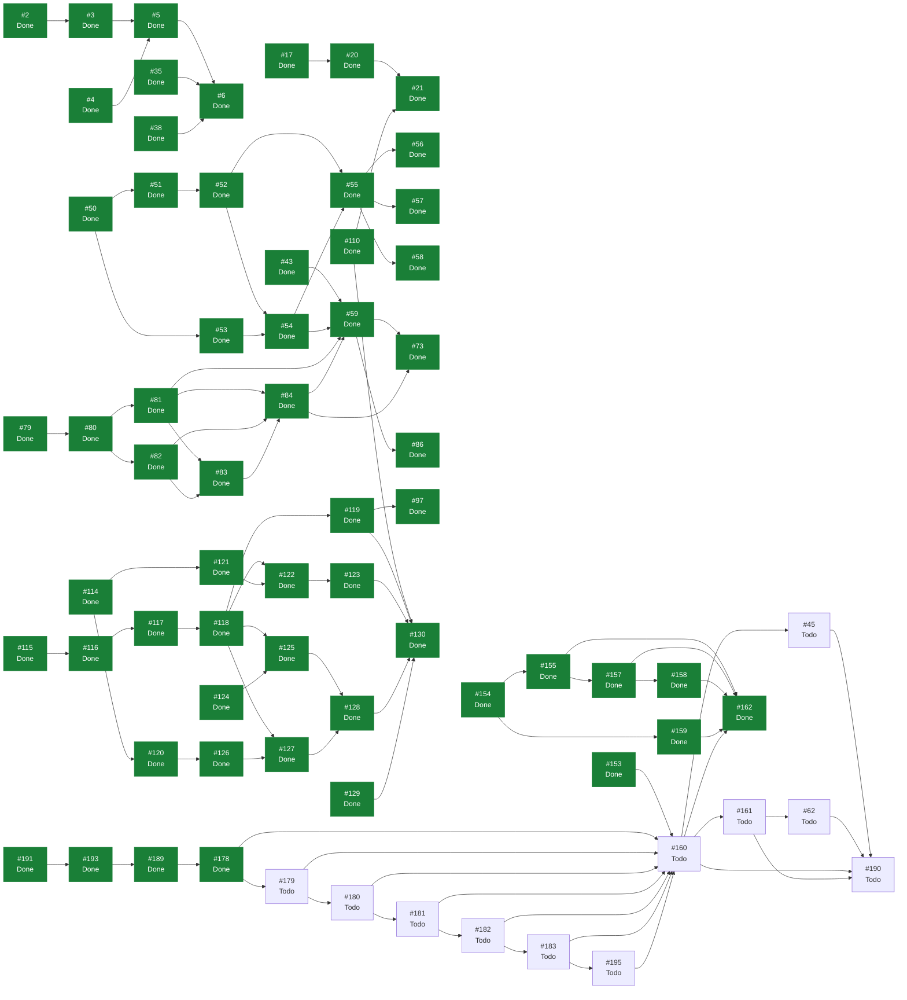

# eVault — Estado del Backlog

> **Documento generado. No editar a mano.**
> Se regenera con `scripts/status.sh` leyendo GitHub, que es la única fuente
> de verdad del estado. Si algo aquí no refleja la realidad, corregirlo en
> GitHub y volver a generar. Las secciones delimitadas como manuales sí se
> editan a mano y el generador las preserva. Ver `docs/GUIDE.md`.

Generado: 2026-08-09
Fuente: [ecamp0s/evault](https://github.com/ecamp0s/evault/issues) y Project «eVault»
Issues: 99 en total, 87 cerrados, 12 abiertos

---

## 1) Objetivo de la iteración

<!-- manual:objetivo -->
**Iteración 6: en curso, planificada el 7 de agosto de 2026 en #191.** Objetivo: *lo que el repositorio afirma sobre sí mismo se puede comprobar ejecutando un comando.*

No es una consigna de método puesta encima de un sprint de renombrado. Es el problema que la Iteración 5 destapó tres veces y no llegó a cerrar: el criterio 7 de la Iteración 4 daba por hecho algo que era falso (#153); el inventario de #160 decía 27 identificadores y eran más de cien; y `grep` omitía un fichero entero en silencio (#184). **La tercera apareció al planificar esta iteración**: `ITERACION_5.md` afirma que el comando de comprobación «existe y funciona» y que «queda en el repositorio», y no está — `scripts/` tiene `status.py`, `status.sh` y `mdns-alias.py`, y nada más. Las cifras tampoco cuadran entre sí: **101** en el comentario del recuento de #160, **103** aquí y en `SPRINT_CONTEXT.md`, **105** sumando la tabla de reparto por capas. Es el mismo modo de fallo una capa más arriba: la herramienta que iba a impedir que se diera algo por cumplido sin ejecutarlo, dada por existente sin buscarla.

De ahí el orden. **El renombrado es lo que se hace; la verificabilidad es lo que se arregla.**

Siete bloques. Bloque 0, las siete alertas de Dependabot abiertas en `master`: #193, primero por el mismo criterio que puso a #153 primero en la Iteración 5 —es lo único que ahora mismo se ve mal desde fuera en un repositorio público, y cuesta poco. Bloque 1, el comprobador y la rectificación: #189, antes de renombrar una línea. Bloque 2, las seis capas encadenadas: #178 → #179 → #180 → #181 → #182 → #183, con #160 cerrando como paraguas. Bloque 3, los tests: #161. Bloque 4, el CI: #62. Bloque 5, el bundle: #45. Cierre: #190.

**Las dos decisiones de secuenciación**, que son lo que no se ve en el grafo. **#62 va después del renombrado y no antes**: un check de identificadores que aterrice con cien pendientes nace en rojo, y un check rojo desde el primer día se acaba ignorando entero. **#45 va después de las seis capas y no en paralelo**: el code splitting toca `vite.config.ts` y las definiciones de ruta, que es exactamente lo que tocan #180, #181 y #182 — la misma apuesta que funcionó en la Iteración 4 al poner la migración de idiomas antes del código nuevo.

Queda fuera: la instancia personal, que sigue sin decidirse dónde vive y que por `ADR-009` §4 no comparte máquina con despliegues de prueba; y el cambio de correo electrónico, que obliga a re-derivar y reenvolver porque el correo es el salt (`ADR-008`).

**Iteración 5: cerrada el 7 de agosto de 2026.** Objetivo cumplido: *eVault se levanta desde un clon con un comando, se despliega con una guía verificada, y quien lo abra ve una vault con contenido en menos de un minuto.*

Once issues cerrados: ocho de los planificados más tres que salieron por el camino y que son buena parte del valor de la iteración —#184, un byte NUL que hacía invisible un fichero para `grep`; #186, dos tests que dependían del orden de resolución; y #153, la rectificación con la que empezó todo.

**Lo que cambió de fondo:** eVault dejó de ser un proyecto que solo corría en la máquina de su autor. Ahora se levanta con un comando, se despliega con una guía verificada ejecutándola, y tiene portada. `ADR-005` decía desde el primer commit que el proyecto era self-hosteable, y era cierto en el código, pero no había forma documentada de hacerlo — la mayor distancia que había entre lo que el repositorio prometía y lo que entregaba.

**Lo que no se hizo**, y se dice porque esta iteración empezó rectificando un criterio mal dado por cumplido: el renombrado de los 103 identificadores en español. Pasa a la Iteración 6 partido en seis capas, con el inventario ya medido y verificado por dos vías independientes.

Su historial y sus lecciones están en `docs/planning/archive/ITERACION_5.md`. La que más se repite, cinco veces en once issues: **el camino que nadie recorre es el que está roto.** Y la más cara de aprender: **cuando dos medidas discrepan, la primera hipótesis no puede ser que la rara es la propia** — se dio por buena a `grep` frente a un extractor propio, y `grep` era el que mentía.

No fue funcionalidad nueva y fue deliberado. `ADR-009` §4 pone «despliegue reproducible» en la primera categoría de prioridad, por delante de la legibilidad y de la funcionalidad, y al empezar la iteración **no existía**: ni `Dockerfile`, ni Compose, ni guía, mientras `ADR-005` decidía desde el primer commit que el proyecto fuera self-hosteable y el README lo afirmaba. Era la mayor distancia entre lo que el proyecto prometía y lo que entregaba.

**El hallazgo que decidió la forma del bloque de datos de ejemplo:** el servidor no puede sembrar una demo. No es una limitación de implementación, es el zero-knowledge funcionando — un seeder no puede crear items con contenido porque el cifrado ocurre en el cliente con una clave derivada de una contraseña que el servidor nunca ve. `DatabaseSeeder` lo confirma sin decirlo: crea un usuario con su vault y cero items, porque no le es posible crear ninguno. Así que la siembra es un fichero `.evault` pre-generado con contraseña publicada, importado desde la interfaz, reutilizando el formato de `ADR-011` y el import de #123. La consecuencia útil es que la propia siembra demuestra el modelo en vez de explicarlo.

Siete bloques planificados. Bloque 0, rectificar el criterio de salida 7 de la Iteración 4: #153. Bloque 1, la decisión antes del código: `ADR-012` en #154. Bloque 2, levantar con un comando: #155 y #156. Bloque 3, algo que enseñar: #157 y #158. Bloque 4, desplegar de verdad: #159. Bloque 5, la deuda: #149 y #62. Bloque 6, la deuda que destapó #153: #160. Cierre: #162.

Se completaron los bloques 0 a 4 y la mitad del 5. El 6 no llegó a empezar.

**La secuenciación salió bien**, y fue la misma apuesta que en la 4: #153 fue primero y solo, porque era lo único que estaba mintiendo en un repositorio público y costaba una tarde de documentación, no de código. Empezar por ahí puso además el listón del resto de la iteración.

**#45 quedó fuera otra vez**, con el mismo criterio de `ADR-009` §4 que la dejó fuera de la 4: sin instancia pública expuesta, un bundle grande es pulido y no fiabilidad. Su medición sí está al día: 689 kB, no 663.

**Iteración 4: cerrada el 5 de agosto de 2026.** Objetivo cumplido: *eVault deja de ser una vault en la que da miedo meter contraseñas reales: se puede sacar lo que hay dentro, entrar si se pierde la contraseña, y rotarla sin recifrar nada.*

Diecinueve issues cerrados, los dieciocho planificados más #133, que salió al revisar lo que ahora lee cualquiera. Se cerraron con ellos dos deudas: #21, `master` sin protección, y #97, los identificadores en dos idiomas — pero **#97 se cerró antes de tiempo**, como descubrió #153 al día siguiente: quedaban 25 identificadores en español en producción. Ver el criterio de salida 7. Deja tres deudas, entonces: #149, #160 y #161.

**Lo que cambió de fondo:** olvidar la contraseña maestra ya no es necesariamente perderlo todo. Era el único agujero duro del modelo y `ADR-001` §5.1 dejó prometida su mitigación desde la Iteración 1. La clave de recuperación la cumple sin tocar el principio, porque envuelve la misma clave de vault y el servidor sigue sin guardar nada que pueda abrir. A cambio, el proyecto amplía por primera vez a propósito su superficie de ataque: ahora hay dos caminos completos a la vault y el segundo no tiene segundo factor.

Su historial y sus lecciones están en `docs/planning/archive/ITERACION_4.md`. Las dos que más caras salieron: **el middleware `ability` de Sanctum no sirve para restringir**, porque un token normal lleva la capacidad `*` y `*` satisface cualquier comprobación; y **el texto de la interfaz se rompe cruzando saltos de línea**, así que una auditoría línea a línea no lo ve — tres frases rotas estuvieron en `master` dos issues seguidos y las encontró abrir el navegador.

No fue un objetivo inventado para llenar un sprint. `ADR-001` §6 planificó el proyecto por fases durante la Iteración 1, y su fase 4 dice «clave de recuperación, rotación de contraseña maestra y criptografía asimétrica para vaults compartidas». Esta iteración fue esa fase, menos la parte asimétrica que `ADR-009` sacó del alcance al dejar el proyecto de ser un SaaS. El orden lo fijó el criterio de `ADR-009` §4: primero lo que hace el producto fiable para quien lo usa de verdad, después lo que lo hace legible, y solo después funcionalidad nueva.

Siete bloques, planificados en #114. Bloque 0, el repositorio público: #110, que cierra #21. Bloque 1, la migración de identificadores a inglés: #115 a #119, que cierran #97. Bloque 2, las decisiones antes del código: `ADR-010` en #120 y `ADR-011` en #121. Bloque 3, sacar los datos: #122 y #123. Bloque 4, rotar la contraseña maestra: #124 y #125. Bloque 5, la clave de recuperación: #126, #127 y #128. Bloque 6, backup y restauración: #129. Cierre: #130.

**La decisión de secuenciación que no se ve en el grafo, y que salió bien:** la migración de idiomas fue antes que el código nuevo. Los bloques 3, 4 y 5 tocan `lib/vault/`, `lib/`, `pages/vault/` y `pages/auth/`, que eran exactamente las capas en español; migrar después habría sido renombrar código recién escrito y resolver conflictos entre PR grandes.

**Iteración 3: cerrada el 3 de agosto de 2026.** Objetivo cumplido: *el servidor deja de poder leer nada del usuario, y la vault se bloquea y se desbloquea con la contraseña maestra.*

Es la iteración que cumple `ADR-001`. Las dos anteriores construyeron el producto sobre dos excepciones deliberadas al principio fundamental —autenticación convencional en la Iteración 1, contenido sin cifrar en la Iteración 2—, tomadas para fijar y validar el contrato antes de introducir criptografía. Esta las retiró las dos.

**La advertencia que encabezaba este documento durante dos iteraciones ya no aplica.** El contenido está cifrado con AES-256-GCM y la condición de no desplegar con datos reales queda levantada. La apuesta salió bien y conviene decirlo: al llegar el cifrado real no hubo que tocar ni `vault_items` ni ninguna ruta. `register` ganó dos campos de entrada, `GET /api/vaults` dos de salida, y eso fue todo.

Doce issues, ocho nuevos y cuatro arrastrados. La columna vertebral fue una cadena que va de la decisión al código y del código a la interfaz: `ADR-008` fijó la arquitectura de claves (#80), el módulo criptográfico y sus tests fueron el suelo (#81), el servidor aprendió a guardar la clave de vault envuelta (#82), y encima fueron registro (#83), login (#84), cifrado real (#59) y bloqueo de la vault (#73). Fuera de esa cadena: la CSP (#77), el trigger del workflow `status` (#63), el generador de contraseñas (#85) y la búsqueda de items (#86).

Su historial y sus lecciones están en `docs/planning/archive/ITERACION_3.md`. Lo que más se repite ahí: **ver pasar un test no demuestra que sirva.** Se comprobó dos veces rompiendo el código a propósito, y en el generador de contraseñas dos de cuatro mutaciones no se detectaban.

**Iteración 2: cerrada el 2 de agosto de 2026.** Ver `docs/planning/archive/ITERACION_2.md`.

**Iteración 1: cerrada el 30 de julio de 2026.** Ver `docs/planning/archive/ITERACION_1.md`.
<!-- /manual:objetivo -->

## 2) Qué se puede tomar ahora

Issues abiertos sin ningún bloqueante abierto, ordenados por prioridad. El primero de la lista es lo siguiente a tomar.

1. [#179](https://github.com/ecamp0s/evault/issues/179) chore(web): migrar el resto de lib a inglés (2ª pasada) (Medium)
1. [#197](https://github.com/ecamp0s/evault/issues/197) chore(repo): el comprobador no ve los identificadores en orden español (sin prioridad)

## 3) Backlog completo

| Issue | Título | Labels | Estado | Prioridad | Bloqueada por | Bloquea a |
| --- | --- | --- | --- | --- | --- | --- |
| [#1](https://github.com/ecamp0s/evault/issues/1) | chore(api): stack de calidad — Pest, Larastan y CI | `s1` `chore` `api` | Done | — | — | — |
| [#2](https://github.com/ecamp0s/evault/issues/2) | chore(api): Sanctum y CORS para consumo desde SPA | `s1` `chore` `api` | Done | High | — | #3 |
| [#3](https://github.com/ecamp0s/evault/issues/3) | feat(api): endpoints de registro, login y sesión | `s1` `feat` `api` | Done | Medium | #2 | #5 |
| [#4](https://github.com/ecamp0s/evault/issues/4) | chore(web): shadcn/ui y sistema de diseño base | `s1` `chore` `web` | Done | — | — | #5 |
| [#5](https://github.com/ecamp0s/evault/issues/5) | feat(web): pantallas de login y registro | `s1` `feat` `web` | Done | Medium | #3, #4 | #6 |
| [#6](https://github.com/ecamp0s/evault/issues/6) | feat(web): shell autenticado y rutas protegidas | `s1` `feat` `web` | Done | Low | #5, #35, #38 | — |
| [#9](https://github.com/ecamp0s/evault/issues/9) | docs: fundación documental — índice, ADRs y STATUS.md generado | `s1` `chore` `documentation` | Done | High | — | — |
| [#11](https://github.com/ecamp0s/evault/issues/11) | ci: regenerar STATUS.md automáticamente al mergear en master | `s1` `chore` `documentation` | Done | — | — | — |
| [#15](https://github.com/ecamp0s/evault/issues/15) | fix(ci): localizar el Project por vinculación al repo, no por su nombre | `s1` `chore` `documentation` | Done | — | — | — |
| [#17](https://github.com/ecamp0s/evault/issues/17) | ci(web): lint y build del frontend en cada PR | `s1` `chore` `web` | Done | High | — | #20 |
| [#18](https://github.com/ecamp0s/evault/issues/18) | chore(repo): plantillas de issue en .github/ISSUE_TEMPLATE | `s1` `chore` `documentation` | Done | Low | — | — |
| [#19](https://github.com/ecamp0s/evault/issues/19) | chore(repo): Dependabot para composer, npm y GitHub Actions | `s1` `chore` | Done | Low | — | — |
| [#20](https://github.com/ecamp0s/evault/issues/20) | ci: mover el filtrado de paths del trigger a los jobs | `s1` `chore` | Done | Medium | #17 | #21 |
| [#21](https://github.com/ecamp0s/evault/issues/21) | chore(repo): proteger master con un ruleset | `s1` `chore` | Done | Medium | #20, #110 | — |
| [#25](https://github.com/ecamp0s/evault/issues/25) | chore(api): rate limiting en los endpoints de autenticación | `s1` `chore` `api` | Done | Medium | — | — |
| [#35](https://github.com/ecamp0s/evault/issues/35) | chore(web): evaluar la migración a React Router 8 | `s1` `chore` `web` | Done | High | — | #6 |
| [#38](https://github.com/ecamp0s/evault/issues/38) | chore(web): suite de tests de frontend con Vitest y Testing Library | `s1` `chore` `web` | Done | High | — | #6 |
| [#43](https://github.com/ecamp0s/evault/issues/43) | chore(web): decidir dónde vive el token de sesión antes de la Iteración 3 | `s2` `chore` `web` `deuda` | Done | High | — | #59 |
| [#44](https://github.com/ecamp0s/evault/issues/44) | chore(web): que /styleguide no viaje al build de producción | `s2` `chore` `web` `deuda` | Done | Low | — | — |
| [#45](https://github.com/ecamp0s/evault/issues/45) | chore(web): reducir el bundle, que va en un solo chunk | `chore` `web` `deuda` `s6` | Todo | Low | #160 | #190 |
| [#46](https://github.com/ecamp0s/evault/issues/46) | feat(web): shell usable en móvil | `s2` `feat` `web` `deuda` | Done | Medium | — | — |
| [#47](https://github.com/ecamp0s/evault/issues/47) | docs: cerrar formalmente la Iteración 1 en STATUS.md | `s1` `chore` `documentation` | Done | Medium | — | — |
| [#48](https://github.com/ecamp0s/evault/issues/48) | docs: partir SPRINT_CONTEXT y fijar las reglas de gestión de deuda | `s1` `chore` `documentation` | Done | Medium | — | — |
| [#50](https://github.com/ecamp0s/evault/issues/50) | feat(api): modelo de dominio de vaults y pertenencia | `s2` `feat` `api` | Done | High | — | #51, #53 |
| [#51](https://github.com/ecamp0s/evault/issues/51) | feat(api): modelo de vault items con payload opaco | `s2` `feat` `api` | Done | High | #50 | #52 |
| [#52](https://github.com/ecamp0s/evault/issues/52) | feat(api): CRUD de vault items con contexto de vault explícito | `s2` `feat` `api` | Done | High | #51 | #54, #55 |
| [#53](https://github.com/ecamp0s/evault/issues/53) | feat(api): listado de los vaults del usuario | `s2` `feat` `api` | Done | Medium | #50 | #54 |
| [#54](https://github.com/ecamp0s/evault/issues/54) | chore(web): capa de datos de la vault con TanStack Query | `s2` `chore` `web` | Done | Medium | #52, #53 | #55, #59 |
| [#55](https://github.com/ecamp0s/evault/issues/55) | feat(web): lista de items de la vault | `s2` `feat` `web` | Done | High | #52, #54 | #56, #57, #58 |
| [#56](https://github.com/ecamp0s/evault/issues/56) | feat(web): crear y editar un item de la vault | `s2` `feat` `web` | Done | High | #55 | — |
| [#57](https://github.com/ecamp0s/evault/issues/57) | feat(web): borrar un item con confirmación | `s2` `feat` `web` | Done | Medium | #55 | — |
| [#58](https://github.com/ecamp0s/evault/issues/58) | feat(web): mostrar, ocultar y copiar la contraseña | `s2` `feat` `web` | Done | Medium | #55 | — |
| [#59](https://github.com/ecamp0s/evault/issues/59) | chore(web): sustituir la codificación temporal del payload por cifrado real | `s3` `chore` `web` `deuda` | Done | High | #43, #54, #81, #84 | #73, #86 |
| [#60](https://github.com/ecamp0s/evault/issues/60) | docs: planificar la Iteración 2 | `s2` `chore` `documentation` | Done | — | — | — |
| [#62](https://github.com/ecamp0s/evault/issues/62) | ci: comprobaciones de documentación en los PR | `s2` `chore` `documentation` `deuda` `s6` | Todo | Medium | #161 | #190 |
| [#63](https://github.com/ecamp0s/evault/issues/63) | fix(ci): el workflow status escribe en master fuera de los disparadores declarados | `s2` `s3` `chore` `documentation` | Done | High | — | — |
| [#73](https://github.com/ecamp0s/evault/issues/73) | chore(web): dejar de persistir el token de sesión (ADR-007) | `s3` `chore` `web` `deuda` | Done | High | #59, #84 | — |
| [#77](https://github.com/ecamp0s/evault/issues/77) | chore(web): definir y servir una Content-Security-Policy | `s3` `chore` `web` | Done | Medium | — | — |
| [#79](https://github.com/ecamp0s/evault/issues/79) | docs: planificar la Iteración 3 | `s3` `chore` `documentation` | Done | High | — | #80 |
| [#80](https://github.com/ecamp0s/evault/issues/80) | docs: ADR-008 — arquitectura de claves de la vault | `s3` `chore` `documentation` | Done | High | #79 | #81, #82 |
| [#81](https://github.com/ecamp0s/evault/issues/81) | feat(web): módulo criptográfico con PBKDF2 y AES-256-GCM | `s3` `feat` `web` | Done | High | #80 | #59, #83, #84 |
| [#82](https://github.com/ecamp0s/evault/issues/82) | feat(api): almacenar la clave de vault envuelta | `s3` `feat` `api` | Done | High | #80 | #83, #84 |
| [#83](https://github.com/ecamp0s/evault/issues/83) | feat(web): registro con derivación en cliente | `s3` `feat` `web` | Done | High | #81, #82 | #84 |
| [#84](https://github.com/ecamp0s/evault/issues/84) | feat(web): login con hash de autenticación derivado | `s3` `feat` `web` | Done | High | #81, #82, #83 | #59, #73 |
| [#85](https://github.com/ecamp0s/evault/issues/85) | feat(web): generador de contraseñas | `s3` `feat` `web` | Done | Medium | — | — |
| [#86](https://github.com/ecamp0s/evault/issues/86) | feat(web): búsqueda de items en la vault | `s3` `feat` `web` | Done | Medium | #59 | — |
| [#91](https://github.com/ecamp0s/evault/issues/91) | chore(dev): el entorno local no puede ejecutar crypto.subtle | `s3` `chore` `deuda` | Done | Medium | — | — |
| [#97](https://github.com/ecamp0s/evault/issues/97) | chore(repo): migrar los identificadores del código a inglés | `chore` `deuda` | Done | Medium | #119 | — |
| [#101](https://github.com/ecamp0s/evault/issues/101) | docs: cerrar la Iteración 3 | `s3` `chore` `documentation` | Done | High | — | — |
| [#103](https://github.com/ecamp0s/evault/issues/103) | docs: README en inglés, licencia MIT y arranque verificable en un clon | `chore` `documentation` | Done | — | — | — |
| [#105](https://github.com/ecamp0s/evault/issues/105) | docs: ADR-009 — eVault deja de ser un SaaS | `chore` `documentation` | Done | — | — | — |
| [#107](https://github.com/ecamp0s/evault/issues/107) | chore(web): que el primer arranque de un clon no tenga sorpresas | `chore` `web` | Done | — | — | — |
| [#109](https://github.com/ecamp0s/evault/issues/109) | chore(repo): actualizar las referencias al nombre antiguo del repositorio | `chore` `documentation` | Done | — | — | — |
| [#110](https://github.com/ecamp0s/evault/issues/110) | chore(repo): configurar el repositorio ahora que es público | `s4` `chore` | Done | Medium | — | #21, #130 |
| [#112](https://github.com/ecamp0s/evault/issues/112) | chore(dev): mover el entorno local a evault.localhost y cerrar el problema de crypto.subtle | `chore` `api` `web` | Done | — | — | — |
| [#114](https://github.com/ecamp0s/evault/issues/114) | docs: planificar la Iteración 4 | `s4` `chore` `documentation` | Done | High | — | #120, #121 |
| [#115](https://github.com/ecamp0s/evault/issues/115) | chore(web): migrar lib/vault a inglés | `s4` `chore` `web` `deuda` | Done | Medium | — | #116 |
| [#116](https://github.com/ecamp0s/evault/issues/116) | chore(web): migrar lib a inglés | `s4` `chore` `web` `deuda` | Done | Medium | #115 | #117 |
| [#117](https://github.com/ecamp0s/evault/issues/117) | chore(web): migrar components a inglés | `s4` `chore` `web` `deuda` | Done | Medium | #116 | #118 |
| [#118](https://github.com/ecamp0s/evault/issues/118) | chore(web): migrar pages a inglés | `s4` `chore` `web` `deuda` | Done | Medium | #117 | #119, #122, #125, #127 |
| [#119](https://github.com/ecamp0s/evault/issues/119) | chore(api): migrar a inglés los identificadores que quedan | `s4` `chore` `api` `deuda` | Done | Medium | #118 | #97, #130 |
| [#120](https://github.com/ecamp0s/evault/issues/120) | docs: ADR-010 — clave de recuperación | `s4` `chore` `documentation` | Done | High | #114 | #126 |
| [#121](https://github.com/ecamp0s/evault/issues/121) | docs: ADR-011 — formato de export e import | `s4` `chore` `documentation` | Done | High | #114 | #122 |
| [#122](https://github.com/ecamp0s/evault/issues/122) | feat(web): export cifrado de la vault | `s4` `feat` `web` | Done | High | #118, #121 | #123 |
| [#123](https://github.com/ecamp0s/evault/issues/123) | feat(web): import desde el formato propio y desde CSV | `s4` `feat` `web` | Done | Medium | #122 | #130 |
| [#124](https://github.com/ecamp0s/evault/issues/124) | feat(api): rotar el hash de autenticación y la clave envuelta | `s4` `feat` `api` | Done | High | — | #125 |
| [#125](https://github.com/ecamp0s/evault/issues/125) | feat(web): cambiar la contraseña maestra | `s4` `feat` `web` | Done | High | #118, #124 | #128 |
| [#126](https://github.com/ecamp0s/evault/issues/126) | feat(api): envoltorio de recuperación y endpoint para usarlo | `s4` `feat` `api` | Done | High | #120 | #127 |
| [#127](https://github.com/ecamp0s/evault/issues/127) | feat(web): generar y entregar la clave de recuperación | `s4` `feat` `web` | Done | High | #118, #126 | #128 |
| [#128](https://github.com/ecamp0s/evault/issues/128) | feat(web): recuperar el acceso con la clave de recuperación | `s4` `feat` `web` | Done | High | #125, #127 | #130 |
| [#129](https://github.com/ecamp0s/evault/issues/129) | feat(api): backup y restauración de la instancia | `s4` `feat` `api` | Done | High | — | #130 |
| [#130](https://github.com/ecamp0s/evault/issues/130) | docs: cerrar la Iteración 4 | `s4` `chore` `documentation` | Done | High | #110, #119, #123, #128, #129 | — |
| [#133](https://github.com/ecamp0s/evault/issues/133) | docs: dejar de nombrar un proyecto personal anterior | `s4` `chore` `documentation` | Done | Medium | — | — |
| [#149](https://github.com/ecamp0s/evault/issues/149) | chore(api): los tokens de sesión se acumulan y no caducan nunca | `chore` `api` `deuda` `s5` | Done | Medium | — | — |
| [#153](https://github.com/ecamp0s/evault/issues/153) | docs: corregir el criterio de salida 7 de la Iteración 4 | `chore` `documentation` `s5` | Done | High | — | #160 |
| [#154](https://github.com/ecamp0s/evault/issues/154) | docs: ADR-012 — estrategia de despliegue | `chore` `documentation` `s5` | Done | High | — | #155, #159 |
| [#155](https://github.com/ecamp0s/evault/issues/155) | chore(repo): docker compose up levanta el proyecto desde un clon limpio | `chore` `s5` | Done | High | #154 | #157, #162 |
| [#156](https://github.com/ecamp0s/evault/issues/156) | chore(web): mover shadcn a devDependencies | `chore` `web` `s5` | Done | Medium | — | — |
| [#157](https://github.com/ecamp0s/evault/issues/157) | feat(repo): fichero .evault de ejemplo para ver la vault con contenido | `feat` `s5` | Done | High | #155 | #158, #162 |
| [#158](https://github.com/ecamp0s/evault/issues/158) | docs: screenshot de la vault en el README | `chore` `documentation` `s5` | Done | Medium | #157 | #162 |
| [#159](https://github.com/ecamp0s/evault/issues/159) | docs: guía de despliegue self-hosted, verificada ejecutándola | `chore` `documentation` `s5` | Done | High | #154 | #162 |
| [#160](https://github.com/ecamp0s/evault/issues/160) | chore(web): los identificadores en español que quedan en producción | `chore` `web` `deuda` `s6` | Todo | Medium | #153, #178, #179, #180, #181, #182, #183, #195 | #45, #161, #162, #190 |
| [#161](https://github.com/ecamp0s/evault/issues/161) | chore(web): identificadores en español en los tests | `chore` `web` `deuda` `s6` | Todo | Medium | #160 | #62, #190 |
| [#162](https://github.com/ecamp0s/evault/issues/162) | docs: cerrar la Iteración 5 | `chore` `documentation` `s5` | Done | High | #155, #157, #158, #159, #160 | — |
| [#165](https://github.com/ecamp0s/evault/issues/165) | chore(repo): borrar la rama al mergear, como convención escrita | `chore` `documentation` `s5` | Done | — | — | — |
| [#178](https://github.com/ecamp0s/evault/issues/178) | chore(web): migrar lib/vault a inglés (2ª pasada) | `chore` `web` `deuda` `s6` | Done | Medium | #189 | #160, #179 |
| [#179](https://github.com/ecamp0s/evault/issues/179) | chore(web): migrar el resto de lib a inglés (2ª pasada) | `chore` `web` `deuda` `s6` | Todo | Medium | #178 | #160, #180 |
| [#180](https://github.com/ecamp0s/evault/issues/180) | chore(web): migrar components y la configuración de build a inglés | `chore` `web` `deuda` `s6` | Todo | Medium | #179 | #160, #181 |
| [#181](https://github.com/ecamp0s/evault/issues/181) | chore(web): migrar pages/vault a inglés (2ª pasada) | `chore` `web` `deuda` `s6` | Todo | Medium | #180 | #160, #182 |
| [#182](https://github.com/ecamp0s/evault/issues/182) | chore(web): migrar pages/auth a inglés (2ª pasada) | `chore` `web` `deuda` `s6` | Todo | Medium | #181 | #160, #183 |
| [#183](https://github.com/ecamp0s/evault/issues/183) | chore(api): migrar a inglés los identificadores que quedan en app | `chore` `api` `deuda` `s6` | Todo | Medium | #182 | #160, #195 |
| [#184](https://github.com/ecamp0s/evault/issues/184) | fix(web): un byte NUL en import.ts lo hace invisible para grep | `bug` `web` `s5` | Done | — | — | — |
| [#186](https://github.com/ecamp0s/evault/issues/186) | fix(web): dos tests dependen del orden de resolución y fallan en CI | `bug` `web` `s5` | Done | — | — | — |
| [#189](https://github.com/ecamp0s/evault/issues/189) | chore(repo): comprobador de identificadores en español, ejecutable y en el repositorio | `chore` `deuda` `s6` | Done | High | #193 | #178 |
| [#190](https://github.com/ecamp0s/evault/issues/190) | docs: cerrar la Iteración 6 | `chore` `documentation` `s6` | Todo | High | #45, #62, #160, #161 | — |
| [#191](https://github.com/ecamp0s/evault/issues/191) | docs: planificar la Iteración 6 | `chore` `documentation` `s6` | Done | High | — | #193 |
| [#193](https://github.com/ecamp0s/evault/issues/193) | chore(repo): saldar las siete alertas de Dependabot abiertas en master | `chore` `deuda` `s6` | Done | High | #191 | #189 |
| [#195](https://github.com/ecamp0s/evault/issues/195) | chore(repo): migrar a inglés los identificadores de scripts/ y de los workflows | `chore` `deuda` `s6` | Todo | Medium | #183 | #160 |
| [#197](https://github.com/ecamp0s/evault/issues/197) | chore(repo): el comprobador no ve los identificadores en orden español | `chore` `deuda` `s6` | Todo | — | — | — |

## 4) Grafo de dependencias

La flecha va del bloqueante al bloqueado. En verde, lo ya cerrado.

## 5) Criterios de salida de la iteración

<!-- manual:salida -->
### Iteración 6, en curso

Nueve criterios. Ninguno se da por bueno leyendo el código, y en esta iteración con más motivo que en ninguna: **si un criterio se puede comprobar con un comando, el criterio es ese comando y ese comando está en el repositorio.**

1. ⬜ **Cero alertas de Dependabot abiertas en `master`**, comprobado **en el panel** y no viendo cambiar los ficheros de bloqueo. Eran siete —seis de `league/commonmark`, transitiva de Laravel, y una de `js-yaml`, de desarrollo—, y ninguna alcanzable desde eVault, que no usa Markdown en ninguna parte. Se arreglan igual: quien abre el repositorio ve «5 high» antes de leer una línea, y un aviso abierto permanente entrena a ignorar avisos (#193).
2. ⬜ **El comprobador de identificadores está en el repositorio y se ejecuta con un comando**, y su recuento reproduce el inventario. Verificado ejecutándolo, y **sobre un fichero con un byte NUL plantado a propósito**, para probar que no hereda el punto ciego de #184 (#189).
3. ⬜ **Cero identificadores en español en el código de producción**, según ese comando. El ámbito **incluye `web/vite.config.ts` y la configuración de build**, no solo `web/src` y `api/app` — declarar un ámbito más estrecho que la regla es lo que hundió el criterio 7 de la Iteración 4 (#160, #178–#183).
4. ⬜ **Cero identificadores en español en los ficheros de test**, mismo comando. Los textos de `it` y `describe` siguen en español y el comando no los toca (#161).
5. ⬜ **El texto visible de la interfaz es idéntico al de antes del renombrado**, comparado entero y en modo DOTALL, no leído en el diff. Verificado además abriendo el navegador en import y export, que son las dos pantallas con más texto del proyecto (#181).
6. ⬜ **El job de documentación detecta cada caso roto a propósito, no configurado**: un marcador de conflicto, la pérdida de un marcador de sección manual de este documento, un byte NUL, y un `Closes #N` que no toca `SPRINT_CONTEXT.md`. La vía de escape explícita funciona (#62). *El primer criterio que #62 pedía —«un PR que solo toca `docs/` muestra al menos un check»— **ya está cumplido desde #20**, que movió el filtrado de paths del trigger a los jobs: comprobado en el PR de #191, que reporta siete checks, cinco `skipping` y dos `pass`. Lo que queda de #62 es el contenido, no la existencia.*
7. ⬜ **La referencia rota de `vite.config.ts` a `docs/architecture/SEGURIDAD.md` está corregida**, y el check la habría detectado. Es uno de los tres casos de prueba que #62 tenía esperando (#62).
8. ⬜ **El chunk inicial baja de forma medible**, con la cifra antes y después —la de partida son **689 kB**— y la navegación entre rutas sigue funcionando en navegador sin pantallas en blanco al cargar un chunk (#45).
9. ⬜ **Pest, Vitest, Larastan en nivel `max` y CI en verde**, con el mismo número de tests que antes del renombrado.

### Iteración 5, cerrada

Siete criterios. **Seis cumplidos y uno no**, el quinto. Ninguno se dio por bueno leyendo código o diffs, que era la lección heredada del criterio 7 de la iteración anterior — y por eso mismo el que no se cumplió se declara sin cumplir.

1. ✅ **Un clon limpio levanta con `docker compose up` y permite registrarse.** Verificado clonando **desde GitHub en un directorio nuevo y vacío del servidor**, no desde el directorio de trabajo, donde ya existen `.env`, `vendor/` y `node_modules/`. Un Compose que solo funciona sobre un árbol ya inicializado no es reproducible: es el directorio del autor con un `compose.yaml` encima (#155).
2. ✅ **El fichero de ejemplo se importa y los items aparecen descifrados.** Verificado en navegador y **desde una cuenta distinta de la que lo generó**, con otro correo y otra contraseña maestra, que es la prueba de que el fichero no está atado a quien lo creó (#157).
3. ✅ **El screenshot del README es de la aplicación real**, con los datos del fichero de ejemplo — de modo que cualquiera puede reproducir la misma pantalla. Un screenshot irreproducible envejece sin que se note (#158).
4. ✅ **La guía de despliegue se verificó ejecutándola** entera en un servidor: alias mDNS, certificados de la CA interna, registro en navegador real, y destrucción y recreación de los contenedores comprobando que los datos **y el certificado** sobreviven (#159).
5. ❌ **Cero identificadores en español en el código de producción.** **No cumplido: siguen habiendo 103.** El inventario está medido y verificado por dos vías independientes, y el renombrado pasa a la Iteración 6 partido en seis capas (#160, #178–#183). Lo que sí quedó hecho es medirlo bien, que resultó ser el trabajo difícil.
6. ✅ **Los tokens de sesión caducan** a las 12 horas y los vencidos se barren al entrar, sin necesidad de cron. Verificado **rompiendo el código a propósito** con tres mutaciones, las tres detectadas (#149).
7. ✅ **Pest, Vitest, Larastan en nivel `max` y CI en verde.** 238 tests en la API y 368 en la web, sin baseline.

Deuda que deja, con issue: el renombrado (#160 y sus seis capas) y #62, las comprobaciones de documentación en los PR. Van juntas: #160 deja escrito el comando y #62 lo mete en el CI.

### Iteración 4, cerrada

Nueve criterios. **Ocho cumplidos y uno mal dado por cumplido**, el séptimo, rectificado el 5 de agosto de 2026 en #153.

Los ocho que aguantaron se comprobaron abriendo el navegador, inspeccionando la base de datos o rompiendo el código a propósito. El que no aguantó se comprobó leyendo el diff, y la diferencia entre las dos cosas es toda la lección.

1. ✅ **Exportar la vault, vaciar la base de datos, importar y recuperar los mismos items.** Verificado el ciclo entero y no cada mitad por su lado, que es donde se esconden los formatos que solo se entienden a sí mismos (#122, #123).
2. ✅ **El fichero de export cifrado no contiene ninguna de las cadenas escritas.** Mismo método que #59: guardar un item con cadenas reconocibles y buscarlas en el fichero generado (#122).
3. ✅ **Cambiar la contraseña maestra, salir, entrar con la nueva y ver intactos los items de antes.** Verificado en navegador con el ciclo completo: cambiar, **recargar** para que la vault se bloquee de verdad, desbloquear con la nueva y ver las tres entradas descifrándose. En la base de datos, después, los items sin un solo `updated_at` movido (#124, #125).
4. ✅ **Un cambio de contraseña interrumpido a medias no deja a nadie fuera.** Es el criterio que se verificó **rompiendo el código a propósito** y no leyendo la transacción: el test fuerza una excepción entre las dos escrituras y comprueba que el envoltorio se revirtió y que la contraseña sigue siendo la vieja. En `api/tests/Unit/Auth/RotateMasterPasswordTest.php` (#124).
5. ✅ **Perder la contraseña maestra y recuperar el acceso con la clave de recuperación.** Verificado en navegador de principio a fin, incluida la parte que no es opcional: recuperar no termina hasta fijar una contraseña nueva (#126, #127, #128).
6. ✅ **Un backup restaurado en una instancia limpia sirve una vault que abre con la contraseña de siempre.** Verificado contra una base de datos vaciada, que es la única forma de saber si un backup es una copia de seguridad o solo un fichero (#129).
7. ❌ **Ningún identificador en español en `web/src` ni en `api/app`** (#115–#119). **Se marcó cumplido y no lo estaba.** Rectificado el 5 de agosto de 2026 en #153.

   Quedaban **24 identificadores en español en el código de producción de `web/src`**, en doce ficheros, y **uno en `api/app`** — `configurarLimitesDeAutenticacion`, en `AppServiceProvider.php:63` —, más unos treinta ficheros de test. No eran restos marginales: cuatro son hooks exportados y usados desde otros cuatro ficheros (`useCrearItem`, `useActualizarItem`, `useBorrarItem`, `useVaultPersonal`). Parte se escribió **después** de dar la migración por terminada: `export.ts` entró en #146 con el bloque ya cerrado.

   Lo que sí se cumplió, y no se pierde en la rectificación: los campos del contrato, el store de `localStorage` y las claves de configuración quedaron intactos. El riesgo que se vigiló se vigiló bien; lo que falló fue dar por completo un recorrido que no lo era.

   **Por qué no se detectó**, que es lo que importa: los otros ocho criterios se verificaron abriendo el navegador, vaciando la base de datos o rompiendo el código a propósito. Este se verificó leyendo el diff de los issues que lo implementaban — leer la intención en vez del resultado. Ver la lección en `ITERACION_4.md`.

   Lo que queda vivo: #160 (producción, en la Iteración 5) y #161 (tests, sin fecha). **#97 se cerró antes de tiempo.**
8. ✅ **`master` protegido por ruleset, y el bot regenerando `STATUS.md` sin romperse** (#110, #21). Verificado en los dos sentidos y no leyendo la configuración: con la regla de pull request activa, el workflow falló con `GH013` y el push fue rechazado; sin ella, la regeneración volvió a pasar y el commit llegó a `master`. La protección conseguida es que nadie pueda borrar la rama ni reescribir su historia; el porqué de que no exija pull request está en la tabla de riesgos.
9. ✅ **Pest, Vitest, Larastan en nivel `max` y CI en verde.** 230 tests en la API y 367 en la web, sin baseline.

Deuda que dejó, con issue: #149, los tokens de sesión se acumulan y no caducan nunca.

### Iteración 3, cerrada

Los ocho criterios de la Iteración 3, todos cumplidos. Ninguno se dio por bueno leyendo el código: todos se comprobaron abriendo el navegador o inspeccionando la base de datos.

1. ✅ **Inspeccionando la base de datos no se puede leer ningún dato de usuario.** Guardada una credencial desde el navegador, la fila en MySQL sale con `version 2` y un `ciphertext` opaco; ninguna de las cinco cadenas escritas aparece, y descodificar el base64 ya no produce nada legible (#59).
2. ✅ **La contraseña maestra no aparece en ninguna petición.** Verificado en la pestaña de red: el cuerpo del alta y el del login llevan un hash en base64 donde antes iba la contraseña (#83, #84).
3. ✅ **El token no está en `localStorage`, `sessionStorage`, cookies ni IndexedDB.** Lo único que queda guardado es el nombre y el correo de quien entró, que no son secretos y son lo que permite el bloqueo (#73).
4. ✅ **Recargar bloquea la vault, presentado como bloqueo y no como expulsión.** Pantalla propia que no pide el correo, saluda con él y explica por qué ha pasado (#73, `ADR-007`).
5. ✅ **Un fallo de descifrado se comunica y nunca escribe encima de los datos buenos.** El cifrado ocurre antes de mandar la petición, así que un fallo deja intacto el item anterior (#81, #59).
6. ✅ **`vault_items` no cambió** y `version` distingue el esquema nuevo. El test que enumera sus columnas sigue pasando sin tocarlo (#59, #82).
7. ✅ **La aplicación sirve una CSP** y la consola no reporta violaciones, verificado con el build de producción y no solo con el de desarrollo. `npm run dev` sigue con HMR (#77).
8. ✅ **Pest, Vitest, Larastan y CI en verde.** 276 tests en la web y 169 en la API; `composer analyse` en nivel `max` sin baseline.

Extra no previsto en los criterios: `ADR-008`, el generador de contraseñas y la búsqueda de items.

Los criterios de las iteraciones anteriores están en `docs/planning/archive/`.
<!-- /manual:salida -->

## 6) Riesgos

<!-- manual:riesgos -->
| Riesgo | Estado | Detalle |
| --- | --- | --- |
| **El comprobador se escribe a la medida de lo que ya pasa** | `Abierto, con mitigación planificada` | Es el riesgo mayor de la Iteración 6, y ya se materializó una vez: el inventario de #160 se quedó corto **tres veces seguidas** —ámbito `web/src` y `api/app`, `vite.config.ts` fuera de `src/`, y ninguna búsqueda que viera el destructuring— y lo inventarió quien tenía que cumplir el criterio. Dicho como lo dejó escrito el propio #160: **cuando el método de medida lo elige quien va a cumplir el criterio, el criterio se mide a sí mismo.** Mitigación en #189, en tres partes: el comando se escribe y se commitea **antes** de renombrar nada, publica su recuento de partida sobre `master`, y trae sus propios tests con identificadores plantados a propósito —en español y en inglés, y uno dentro de un fichero con un byte NUL— verificados rompiendo el comprobador y no viéndolos pasar |
| **Un check que nace en rojo se acaba ignorando entero** | `Abierto, mitigado por secuenciación` | Si el check de identificadores de #62 aterriza con cien pendientes, el CI queda rojo en todos los PR y el equipo aprende a mirar hacia otro lado — que es justo lo que el propio #62 dice de su vía de escape. Mitigación: **#62 va después de #160 y #161**, declarado como dependencia nativa, para que el check entre en verde y desde ese momento cualquier rojo signifique algo. El coste aceptado es que el CI tarda cuatro bloques en protegernos |
| **La carga diferida introduce estados que antes no existían** | `Abierto` | #45 parte las rutas con `React.lazy`, y eso crea huecos de carga donde antes no había ninguno. El modo de fallo es una pantalla en blanco al navegar, que en build de desarrollo no se ve porque el chunk está caliente. Mitigación: el criterio de salida 8 exige comprobarlo **en navegador y no solo en build**, y #45 va el último para que si la iteración se alarga sea lo que se cae |
| **Una herramienta de auditoría omite ficheros en silencio** | `Materializado y cerrado, con secuela abierta` | Descubierto en la Iteración 5 y es el hallazgo que más lejos llega. `web/src/lib/vault/import.ts` contenía un byte NUL literal —usado como separador en `findDuplicates`, y la intención era correcta—, así que `file` lo clasificaba como `data` y **`grep` lo omitía sin dar error, sin avisar y sin contarlo**. Ninguna auditoría del repositorio había visto ese fichero desde que se creó el 4 de agosto, lo que explica que sobreviviera a la migración de #115 y a la evaluación del criterio 7. Corregido en #184. **Lo que queda abierto es la clase de fallo, no el caso**: un comprobador que omite en silencio devuelve un cero tranquilizador, y es peor que no tenerlo. Va a #62, que tendrá que usar `-a` y comprobar que ningún fichero de texto lleve bytes NUL |
| **Un test que espera a una cosa y afirma otra** | `Materializado y cerrado` | Dos tests esperaban al `post` y comprobaban el cierre del diálogo sin esperarlo, cuando ese cierre ocurre un tick más tarde en el callback de la mutación. Ocho pasadas en verde en local y fallo a la primera en CI, **ensuciando además un PR que no tenía nada que ver**. Corregido en #186, y verificado rompiendo los componentes: sin la llamada al cierre, los dos fallan |
| **Un criterio de salida se da por cumplido sin comprobarlo** | `Materializado, y con mitigación en curso` | Ya pasó: el criterio 7 de la Iteración 4 afirmaba que no quedaban identificadores en español y quedaban 25 en producción, detectado en #153 al día siguiente de cerrar la iteración. Lo que lo hace peligroso es que **el daño escala solo**: de un checkbox a `STATUS.md`, de ahí al archivo de la iteración y de ahí a un repositorio público, ganando autoridad en cada salto sin que nadie añada una comprobación. Un test que no detecta nada al menos pasa por delante de alguien; una afirmación en un criterio de salida no la vuelve a mirar nadie, porque el documento donde vive es el que certifica que ya está comprobado. Mitigación: **si un criterio se puede comprobar con un comando, el criterio es ese comando y se deja escrito en el repositorio** — va en #62, junto con las comprobaciones de documentación en los PR. **Tercera aparición, al planificar la Iteración 6, y esta vez en la propia mitigación**: `ITERACION_5.md` afirma que el comando de comprobación «existe y funciona» y que «queda en el repositorio», y no está en ninguna parte. Escribir la mitigación no es aplicarla. Va a #189, que la construye y la commitea antes de renombrar nada |
| **Un despliegue que solo funciona en la máquina del autor** | `Cerrado` | Se verificó clonando desde GitHub en un directorio vacío de un servidor real, y la guía se escribió ejecutándola. Lo que destapó hacerlo así fue justo lo que no se ve leyendo: el origen de CORS mal compuesto, el clon que su dueño no podía borrar y los nombres mDNS multietiqueta que no resuelven. Antes decía: | Es el modo de fallo natural de #155 y #159, y no se detecta desde el directorio de trabajo, donde ya está todo inicializado. Mitigación: el criterio 1 exige clon limpio en un directorio vacío, y el 4 exige ejecutar la guía en un servidor en vez de escribirla de memoria — que sería repetir el error del criterio 7 en un documento que alguien va a seguir paso a paso |
| **La contraseña del fichero de ejemplo usada como contraseña real** | `Abierto` | Un `.evault` de ejemplo obliga a publicar la contraseña que lo abre. Mitigación en #157: que sea obviamente de demostración a simple vista, y que el aviso esté donde se lee y no en una nota al pie |
| **Desplegar por `http` en un dominio real** | `Mitigado` | El aviso está escrito en `DEPLOYMENT.md` antes que ningún comando, y `ADR-012` lo recoge como requisito de arranque y no de endurecimiento. Además el despliegue verificado usa `tls internal`, así que el camino documentado ya es HTTPS. Detalle original: | Fuera de `localhost` no existe `crypto.subtle` en contexto inseguro, así que una instancia servida por `http` en un dominio propio no es una instalación degradada: es una donde no se puede ni registrar un usuario. Quien lo descubra después habrá desplegado dos veces. Mitigación: va antes que ningún comando en la guía de #159, y es requisito explícito de `ADR-012` en #154 |
| **La rotación y la recuperación tocan el material que abre la vault** | `Mitigado` | Era el riesgo mayor de la Iteración 4. Un cambio de contraseña a medias —contraseña actualizada y envoltorio no, o al revés— deja al usuario fuera de sus datos para siempre, y el servidor no puede repararlo porque no puede leer nada. Mitigado en los dos extremos: transacción en el servidor con **un test que fuerza el fallo entre las dos escrituras**, y en el cliente el reenvolvido entero antes de enviar la primera petición, de modo que una contraseña actual equivocada falla sin haber mandado nada (#124, #125) |
| **La clave de recuperación es un segundo camino completo a la vault** | `Aceptado, con la decisión escrita` | Es la primera vez que el proyecto amplía a propósito su superficie de ataque: hasta ahora solo la contraseña maestra abría la vault. Quien tenga la clave de recuperación entra sin ella y sin segundo factor. Se asume a cambio de cerrar la promesa de `ADR-001` §5.1, y se argumentó en `ADR-010` (#120). Implementado en #126, #127 y #128. El corolario que más se malinterpreta: **rotar la contraseña maestra no lo cierra**, porque la clave de vault no cambia; quien sospeche un robo de la clave de recuperación tiene que regenerarla aparte, y la interfaz lo dice con un test que falla si el aviso desaparece |
| Un endpoint de recuperación convertido en oráculo de enumeración | `Mitigado` | Reintroduciría justo lo que `ADR-008` evitó al descartar un endpoint de prelogin. La respuesta ante un correo inexistente y ante una clave incorrecta debe ser indistinguible, con test que compara las dos, y limitador propio más estricto que el de login. Resuelto en #126, donde apareció además el agujero real de ese endpoint y que no era este: el middleware `ability` de Sanctum **no restringe**, porque un token de sesión normal lleva la capacidad `*`. Lo cubre `EnsureRecoveryToken`, que compara la lista exacta de capacidades |
| Un export en claro es la vault entera legible en la carpeta de descargas | `Mitigado` | Existe igualmente porque sin él el usuario queda atrapado en eVault. Mitigación: el formato por defecto es el cifrado, y el export en claro exige una confirmación que no se puede dar por inercia (#122, `ADR-011`) |
| Un backup que nadie ha restaurado nunca | `Cerrado` | Un backup sin restauración probada es un fichero, no una copia de seguridad. Por eso el comando de restauración entró en el mismo issue que el de backup, y el criterio de salida exigió el ciclo completo contra una base de datos vaciada. Verificado así en #129 |
| Un import interrumpido deja la vault a medias | `Mitigado` | Y el usuario sin saber qué items llegaron, justo cuando cree que ya puede borrar el origen. El comportamiento ante la interrupción se decidió y se probó en #123, en vez de dejarlo al azar de la red. Ayuda que `ADR-011` fijara que el import **añade y nunca sustituye**: lo peor que puede dejar una interrupción son items de menos, nunca items perdidos |
| La migración de idiomas y el código nuevo compiten por los mismos ficheros | `Cerrado` | Los bloques 3, 4 y 5 tocan las capas que están en español. Mitigación: secuenciación declarada como dependencia nativa, #118 bloqueando a #122, #125 y #127. Funcionó, y no hubo un solo conflicto entre bloques |
| El contenido de los vault items no está cifrado | `Cerrado` | Resuelto en #59. El servidor almacena AES-256-GCM y no puede leer nada, comprobado en MySQL. **La condición de no desplegar con datos reales queda levantada** |
| El token en `localStorage` es accesible a un XSS | `Cerrado` | Resuelto en #73. Vive solo en memoria y muere al recargar, igual que la clave de cifrado. `ADR-007` cumplido |
| Sin CSP en ninguna parte | `Cerrado` | Resuelto en #77. La SPA la lleva en su build y la API la sirve Laravel con `default-src 'none'` |
| Cifrado en cliente con fallo silencioso: pérdida de datos irreversible | `Mitigado` | Sigue siendo el riesgo mayor del producto y no desaparece nunca. Mitigación: el módulo criptográfico se escribió con sus tests antes que ninguna pantalla, y **los tests se verificaron rompiendo el módulo**, no viéndolos pasar. Ver `ADR-001` |
| Una contraseña maestra olvidada es pérdida definitiva | `Mitigado` | No es un fallo: `ADR-001` descarta la recuperación por parte del servidor. El aviso inequívoco que exigía ya existe en el registro, antes de crear la vault, con tests que fallan si desaparece (#83). **La mitigación que `ADR-001` §5.1 dejó prometida —una clave de recuperación generada en el cliente— está construida**: `ADR-010` en #120, y #126, #127 y #128. Sigue sin ser recuperación por parte del servidor, y por eso no contradice nada: perder la contraseña **y** la clave de recuperación sigue siendo pérdida definitiva, por diseño |
| Los parámetros KDF quedan fijos en el cliente | `Aceptado, con trigger` | Consecuencia de usar el correo como salt para no exponer un endpoint de prelogin, que sería un oráculo de enumeración de cuentas. Subir las iteraciones exigirá construirlo igualmente y re-derivar. Argumentado en `ADR-008` |
| `crypto.subtle` no existe en el entorno local | `Cerrado` | Resuelto en #112. El entorno se movió a `app.evault.localhost`: la especificación de contextos seguros considera de confianza todo host acabado en `.localhost`, así que hay criptografía por `http` y sin certificado. Verificado registrando y guardando un item desde el navegador. `.test` no habría servido. Cierra #91 |
| Identificadores del código en dos idiomas | `Reabierto` | **Estuvo marcado `Cerrado` y no lo estaba**, porque se cerró contra #97 y #97 se cerró antes de tiempo: quedaban más de cien identificadores en español, no cero. Se corrige aquí al planificar la Iteración 6, donde se salda de verdad con #189, las seis capas #178–#183 y #161. Lo que sigue siendo cierto del texto original: el riesgo estaba donde se esperaba —en lo que no es un símbolo y por tanto el compilador no vigila: los campos del contrato, el store `evault.sesion` y las claves de `config/throttling.php`— y esa parte se respetó entera. Lo que sí se rompió fue el **texto de la interfaz cruzando saltos de línea**, que ninguna auditoría línea a línea detectó y que estuvo roto en `master` dos issues seguidos. Ver `ITERACION_4.md` |
| Query sin `vault_id` filtrando datos entre tenants | `Mitigado` | El acotado vive en un único sitio, `VaultItemLocator`, y hay tests de aislamiento obligatorios por `ADR-004`. La clave envuelta añadió su propio test de aislamiento (#82) |
| Un 403 convirtiendo la API en oráculo de enumeración | `Mitigado` | Todo lo inaccesible responde 404. Los tests comparan la respuesta de un recurso ajeno con la de uno inexistente, en vez de comprobar cada una por su lado |
| El vaciado del portapapeles no ocurre sin https | `Aceptado, con premisa caducada` | `execCommand` exige un gesto del usuario, así que en contexto no seguro no puede vaciar, y la interfaz dejó de prometerlo en vez de fingirlo. **En el entorno local ya no aplica**: desde #112 hay contexto seguro y `navigator.clipboard` existe. Sigue aplicando a quien despliegue por `http` en su red sin certificado. Que la interfaz volviera a prometer el vaciado donde sí puede cumplirlo **no hizo falta hacerlo**: se decide en tiempo de ejecución mirando `isSecureContext`, no el entorno, así que la promesa volvió sola al haber contexto seguro. Era la única deuda reconocida sin issue, y deja de serlo por no existir |
| La validación de un item es solo de cliente | `Aceptado` | Excepción real al double guard, no descuido: el servidor no puede validar lo que no puede leer. Lo que no se valide en `schema.ts` no lo valida nadie |
| Un cambio de contrato obligue a reescribir los clientes | `Cerrado` | El riesgo se abrió en la Iteración 1 y se cierra aquí: el contrato aguantó dos iteraciones y el cifrado real, y lo único que cambió fue aditivo |
| Nivel `max` de Larastan insostenible al aparecer código de dominio | `Mitigado` | Aguantó dos iteraciones con dominio real y sin baseline |
| El bundle crece sin control | `Open` | **689 kB** en un solo chunk, medidos el 7 de agosto de 2026 — eran 663 kB el día 3. `WebCrypto` es nativo, así que la criptografía apenas lo movió. Tiene issue, #45, y **se quedó fuera de la Iteración 4 a propósito**: por el criterio de `ADR-009` §4 esto es pulido y no fiabilidad, y un bundle grande no impide usar el producto |
| `master` sin protección | `Cerrado, parcialmente` | Resuelto en #110, que cierra #21. Hay un ruleset activo en el servidor: **no se puede borrar `master` ni reescribir su historia**, sin bypass para nadie. Es justo el agujero del hook `pre-push`, que vive en el clon y se salta con `--no-verify`. **No exige pull request, y no por descuido**: GitHub no admite dar bypass a GitHub Actions en un repositorio personal, así que la regla mata el push con que el workflow `status` regenera este documento. Comprobado activándola: `GH013: Repository rule violations found`. Se eligió conservar la automatización, y el push directo a `master` lo sigue cubriendo el hook |
| El repositorio es público con el escaneo de secretos desactivado | `Cerrado` | Resuelto en #110. `secret_scanning` y `secret_scanning_push_protection` activados el 3 de agosto de 2026, más descripción y ocho topics. La *push protection* es la que más vale: bloquea un push con un token dentro antes de que salga de la máquina. Revisados además los 72 issues y sus comentarios, ahora públicos, sin encontrar rutas locales, correos, credenciales ni IPs privadas |
<!-- /manual:riesgos -->
