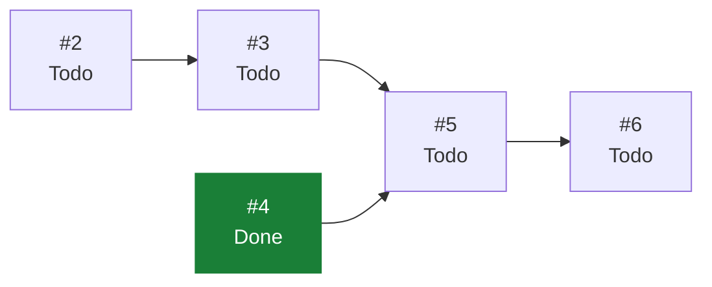

# eVault — Estado del Backlog

> **Documento generado. No editar a mano.**
> Se regenera con `scripts/status.sh` leyendo GitHub, que es la única fuente
> de verdad del estado. Si algo aquí no refleja la realidad, corregirlo en
> GitHub y volver a generar. Las secciones delimitadas como manuales sí se
> editan a mano y el generador las preserva. Ver `docs/GUIDE.md`.

Generado: 2026-07-30
Fuente: [ecamp0s/evault-claude](https://github.com/ecamp0s/evault-claude/issues) y Project «eVault»
Issues: 12 en total, 5 cerrados, 7 abiertos

---

## 1) Objetivo de la iteración

<!-- manual:objetivo -->
Cerrar la Iteración 1 con el ciclo completo de autenticación funcionando de punta a punta: la SPA registra, entra, mantiene sesión por token y sale, contra la API real.

El objetivo de la iteración no es la funcionalidad en sí, que es convencional, sino **validar el stack completo** —API, SPA, tokens, CORS, tests, análisis estático y CI— antes de introducir criptografía en el cliente en la Iteración 3.
<!-- /manual:objetivo -->

## 2) Qué se puede tomar ahora

Issues abiertos sin ningún bloqueante abierto, ordenados por prioridad. El primero de la lista es lo siguiente a tomar.

1. [#2](https://github.com/ecamp0s/evault-claude/issues/2) chore(api): Sanctum y CORS para consumo desde SPA (High)
1. [#17](https://github.com/ecamp0s/evault-claude/issues/17) ci(web): lint y build del frontend en cada PR (sin prioridad)
1. [#18](https://github.com/ecamp0s/evault-claude/issues/18) chore(repo): plantillas de issue en .github/ISSUE_TEMPLATE (sin prioridad)
1. [#19](https://github.com/ecamp0s/evault-claude/issues/19) chore(repo): Dependabot para composer, npm y GitHub Actions (sin prioridad)

## 3) Backlog completo

| Issue | Título | Labels | Estado | Prioridad | Bloqueada por | Bloquea a |
| --- | --- | --- | --- | --- | --- | --- |
| [#1](https://github.com/ecamp0s/evault-claude/issues/1) | chore(api): stack de calidad — Pest, Larastan y CI | `s1` `chore` `api` | Done | — | — | — |
| [#2](https://github.com/ecamp0s/evault-claude/issues/2) | chore(api): Sanctum y CORS para consumo desde SPA | `s1` `chore` `api` | Todo | High | — | #3 |
| [#3](https://github.com/ecamp0s/evault-claude/issues/3) | feat(api): endpoints de registro, login y sesión | `s1` `feat` `api` | Todo | Medium | #2 | #5 |
| [#4](https://github.com/ecamp0s/evault-claude/issues/4) | chore(web): shadcn/ui y sistema de diseño base | `s1` `chore` `web` | Done | — | — | #5 |
| [#5](https://github.com/ecamp0s/evault-claude/issues/5) | feat(web): pantallas de login y registro | `s1` `feat` `web` | Todo | Medium | #3, #4 | #6 |
| [#6](https://github.com/ecamp0s/evault-claude/issues/6) | feat(web): shell autenticado y rutas protegidas | `s1` `feat` `web` | Todo | Low | #5 | — |
| [#9](https://github.com/ecamp0s/evault-claude/issues/9) | docs: fundación documental — índice, ADRs y STATUS.md generado | `s1` `chore` `documentation` | Done | High | — | — |
| [#11](https://github.com/ecamp0s/evault-claude/issues/11) | ci: regenerar STATUS.md automáticamente al mergear en master | `s1` `chore` `documentation` | Done | — | — | — |
| [#15](https://github.com/ecamp0s/evault-claude/issues/15) | fix(ci): localizar el Project por vinculación al repo, no por su nombre | `s1` `chore` `documentation` | Done | — | — | — |
| [#17](https://github.com/ecamp0s/evault-claude/issues/17) | ci(web): lint y build del frontend en cada PR | `s1` `chore` `web` | Todo | — | — | — |
| [#18](https://github.com/ecamp0s/evault-claude/issues/18) | chore(repo): plantillas de issue en .github/ISSUE_TEMPLATE | `s1` `chore` `documentation` | Todo | — | — | — |
| [#19](https://github.com/ecamp0s/evault-claude/issues/19) | chore(repo): Dependabot para composer, npm y GitHub Actions | `s1` `chore` | Todo | — | — | — |

## 4) Grafo de dependencias

La flecha va del bloqueante al bloqueado. En verde, lo ya cerrado.

## 5) Criterios de salida de la iteración

<!-- manual:salida -->
La Iteración 1 se cierra cuando se cumple todo:

1. Registro, login, logout y consulta de sesión activa funcionando contra la API.
2. La SPA completa el ciclo en navegador, no solo en tests.
3. Rutas protegidas y expulsión automática ante un 401.
4. Suite de Pest en verde y `composer analyse` sin errores.
5. CI en verde en el PR de cada issue.
6. Contrato de la API documentado y estable, porque la Iteración 3 lo reutiliza.
<!-- /manual:salida -->

## 6) Riesgos

<!-- manual:riesgos -->
| Riesgo | Estado | Mitigación |
| --- | --- | --- |
| La autenticación de esta iteración **no es zero-knowledge**: la contraseña viaja al servidor | `Aceptado` | Deliberado y temporal. Se sustituye en la Iteración 3. El contrato de la API se mantiene estable para que el cambio sea mínimo. Ver `ADR-001` |
| Un cambio de contrato en la Iteración 3 obligue a reescribir los clientes | `Open` | Fijar ahora rutas, forma de request/response y gestión de tokens, y no cambiarlas al introducir criptografía |
| Orígenes CORS mal configurados degradando a permisivo | `Open` | Fallar de forma ruidosa ante configuración ausente, nunca abrir el origen por defecto. Ver `ADR-005` |
| Nivel `max` de Larastan insostenible al aparecer código de dominio | `Open` | Bajar a nivel 8 es aceptable si llega el caso; la intención es mantener `max` mientras se pueda |
| Cifrado en cliente con fallo silencioso: pérdida de datos irreversible | `Open` | Tests criptográficos dedicados antes de la Iteración 3. Ver `ADR-001` |
| Query sin `vault_id` filtrando datos entre tenants | `Open` | Double guard más tests de aislamiento cross-tenant obligatorios. Ver `ADR-004` |
<!-- /manual:riesgos -->
