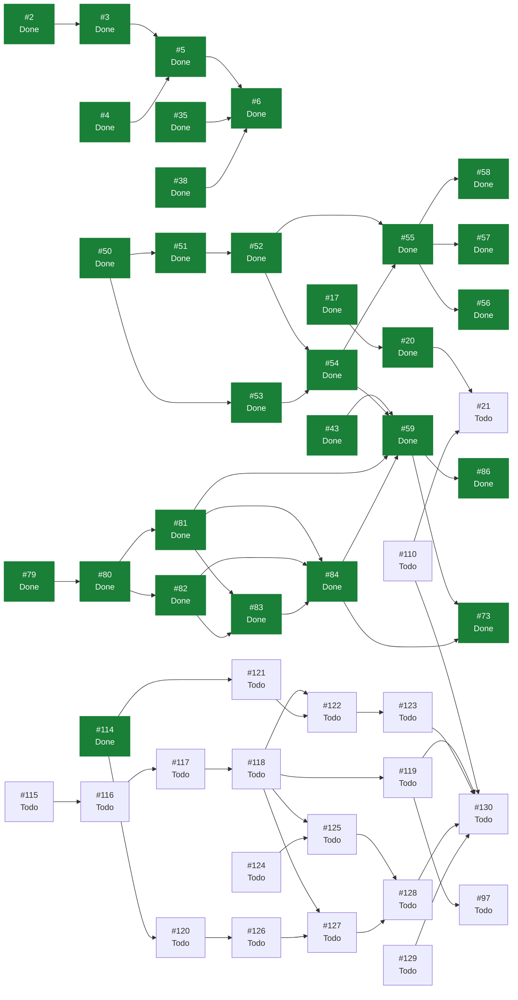

# eVault — Estado del Backlog

> **Documento generado. No editar a mano.**
> Se regenera con `scripts/status.sh` leyendo GitHub, que es la única fuente
> de verdad del estado. Si algo aquí no refleja la realidad, corregirlo en
> GitHub y volver a generar. Las secciones delimitadas como manuales sí se
> editan a mano y el generador las preserva. Ver `docs/GUIDE.md`.

Generado: 2026-08-03
Fuente: [ecamp0s/evault](https://github.com/ecamp0s/evault/issues) y Project «eVault»
Issues: 72 en total, 51 cerrados, 21 abiertos

---

## 1) Objetivo de la iteración

<!-- manual:objetivo -->
**Iteración 4: en curso desde el 3 de agosto de 2026.** Objetivo: *eVault deja de ser una vault en la que da miedo meter contraseñas reales: se puede sacar lo que hay dentro, entrar si se pierde la contraseña, y rotarla sin recifrar nada.*

No es un objetivo inventado para llenar un sprint. `ADR-001` §6 planificó el proyecto por fases durante la Iteración 1, y su fase 4 dice «clave de recuperación, rotación de contraseña maestra y criptografía asimétrica para vaults compartidas». Esta iteración es esa fase, menos la parte asimétrica que `ADR-009` sacó del alcance al dejar el proyecto de ser un SaaS. El orden lo fija el criterio de `ADR-009` §4: primero lo que hace el producto fiable para quien lo usa de verdad, después lo que lo hace legible, y solo después funcionalidad nueva.

Las tres iteraciones anteriores construyeron el producto y cumplieron su garantía. Lo que falta no es funcionalidad: es confianza operativa. Hoy no hay copia de seguridad, no hay forma de sacar los datos, no se puede cambiar la contraseña maestra, y perderla sigue significando perderlo todo.

Dieciocho issues en siete bloques, planificados en #114. Bloque 0, el repositorio público: #110, que cierra #21. Bloque 1, la migración de identificadores a inglés: #115 a #119, que cierran #97. Bloque 2, las decisiones antes del código: `ADR-010` en #120 y `ADR-011` en #121. Bloque 3, sacar los datos: #122 y #123. Bloque 4, rotar la contraseña maestra: #124 y #125. Bloque 5, la clave de recuperación: #126, #127 y #128. Bloque 6, backup y restauración: #129. Cierre: #130.

**La decisión de secuenciación que no se ve en el grafo:** la migración de idiomas va antes que el código nuevo. Los bloques 3, 4 y 5 tocan `lib/vault/`, `lib/`, `pages/vault/` y `pages/auth/`, que son exactamente las capas en español; migrar después sería renombrar código recién escrito y resolver conflictos entre PR grandes.

**Fuera del alcance a propósito:** la demo pública y el screenshot del README, que van juntos y son la iteración siguiente; #45 y #62; y el cambio de correo electrónico, que obliga a re-derivar porque el correo es el salt (`ADR-008`).

**Iteración 3: cerrada el 3 de agosto de 2026.** Objetivo cumplido: *el servidor deja de poder leer nada del usuario, y la vault se bloquea y se desbloquea con la contraseña maestra.*

Es la iteración que cumple `ADR-001`. Las dos anteriores construyeron el producto sobre dos excepciones deliberadas al principio fundamental —autenticación convencional en la Iteración 1, contenido sin cifrar en la Iteración 2—, tomadas para fijar y validar el contrato antes de introducir criptografía. Esta las retiró las dos.

**La advertencia que encabezaba este documento durante dos iteraciones ya no aplica.** El contenido está cifrado con AES-256-GCM y la condición de no desplegar con datos reales queda levantada. La apuesta salió bien y conviene decirlo: al llegar el cifrado real no hubo que tocar ni `vault_items` ni ninguna ruta. `register` ganó dos campos de entrada, `GET /api/vaults` dos de salida, y eso fue todo.

Doce issues, ocho nuevos y cuatro arrastrados. La columna vertebral fue una cadena que va de la decisión al código y del código a la interfaz: `ADR-008` fijó la arquitectura de claves (#80), el módulo criptográfico y sus tests fueron el suelo (#81), el servidor aprendió a guardar la clave de vault envuelta (#82), y encima fueron registro (#83), login (#84), cifrado real (#59) y bloqueo de la vault (#73). Fuera de esa cadena: la CSP (#77), el trigger del workflow `status` (#63), el generador de contraseñas (#85) y la búsqueda de items (#86).

Su historial y sus lecciones están en `docs/planning/archive/ITERACION_3.md`. Lo que más se repite ahí: **ver pasar un test no demuestra que sirva.** Se comprobó dos veces rompiendo el código a propósito, y en el generador de contraseñas dos de cuatro mutaciones no se detectaban.

**Iteración 2: cerrada el 2 de agosto de 2026.** Ver `docs/planning/archive/ITERACION_2.md`.

**Iteración 1: cerrada el 30 de julio de 2026.** Ver `docs/planning/archive/ITERACION_1.md`.
<!-- /manual:objetivo -->

## 2) Qué se puede tomar ahora

Issues abiertos sin ningún bloqueante abierto, ordenados por prioridad. El primero de la lista es lo siguiente a tomar.

1. [#120](https://github.com/ecamp0s/evault/issues/120) docs: ADR-010 — clave de recuperación (High)
1. [#121](https://github.com/ecamp0s/evault/issues/121) docs: ADR-011 — formato de export e import (High)
1. [#124](https://github.com/ecamp0s/evault/issues/124) feat(api): rotar el hash de autenticación y la clave envuelta (High)
1. [#129](https://github.com/ecamp0s/evault/issues/129) feat(api): backup y restauración de la instancia (High)
1. [#62](https://github.com/ecamp0s/evault/issues/62) ci: comprobaciones de documentación en los PR (Medium)
1. [#110](https://github.com/ecamp0s/evault/issues/110) chore(repo): configurar el repositorio ahora que es público (Medium)
1. [#115](https://github.com/ecamp0s/evault/issues/115) chore(web): migrar lib/vault a inglés (Medium)
1. [#45](https://github.com/ecamp0s/evault/issues/45) chore(web): reducir el bundle, que va en un solo chunk (Low)

## 3) Backlog completo

| Issue | Título | Labels | Estado | Prioridad | Bloqueada por | Bloquea a |
| --- | --- | --- | --- | --- | --- | --- |
| [#1](https://github.com/ecamp0s/evault/issues/1) | chore(api): stack de calidad — Pest, Larastan y CI | `s1` `chore` `api` | Done | — | — | — |
| [#2](https://github.com/ecamp0s/evault/issues/2) | chore(api): Sanctum y CORS para consumo desde SPA | `s1` `chore` `api` | Done | High | — | #3 |
| [#3](https://github.com/ecamp0s/evault/issues/3) | feat(api): endpoints de registro, login y sesión | `s1` `feat` `api` | Done | Medium | #2 | #5 |
| [#4](https://github.com/ecamp0s/evault/issues/4) | chore(web): shadcn/ui y sistema de diseño base | `s1` `chore` `web` | Done | — | — | #5 |
| [#5](https://github.com/ecamp0s/evault/issues/5) | feat(web): pantallas de login y registro | `s1` `feat` `web` | Done | Medium | #3, #4 | #6 |
| [#6](https://github.com/ecamp0s/evault/issues/6) | feat(web): shell autenticado y rutas protegidas | `s1` `feat` `web` | Done | Low | #5, #35, #38 | — |
| [#9](https://github.com/ecamp0s/evault/issues/9) | docs: fundación documental — índice, ADRs y STATUS.md generado | `s1` `chore` `documentation` | Done | High | — | — |
| [#11](https://github.com/ecamp0s/evault/issues/11) | ci: regenerar STATUS.md automáticamente al mergear en master | `s1` `chore` `documentation` | Done | — | — | — |
| [#15](https://github.com/ecamp0s/evault/issues/15) | fix(ci): localizar el Project por vinculación al repo, no por su nombre | `s1` `chore` `documentation` | Done | — | — | — |
| [#17](https://github.com/ecamp0s/evault/issues/17) | ci(web): lint y build del frontend en cada PR | `s1` `chore` `web` | Done | High | — | #20 |
| [#18](https://github.com/ecamp0s/evault/issues/18) | chore(repo): plantillas de issue en .github/ISSUE_TEMPLATE | `s1` `chore` `documentation` | Done | Low | — | — |
| [#19](https://github.com/ecamp0s/evault/issues/19) | chore(repo): Dependabot para composer, npm y GitHub Actions | `s1` `chore` | Done | Low | — | — |
| [#20](https://github.com/ecamp0s/evault/issues/20) | ci: mover el filtrado de paths del trigger a los jobs | `s1` `chore` | Done | Medium | #17 | #21 |
| [#21](https://github.com/ecamp0s/evault/issues/21) | chore(repo): proteger master con un ruleset | `s1` `chore` | Todo | Medium | #20, #110 | — |
| [#25](https://github.com/ecamp0s/evault/issues/25) | chore(api): rate limiting en los endpoints de autenticación | `s1` `chore` `api` | Done | Medium | — | — |
| [#35](https://github.com/ecamp0s/evault/issues/35) | chore(web): evaluar la migración a React Router 8 | `s1` `chore` `web` | Done | High | — | #6 |
| [#38](https://github.com/ecamp0s/evault/issues/38) | chore(web): suite de tests de frontend con Vitest y Testing Library | `s1` `chore` `web` | Done | High | — | #6 |
| [#43](https://github.com/ecamp0s/evault/issues/43) | chore(web): decidir dónde vive el token de sesión antes de la Iteración 3 | `s2` `chore` `web` `deuda` | Done | High | — | #59 |
| [#44](https://github.com/ecamp0s/evault/issues/44) | chore(web): que /styleguide no viaje al build de producción | `s2` `chore` `web` `deuda` | Done | Low | — | — |
| [#45](https://github.com/ecamp0s/evault/issues/45) | chore(web): reducir el bundle, que va en un solo chunk | `chore` `web` `deuda` | Todo | Low | — | — |
| [#46](https://github.com/ecamp0s/evault/issues/46) | feat(web): shell usable en móvil | `s2` `feat` `web` `deuda` | Done | Medium | — | — |
| [#47](https://github.com/ecamp0s/evault/issues/47) | docs: cerrar formalmente la Iteración 1 en STATUS.md | `s1` `chore` `documentation` | Done | Medium | — | — |
| [#48](https://github.com/ecamp0s/evault/issues/48) | docs: partir SPRINT_CONTEXT y fijar las reglas de gestión de deuda | `s1` `chore` `documentation` | Done | Medium | — | — |
| [#50](https://github.com/ecamp0s/evault/issues/50) | feat(api): modelo de dominio de vaults y pertenencia | `s2` `feat` `api` | Done | High | — | #51, #53 |
| [#51](https://github.com/ecamp0s/evault/issues/51) | feat(api): modelo de vault items con payload opaco | `s2` `feat` `api` | Done | High | #50 | #52 |
| [#52](https://github.com/ecamp0s/evault/issues/52) | feat(api): CRUD de vault items con contexto de vault explícito | `s2` `feat` `api` | Done | High | #51 | #54, #55 |
| [#53](https://github.com/ecamp0s/evault/issues/53) | feat(api): listado de los vaults del usuario | `s2` `feat` `api` | Done | Medium | #50 | #54 |
| [#54](https://github.com/ecamp0s/evault/issues/54) | chore(web): capa de datos de la vault con TanStack Query | `s2` `chore` `web` | Done | Medium | #52, #53 | #55, #59 |
| [#55](https://github.com/ecamp0s/evault/issues/55) | feat(web): lista de items de la vault | `s2` `feat` `web` | Done | High | #52, #54 | #56, #57, #58 |
| [#56](https://github.com/ecamp0s/evault/issues/56) | feat(web): crear y editar un item de la vault | `s2` `feat` `web` | Done | High | #55 | — |
| [#57](https://github.com/ecamp0s/evault/issues/57) | feat(web): borrar un item con confirmación | `s2` `feat` `web` | Done | Medium | #55 | — |
| [#58](https://github.com/ecamp0s/evault/issues/58) | feat(web): mostrar, ocultar y copiar la contraseña | `s2` `feat` `web` | Done | Medium | #55 | — |
| [#59](https://github.com/ecamp0s/evault/issues/59) | chore(web): sustituir la codificación temporal del payload por cifrado real | `s3` `chore` `web` `deuda` | Done | High | #43, #54, #81, #84 | #73, #86 |
| [#60](https://github.com/ecamp0s/evault/issues/60) | docs: planificar la Iteración 2 | `s2` `chore` `documentation` | Done | — | — | — |
| [#62](https://github.com/ecamp0s/evault/issues/62) | ci: comprobaciones de documentación en los PR | `s2` `chore` `documentation` | Todo | Medium | — | — |
| [#63](https://github.com/ecamp0s/evault/issues/63) | fix(ci): el workflow status escribe en master fuera de los disparadores declarados | `s2` `s3` `chore` `documentation` | Done | High | — | — |
| [#73](https://github.com/ecamp0s/evault/issues/73) | chore(web): dejar de persistir el token de sesión (ADR-007) | `s3` `chore` `web` `deuda` | Done | High | #59, #84 | — |
| [#77](https://github.com/ecamp0s/evault/issues/77) | chore(web): definir y servir una Content-Security-Policy | `s3` `chore` `web` | Done | Medium | — | — |
| [#79](https://github.com/ecamp0s/evault/issues/79) | docs: planificar la Iteración 3 | `s3` `chore` `documentation` | Done | High | — | #80 |
| [#80](https://github.com/ecamp0s/evault/issues/80) | docs: ADR-008 — arquitectura de claves de la vault | `s3` `chore` `documentation` | Done | High | #79 | #81, #82 |
| [#81](https://github.com/ecamp0s/evault/issues/81) | feat(web): módulo criptográfico con PBKDF2 y AES-256-GCM | `s3` `feat` `web` | Done | High | #80 | #59, #83, #84 |
| [#82](https://github.com/ecamp0s/evault/issues/82) | feat(api): almacenar la clave de vault envuelta | `s3` `feat` `api` | Done | High | #80 | #83, #84 |
| [#83](https://github.com/ecamp0s/evault/issues/83) | feat(web): registro con derivación en cliente | `s3` `feat` `web` | Done | High | #81, #82 | #84 |
| [#84](https://github.com/ecamp0s/evault/issues/84) | feat(web): login con hash de autenticación derivado | `s3` `feat` `web` | Done | High | #81, #82, #83 | #59, #73 |
| [#85](https://github.com/ecamp0s/evault/issues/85) | feat(web): generador de contraseñas | `s3` `feat` `web` | Done | Medium | — | — |
| [#86](https://github.com/ecamp0s/evault/issues/86) | feat(web): búsqueda de items en la vault | `s3` `feat` `web` | Done | Medium | #59 | — |
| [#91](https://github.com/ecamp0s/evault/issues/91) | chore(dev): el entorno local no puede ejecutar crypto.subtle | `s3` `chore` `deuda` | Done | Medium | — | — |
| [#97](https://github.com/ecamp0s/evault/issues/97) | chore(repo): migrar los identificadores del código a inglés | `chore` `deuda` | Todo | Medium | #119 | — |
| [#101](https://github.com/ecamp0s/evault/issues/101) | docs: cerrar la Iteración 3 | `s3` `chore` `documentation` | Done | High | — | — |
| [#103](https://github.com/ecamp0s/evault/issues/103) | docs: README en inglés, licencia MIT y arranque verificable en un clon | `chore` `documentation` | Done | — | — | — |
| [#105](https://github.com/ecamp0s/evault/issues/105) | docs: ADR-009 — eVault deja de ser un SaaS | `chore` `documentation` | Done | — | — | — |
| [#107](https://github.com/ecamp0s/evault/issues/107) | chore(web): que el primer arranque de un clon no tenga sorpresas | `chore` `web` | Done | — | — | — |
| [#109](https://github.com/ecamp0s/evault/issues/109) | chore(repo): actualizar las referencias al nombre antiguo del repositorio | `chore` `documentation` | Done | — | — | — |
| [#110](https://github.com/ecamp0s/evault/issues/110) | chore(repo): configurar el repositorio ahora que es público | `s4` `chore` | Todo | Medium | — | #21, #130 |
| [#112](https://github.com/ecamp0s/evault/issues/112) | chore(dev): mover el entorno local a evault.localhost y cerrar el problema de crypto.subtle | `chore` `api` `web` | Done | — | — | — |
| [#114](https://github.com/ecamp0s/evault/issues/114) | docs: planificar la Iteración 4 | `s4` `chore` `documentation` | Done | High | — | #120, #121 |
| [#115](https://github.com/ecamp0s/evault/issues/115) | chore(web): migrar lib/vault a inglés | `s4` `chore` `web` `deuda` | Todo | Medium | — | #116 |
| [#116](https://github.com/ecamp0s/evault/issues/116) | chore(web): migrar lib a inglés | `s4` `chore` `web` `deuda` | Todo | Medium | #115 | #117 |
| [#117](https://github.com/ecamp0s/evault/issues/117) | chore(web): migrar components a inglés | `s4` `chore` `web` `deuda` | Todo | Medium | #116 | #118 |
| [#118](https://github.com/ecamp0s/evault/issues/118) | chore(web): migrar pages a inglés | `s4` `chore` `web` `deuda` | Todo | Medium | #117 | #119, #122, #125, #127 |
| [#119](https://github.com/ecamp0s/evault/issues/119) | chore(api): migrar a inglés los identificadores que quedan | `s4` `chore` `api` `deuda` | Todo | Medium | #118 | #97, #130 |
| [#120](https://github.com/ecamp0s/evault/issues/120) | docs: ADR-010 — clave de recuperación | `s4` `chore` `documentation` | Todo | High | #114 | #126 |
| [#121](https://github.com/ecamp0s/evault/issues/121) | docs: ADR-011 — formato de export e import | `s4` `chore` `documentation` | Todo | High | #114 | #122 |
| [#122](https://github.com/ecamp0s/evault/issues/122) | feat(web): export cifrado de la vault | `s4` `feat` `web` | Todo | High | #118, #121 | #123 |
| [#123](https://github.com/ecamp0s/evault/issues/123) | feat(web): import desde el formato propio y desde CSV | `s4` `feat` `web` | Todo | Medium | #122 | #130 |
| [#124](https://github.com/ecamp0s/evault/issues/124) | feat(api): rotar el hash de autenticación y la clave envuelta | `s4` `feat` `api` | Todo | High | — | #125 |
| [#125](https://github.com/ecamp0s/evault/issues/125) | feat(web): cambiar la contraseña maestra | `s4` `feat` `web` | Todo | High | #118, #124 | #128 |
| [#126](https://github.com/ecamp0s/evault/issues/126) | feat(api): envoltorio de recuperación y endpoint para usarlo | `s4` `feat` `api` | Todo | High | #120 | #127 |
| [#127](https://github.com/ecamp0s/evault/issues/127) | feat(web): generar y entregar la clave de recuperación | `s4` `feat` `web` | Todo | High | #118, #126 | #128 |
| [#128](https://github.com/ecamp0s/evault/issues/128) | feat(web): recuperar el acceso con la clave de recuperación | `s4` `feat` `web` | Todo | High | #125, #127 | #130 |
| [#129](https://github.com/ecamp0s/evault/issues/129) | feat(api): backup y restauración de la instancia | `s4` `feat` `api` | Todo | High | — | #130 |
| [#130](https://github.com/ecamp0s/evault/issues/130) | docs: cerrar la Iteración 4 | `s4` `chore` `documentation` | Todo | High | #110, #119, #123, #128, #129 | — |

## 4) Grafo de dependencias

La flecha va del bloqueante al bloqueado. En verde, lo ya cerrado.

## 5) Criterios de salida de la iteración

<!-- manual:salida -->
### Iteración 4, en curso

Nueve criterios. Como en las tres iteraciones anteriores, ninguno se da por bueno leyendo el código: se comprueban abriendo el navegador, inspeccionando la base de datos o rompiendo el código a propósito.

1. ⬜ **Exportar la vault, vaciar la base de datos, importar y recuperar los mismos items.** El ciclo completo, no cada mitad por su lado (#122, #123).
2. ⬜ **El fichero de export cifrado no contiene ninguna de las cadenas escritas.** Mismo método que #59: guardar un item con cinco cadenas reconocibles y buscarlas en el fichero (#122).
3. ⬜ **Cambiar la contraseña maestra, salir, entrar con la nueva y ver intactos los items de antes**, y que la vieja ya no entre (#124, #125).
4. ⬜ **Un cambio de contraseña interrumpido a medias no deja a nadie fuera.** Verificado forzando el fallo entre las dos escrituras, no leyendo la transacción (#124).
5. ⬜ **Perder la contraseña maestra y recuperar el acceso con la clave de recuperación**, terminando con una contraseña nueva utilizable (#126, #127, #128).
6. ⬜ **Un backup restaurado en una instancia limpia sirve una vault que abre con la contraseña de siempre** (#129).
7. ⬜ **Ningún identificador en español en `web/src` ni en `api/app`**, con los campos del contrato y las claves de configuración intactos (#115–#119).
8. ✅ **`master` protegido por ruleset, y el bot regenerando `STATUS.md` sin romperse** (#110, #21). Verificado en los dos sentidos y no leyendo la configuración: con la regla de pull request activa, el workflow falló con `GH013` y el push fue rechazado; sin ella, la regeneración volvió a pasar y el commit llegó a `master`. La protección conseguida es que nadie pueda borrar la rama ni reescribir su historia; el porqué de que no exija pull request está en la tabla de riesgos.
9. ⬜ **Pest, Vitest, Larastan en nivel `max` y CI en verde.**

### Iteración 3, cerrada

Los ocho criterios de la Iteración 3, todos cumplidos. Ninguno se dio por bueno leyendo el código: todos se comprobaron abriendo el navegador o inspeccionando la base de datos.

1. ✅ **Inspeccionando la base de datos no se puede leer ningún dato de usuario.** Guardada una credencial desde el navegador, la fila en MySQL sale con `version 2` y un `ciphertext` opaco; ninguna de las cinco cadenas escritas aparece, y descodificar el base64 ya no produce nada legible (#59).
2. ✅ **La contraseña maestra no aparece en ninguna petición.** Verificado en la pestaña de red: el cuerpo del alta y el del login llevan un hash en base64 donde antes iba la contraseña (#83, #84).
3. ✅ **El token no está en `localStorage`, `sessionStorage`, cookies ni IndexedDB.** Lo único que queda guardado es el nombre y el correo de quien entró, que no son secretos y son lo que permite el bloqueo (#73).
4. ✅ **Recargar bloquea la vault, presentado como bloqueo y no como expulsión.** Pantalla propia que no pide el correo, saluda con él y explica por qué ha pasado (#73, `ADR-007`).
5. ✅ **Un fallo de descifrado se comunica y nunca escribe encima de los datos buenos.** El cifrado ocurre antes de mandar la petición, así que un fallo deja intacto el item anterior (#81, #59).
6. ✅ **`vault_items` no cambió** y `version` distingue el esquema nuevo. El test que enumera sus columnas sigue pasando sin tocarlo (#59, #82).
7. ✅ **La aplicación sirve una CSP** y la consola no reporta violaciones, verificado con el build de producción y no solo con el de desarrollo. `npm run dev` sigue con HMR (#77).
8. ✅ **Pest, Vitest, Larastan y CI en verde.** 276 tests en la web y 169 en la API; `composer analyse` en nivel `max` sin baseline.

Extra no previsto en los criterios: `ADR-008`, el generador de contraseñas y la búsqueda de items.

Los criterios de las iteraciones anteriores están en `docs/planning/archive/`.
<!-- /manual:salida -->

## 6) Riesgos

<!-- manual:riesgos -->
| Riesgo | Estado | Detalle |
| --- | --- | --- |
| **La rotación y la recuperación tocan el material que abre la vault** | `Abierto, Iteración 4` | Es el riesgo mayor de esta iteración. Un cambio de contraseña a medias —contraseña actualizada y envoltorio no, o al revés— deja al usuario fuera de sus datos para siempre, y el servidor no puede repararlo porque no puede leer nada. Mitigación: transacción en el servidor y **un test que fuerza el fallo entre las dos escrituras**, más reenvolver en el cliente antes de enviar la primera petición (#124, #125) |
| **La clave de recuperación es un segundo camino completo a la vault** | `Abierto, Iteración 4` | Es la primera vez que el proyecto amplía a propósito su superficie de ataque: hasta ahora solo la contraseña maestra abría la vault. Quien tenga la clave de recuperación entra sin ella y sin segundo factor. Se asume a cambio de cerrar la promesa de `ADR-001` §5.1, y se argumenta en `ADR-010` (#120) |
| Un endpoint de recuperación convertido en oráculo de enumeración | `Abierto, Iteración 4` | Reintroduciría justo lo que `ADR-008` evitó al descartar un endpoint de prelogin. La respuesta ante un correo inexistente y ante una clave incorrecta debe ser indistinguible, con test que compare las dos y limitador propio más estricto que el de login (#126) |
| Un export en claro es la vault entera legible en la carpeta de descargas | `Abierto, Iteración 4` | Existe igualmente porque sin él el usuario queda atrapado en eVault. Mitigación: el formato por defecto es el cifrado, y el export en claro exige una confirmación que no se pueda dar por inercia (#122, `ADR-011`) |
| Un backup que nadie ha restaurado nunca | `Abierto, Iteración 4` | Un backup sin restauración probada es un fichero, no una copia de seguridad. Por eso el comando de restauración entra en el mismo issue que el de backup, y el criterio de salida exige el ciclo completo contra una instancia limpia (#129) |
| Un import interrumpido deja la vault a medias | `Abierto, Iteración 4` | Y el usuario sin saber qué items llegaron, justo cuando cree que ya puede borrar el origen. El comportamiento ante la interrupción se decide y se prueba, no se deja al azar de la red (#123) |
| La migración de idiomas y el código nuevo compiten por los mismos ficheros | `Mitigado` | Los bloques 3, 4 y 5 tocan las capas que están en español. Mitigación: secuenciación declarada como dependencia nativa, #118 bloquea a #122, #125 y #127 |
| El contenido de los vault items no está cifrado | `Cerrado` | Resuelto en #59. El servidor almacena AES-256-GCM y no puede leer nada, comprobado en MySQL. **La condición de no desplegar con datos reales queda levantada** |
| El token en `localStorage` es accesible a un XSS | `Cerrado` | Resuelto en #73. Vive solo en memoria y muere al recargar, igual que la clave de cifrado. `ADR-007` cumplido |
| Sin CSP en ninguna parte | `Cerrado` | Resuelto en #77. La SPA la lleva en su build y la API la sirve Laravel con `default-src 'none'` |
| Cifrado en cliente con fallo silencioso: pérdida de datos irreversible | `Mitigado` | Sigue siendo el riesgo mayor del producto y no desaparece nunca. Mitigación: el módulo criptográfico se escribió con sus tests antes que ninguna pantalla, y **los tests se verificaron rompiendo el módulo**, no viéndolos pasar. Ver `ADR-001` |
| Una contraseña maestra olvidada es pérdida definitiva | `Aceptado, en mitigación` | No es un fallo: `ADR-001` descarta la recuperación por parte del servidor. El aviso inequívoco que exigía ya existe en el registro, antes de crear la vault, con tests que fallan si desaparece (#83). **La mitigación que `ADR-001` §5.1 dejó prometida —una clave de recuperación generada en el cliente— entra en la Iteración 4**: `ADR-010` en #120, y #126, #127 y #128 |
| Los parámetros KDF quedan fijos en el cliente | `Aceptado, con trigger` | Consecuencia de usar el correo como salt para no exponer un endpoint de prelogin, que sería un oráculo de enumeración de cuentas. Subir las iteraciones exigirá construirlo igualmente y re-derivar. Argumentado en `ADR-008` |
| `crypto.subtle` no existe en el entorno local | `Cerrado` | Resuelto en #112. El entorno se movió a `app.evault.localhost`: la especificación de contextos seguros considera de confianza todo host acabado en `.localhost`, así que hay criptografía por `http` y sin certificado. Verificado registrando y guardando un item desde el navegador. `.test` no habría servido. Cierra #91 |
| Identificadores del código en dos idiomas | `En curso` | La API está en inglés y el frontend en español. La convención está escrita en `CLAUDE.md` y rige para lo nuevo. Migrar lo anterior es #97, y entra en la Iteración 4 troceado en cinco issues, uno por capa: #115 a #119. El riesgo está concentrado en lo que no es un símbolo y por tanto el compilador no vigila: los campos del contrato, el store `evault.sesion` y las claves de `config/throttling.php`, que además llegan al `.env` de un despliegue |
| Query sin `vault_id` filtrando datos entre tenants | `Mitigado` | El acotado vive en un único sitio, `VaultItemLocator`, y hay tests de aislamiento obligatorios por `ADR-004`. La clave envuelta añadió su propio test de aislamiento (#82) |
| Un 403 convirtiendo la API en oráculo de enumeración | `Mitigado` | Todo lo inaccesible responde 404. Los tests comparan la respuesta de un recurso ajeno con la de uno inexistente, en vez de comprobar cada una por su lado |
| El vaciado del portapapeles no ocurre sin https | `Aceptado, con premisa caducada` | `execCommand` exige un gesto del usuario, así que en contexto no seguro no puede vaciar, y la interfaz dejó de prometerlo en vez de fingirlo. **En el entorno local ya no aplica**: desde #112 hay contexto seguro y `navigator.clipboard` existe. Sigue aplicando a quien despliegue por `http` en su red sin certificado. Que la interfaz vuelva a prometer el vaciado donde sí puede cumplirlo es trabajo pendiente sin issue todavía |
| La validación de un item es solo de cliente | `Aceptado` | Excepción real al double guard, no descuido: el servidor no puede validar lo que no puede leer. Lo que no se valide en `esquema.ts` no lo valida nadie |
| Un cambio de contrato obligue a reescribir los clientes | `Cerrado` | El riesgo se abrió en la Iteración 1 y se cierra aquí: el contrato aguantó dos iteraciones y el cifrado real, y lo único que cambió fue aditivo |
| Nivel `max` de Larastan insostenible al aparecer código de dominio | `Mitigado` | Aguantó dos iteraciones con dominio real y sin baseline |
| El bundle crece sin control | `Open` | 663 kB en un solo chunk, medidos el 3 de agosto de 2026. `WebCrypto` es nativo, así que la criptografía apenas lo movió. Tiene issue, #45, y **se quedó fuera de la Iteración 4 a propósito**: por el criterio de `ADR-009` §4 esto es pulido y no fiabilidad, y un bundle grande no impide usar el producto |
| `master` sin protección | `Cerrado, parcialmente` | Resuelto en #110, que cierra #21. Hay un ruleset activo en el servidor: **no se puede borrar `master` ni reescribir su historia**, sin bypass para nadie. Es justo el agujero del hook `pre-push`, que vive en el clon y se salta con `--no-verify`. **No exige pull request, y no por descuido**: GitHub no admite dar bypass a GitHub Actions en un repositorio personal, así que la regla mata el push con que el workflow `status` regenera este documento. Comprobado activándola: `GH013: Repository rule violations found`. Se eligió conservar la automatización, y el push directo a `master` lo sigue cubriendo el hook |
| El repositorio es público con el escaneo de secretos desactivado | `Cerrado` | Resuelto en #110. `secret_scanning` y `secret_scanning_push_protection` activados el 3 de agosto de 2026, más descripción y ocho topics. La *push protection* es la que más vale: bloquea un push con un token dentro antes de que salga de la máquina. Revisados además los 72 issues y sus comentarios, ahora públicos, sin encontrar rutas locales, correos, credenciales ni IPs privadas |
<!-- /manual:riesgos -->
