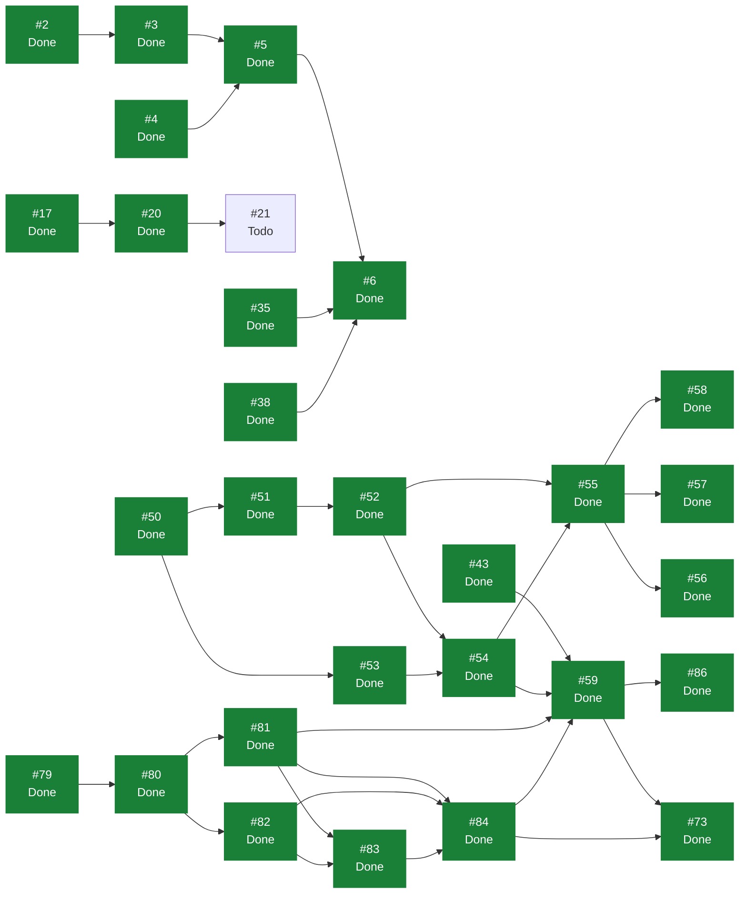

# eVault — Estado del Backlog

> **Documento generado. No editar a mano.**
> Se regenera con `scripts/status.sh` leyendo GitHub, que es la única fuente
> de verdad del estado. Si algo aquí no refleja la realidad, corregirlo en
> GitHub y volver a generar. Las secciones delimitadas como manuales sí se
> editan a mano y el generador las preserva. Ver `docs/GUIDE.md`.

Generado: 2026-08-03
Fuente: [ecamp0s/evault-claude](https://github.com/ecamp0s/evault-claude/issues) y Project «eVault»
Issues: 52 en total, 46 cerrados, 6 abiertos

---

## 1) Objetivo de la iteración

<!-- manual:objetivo -->
**Iteración 3: cerrada el 3 de agosto de 2026.** Objetivo cumplido: *el servidor deja de poder leer nada del usuario, y la vault se bloquea y se desbloquea con la contraseña maestra.*

Es la iteración que cumple `ADR-001`. Las dos anteriores construyeron el producto sobre dos excepciones deliberadas al principio fundamental —autenticación convencional en la Iteración 1, contenido sin cifrar en la Iteración 2—, tomadas para fijar y validar el contrato antes de introducir criptografía. Esta las retiró las dos.

**La advertencia que encabezaba este documento durante dos iteraciones ya no aplica.** El contenido está cifrado con AES-256-GCM y la condición de no desplegar con datos reales queda levantada. La apuesta salió bien y conviene decirlo: al llegar el cifrado real no hubo que tocar ni `vault_items` ni ninguna ruta. `register` ganó dos campos de entrada, `GET /api/vaults` dos de salida, y eso fue todo.

Doce issues, ocho nuevos y cuatro arrastrados. La columna vertebral fue una cadena que va de la decisión al código y del código a la interfaz: `ADR-008` fijó la arquitectura de claves (#80), el módulo criptográfico y sus tests fueron el suelo (#81), el servidor aprendió a guardar la clave de vault envuelta (#82), y encima fueron registro (#83), login (#84), cifrado real (#59) y bloqueo de la vault (#73). Fuera de esa cadena: la CSP (#77), el trigger del workflow `status` (#63), el generador de contraseñas (#85) y la búsqueda de items (#86).

Su historial y sus lecciones están en `docs/planning/archive/ITERACION_3.md`. Lo que más se repite ahí: **ver pasar un test no demuestra que sirva.** Se comprobó dos veces rompiendo el código a propósito, y en el generador de contraseñas dos de cuatro mutaciones no se detectaban.

**Iteración 4: sin planificar.**

**Iteración 2: cerrada el 2 de agosto de 2026.** Ver `docs/planning/archive/ITERACION_2.md`.

**Iteración 1: cerrada el 30 de julio de 2026.** Ver `docs/planning/archive/ITERACION_1.md`.
<!-- /manual:objetivo -->

## 2) Qué se puede tomar ahora

Issues abiertos sin ningún bloqueante abierto, ordenados por prioridad. El primero de la lista es lo siguiente a tomar.

1. [#21](https://github.com/ecamp0s/evault-claude/issues/21) chore(repo): proteger master con un ruleset (Medium)
1. [#62](https://github.com/ecamp0s/evault-claude/issues/62) ci: comprobaciones de documentación en los PR (Medium)
1. [#91](https://github.com/ecamp0s/evault-claude/issues/91) chore(dev): el entorno local no puede ejecutar crypto.subtle (Medium)
1. [#97](https://github.com/ecamp0s/evault-claude/issues/97) chore(repo): migrar los identificadores del código a inglés (Medium)
1. [#45](https://github.com/ecamp0s/evault-claude/issues/45) chore(web): reducir el bundle, que va en un solo chunk (Low)
1. [#107](https://github.com/ecamp0s/evault-claude/issues/107) chore(web): que el primer arranque de un clon no tenga sorpresas (sin prioridad)

## 3) Backlog completo

| Issue | Título | Labels | Estado | Prioridad | Bloqueada por | Bloquea a |
| --- | --- | --- | --- | --- | --- | --- |
| [#1](https://github.com/ecamp0s/evault-claude/issues/1) | chore(api): stack de calidad — Pest, Larastan y CI | `s1` `chore` `api` | Done | — | — | — |
| [#2](https://github.com/ecamp0s/evault-claude/issues/2) | chore(api): Sanctum y CORS para consumo desde SPA | `s1` `chore` `api` | Done | High | — | #3 |
| [#3](https://github.com/ecamp0s/evault-claude/issues/3) | feat(api): endpoints de registro, login y sesión | `s1` `feat` `api` | Done | Medium | #2 | #5 |
| [#4](https://github.com/ecamp0s/evault-claude/issues/4) | chore(web): shadcn/ui y sistema de diseño base | `s1` `chore` `web` | Done | — | — | #5 |
| [#5](https://github.com/ecamp0s/evault-claude/issues/5) | feat(web): pantallas de login y registro | `s1` `feat` `web` | Done | Medium | #3, #4 | #6 |
| [#6](https://github.com/ecamp0s/evault-claude/issues/6) | feat(web): shell autenticado y rutas protegidas | `s1` `feat` `web` | Done | Low | #5, #35, #38 | — |
| [#9](https://github.com/ecamp0s/evault-claude/issues/9) | docs: fundación documental — índice, ADRs y STATUS.md generado | `s1` `chore` `documentation` | Done | High | — | — |
| [#11](https://github.com/ecamp0s/evault-claude/issues/11) | ci: regenerar STATUS.md automáticamente al mergear en master | `s1` `chore` `documentation` | Done | — | — | — |
| [#15](https://github.com/ecamp0s/evault-claude/issues/15) | fix(ci): localizar el Project por vinculación al repo, no por su nombre | `s1` `chore` `documentation` | Done | — | — | — |
| [#17](https://github.com/ecamp0s/evault-claude/issues/17) | ci(web): lint y build del frontend en cada PR | `s1` `chore` `web` | Done | High | — | #20 |
| [#18](https://github.com/ecamp0s/evault-claude/issues/18) | chore(repo): plantillas de issue en .github/ISSUE_TEMPLATE | `s1` `chore` `documentation` | Done | Low | — | — |
| [#19](https://github.com/ecamp0s/evault-claude/issues/19) | chore(repo): Dependabot para composer, npm y GitHub Actions | `s1` `chore` | Done | Low | — | — |
| [#20](https://github.com/ecamp0s/evault-claude/issues/20) | ci: mover el filtrado de paths del trigger a los jobs | `s1` `chore` | Done | Medium | #17 | #21 |
| [#21](https://github.com/ecamp0s/evault-claude/issues/21) | chore(repo): proteger master con un ruleset | `s1` `chore` | Todo | Medium | #20 | — |
| [#25](https://github.com/ecamp0s/evault-claude/issues/25) | chore(api): rate limiting en los endpoints de autenticación | `s1` `chore` `api` | Done | Medium | — | — |
| [#35](https://github.com/ecamp0s/evault-claude/issues/35) | chore(web): evaluar la migración a React Router 8 | `s1` `chore` `web` | Done | High | — | #6 |
| [#38](https://github.com/ecamp0s/evault-claude/issues/38) | chore(web): suite de tests de frontend con Vitest y Testing Library | `s1` `chore` `web` | Done | High | — | #6 |
| [#43](https://github.com/ecamp0s/evault-claude/issues/43) | chore(web): decidir dónde vive el token de sesión antes de la Iteración 3 | `s2` `chore` `web` `deuda` | Done | High | — | #59 |
| [#44](https://github.com/ecamp0s/evault-claude/issues/44) | chore(web): que /styleguide no viaje al build de producción | `s2` `chore` `web` `deuda` | Done | Low | — | — |
| [#45](https://github.com/ecamp0s/evault-claude/issues/45) | chore(web): reducir el bundle, que va en un solo chunk | `chore` `web` `deuda` | Todo | Low | — | — |
| [#46](https://github.com/ecamp0s/evault-claude/issues/46) | feat(web): shell usable en móvil | `s2` `feat` `web` `deuda` | Done | Medium | — | — |
| [#47](https://github.com/ecamp0s/evault-claude/issues/47) | docs: cerrar formalmente la Iteración 1 en STATUS.md | `s1` `chore` `documentation` | Done | Medium | — | — |
| [#48](https://github.com/ecamp0s/evault-claude/issues/48) | docs: partir SPRINT_CONTEXT y fijar las reglas de gestión de deuda | `s1` `chore` `documentation` | Done | Medium | — | — |
| [#50](https://github.com/ecamp0s/evault-claude/issues/50) | feat(api): modelo de dominio de vaults y pertenencia | `s2` `feat` `api` | Done | High | — | #51, #53 |
| [#51](https://github.com/ecamp0s/evault-claude/issues/51) | feat(api): modelo de vault items con payload opaco | `s2` `feat` `api` | Done | High | #50 | #52 |
| [#52](https://github.com/ecamp0s/evault-claude/issues/52) | feat(api): CRUD de vault items con contexto de vault explícito | `s2` `feat` `api` | Done | High | #51 | #54, #55 |
| [#53](https://github.com/ecamp0s/evault-claude/issues/53) | feat(api): listado de los vaults del usuario | `s2` `feat` `api` | Done | Medium | #50 | #54 |
| [#54](https://github.com/ecamp0s/evault-claude/issues/54) | chore(web): capa de datos de la vault con TanStack Query | `s2` `chore` `web` | Done | Medium | #52, #53 | #55, #59 |
| [#55](https://github.com/ecamp0s/evault-claude/issues/55) | feat(web): lista de items de la vault | `s2` `feat` `web` | Done | High | #52, #54 | #56, #57, #58 |
| [#56](https://github.com/ecamp0s/evault-claude/issues/56) | feat(web): crear y editar un item de la vault | `s2` `feat` `web` | Done | High | #55 | — |
| [#57](https://github.com/ecamp0s/evault-claude/issues/57) | feat(web): borrar un item con confirmación | `s2` `feat` `web` | Done | Medium | #55 | — |
| [#58](https://github.com/ecamp0s/evault-claude/issues/58) | feat(web): mostrar, ocultar y copiar la contraseña | `s2` `feat` `web` | Done | Medium | #55 | — |
| [#59](https://github.com/ecamp0s/evault-claude/issues/59) | chore(web): sustituir la codificación temporal del payload por cifrado real | `s3` `chore` `web` `deuda` | Done | High | #43, #54, #81, #84 | #73, #86 |
| [#60](https://github.com/ecamp0s/evault-claude/issues/60) | docs: planificar la Iteración 2 | `s2` `chore` `documentation` | Done | — | — | — |
| [#62](https://github.com/ecamp0s/evault-claude/issues/62) | ci: comprobaciones de documentación en los PR | `s2` `chore` `documentation` | Todo | Medium | — | — |
| [#63](https://github.com/ecamp0s/evault-claude/issues/63) | fix(ci): el workflow status escribe en master fuera de los disparadores declarados | `s2` `s3` `chore` `documentation` | Done | High | — | — |
| [#73](https://github.com/ecamp0s/evault-claude/issues/73) | chore(web): dejar de persistir el token de sesión (ADR-007) | `s3` `chore` `web` `deuda` | Done | High | #59, #84 | — |
| [#77](https://github.com/ecamp0s/evault-claude/issues/77) | chore(web): definir y servir una Content-Security-Policy | `s3` `chore` `web` | Done | Medium | — | — |
| [#79](https://github.com/ecamp0s/evault-claude/issues/79) | docs: planificar la Iteración 3 | `s3` `chore` `documentation` | Done | High | — | #80 |
| [#80](https://github.com/ecamp0s/evault-claude/issues/80) | docs: ADR-008 — arquitectura de claves de la vault | `s3` `chore` `documentation` | Done | High | #79 | #81, #82 |
| [#81](https://github.com/ecamp0s/evault-claude/issues/81) | feat(web): módulo criptográfico con PBKDF2 y AES-256-GCM | `s3` `feat` `web` | Done | High | #80 | #59, #83, #84 |
| [#82](https://github.com/ecamp0s/evault-claude/issues/82) | feat(api): almacenar la clave de vault envuelta | `s3` `feat` `api` | Done | High | #80 | #83, #84 |
| [#83](https://github.com/ecamp0s/evault-claude/issues/83) | feat(web): registro con derivación en cliente | `s3` `feat` `web` | Done | High | #81, #82 | #84 |
| [#84](https://github.com/ecamp0s/evault-claude/issues/84) | feat(web): login con hash de autenticación derivado | `s3` `feat` `web` | Done | High | #81, #82, #83 | #59, #73 |
| [#85](https://github.com/ecamp0s/evault-claude/issues/85) | feat(web): generador de contraseñas | `s3` `feat` `web` | Done | Medium | — | — |
| [#86](https://github.com/ecamp0s/evault-claude/issues/86) | feat(web): búsqueda de items en la vault | `s3` `feat` `web` | Done | Medium | #59 | — |
| [#91](https://github.com/ecamp0s/evault-claude/issues/91) | chore(dev): el entorno local no puede ejecutar crypto.subtle | `s3` `chore` `deuda` | Todo | Medium | — | — |
| [#97](https://github.com/ecamp0s/evault-claude/issues/97) | chore(repo): migrar los identificadores del código a inglés | `chore` `deuda` | Todo | Medium | — | — |
| [#101](https://github.com/ecamp0s/evault-claude/issues/101) | docs: cerrar la Iteración 3 | `s3` `chore` `documentation` | Done | High | — | — |
| [#103](https://github.com/ecamp0s/evault-claude/issues/103) | docs: README en inglés, licencia MIT y arranque verificable en un clon | `chore` `documentation` | Done | — | — | — |
| [#105](https://github.com/ecamp0s/evault-claude/issues/105) | docs: ADR-009 — eVault deja de ser un SaaS | `chore` `documentation` | Done | — | — | — |
| [#107](https://github.com/ecamp0s/evault-claude/issues/107) | chore(web): que el primer arranque de un clon no tenga sorpresas | `chore` `web` | Todo | — | — | — |

## 4) Grafo de dependencias

La flecha va del bloqueante al bloqueado. En verde, lo ya cerrado.

## 5) Criterios de salida de la iteración

<!-- manual:salida -->
Los ocho criterios de la Iteración 3, todos cumplidos. Ninguno se dio por bueno leyendo el código: todos se comprobaron abriendo el navegador o inspeccionando la base de datos.

1. ✅ **Inspeccionando la base de datos no se puede leer ningún dato de usuario.** Guardada una credencial desde el navegador, la fila en MySQL sale con `version 2` y un `ciphertext` opaco; ninguna de las cinco cadenas escritas aparece, y descodificar el base64 ya no produce nada legible (#59).
2. ✅ **La contraseña maestra no aparece en ninguna petición.** Verificado en la pestaña de red: el cuerpo del alta y el del login llevan un hash en base64 donde antes iba la contraseña (#83, #84).
3. ✅ **El token no está en `localStorage`, `sessionStorage`, cookies ni IndexedDB.** Lo único que queda guardado es el nombre y el correo de quien entró, que no son secretos y son lo que permite el bloqueo (#73).
4. ✅ **Recargar bloquea la vault, presentado como bloqueo y no como expulsión.** Pantalla propia que no pide el correo, saluda con él y explica por qué ha pasado (#73, `ADR-007`).
5. ✅ **Un fallo de descifrado se comunica y nunca escribe encima de los datos buenos.** El cifrado ocurre antes de mandar la petición, así que un fallo deja intacto el item anterior (#81, #59).
6. ✅ **`vault_items` no cambió** y `version` distingue el esquema nuevo. El test que enumera sus columnas sigue pasando sin tocarlo (#59, #82).
7. ✅ **La aplicación sirve una CSP** y la consola no reporta violaciones, verificado con el build de producción y no solo con el de desarrollo. `npm run dev` sigue con HMR (#77).
8. ✅ **Pest, Vitest, Larastan y CI en verde.** 276 tests en la web y 169 en la API; `composer analyse` en nivel `max` sin baseline.

Extra no previsto en los criterios: `ADR-008`, el generador de contraseñas y la búsqueda de items.

Los criterios de las iteraciones anteriores están en `docs/planning/archive/`.
<!-- /manual:salida -->

## 6) Riesgos

<!-- manual:riesgos -->
| Riesgo | Estado | Detalle |
| --- | --- | --- |
| El contenido de los vault items no está cifrado | `Cerrado` | Resuelto en #59. El servidor almacena AES-256-GCM y no puede leer nada, comprobado en MySQL. **La condición de no desplegar con datos reales queda levantada** |
| El token en `localStorage` es accesible a un XSS | `Cerrado` | Resuelto en #73. Vive solo en memoria y muere al recargar, igual que la clave de cifrado. `ADR-007` cumplido |
| Sin CSP en ninguna parte | `Cerrado` | Resuelto en #77. La SPA la lleva en su build y la API la sirve Laravel con `default-src 'none'` |
| Cifrado en cliente con fallo silencioso: pérdida de datos irreversible | `Mitigado` | Sigue siendo el riesgo mayor del producto y no desaparece nunca. Mitigación: el módulo criptográfico se escribió con sus tests antes que ninguna pantalla, y **los tests se verificaron rompiendo el módulo**, no viéndolos pasar. Ver `ADR-001` |
| Una contraseña maestra olvidada es pérdida definitiva | `Aceptado, por diseño` | No es un fallo: `ADR-001` descarta la recuperación. El aviso inequívoco que exigía ya existe en el registro, antes de crear la vault, con tests que fallan si desaparece (#83). La clave de recuperación sigue pendiente para más adelante |
| Los parámetros KDF quedan fijos en el cliente | `Aceptado, con trigger` | Consecuencia de usar el correo como salt para no exponer un endpoint de prelogin, que sería un oráculo de enumeración de cuentas. Subir las iteraciones exigirá construirlo igualmente y re-derivar. Argumentado en `ADR-008` |
| `crypto.subtle` no existe en el entorno local | `Open` | La Web Crypto API exige contexto seguro y `app.evault.claude` es http sobre un dominio que no es localhost. Se trabaja en `localhost:5173`. El fallo llega como `Uncaught (in promise)` sin mensaje. Tiene issue: #91 |
| Identificadores del código en dos idiomas | `Open` | La API está en inglés y el frontend en español. La convención está escrita en `CLAUDE.md` y rige para lo nuevo; migrar lo anterior es #97, por capas para que cada PR sea revisable |
| Query sin `vault_id` filtrando datos entre tenants | `Mitigado` | El acotado vive en un único sitio, `VaultItemLocator`, y hay tests de aislamiento obligatorios por `ADR-004`. La clave envuelta añadió su propio test de aislamiento (#82) |
| Un 403 convirtiendo la API en oráculo de enumeración | `Mitigado` | Todo lo inaccesible responde 404. Los tests comparan la respuesta de un recurso ajeno con la de uno inexistente, en vez de comprobar cada una por su lado |
| El vaciado del portapapeles no ocurre sin https | `Aceptado` | `execCommand` exige un gesto del usuario, así que en contexto no seguro no puede vaciar. La interfaz deja de prometerlo en vez de fingirlo. Misma causa que #91 |
| La validación de un item es solo de cliente | `Aceptado` | Excepción real al double guard, no descuido: el servidor no puede validar lo que no puede leer. Lo que no se valide en `esquema.ts` no lo valida nadie |
| Un cambio de contrato obligue a reescribir los clientes | `Cerrado` | El riesgo se abrió en la Iteración 1 y se cierra aquí: el contrato aguantó dos iteraciones y el cifrado real, y lo único que cambió fue aditivo |
| Nivel `max` de Larastan insostenible al aparecer código de dominio | `Mitigado` | Aguantó dos iteraciones con dominio real y sin baseline |
| El bundle crece sin control | `Open` | 657 kB en un solo chunk. `WebCrypto` es nativo, así que la criptografía apenas lo movió. Tiene issue: #45, y es el primero de la lista para la siguiente iteración |
| `master` sin protección | `Open` | **No se puede mitigar**: GitHub no permite rulesets en repos privados de cuentas Free. Ver #21. Mitigación parcial con el hook `pre-push` |
<!-- /manual:riesgos -->
