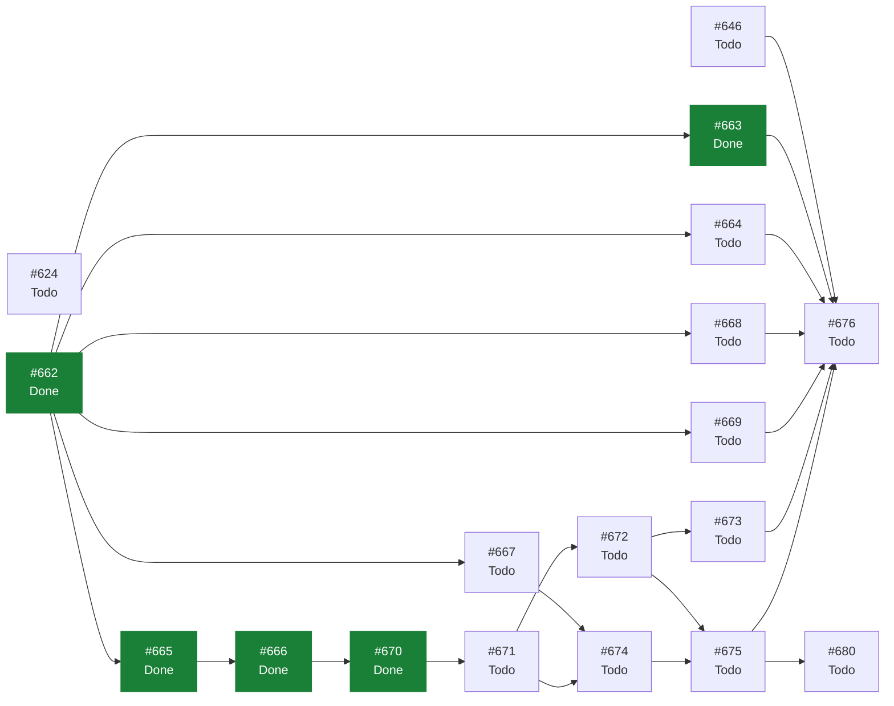

# eVault — Estado del Backlog

> **Documento generado. No editar a mano.**
> Se regenera con `scripts/status.sh` leyendo GitHub, que es la única fuente
> de verdad del estado. Si algo aquí no refleja la realidad, corregirlo en
> GitHub y volver a generar. Las secciones delimitadas como manuales sí se
> editan a mano y el generador las preserva. Ver `docs/GUIDE.md`.

Generado: 2026-09-12
Fuente: [ecamp0s/evault](https://github.com/ecamp0s/evault/issues) y Project «eVault»
Issues: 335 en total, 322 cerrados, 13 abiertos

---

## 1) Objetivo de la iteración

<!-- manual:objetivo -->
**Iteración 18: en curso, abierta el 11 de septiembre de 2026.** Objetivo: *la vault se abre desde la barra del navegador.*

**Quince issues planificados**, del #662 al #676, más el #646, que viene de la 17. Es la **extensión de navegador**, el candidato principal desde el 3 de septiembre de 2026, y **solo Chrome en esta iteración**, por los datos: Firefox aportó 2 entradas de 997 en el #610, y el portátil con Windows Hello usa Chrome. Firefox se mide en el #665 y no se construye todavía.

**Lo que la hace posible ahora y no antes: el passkey.** Manifest V3 mata el service worker de fondo, y eso chocaba con `ADR-007`: no había sitio donde guardar la clave desbloqueada. Con `ADR-021`, la extensión **no custodia la clave: la re-deriva con un toque biométrico**. Que funcione así depende de algo que `ADR-021` §1 anotó y nadie ha medido con PRF, y por eso **el primer issue es una medida y el segundo un ADR**, los dos antes de una línea de `extension/`.

**Cinco ADR dejaron escrito un disparador para este día**, y `ADR-023` tiene que contestarlos todos. Es la lección de la 17 aplicada antes de empezar: un ADR aprobado y diferido es invisible por partida doble.

| ADR | Qué deja pendiente |
|---|---|
| `ADR-007` §6.1 | Un cliente que no desbloquea con comodidad obliga a revisar el token en memoria |
| `ADR-008` §6.4 | El presupuesto de CPU: 600.000 iteraciones de PBKDF2 dentro de una extensión |
| `ADR-016` §6 | CORS, si una extensión llega a necesitarlo |
| `ADR-018` §6.4 | Las 12 horas del token se eligieron para un cliente que recarga |
| `ADR-021` §6.3 | El *salt* del PRF y el `rpId` pasan a ser contrato entre dos clientes |

**Seis bloques.** Bloque 0, medir y decidir: #662, #665 y #666 (`ADR-023`). Bloque 1, el utillaje y los documentos: #663, #664, #667 y #668. Bloque 2, la extensión: #670, #671, #672 y #673. Bloque 3, la verificación: #674 y #675. Bloque 4, la vault: #646 y #669. Bloque 5, el cierre: #676.

**Lo que se decidió al planificar, para que no se reabra por inercia:**

- **#624 pasa a la 19.** Reconciliar sin red no tiene un camino roto, tiene uno que no existe todavía.
- **La papelera y la caducidad del token de `ADR-018` siguen diferidas**, y ahora con motivo: la caducidad la tiene que revisar `ADR-023` contra un cliente que no recarga, y la papelera se decide con la extensión delante.
- **El segundo factor se pliega y no se retira** (#669). Quien tiene la vault dijo que el campo es ruido en el formulario; el #545 decidió no retirarlo, y plegarlo respeta esa decisión sin superseder `ADR-017`.
- **archify entra como prueba de un solo diagrama** (#668), fijado a un commit revisado y sin copiarlo dentro del repositorio.
- **`STATUS.md` se adelgaza primero** (#663): con 288 KB ya no cabe en una lectura, y la planificación de esta misma iteración tropezó con eso.

### Lo que apareció al planificar y no estaba en ningún documento

1. **El límite de diez altas por hora que citó el cierre de la 17 no es el de este clon.** `api/.env` tiene `THROTTLE_REGISTER_ATTEMPTS=1000` desde el 27 de agosto de 2026 y `config()` lo confirma, así que o el cierre corrió contra otra API o la cuenta se hizo con la cifra del documento. **Y SETUP.md no menciona el ajuste**, así que en un clon nuevo el problema es real. Es el patrón de siempre, una afirmación con autoridad que nadie volvió a comprobar, y lo recoge el #667.
2. **Un comentario defensivo que sobrevivió a su motivo**: `api/config/throttling.php` dice que `CLAUDE.md` lista sus claves entre las excepciones de idioma, y esa lista la retiró el #542. Es el mismo mecanismo que el #542 describe. Al #667.
3. **Un superviviente de la conversión de idioma**: `copyToClipboard` documenta `@param vaciarDespues`, y el parámetro se llama `clearAfterwards`. Al #672.
4. **La limpieza del portapapeles no sobreviviría a la extensión tal como está.** La SPA la programa con un `setTimeout`, y el popup de una extensión se cierra en cuanto la persona hace clic en la página para pegar: el temporizador muere justo en el caso normal. Salió al comprobar lo que afirmaba el cuerpo del #672, que decía algo falso sobre `clipboard.ts`.
5. **Los documentos que se leen al empezar suman unos 19.000 *tokens***: `SPRINT_CONTEXT.md` 49 KB y `CLAUDE.md` 29 KB. El primero dice de sí mismo que hay que mantenerlo corto, y nada lo comprueba. Al #664.

**Lo que queda fuera a propósito:** Firefox, que se mide y no se construye; el autocompletado al cargar la página, que no se plantea ni aunque `ADR-023` admita rellenar con un gesto (#673); y escribir desde la extensión, que es de solo lectura en esta iteración.

**Las mediciones al abrir**, tomadas el 11 de septiembre de 2026 y no heredadas del cierre: **1.185 tests** en la web (71 ficheros), **310** en la API con 2.842 aserciones y **127** del utillaje, **1.622** en total; cobertura del **95,14 %** global y **98,88 %** en `lib/vault`, con sus funciones al 100 %. Coinciden con las del cierre de la 17, porque entre las dos no hay código. **Dos issues abiertos** antes de planificar, **cero** de deuda, **cero** PRs y **cero** alertas de Dependabot abiertas; el CI, en verde en los cuatro workflows sobre `e0a7ca9`.
<!-- /manual:objetivo -->

## 2) Qué se puede tomar ahora

Issues abiertos sin ningún bloqueante abierto, ordenados por prioridad. El primero de la lista es lo siguiente a tomar.

1. [#671](https://github.com/ecamp0s/evault/issues/671) feat(extension): desbloquear la vault desde el popup (High)
1. [#646](https://github.com/ecamp0s/evault/issues/646) feat(web): olvidar el historial de contraseñas de toda la vault (Medium)
1. [#664](https://github.com/ecamp0s/evault/issues/664) docs: SPRINT_CONTEXT.md y CLAUDE.md vuelven a caber en una lectura (Medium)
1. [#667](https://github.com/ecamp0s/evault/issues/667) chore(repo): los verificadores comprueban el cupo de altas antes de arrancar Chromium (Medium)
1. [#669](https://github.com/ecamp0s/evault/issues/669) feat(web): la verificación en dos pasos se pliega cuando la entrada no la usa (Medium)
1. [#624](https://github.com/ecamp0s/evault/issues/624) feat(web): reconciliar sin red (Low)
1. [#668](https://github.com/ecamp0s/evault/issues/668) chore(docs): probar archify con el diagrama del flujo de datos zero-knowledge (Low)

## 3) Backlog

Lo abierto y todo lo de las iteraciones que siguen abiertas.

| Issue | Título | Labels | Estado | Prioridad | Bloqueada por | Bloquea a |
| --- | --- | --- | --- | --- | --- | --- |
| [#624](https://github.com/ecamp0s/evault/issues/624) | feat(web): reconciliar sin red | `feat` `web` `s19` | Todo | Low | #619 | — |
| [#646](https://github.com/ecamp0s/evault/issues/646) | feat(web): olvidar el historial de contraseñas de toda la vault | `feat` `web` `s18` | Todo | Medium | #621 | #676 |
| [#662](https://github.com/ecamp0s/evault/issues/662) | docs: planificar la Iteración 18 | `documentation` `s18` | Done | High | — | #663, #664, #665, #667, #668, #669 |
| [#663](https://github.com/ecamp0s/evault/issues/663) | docs: STATUS.md lleva solo la iteración en curso | `documentation` `s18` | Done | High | #662 | #676 |
| [#664](https://github.com/ecamp0s/evault/issues/664) | docs: SPRINT_CONTEXT.md y CLAUDE.md vuelven a caber en una lectura | `documentation` `s18` | Todo | Medium | #662 | #676 |
| [#665](https://github.com/ecamp0s/evault/issues/665) | chore: medir el passkey desde una extensión de navegador | `chore` `extension` `s18` | Done | High | #662 | #666 |
| [#666](https://github.com/ecamp0s/evault/issues/666) | docs: registrar ADR-023, la extensión de navegador | `documentation` `extension` `s18` | Done | High | #665 | #670 |
| [#667](https://github.com/ecamp0s/evault/issues/667) | chore(repo): los verificadores comprueban el cupo de altas antes de arrancar Chromium | `chore` `s18` | Todo | Medium | #662 | #674 |
| [#668](https://github.com/ecamp0s/evault/issues/668) | chore(docs): probar archify con el diagrama del flujo de datos zero-knowledge | `chore` `documentation` `s18` | Todo | Low | #662 | #676 |
| [#669](https://github.com/ecamp0s/evault/issues/669) | feat(web): la verificación en dos pasos se pliega cuando la entrada no la usa | `feat` `web` `s18` | Todo | Medium | #662 | #676 |
| [#670](https://github.com/ecamp0s/evault/issues/670) | chore(extension): el paquete extension/ comparte lib/vault y entra en el CI | `chore` `extension` `s18` | Done | High | #666 | #671 |
| [#671](https://github.com/ecamp0s/evault/issues/671) | feat(extension): desbloquear la vault desde el popup | `feat` `extension` `s18` | Todo | High | #670 | #672, #674 |
| [#672](https://github.com/ecamp0s/evault/issues/672) | feat(extension): buscar y copiar desde el popup | `feat` `extension` `s18` | Todo | High | #671 | #673, #675 |
| [#673](https://github.com/ecamp0s/evault/issues/673) | feat(extension): rellenar con un gesto en la pestaña activa | `feat` `extension` `s18` | Todo | Medium | #672 | #676 |
| [#674](https://github.com/ecamp0s/evault/issues/674) | chore(repo): verify-extension.mjs, la extensión en un Chromium de verdad | `chore` `extension` `s18` | Todo | High | #667, #671 | #675 |
| [#675](https://github.com/ecamp0s/evault/issues/675) | chore: la extensión abre la vault de kastor con Windows Hello en el portátil | `chore` `extension` `s18` | Todo | High | #672, #674 | #676, #680 |
| [#676](https://github.com/ecamp0s/evault/issues/676) | docs: cerrar la Iteración 18 | `documentation` `s18` | Todo | High | #646, #663, #664, #668, #669, #673, #675 | — |
| [#680](https://github.com/ecamp0s/evault/issues/680) | feat(extension): la extensión en Firefox | `feat` `extension` `s19` | Todo | Medium | #675 | — |

Las iteraciones cerradas no se pintan aquí: sus issues están en GitHub y lo que se aprendió, en `docs/planning/archive/`. Cada issue cuenta en la última iteración que lo lleva, así que el enlace de una puede enseñar alguno más: los que empezaron en ella y se cerraron en otra.

| Iteración | Issues | Dónde verlos |
| --- | --- | --- |
| 17 | 24 | [label `s17`](https://github.com/ecamp0s/evault/issues?q=is%3Aissue+label%3As17) |
| 16 | 26 | [label `s16`](https://github.com/ecamp0s/evault/issues?q=is%3Aissue+label%3As16) |
| 15 | 26 | [label `s15`](https://github.com/ecamp0s/evault/issues?q=is%3Aissue+label%3As15) |
| 14 | 22 | [label `s14`](https://github.com/ecamp0s/evault/issues?q=is%3Aissue+label%3As14) |
| 13 | 23 | [label `s13`](https://github.com/ecamp0s/evault/issues?q=is%3Aissue+label%3As13) |
| 12 | 20 | [label `s12`](https://github.com/ecamp0s/evault/issues?q=is%3Aissue+label%3As12) |
| 11 | 13 | [label `s11`](https://github.com/ecamp0s/evault/issues?q=is%3Aissue+label%3As11) |
| 10 | 16 | [label `s10`](https://github.com/ecamp0s/evault/issues?q=is%3Aissue+label%3As10) |
| 9 | 16 | [label `s9`](https://github.com/ecamp0s/evault/issues?q=is%3Aissue+label%3As9) |
| 8 | 10 | [label `s8`](https://github.com/ecamp0s/evault/issues?q=is%3Aissue+label%3As8) |
| 7 | 19 | [label `s7`](https://github.com/ecamp0s/evault/issues?q=is%3Aissue+label%3As7) |
| 6 | 16 | [label `s6`](https://github.com/ecamp0s/evault/issues?q=is%3Aissue+label%3As6) |
| 5 | 12 | [label `s5`](https://github.com/ecamp0s/evault/issues?q=is%3Aissue+label%3As5) |
| 4 | 19 | [label `s4`](https://github.com/ecamp0s/evault/issues?q=is%3Aissue+label%3As4) |
| 3 | 14 | [label `s3`](https://github.com/ecamp0s/evault/issues?q=is%3Aissue+label%3As3) |
| 2 | 13 | [label `s2`](https://github.com/ecamp0s/evault/issues?q=is%3Aissue+label%3As2) |
| 1 | 19 | [label `s1`](https://github.com/ecamp0s/evault/issues?q=is%3Aissue+label%3As1) |
| sin iteración | 9 | [sin label de iteración](https://github.com/ecamp0s/evault/issues?q=is%3Aissue+-label%3As19+-label%3As18+-label%3As17+-label%3As16+-label%3As15+-label%3As14+-label%3As13+-label%3As12+-label%3As11+-label%3As10+-label%3As9+-label%3As8+-label%3As7+-label%3As6+-label%3As5+-label%3As4+-label%3As3+-label%3As2+-label%3As1) |

## 4) Grafo de dependencias

La flecha va del bloqueante al bloqueado. En verde, lo ya cerrado.

## 5) Criterios de salida de la iteración

<!-- manual:salida -->
### Iteración 18, en curso

**Ocho criterios, escritos al abrirla el 11 de septiembre de 2026.** Ninguno evaluado todavía.

1. **`ADR-023` registrado antes de la primera línea de `extension/`**, contestando uno a uno los cinco disparadores: `ADR-007` §6.1, `ADR-008` §6.4, `ADR-016` §6, `ADR-018` §6.4 y `ADR-021` §6.3 (#665, #666).
2. **En el portátil real, Chrome con la extensión abre la vault de kastor con Windows Hello sin teclear la contraseña maestra**, y la cuenta de entradas es la misma antes y después (#675).
3. **La extensión no conserva la clave de vault más tiempo del que dice `ADR-023`**, verificado en navegador y no solo afirmado en un comentario (#671, #674).
4. **Una sola implementación criptográfica**: **ningún `crypto.subtle` en `extension/`**, vigilado por un test y por ESLint en el CI. Se escribió como «`crypto.subtle` solo en `web/src/lib/vault/crypto.ts`», y eso era falso al escribirlo: `totp.ts` lo usa desde la Iteración 13 para el HMAC de los códigos (#670).
5. **`api/` cambia solo lo que diga `ADR-023`**, y probablemente nada. Se comprueba con `git diff --stat` sobre la iteración.
6. **Los cuatro verificadores ejecutados el día del cierre**, `verify-extension` nacido en rojo, y ninguno puede morir por el cupo de altas sin decirlo antes de arrancar Chromium (#667, #674).
7. **El historial de toda la vault se puede olvidar con un gesto**, verificado en navegador sobre datos sembrados. Hacerlo en la vault real lo decide quien la tiene (#646).
8. **El formulario de un login sin semilla ya no lleva el segundo factor desplegado**, con `verify-auto-lock` entero en verde después del cambio (#669).

**El criterio 2 es el único que ningún test puede sustituir, y por el mismo motivo que el criterio 2 de la 16:** un autenticador virtual es el modelo de Chromium y no el de Windows. Si Windows Hello no entrega el PRF a una extensión, eso es un hallazgo del #665 y cambia la forma de `ADR-023`, no el criterio.
<!-- /manual:salida -->

## 6) Riesgos

<!-- manual:riesgos -->
| Riesgo | Estado | Detalle |
| --- | --- | --- |
| **Windows Hello no entrega el PRF a una extensión** | `Cerrado sin materializarse: medido en el #665` | **Sí lo entrega**, y el mismo que a la web: con Windows Hello real, el passkey que dio de alta la SPA abrió desde la extensión el envoltorio que la SPA guardó, también desde el popup. Lo que sigue es la planificación. Todo el diseño descansa en que la extensión re-deriva la clave con el passkey en vez de custodiarla. `ADR-021` §1 anotó que una extensión puede usar el `rpId` de sus `host_permissions`, **pero nadie lo ha medido con PRF ni con un autenticador real**. Si falla, hay dos salidas y ninguna tumba la iteración: un passkey propio de la extensión, que la tabla de varios passkeys de `ADR-021` ya admite, o la contraseña maestra dentro de la extensión pagando el PBKDF2 que `ADR-008` §6.4 anticipaba. Por eso la medida va primera y sola. |
| **La extensión amplía la superficie de ataque del cliente** | `Decidido en ADR-023, pendiente de construir` | `ADR-023` lo acota así: solo lectura, sin content scripts declarados, rellenar solo con un gesto, en el marco principal y en el host de la entrada, y ningún permiso de más. Lo que sigue es la planificación. Un gestor de contraseñas en el navegador es el blanco clásico: permisos amplios, rellenar en iframes de otro origen, formularios invisibles. La mitigación es de alcance y va escrita antes del código: solo lectura, sin autocompletar al cargar la página, rellenar solo con un gesto y en el host de la entrada si `ADR-023` lo admite (#673), y permisos mínimos en el manifiesto (#670). |
| **Dos copias de la criptografía** | `Mitigado: vigilado en el CI desde el #670` | Si `extension/` copia `lib/vault` en vez de importarla, las dos divergen y la que se queda atrás cifra mal con autoridad. Es el criterio 4, y no se comprueba con un grep que alguien tiene que acordarse de lanzar: `extension/src/oneImplementation.test.ts` rechaza la palabra en el código de la extensión y la regla de ESLint avisa antes, en el editor (#670). |
| **El portapapeles no se limpia con el popup cerrado** | `Decidido en ADR-023, pendiente de construir` | Lo limpia el documento *offscreen* que custodia la clave, que sobrevive al popup y al service worker (medido). Lo que sigue es la planificación. La SPA limpia con un `setTimeout`, y el popup se cierra en cuanto se hace clic en la página para pegar. Sin decidir quién limpia —el service worker con `chrome.alarms`, un documento *offscreen*—, la contraseña copiada se quedaría en el portapapeles. Está en el #672 y en los casos del #674. |
| **Plegar el segundo factor rompe un verificador que el CI no ejecuta** | `Abierto, escrito en el #669` | `typeTotpSeed` enfoca `#totp` directamente y el caso 9 de `verify-auto-lock` fallaría con el campo plegado. Ya pasó al cerrar la 15 con `#notas`. El #669 no se cierra sin ese verificador ejecutado entero. |
| **archify es código ajeno en la máquina que hace `ssh kastor`** | `Abierto, mitigado por la forma del #668` | Una skill ejecuta con los permisos de quien la usa, y el repositorio cambia a diario. Fijado a un commit revisado, leído antes de ejecutarlo, con la consulta de actualizaciones apagada y sin copiarse dentro de este repositorio. Si la prueba no convence, no deja nada. |
| **Adelgazar `STATUS.md` pierde texto que no está en ningún archivo** | `Abierto, mitigado por el orden` | Las secciones manuales son lo único irrecuperable de ese fichero. El #663 comprueba iteración por iteración que su archivo contiene lo que se quita **antes** de quitarlo, y mueve lo que falte. |
| **El historial guarda contraseñas viejas, que son secretos** | `Abierto, heredado de la 17 y de ADR-018 §5` | La vault custodia más secretos de los que su dueño metió: **24 entradas con candidatas sin confirmar** desde el import real, y contraseñas retiradas que a veces se retiraron precisamente por estar comprometidas. La mitigación de `ADR-018` es el tope de tres y el olvido explícito, y hoy solo existe la mitad pequeña, entrada a entrada. El #646 trae la otra —olvidar el de toda la vault—, avisando aparte de las entradas sin confirmar, porque ahí olvidar es resolver el conflicto tirando una contraseña que puede ser la buena. |
| **Una pestaña abierta desde antes de un despliegue sigue con el código viejo** | `Abierto, heredado de la 17` | El service worker nuevo toma el control, pero una página ya cargada ejecuta su código hasta que se recarga: la primera apertura del import en kastor enseñó la pantalla de antes del #644. En la 18 despliega el cierre (#676) y el #669 cambia el formulario de todas las entradas, así que **recargar la pestaña es un paso del despliegue** y el cierre lo lleva en sus criterios. |
<!-- /manual:riesgos -->
