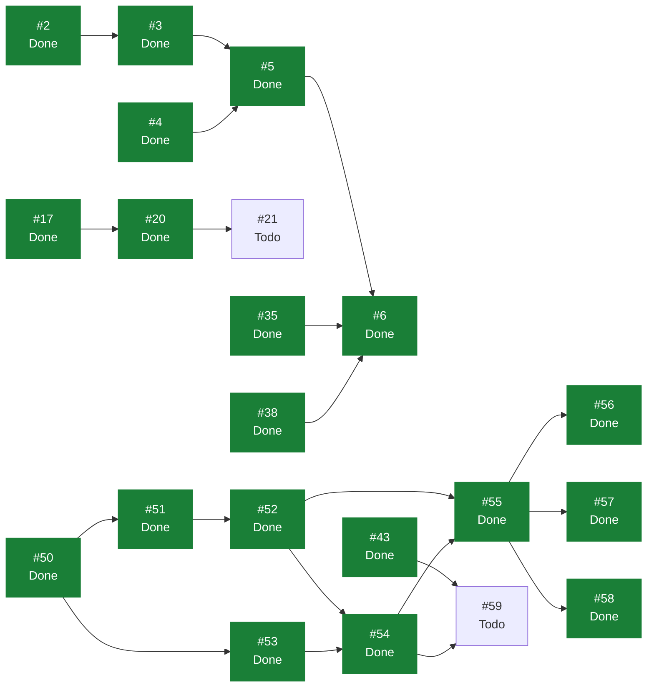

# eVault — Estado del Backlog

> **Documento generado. No editar a mano.**
> Se regenera con `scripts/status.sh` leyendo GitHub, que es la única fuente
> de verdad del estado. Si algo aquí no refleja la realidad, corregirlo en
> GitHub y volver a generar. Las secciones delimitadas como manuales sí se
> editan a mano y el generador las preserva. Ver `docs/GUIDE.md`.

Generado: 2026-08-02
Fuente: [ecamp0s/evault-claude](https://github.com/ecamp0s/evault-claude/issues) y Project «eVault»
Issues: 37 en total, 29 cerrados, 8 abiertos

---

## 1) Objetivo de la iteración

<!-- manual:objetivo -->
**Iteración 2: en curso.** Objetivo: *un usuario guarda, consulta, edita y borra credenciales en su vault personal.*

La Iteración 1 validó el stack pero no entregó producto: hoy la aplicación permite registrarse, entrar y ver un placeholder. Esta iteración introduce el primer modelo de dominio —`Vault` y `VaultItem` según `ADR-004`— y el CRUD completo de extremo a extremo.

**Decisión de alcance sobre el cifrado.** El cifrado en cliente sigue siendo la Iteración 3. Durante esta iteración el contrato de la API ya es el definitivo —el servidor recibe un blob opaco y ninguna columna tiene significado—, pero lo que hay dentro del blob va con una codificación reversible, no criptográfica. Es la misma jugada que se hizo con la autenticación en la Iteración 1: fijar el contrato antes de meter criptografía, para que el cambio posterior toque solo al cliente.

La condición que va con esa decisión: **no se despliega con datos reales hasta que cierre la Iteración 3.** Queda registrada en #59.

Fuera de alcance por decisión de planificación: búsqueda y filtrado de items, y generador de contraseñas. Ambos se replantean en la Iteración 3.

**Iteración 1: cerrada el 30 de julio de 2026.** Su historial y sus lecciones están en `docs/planning/archive/ITERACION_1.md`.
<!-- /manual:objetivo -->

## 2) Qué se puede tomar ahora

Issues abiertos sin ningún bloqueante abierto, ordenados por prioridad. El primero de la lista es lo siguiente a tomar.

1. [#59](https://github.com/ecamp0s/evault-claude/issues/59) chore(web): sustituir la codificación temporal del payload por cifrado real (High)
1. [#73](https://github.com/ecamp0s/evault-claude/issues/73) chore(web): dejar de persistir el token de sesión (ADR-007) (High)
1. [#21](https://github.com/ecamp0s/evault-claude/issues/21) chore(repo): proteger master con un ruleset (Medium)
1. [#46](https://github.com/ecamp0s/evault-claude/issues/46) feat(web): shell usable en móvil (Medium)
1. [#62](https://github.com/ecamp0s/evault-claude/issues/62) ci: comprobaciones de documentación en los PR (Medium)
1. [#63](https://github.com/ecamp0s/evault-claude/issues/63) fix(ci): el workflow status escribe en master fuera de los disparadores declarados (Medium)
1. [#44](https://github.com/ecamp0s/evault-claude/issues/44) chore(web): que /styleguide no viaje al build de producción (Low)
1. [#45](https://github.com/ecamp0s/evault-claude/issues/45) chore(web): reducir el bundle, hoy en 595 kB en un solo chunk (Low)

## 3) Backlog completo

| Issue | Título | Labels | Estado | Prioridad | Bloqueada por | Bloquea a |
| --- | --- | --- | --- | --- | --- | --- |
| [#1](https://github.com/ecamp0s/evault-claude/issues/1) | chore(api): stack de calidad — Pest, Larastan y CI | `s1` `chore` `api` | Done | — | — | — |
| [#2](https://github.com/ecamp0s/evault-claude/issues/2) | chore(api): Sanctum y CORS para consumo desde SPA | `s1` `chore` `api` | Done | High | — | #3 |
| [#3](https://github.com/ecamp0s/evault-claude/issues/3) | feat(api): endpoints de registro, login y sesión | `s1` `feat` `api` | Done | Medium | #2 | #5 |
| [#4](https://github.com/ecamp0s/evault-claude/issues/4) | chore(web): shadcn/ui y sistema de diseño base | `s1` `chore` `web` | Done | — | — | #5 |
| [#5](https://github.com/ecamp0s/evault-claude/issues/5) | feat(web): pantallas de login y registro | `s1` `feat` `web` | Done | Medium | #3, #4 | #6 |
| [#6](https://github.com/ecamp0s/evault-claude/issues/6) | feat(web): shell autenticado y rutas protegidas | `s1` `feat` `web` | Done | Low | #5, #35, #38 | — |
| [#9](https://github.com/ecamp0s/evault-claude/issues/9) | docs: fundación documental — índice, ADRs y STATUS.md generado | `s1` `chore` `documentation` | Done | High | — | — |
| [#11](https://github.com/ecamp0s/evault-claude/issues/11) | ci: regenerar STATUS.md automáticamente al mergear en master | `s1` `chore` `documentation` | Done | — | — | — |
| [#15](https://github.com/ecamp0s/evault-claude/issues/15) | fix(ci): localizar el Project por vinculación al repo, no por su nombre | `s1` `chore` `documentation` | Done | — | — | — |
| [#17](https://github.com/ecamp0s/evault-claude/issues/17) | ci(web): lint y build del frontend en cada PR | `s1` `chore` `web` | Done | High | — | #20 |
| [#18](https://github.com/ecamp0s/evault-claude/issues/18) | chore(repo): plantillas de issue en .github/ISSUE_TEMPLATE | `s1` `chore` `documentation` | Done | Low | — | — |
| [#19](https://github.com/ecamp0s/evault-claude/issues/19) | chore(repo): Dependabot para composer, npm y GitHub Actions | `s1` `chore` | Done | Low | — | — |
| [#20](https://github.com/ecamp0s/evault-claude/issues/20) | ci: mover el filtrado de paths del trigger a los jobs | `s1` `chore` | Done | Medium | #17 | #21 |
| [#21](https://github.com/ecamp0s/evault-claude/issues/21) | chore(repo): proteger master con un ruleset | `s1` `chore` | Todo | Medium | #20 | — |
| [#25](https://github.com/ecamp0s/evault-claude/issues/25) | chore(api): rate limiting en los endpoints de autenticación | `s1` `chore` `api` | Done | Medium | — | — |
| [#35](https://github.com/ecamp0s/evault-claude/issues/35) | chore(web): evaluar la migración a React Router 8 | `s1` `chore` `web` | Done | High | — | #6 |
| [#38](https://github.com/ecamp0s/evault-claude/issues/38) | chore(web): suite de tests de frontend con Vitest y Testing Library | `s1` `chore` `web` | Done | High | — | #6 |
| [#43](https://github.com/ecamp0s/evault-claude/issues/43) | chore(web): decidir dónde vive el token de sesión antes de la Iteración 3 | `s2` `chore` `web` `deuda` | Done | High | — | #59 |
| [#44](https://github.com/ecamp0s/evault-claude/issues/44) | chore(web): que /styleguide no viaje al build de producción | `s2` `chore` `web` `deuda` | Todo | Low | — | — |
| [#45](https://github.com/ecamp0s/evault-claude/issues/45) | chore(web): reducir el bundle, hoy en 595 kB en un solo chunk | `chore` `web` `deuda` | Todo | Low | — | — |
| [#46](https://github.com/ecamp0s/evault-claude/issues/46) | feat(web): shell usable en móvil | `s2` `feat` `web` `deuda` | Todo | Medium | — | — |
| [#47](https://github.com/ecamp0s/evault-claude/issues/47) | docs: cerrar formalmente la Iteración 1 en STATUS.md | `s1` `chore` `documentation` | Done | Medium | — | — |
| [#48](https://github.com/ecamp0s/evault-claude/issues/48) | docs: partir SPRINT_CONTEXT y fijar las reglas de gestión de deuda | `s1` `chore` `documentation` | Done | Medium | — | — |
| [#50](https://github.com/ecamp0s/evault-claude/issues/50) | feat(api): modelo de dominio de vaults y pertenencia | `s2` `feat` `api` | Done | High | — | #51, #53 |
| [#51](https://github.com/ecamp0s/evault-claude/issues/51) | feat(api): modelo de vault items con payload opaco | `s2` `feat` `api` | Done | High | #50 | #52 |
| [#52](https://github.com/ecamp0s/evault-claude/issues/52) | feat(api): CRUD de vault items con contexto de vault explícito | `s2` `feat` `api` | Done | High | #51 | #54, #55 |
| [#53](https://github.com/ecamp0s/evault-claude/issues/53) | feat(api): listado de los vaults del usuario | `s2` `feat` `api` | Done | Medium | #50 | #54 |
| [#54](https://github.com/ecamp0s/evault-claude/issues/54) | chore(web): capa de datos de la vault con TanStack Query | `s2` `chore` `web` | Done | Medium | #52, #53 | #55, #59 |
| [#55](https://github.com/ecamp0s/evault-claude/issues/55) | feat(web): lista de items de la vault | `s2` `feat` `web` | Done | High | #52, #54 | #56, #57, #58 |
| [#56](https://github.com/ecamp0s/evault-claude/issues/56) | feat(web): crear y editar un item de la vault | `s2` `feat` `web` | Done | High | #55 | — |
| [#57](https://github.com/ecamp0s/evault-claude/issues/57) | feat(web): borrar un item con confirmación | `s2` `feat` `web` | Done | Medium | #55 | — |
| [#58](https://github.com/ecamp0s/evault-claude/issues/58) | feat(web): mostrar, ocultar y copiar la contraseña | `s2` `feat` `web` | Done | Medium | #55 | — |
| [#59](https://github.com/ecamp0s/evault-claude/issues/59) | chore(web): sustituir la codificación temporal del payload por cifrado real | `chore` `web` `deuda` | Todo | High | #43, #54 | — |
| [#60](https://github.com/ecamp0s/evault-claude/issues/60) | docs: planificar la Iteración 2 | `s2` `chore` `documentation` | Done | — | — | — |
| [#62](https://github.com/ecamp0s/evault-claude/issues/62) | ci: comprobaciones de documentación en los PR | `s2` `chore` `documentation` | Todo | Medium | — | — |
| [#63](https://github.com/ecamp0s/evault-claude/issues/63) | fix(ci): el workflow status escribe en master fuera de los disparadores declarados | `s2` `chore` `documentation` | Todo | Medium | — | — |
| [#73](https://github.com/ecamp0s/evault-claude/issues/73) | chore(web): dejar de persistir el token de sesión (ADR-007) | `chore` `web` `deuda` | Todo | High | — | — |

## 4) Grafo de dependencias

La flecha va del bloqueante al bloqueado. En verde, lo ya cerrado.

## 5) Criterios de salida de la iteración

<!-- manual:salida -->
Criterios de la Iteración 2. La iteración no se cierra hasta que los siete se cumplan:

1. ⬜ **Un usuario crea, ve, edita y borra una credencial en navegador**, contra la API real y no solo en tests.
2. ⬜ **El servidor no tiene ninguna columna con significado.** Inspeccionar `vault_items` en la base de datos no revela ni nombres, ni URLs, ni usuarios: solo bytes.
3. ⬜ **Tests de aislamiento cross-tenant en todos los servicios que tocan datos de vault.** Obligatorio por `ADR-004`: un servicio sin ellos se considera incompleto, no pendiente de pulir.
4. ⬜ **El contexto de vault viaja explícito en cada endpoint de dominio.** Nada se infiere de estado previo en el servidor.
5. ⬜ **El contrato de `/api/auth` no ha cambiado.** Las cuatro rutas de la Iteración 1 responden exactamente igual.
6. ⬜ **Pest y Vitest en verde, `composer analyse` sin errores en nivel `max`, CI en verde en cada PR.**
7. ⬜ **La codificación del payload vive en un solo módulo del cliente**, de forma que la Iteración 3 lo sustituya sin tocar nada más.

Los criterios de la Iteración 1, todos cumplidos, están en `docs/planning/archive/ITERACION_1.md`.
<!-- /manual:salida -->

## 6) Riesgos

<!-- manual:riesgos -->
| Riesgo | Estado | Detalle |
| --- | --- | --- |
| La autenticación de la Iteración 1 **no es zero-knowledge**: la contraseña viaja al servidor | `Aceptado` | Deliberado y temporal. Se sustituye en la Iteración 3. El contrato de la API se mantiene estable para que el cambio sea mínimo. Ver `ADR-001` |
| Orígenes CORS mal configurados degradando a permisivo | `Mitigado` | Cerrado en #2. El parseo es fail-closed y descarta el comodín incluso escrito a propósito; sin orígenes, la API aborta con un mensaje explícito en vez de abrirse |
| Fuerza bruta contra el login | `Mitigado` | Cerrado en #25. Cinco intentos por minuto y combinación de IP y correo, más límite por IP en el registro |
| Un cambio de contrato en la Iteración 3 obligue a reescribir los clientes | `Open` | Rutas, forma de request/response y gestión de tokens ya fijadas. El riesgo persiste hasta que la Iteración 3 lo confirme en la práctica |
| **El servidor puede leer los secretos durante la Iteración 2** | `Aceptado` | Deliberado. El contrato ya es el definitivo, pero el contenido del blob va codificado y no cifrado hasta la Iteración 3. **Condición mientras dure: no desplegar con datos reales.** Tiene issue: #59 |
| El token en `localStorage` es accesible a un XSS | `Open` | El razonamiento que lo aceptaba —«la API no guarda secretos»— **deja de valer en esta iteración**, en la que la API empieza a guardarlos. Tiene issue: #43, dentro del sprint |
| Query sin `vault_id` filtrando datos entre tenants | `Open` | **Ya aplica**: esta iteración introduce el modelo de vaults. Double guard y tests de aislamiento cross-tenant obligatorios en #52. Es el fallo más grave posible en este producto. Ver `ADR-004` |
| Cifrado en cliente con fallo silencioso: pérdida de datos irreversible | `Open` | Tests criptográficos dedicados antes de la Iteración 3. Ver `ADR-001` y #59 |
| Nivel `max` de Larastan insostenible al aparecer código de dominio | `Open` | **Esta es la iteración que lo pone a prueba**: es la primera con código de dominio real. Aguantó la Iteración 1 sin baseline. Bajar a 8 sigue siendo aceptable si llega el caso |
| El cliente descarga y descifra la vault entera | `Aceptado` | Consecuencia obligada de `ADR-001`: el servidor no puede filtrar ni paginar lo que no puede leer. Es el modelo de Bitwarden. Se revisará si el número de items lo hace notar |
| `master` sin protección: un push directo o un force push no los impide nada | `Open` | **No se puede mitigar**: GitHub no permite rulesets en repos privados de cuentas Free. Ver #21. Mitigación parcial con el hook `pre-push`, que vive en el clon y se salta con `--no-verify` |
<!-- /manual:riesgos -->
