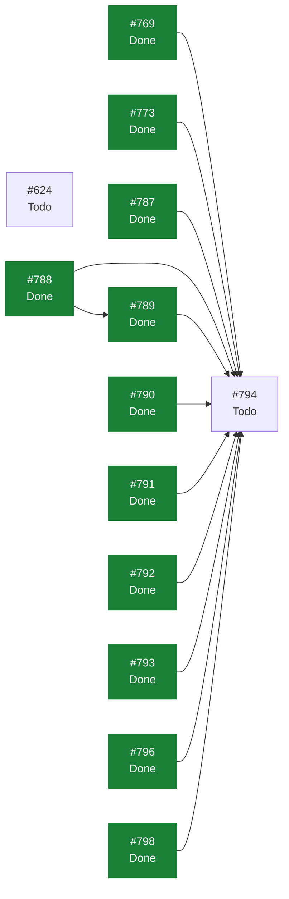

# eVault — Estado del Backlog

> **Documento generado. No editar a mano.**
> Se regenera con `scripts/status.sh` leyendo GitHub, que es la única fuente
> de verdad del estado. Si algo aquí no refleja la realidad, corregirlo en
> GitHub y volver a generar. Las secciones delimitadas como manuales sí se
> editan a mano y el generador las preserva. Ver `docs/GUIDE.md`.

Generado: 2026-10-10
Fuente: [ecamp0s/evault](https://github.com/ecamp0s/evault/issues) y Project «eVault»
Issues: 383 en total, 381 cerrados, 2 abiertos

---

## 1) Objetivo de la iteración

<!-- manual:objetivo -->
**Iteración 22: sin planificar.** La 21 se cerró el 10 de octubre de 2026 con su objetivo cumplido —la vault se usa a diario con menos fricción, en la web y en las dos extensiones— y su detalle está en [docs/planning/archive/ITERACION_21.md](archive/ITERACION_21.md).

**Los candidatos, para quien la planifique**, sin orden decidido:

- **La limpieza de la vault real**, la candidata que la 21 dejó para esta: un modo de revisión que recorra desde la auditoría las entradas con algo que corregir, y **comprobar contraseñas filtradas** con el k-anonimato de HIBP, que pide su propio ADR con `ADR-001` y `ADR-015` delante.
- **La contraseña maestra de 12 caracteres**, propuesta al planificar la 21 y no elegida: hoy exige 8, y la auditoría llama «corta» a cualquier contraseña de menos de 12.
- **Una página de ajustes**: el menú de usuario tiene diez opciones que mezclan cuenta, dispositivo y vault.
- [#624](https://github.com/ecamp0s/evault/issues/624), **reconciliar sin red**, en el backlog en `Low`.
- **Un modelo de amenazas**, anotado sin prisa.

**Y lo que no es de una iteración:** actualizar la extensión del portátil de la mujer de quien tiene la vault, que sigue con la 0.1.3, abriendo el enlace de kastor. Es además la primera prueba de ese enlace en su Firefox (#796).
<!-- /manual:objetivo -->

## 2) Qué se puede tomar ahora

Issues abiertos sin ningún bloqueante abierto, ordenados por prioridad. El primero de la lista es lo siguiente a tomar.

1. [#794](https://github.com/ecamp0s/evault/issues/794) docs: cerrar la Iteración 21 (Medium)
1. [#624](https://github.com/ecamp0s/evault/issues/624) feat(web): reconciliar sin red (Low)

## 3) Backlog

Lo abierto y todo lo de las iteraciones que siguen abiertas.

| Issue | Título | Labels | Estado | Prioridad | Bloqueada por | Bloquea a |
| --- | --- | --- | --- | --- | --- | --- |
| [#624](https://github.com/ecamp0s/evault/issues/624) | feat(web): reconciliar sin red | `feat` `web` | Todo | Low | #619 | — |
| [#769](https://github.com/ecamp0s/evault/issues/769) | chore(extension): medir una ventana de desbloqueo en Firefox, o reabrir el popup al terminar | `chore` `extension` `s21` | Done | Low | — | #794 |
| [#773](https://github.com/ecamp0s/evault/issues/773) | bug(extension): el primer paso de un login en dos pasos no se rellena en sitios reales (shein.com, gravatar.com) | `bug` `extension` `s21` | Done | High | — | #794 |
| [#787](https://github.com/ecamp0s/evault/issues/787) | docs: planificar la Iteración 21 | `documentation` `s21` | Done | High | — | #794 |
| [#788](https://github.com/ecamp0s/evault/issues/788) | feat(web): bloquear la vault a mano, desde el menú y con un atajo | `feat` `web` `s21` | Done | High | — | #789, #794 |
| [#789](https://github.com/ecamp0s/evault/issues/789) | feat(web): atajos de teclado para buscar en la vault | `feat` `web` `s21` | Done | Medium | #788 | #794 |
| [#790](https://github.com/ecamp0s/evault/issues/790) | feat(web): primeros pasos tras crear la cuenta | `feat` `web` `s21` | Done | Medium | — | #794 |
| [#791](https://github.com/ecamp0s/evault/issues/791) | feat(web): Exportar e Importar en un menú, y una inicial por host en lugar del globo | `feat` `web` `s21` | Done | Medium | — | #794 |
| [#792](https://github.com/ecamp0s/evault/issues/792) | feat(extension): un generador de contraseñas en el popup, que solo copia | `feat` `extension` `s21` | Done | Medium | — | #794 |
| [#793](https://github.com/ecamp0s/evault/issues/793) | feat(extension): un atajo de teclado para abrir el popup | `feat` `extension` `s21` | Done | Low | — | #794 |
| [#794](https://github.com/ecamp0s/evault/issues/794) | docs: cerrar la Iteración 21 | `documentation` `s21` | Todo | Medium | #769, #773, #787, #788, #789, #790, #791, #792, #793, #796, #798 | — |
| [#796](https://github.com/ecamp0s/evault/issues/796) | chore(extension): instalar la extensión de Firefox desde un enlace de kastor, sin quitar la anterior | `chore` `extension` `s21` | Done | Medium | — | #794 |
| [#798](https://github.com/ecamp0s/evault/issues/798) | chore(extension): la instancia y la carpeta de Chrome, en un fichero fuera del repositorio | `chore` `extension` `s21` | Done | High | — | #794 |

Las iteraciones cerradas no se pintan aquí: sus issues están en GitHub y lo que se aprendió, en `docs/planning/archive/`. Cada issue cuenta en la última iteración que lo lleva, así que el enlace de una puede enseñar alguno más: los que empezaron en ella y se cerraron en otra.

| Iteración | Issues | Dónde verlos |
| --- | --- | --- |
| 20 | 16 | [label `s20`](https://github.com/ecamp0s/evault/issues?q=is%3Aissue+label%3As20) |
| 19 | 19 | [label `s19`](https://github.com/ecamp0s/evault/issues?q=is%3Aissue+label%3As19) |
| 18 | 16 | [label `s18`](https://github.com/ecamp0s/evault/issues?q=is%3Aissue+label%3As18) |
| 17 | 24 | [label `s17`](https://github.com/ecamp0s/evault/issues?q=is%3Aissue+label%3As17) |
| 16 | 26 | [label `s16`](https://github.com/ecamp0s/evault/issues?q=is%3Aissue+label%3As16) |
| 15 | 26 | [label `s15`](https://github.com/ecamp0s/evault/issues?q=is%3Aissue+label%3As15) |
| 14 | 22 | [label `s14`](https://github.com/ecamp0s/evault/issues?q=is%3Aissue+label%3As14) |
| 13 | 23 | [label `s13`](https://github.com/ecamp0s/evault/issues?q=is%3Aissue+label%3As13) |
| 12 | 20 | [label `s12`](https://github.com/ecamp0s/evault/issues?q=is%3Aissue+label%3As12) |
| 11 | 13 | [label `s11`](https://github.com/ecamp0s/evault/issues?q=is%3Aissue+label%3As11) |
| 10 | 16 | [label `s10`](https://github.com/ecamp0s/evault/issues?q=is%3Aissue+label%3As10) |
| 9 | 16 | [label `s9`](https://github.com/ecamp0s/evault/issues?q=is%3Aissue+label%3As9) |
| 8 | 10 | [label `s8`](https://github.com/ecamp0s/evault/issues?q=is%3Aissue+label%3As8) |
| 7 | 19 | [label `s7`](https://github.com/ecamp0s/evault/issues?q=is%3Aissue+label%3As7) |
| 6 | 16 | [label `s6`](https://github.com/ecamp0s/evault/issues?q=is%3Aissue+label%3As6) |
| 5 | 12 | [label `s5`](https://github.com/ecamp0s/evault/issues?q=is%3Aissue+label%3As5) |
| 4 | 19 | [label `s4`](https://github.com/ecamp0s/evault/issues?q=is%3Aissue+label%3As4) |
| 3 | 14 | [label `s3`](https://github.com/ecamp0s/evault/issues?q=is%3Aissue+label%3As3) |
| 2 | 13 | [label `s2`](https://github.com/ecamp0s/evault/issues?q=is%3Aissue+label%3As2) |
| 1 | 19 | [label `s1`](https://github.com/ecamp0s/evault/issues?q=is%3Aissue+label%3As1) |
| sin iteración | 12 | [sin label de iteración](https://github.com/ecamp0s/evault/issues?q=is%3Aissue+-label%3As21+-label%3As20+-label%3As19+-label%3As18+-label%3As17+-label%3As16+-label%3As15+-label%3As14+-label%3As13+-label%3As12+-label%3As11+-label%3As10+-label%3As9+-label%3As8+-label%3As7+-label%3As6+-label%3As5+-label%3As4+-label%3As3+-label%3As2+-label%3As1) |

## 4) Grafo de dependencias

```mermaid
graph LR
  I624["#624<br/>Todo"]
  I769["#769<br/>Done"]
  I773["#773<br/>Done"]
  I787["#787<br/>Done"]
  I788["#788<br/>Done"]
  I789["#789<br/>Done"]
  I790["#790<br/>Done"]
  I791["#791<br/>Done"]
  I792["#792<br/>Done"]
  I793["#793<br/>Done"]
  I794["#794<br/>Todo"]
  I796["#796<br/>Done"]
  I798["#798<br/>Done"]
  I769 --> I794
  I773 --> I794
  I787 --> I794
  I788 --> I789
  I788 --> I794
  I789 --> I794
  I790 --> I794
  I791 --> I794
  I792 --> I794
  I793 --> I794
  I796 --> I794
  I798 --> I794
  classDef hecho fill:#1a7f37,stroke:#1a7f37,color:#fff;
  class I769,I773,I787,I788,I789,I790,I791,I792,I793,I796,I798 hecho;
```

La flecha va del bloqueante al bloqueado. En verde, lo ya cerrado.

## 5) Criterios de salida de la iteración

<!-- manual:salida -->
### Iteración 22, sin planificar

**Todavía no tiene criterios de salida.** Los de la 21, evaluados uno a uno, están en [docs/planning/archive/ITERACION_21.md](archive/ITERACION_21.md).
<!-- /manual:salida -->

## 6) Riesgos

<!-- manual:riesgos -->
| Riesgo | Estado | Detalle |
| --- | --- | --- |
| **Que Mozilla retire Manifest V2** | `Abierto, sin fecha` | La extensión de Firefox guarda la clave en una página de fondo persistente, que solo existe en V2 (`ADR-025` §2.1), y desde el #769 es también la que reabre el popup tras desbloquear. Mozilla ha dicho que lo mantiene; si anuncia lo contrario, es el disparador 1 de ese ADR. |
| **Una pestaña abierta desde antes de un despliegue sigue con el código viejo** | `Abierto, heredado: es un paso de cada despliegue` | Y ninguna de las dos extensiones se actualiza sola: la de Chrome se reconstruye con `release:chrome` y la de Firefox se publica con `release:firefox` y se instala desde el enlace de kastor. Que sean de solo lectura es lo que impide que eso cueste datos. |
| **El límite de desbloqueos con passkey se comparte** | `Asumido en ADR-023 §5.5` | Cinco por hora y cuenta, entre la web y las dos extensiones de todos los dispositivos. Cada actualización de una extensión cuesta uno, y en la 21 una tarde de pruebas lo agotó. |
| **La suite no ve lo que hace MySQL** | `Abierto, sin issue: es una propiedad de la suite` | Los tests corren en SQLite, que no tiene bloqueos de hueco (#730). Lo que se hace a la vez se prueba también contra el MySQL de desarrollo. |
| **Un verificador en verde no es un sitio real** | `Abierto, heredado: es un método` | Lo que toca páginas ajenas se comprueba a mano en un sitio de verdad antes de cerrarlo: el #773 salió en verde en `verify-extension` y no rellenaba en shein.com hasta que se midió el banner de cookies. |
<!-- /manual:riesgos -->
