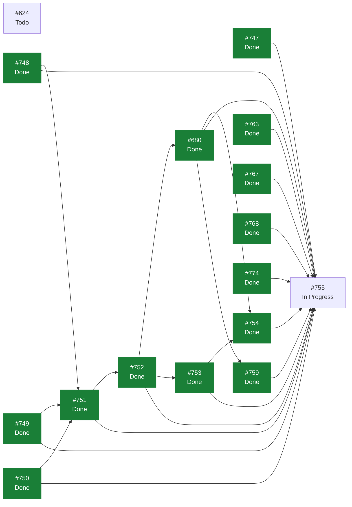

# eVault — Estado del Backlog

> **Documento generado. No editar a mano.**
> Se regenera con `scripts/status.sh` leyendo GitHub, que es la única fuente
> de verdad del estado. Si algo aquí no refleja la realidad, corregirlo en
> GitHub y volver a generar. Las secciones delimitadas como manuales sí se
> editan a mano y el generador las preserva. Ver `docs/GUIDE.md`.

Generado: 2026-10-09
Fuente: [ecamp0s/evault](https://github.com/ecamp0s/evault/issues) y Project «eVault»
Issues: 372 en total, 368 cerrados, 4 abiertos

---

## 1) Objetivo de la iteración

<!-- manual:objetivo -->
**Iteración 21: sin planificar.** La 20 se cerró el 8 de octubre de 2026 con su objetivo cumplido —la vault se abre desde Firefox— y su detalle está en [docs/planning/archive/ITERACION_20.md](archive/ITERACION_20.md).

**Los candidatos, para quien la planifique**, sin orden decidido:

- [#773](https://github.com/ecamp0s/evault/issues/773), **el primer paso de shein.com**, que sigue sin rellenarse en un navegador real aunque el verificador sale en verde. Empieza por medir, con la función real en la página real, dónde está el foco al rellenar.
- **Las vaults compartidas**, que esperaban a que hubiera dos cuentas reales: desde el 8 de octubre las hay. `ADR-008` las anticipa —la clave envuelta vive en `vault_members`— y lo que falta es criptografía asimétrica. Antes, saber si quienes tienen esas dos cuentas quieren compartir algo.
- **La limpieza de la vault real**: un modo de revisión desde la auditoría, y comprobar contraseñas filtradas con el k-anonimato de HIBP, que pide su propio ADR con `ADR-001` y `ADR-015` delante.
- [#769](https://github.com/ecamp0s/evault/issues/769), **una ventana de desbloqueo en Firefox o reabrir el popup al terminar**, en `Low`.
- [#624](https://github.com/ecamp0s/evault/issues/624), **reconciliar sin red**, en el backlog en `Low`.
- **Un modelo de amenazas**, anotado al planificar la 20 sin prisa.

**Y lo que no es de una iteración sino de quien tiene la vault:** 512 de 660 contraseñas con algo que corregir, 24 entradas sin confirmar, y decidir si olvida el historial de la vault real.
<!-- /manual:objetivo -->

## 2) Qué se puede tomar ahora

Issues abiertos sin ningún bloqueante abierto, ordenados por prioridad. El primero de la lista es lo siguiente a tomar.

1. [#755](https://github.com/ecamp0s/evault/issues/755) docs: cerrar la Iteración 20 (Medium) — **en curso**
1. [#773](https://github.com/ecamp0s/evault/issues/773) bug(extension): el primer paso de shein.com sigue sin rellenarse en un navegador real (Medium)
1. [#624](https://github.com/ecamp0s/evault/issues/624) feat(web): reconciliar sin red (Low)
1. [#769](https://github.com/ecamp0s/evault/issues/769) chore(extension): medir una ventana de desbloqueo en Firefox, o reabrir el popup al terminar (Low)

## 3) Backlog

Lo abierto y todo lo de las iteraciones que siguen abiertas.

| Issue | Título | Labels | Estado | Prioridad | Bloqueada por | Bloquea a |
| --- | --- | --- | --- | --- | --- | --- |
| [#624](https://github.com/ecamp0s/evault/issues/624) | feat(web): reconciliar sin red | `feat` `web` | Todo | Low | #619 | — |
| [#680](https://github.com/ecamp0s/evault/issues/680) | feat(extension): la extensión en Firefox | `feat` `extension` `s20` | Done | Medium | #675, #716, #752 | #754, #755, #759 |
| [#747](https://github.com/ecamp0s/evault/issues/747) | docs: planificar la Iteración 20 | `documentation` `s20` | Done | High | — | #755 |
| [#748](https://github.com/ecamp0s/evault/issues/748) | chore(extension): medir dónde vive la clave en una extensión de Firefox | `chore` `extension` `s20` | Done | High | — | #751, #755 |
| [#749](https://github.com/ecamp0s/evault/issues/749) | chore(extension): medir la firma de Mozilla y la instalación en Firefox | `chore` `extension` `s20` | Done | Medium | — | #751, #755 |
| [#750](https://github.com/ecamp0s/evault/issues/750) | chore(repo): medir si un verificador puede conducir la extensión en Firefox | `chore` `extension` `s20` | Done | Medium | — | #751, #755 |
| [#751](https://github.com/ecamp0s/evault/issues/751) | docs: ADR-025, la extensión en Firefox | `documentation` `extension` `s20` | Done | High | #748, #749, #750 | #752, #755 |
| [#752](https://github.com/ecamp0s/evault/issues/752) | refactor(extension): lo propio de Chrome detrás de interfaces | `chore` `extension` `s20` | Done | Medium | #751 | #680, #753, #755 |
| [#753](https://github.com/ecamp0s/evault/issues/753) | feat(api): la lista de sesiones dice desde qué navegador se abrió la extensión | `feat` `api` `web` `s20` | Done | Medium | #752 | #754, #755 |
| [#754](https://github.com/ecamp0s/evault/issues/754) | chore(extension): la extensión en el Firefox de Windows, con Windows Hello real | `chore` `extension` `s20` | Done | Medium | #680, #753 | #755 |
| [#755](https://github.com/ecamp0s/evault/issues/755) | docs: cerrar la Iteración 20 | `documentation` `s20` | In Progress | Medium | #680, #747, #748, #749, #750, #751, #752, #753, #754, #759, #763, #767, #768, #774 | — |
| [#757](https://github.com/ecamp0s/evault/issues/757) | chore(repo): subir brace-expansion por dos alertas de Dependabot | `chore` `dependencies` `s20` | Done | — | — | — |
| [#759](https://github.com/ecamp0s/evault/issues/759) | chore(repo): un verificador para la extensión de Firefox | `chore` `extension` `s20` | Done | Medium | #680 | #755 |
| [#763](https://github.com/ecamp0s/evault/issues/763) | bug(web): el Vite del entorno de desarrollo recarga con cada fichero de la cobertura | `bug` `web` `s20` | Done | Medium | — | #755 |
| [#767](https://github.com/ecamp0s/evault/issues/767) | feat(extension): las extensiones con el icono de eVault | `feat` `extension` `s20` | Done | Medium | — | #755 |
| [#768](https://github.com/ecamp0s/evault/issues/768) | feat(extension): rellenar el usuario en un login de dos pasos | `feat` `extension` `s20` | Done | Medium | — | #755 |
| [#769](https://github.com/ecamp0s/evault/issues/769) | chore(extension): medir una ventana de desbloqueo en Firefox, o reabrir el popup al terminar | `chore` `extension` | Todo | Low | — | — |
| [#773](https://github.com/ecamp0s/evault/issues/773) | bug(extension): el primer paso de shein.com sigue sin rellenarse en un navegador real | `bug` `extension` | Todo | Medium | — | — |
| [#774](https://github.com/ecamp0s/evault/issues/774) | fix(web): Zod no prueba new Function, que la CSP bloquea y Chrome anota como problema | `bug` `web` `s20` | Done | Medium | — | #755 |

Las iteraciones cerradas no se pintan aquí: sus issues están en GitHub y lo que se aprendió, en `docs/planning/archive/`. Cada issue cuenta en la última iteración que lo lleva, así que el enlace de una puede enseñar alguno más: los que empezaron en ella y se cerraron en otra.

| Iteración | Issues | Dónde verlos |
| --- | --- | --- |
| 19 | 19 | [label `s19`](https://github.com/ecamp0s/evault/issues?q=is%3Aissue+label%3As19) |
| 18 | 16 | [label `s18`](https://github.com/ecamp0s/evault/issues?q=is%3Aissue+label%3As18) |
| 17 | 24 | [label `s17`](https://github.com/ecamp0s/evault/issues?q=is%3Aissue+label%3As17) |
| 16 | 26 | [label `s16`](https://github.com/ecamp0s/evault/issues?q=is%3Aissue+label%3As16) |
| 15 | 26 | [label `s15`](https://github.com/ecamp0s/evault/issues?q=is%3Aissue+label%3As15) |
| 14 | 22 | [label `s14`](https://github.com/ecamp0s/evault/issues?q=is%3Aissue+label%3As14) |
| 13 | 23 | [label `s13`](https://github.com/ecamp0s/evault/issues?q=is%3Aissue+label%3As13) |
| 12 | 20 | [label `s12`](https://github.com/ecamp0s/evault/issues?q=is%3Aissue+label%3As12) |
| 11 | 13 | [label `s11`](https://github.com/ecamp0s/evault/issues?q=is%3Aissue+label%3As11) |
| 10 | 16 | [label `s10`](https://github.com/ecamp0s/evault/issues?q=is%3Aissue+label%3As10) |
| 9 | 16 | [label `s9`](https://github.com/ecamp0s/evault/issues?q=is%3Aissue+label%3As9) |
| 8 | 10 | [label `s8`](https://github.com/ecamp0s/evault/issues?q=is%3Aissue+label%3As8) |
| 7 | 19 | [label `s7`](https://github.com/ecamp0s/evault/issues?q=is%3Aissue+label%3As7) |
| 6 | 16 | [label `s6`](https://github.com/ecamp0s/evault/issues?q=is%3Aissue+label%3As6) |
| 5 | 12 | [label `s5`](https://github.com/ecamp0s/evault/issues?q=is%3Aissue+label%3As5) |
| 4 | 19 | [label `s4`](https://github.com/ecamp0s/evault/issues?q=is%3Aissue+label%3As4) |
| 3 | 14 | [label `s3`](https://github.com/ecamp0s/evault/issues?q=is%3Aissue+label%3As3) |
| 2 | 13 | [label `s2`](https://github.com/ecamp0s/evault/issues?q=is%3Aissue+label%3As2) |
| 1 | 19 | [label `s1`](https://github.com/ecamp0s/evault/issues?q=is%3Aissue+label%3As1) |
| sin iteración | 13 | [sin label de iteración](https://github.com/ecamp0s/evault/issues?q=is%3Aissue+-label%3As20+-label%3As19+-label%3As18+-label%3As17+-label%3As16+-label%3As15+-label%3As14+-label%3As13+-label%3As12+-label%3As11+-label%3As10+-label%3As9+-label%3As8+-label%3As7+-label%3As6+-label%3As5+-label%3As4+-label%3As3+-label%3As2+-label%3As1) |

## 4) Grafo de dependencias

```mermaid
graph LR
  I624["#624<br/>Todo"]
  I680["#680<br/>Done"]
  I747["#747<br/>Done"]
  I748["#748<br/>Done"]
  I749["#749<br/>Done"]
  I750["#750<br/>Done"]
  I751["#751<br/>Done"]
  I752["#752<br/>Done"]
  I753["#753<br/>Done"]
  I754["#754<br/>Done"]
  I755["#755<br/>In Progress"]
  I759["#759<br/>Done"]
  I763["#763<br/>Done"]
  I767["#767<br/>Done"]
  I768["#768<br/>Done"]
  I774["#774<br/>Done"]
  I680 --> I754
  I680 --> I755
  I680 --> I759
  I747 --> I755
  I748 --> I751
  I748 --> I755
  I749 --> I751
  I749 --> I755
  I750 --> I751
  I750 --> I755
  I751 --> I752
  I751 --> I755
  I752 --> I680
  I752 --> I753
  I752 --> I755
  I753 --> I754
  I753 --> I755
  I754 --> I755
  I759 --> I755
  I763 --> I755
  I767 --> I755
  I768 --> I755
  I774 --> I755
  classDef hecho fill:#1a7f37,stroke:#1a7f37,color:#fff;
  class I680,I747,I748,I749,I750,I751,I752,I753,I754,I759,I763,I767,I768,I774 hecho;
```

La flecha va del bloqueante al bloqueado. En verde, lo ya cerrado.

## 5) Criterios de salida de la iteración

<!-- manual:salida -->
### Iteración 21, sin planificar

**Todavía no tiene criterios de salida.** Los de la 20, evaluados uno a uno, están en [docs/planning/archive/ITERACION_20.md](archive/ITERACION_20.md).
<!-- /manual:salida -->

## 6) Riesgos

<!-- manual:riesgos -->
| Riesgo | Estado | Detalle |
| --- | --- | --- |
| **Que Mozilla retire Manifest V2** | `Abierto, sin fecha` | La extensión de Firefox guarda la clave en una página de fondo persistente, que solo existe en V2 (`ADR-025` §2.1). Mozilla ha dicho que lo mantiene; si anuncia lo contrario, es el disparador 1 de ese ADR. |
| **Una pestaña abierta desde antes de un despliegue sigue con el código viejo** | `Abierto, heredado: es un paso de cada despliegue` | Y ninguna de las dos extensiones se actualiza sola: la de Chrome se reconstruye en su carpeta, y la de Firefox se firma con una versión nueva y se instala a mano (`ADR-025` §2.4). Que sean de solo lectura es lo que impide que eso cueste datos. |
| **El límite de desbloqueos con passkey se comparte** | `Asumido en ADR-023 §5.5` | Cinco por hora y cuenta, entre la web y las dos extensiones de todos los dispositivos. |
| **La suite no ve lo que hace MySQL** | `Abierto, sin issue: es una propiedad de la suite` | Los tests corren en SQLite, que no tiene bloqueos de hueco (#730). Lo que se hace a la vez se prueba también contra el MySQL de desarrollo. |
| **Un verificador en verde no es un sitio real** | `Abierto, con el #773 delante` | El relleno del login en dos pasos salió en verde en `verify-extension` dos veces y falló las dos en shein.com. Lo que toca páginas ajenas se comprueba también en una de verdad antes de darlo por bueno. |
<!-- /manual:riesgos -->
