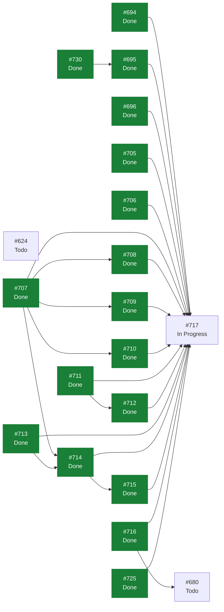

# eVault — Estado del Backlog

> **Documento generado. No editar a mano.**
> Se regenera con `scripts/status.sh` leyendo GitHub, que es la única fuente
> de verdad del estado. Si algo aquí no refleja la realidad, corregirlo en
> GitHub y volver a generar. Las secciones delimitadas como manuales sí se
> editan a mano y el generador las preserva. Ver `docs/GUIDE.md`.

Generado: 2026-09-29
Fuente: [ecamp0s/evault](https://github.com/ecamp0s/evault/issues) y Project «eVault»
Issues: 354 en total, 351 cerrados, 3 abiertos

---

## 1) Objetivo de la iteración

<!-- manual:objetivo -->
**Iteración 19: nada se pierde sin querer y nada queda abierto sin saberlo.** Planificada el 28 de septiembre de 2026 (#706).

Es **`ADR-018` entero en vigor**, más poder irse del todo. De aquel ADR rige el historial desde la 17 y la caducidad del token desde el #177; faltan las dos cosas que dan marcha atrás o cierran una puerta:

- **La papelera** (`ADR-018` §2.4): borrar una entrada la deja treinta días en el servidor, de donde se restaura con su mismo `id`, y una purga programada la vacía. Encima, un «Deshacer» inmediato. Hoy un borrado por error en la vault real solo se deshace restaurando la instancia entera.
- **Cerrar las demás sesiones sin rotar la maestra** (`ADR-018` §2.5), viendo cuáles hay. Desde la 18 hay tokens de la web y de la extensión, y la única palanca para cerrarlos es reenvolver las claves.
- **Borrar la cuenta**, que hoy no existe. Con `ADR-024` antes del código: qué se borra, qué conservan las copias y durante cuánto.

**Y además**, sin ser el objetivo:

- **Firefox, como medida acotada** (#716): si una extensión de Firefox obtiene el mismo PRF con Windows Hello real. La custodia, la firma y la implementación siguen en el [#680](https://github.com/ecamp0s/evault/issues/680), que sale de la 19 y queda bloqueado por la medida.
- **La deuda del cierre de la 18**: [#694](https://github.com/ecamp0s/evault/issues/694), [#695](https://github.com/ecamp0s/evault/issues/695) y [#696](https://github.com/ecamp0s/evault/issues/696). Y el [#705](https://github.com/ecamp0s/evault/issues/705), abierto el 27 de septiembre: `verify-extension` sale 4 de 5 en esta máquina porque su lector del portapapeles recibe una cadena vacía, sin que falle la extensión.
- **Los tres PRs de Dependabot abiertos**, #700, #701 y #702.

**Lo que se decidió dejar fuera:** el [#624](https://github.com/ecamp0s/evault/issues/624), reconciliar sin red, se queda en el backlog en `Low`, porque no hay un camino roto sino uno que no existe. Y **la limpieza de la vault real** —un modo de revisión desde la auditoría y comprobar contraseñas filtradas, que pide su propio ADR— se deja como candidata de la 20.

| Bloque | Issues |
| --- | --- |
| 0, planificar | #706 |
| 1, la deuda y el utillaje | #694, #695, #696, #705 |
| 2, la papelera | #707 → #708, #709, #710 |
| 3, las sesiones | #711 → #712 |
| 4, borrar la cuenta | #713 → #714 → #715, que además espera a #707 |
| 5, Firefox | #716 |
| 6, el cierre | #717 |
<!-- /manual:objetivo -->

## 2) Qué se puede tomar ahora

Issues abiertos sin ningún bloqueante abierto, ordenados por prioridad. El primero de la lista es lo siguiente a tomar.

1. [#680](https://github.com/ecamp0s/evault/issues/680) feat(extension): la extensión en Firefox (Medium)
1. [#717](https://github.com/ecamp0s/evault/issues/717) docs: cerrar la Iteración 19 (Medium) — **en curso**
1. [#624](https://github.com/ecamp0s/evault/issues/624) feat(web): reconciliar sin red (Low)

## 3) Backlog

Lo abierto y todo lo de las iteraciones que siguen abiertas.

| Issue | Título | Labels | Estado | Prioridad | Bloqueada por | Bloquea a |
| --- | --- | --- | --- | --- | --- | --- |
| [#624](https://github.com/ecamp0s/evault/issues/624) | feat(web): reconciliar sin red | `feat` `web` | Todo | Low | #619 | — |
| [#680](https://github.com/ecamp0s/evault/issues/680) | feat(extension): la extensión en Firefox | `feat` `extension` | Todo | Medium | #675, #716 | — |
| [#694](https://github.com/ecamp0s/evault/issues/694) | chore(repo): verify-extension también comprueba rellenar | `chore` `deuda` `extension` `s19` | Done | Medium | — | #717 |
| [#695](https://github.com/ecamp0s/evault/issues/695) | chore(repo): verify-auto-lock vigila el aviso en vez de mirarlo a los 14:45 | `chore` `web` `deuda` `s19` | Done | Medium | #730 | #717 |
| [#696](https://github.com/ecamp0s/evault/issues/696) | chore(web): quitar el aviso «Encountered a script tag» de React 19.3 | `chore` `web` `deuda` `s19` | Done | Medium | — | #717 |
| [#703](https://github.com/ecamp0s/evault/issues/703) | chore(repo): levantar el entorno de desarrollo con Docker, como eDrive | `chore` `s19` | Done | Medium | — | — |
| [#705](https://github.com/ecamp0s/evault/issues/705) | bug(repo): verify-extension no puede leer el portapapeles en esta máquina | `bug` `extension` `s19` | Done | Medium | — | #717 |
| [#706](https://github.com/ecamp0s/evault/issues/706) | docs: planificar la Iteración 19 | `documentation` `s19` | Done | High | — | #717 |
| [#707](https://github.com/ecamp0s/evault/issues/707) | feat(api): borrar una entrada la deja en la papelera | `feat` `api` `s19` | Done | High | — | #708, #709, #710, #714, #717 |
| [#708](https://github.com/ecamp0s/evault/issues/708) | feat(api): la papelera se vacía sola a los 30 días | `feat` `api` `s19` | Done | Medium | #707 | #717 |
| [#709](https://github.com/ecamp0s/evault/issues/709) | feat(web): la papelera: ver lo borrado, restaurarlo y borrarlo del todo | `feat` `web` `s19` | Done | Medium | #707 | #717 |
| [#710](https://github.com/ecamp0s/evault/issues/710) | feat(web): «Deshacer» justo después de borrar una entrada | `feat` `web` `s19` | Done | Medium | #707 | #717 |
| [#711](https://github.com/ecamp0s/evault/issues/711) | feat(api): listar las sesiones abiertas y cerrar las demás | `feat` `api` `s19` | Done | High | — | #712, #717 |
| [#712](https://github.com/ecamp0s/evault/issues/712) | feat(web): la pantalla de sesiones abiertas | `feat` `web` `s19` | Done | Medium | #711 | #717 |
| [#713](https://github.com/ecamp0s/evault/issues/713) | docs: ADR-024, borrar la cuenta | `documentation` `s19` | Done | Medium | — | #714, #717 |
| [#714](https://github.com/ecamp0s/evault/issues/714) | feat(api): borrar la cuenta | `feat` `api` `s19` | Done | Medium | #707, #713 | #715, #717 |
| [#715](https://github.com/ecamp0s/evault/issues/715) | feat(web): borrar la cuenta desde la web | `feat` `web` `s19` | Done | Medium | #714 | #717 |
| [#716](https://github.com/ecamp0s/evault/issues/716) | chore(extension): medir el PRF desde una extensión de Firefox con Windows Hello | `chore` `extension` `s19` | Done | Medium | — | #680, #717 |
| [#717](https://github.com/ecamp0s/evault/issues/717) | docs: cerrar la Iteración 19 | `documentation` `s19` | In Progress | Medium | #694, #695, #696, #705, #706, #707, #708, #709, #710, #711, #712, #713, #714, #715, #716, #725 | — |
| [#725](https://github.com/ecamp0s/evault/issues/725) | feat(web): recargar la página no deja una sesión abierta por cada recarga | `feat` `api` `web` `s19` | Done | Medium | — | #717 |
| [#730](https://github.com/ecamp0s/evault/issues/730) | fix(api): las altas simultáneas mueren por un deadlock de MySQL | `bug` `api` `s19` | Done | High | — | #695 |

Las iteraciones cerradas no se pintan aquí: sus issues están en GitHub y lo que se aprendió, en `docs/planning/archive/`. Cada issue cuenta en la última iteración que lo lleva, así que el enlace de una puede enseñar alguno más: los que empezaron en ella y se cerraron en otra.

| Iteración | Issues | Dónde verlos |
| --- | --- | --- |
| 18 | 16 | [label `s18`](https://github.com/ecamp0s/evault/issues?q=is%3Aissue+label%3As18) |
| 17 | 24 | [label `s17`](https://github.com/ecamp0s/evault/issues?q=is%3Aissue+label%3As17) |
| 16 | 26 | [label `s16`](https://github.com/ecamp0s/evault/issues?q=is%3Aissue+label%3As16) |
| 15 | 26 | [label `s15`](https://github.com/ecamp0s/evault/issues?q=is%3Aissue+label%3As15) |
| 14 | 22 | [label `s14`](https://github.com/ecamp0s/evault/issues?q=is%3Aissue+label%3As14) |
| 13 | 23 | [label `s13`](https://github.com/ecamp0s/evault/issues?q=is%3Aissue+label%3As13) |
| 12 | 20 | [label `s12`](https://github.com/ecamp0s/evault/issues?q=is%3Aissue+label%3As12) |
| 11 | 13 | [label `s11`](https://github.com/ecamp0s/evault/issues?q=is%3Aissue+label%3As11) |
| 10 | 16 | [label `s10`](https://github.com/ecamp0s/evault/issues?q=is%3Aissue+label%3As10) |
| 9 | 16 | [label `s9`](https://github.com/ecamp0s/evault/issues?q=is%3Aissue+label%3As9) |
| 8 | 10 | [label `s8`](https://github.com/ecamp0s/evault/issues?q=is%3Aissue+label%3As8) |
| 7 | 19 | [label `s7`](https://github.com/ecamp0s/evault/issues?q=is%3Aissue+label%3As7) |
| 6 | 16 | [label `s6`](https://github.com/ecamp0s/evault/issues?q=is%3Aissue+label%3As6) |
| 5 | 12 | [label `s5`](https://github.com/ecamp0s/evault/issues?q=is%3Aissue+label%3As5) |
| 4 | 19 | [label `s4`](https://github.com/ecamp0s/evault/issues?q=is%3Aissue+label%3As4) |
| 3 | 14 | [label `s3`](https://github.com/ecamp0s/evault/issues?q=is%3Aissue+label%3As3) |
| 2 | 13 | [label `s2`](https://github.com/ecamp0s/evault/issues?q=is%3Aissue+label%3As2) |
| 1 | 19 | [label `s1`](https://github.com/ecamp0s/evault/issues?q=is%3Aissue+label%3As1) |
| sin iteración | 11 | [sin label de iteración](https://github.com/ecamp0s/evault/issues?q=is%3Aissue+-label%3As19+-label%3As18+-label%3As17+-label%3As16+-label%3As15+-label%3As14+-label%3As13+-label%3As12+-label%3As11+-label%3As10+-label%3As9+-label%3As8+-label%3As7+-label%3As6+-label%3As5+-label%3As4+-label%3As3+-label%3As2+-label%3As1) |

## 4) Grafo de dependencias

```mermaid
graph LR
  I624["#624<br/>Todo"]
  I680["#680<br/>Todo"]
  I694["#694<br/>Done"]
  I695["#695<br/>Done"]
  I696["#696<br/>Done"]
  I705["#705<br/>Done"]
  I706["#706<br/>Done"]
  I707["#707<br/>Done"]
  I708["#708<br/>Done"]
  I709["#709<br/>Done"]
  I710["#710<br/>Done"]
  I711["#711<br/>Done"]
  I712["#712<br/>Done"]
  I713["#713<br/>Done"]
  I714["#714<br/>Done"]
  I715["#715<br/>Done"]
  I716["#716<br/>Done"]
  I717["#717<br/>In Progress"]
  I725["#725<br/>Done"]
  I730["#730<br/>Done"]
  I694 --> I717
  I695 --> I717
  I696 --> I717
  I705 --> I717
  I706 --> I717
  I707 --> I708
  I707 --> I709
  I707 --> I710
  I707 --> I714
  I707 --> I717
  I708 --> I717
  I709 --> I717
  I710 --> I717
  I711 --> I712
  I711 --> I717
  I712 --> I717
  I713 --> I714
  I713 --> I717
  I714 --> I715
  I714 --> I717
  I715 --> I717
  I716 --> I680
  I716 --> I717
  I725 --> I717
  I730 --> I695
  classDef hecho fill:#1a7f37,stroke:#1a7f37,color:#fff;
  class I694,I695,I696,I705,I706,I707,I708,I709,I710,I711,I712,I713,I714,I715,I716,I725,I730 hecho;
```

La flecha va del bloqueante al bloqueado. En verde, lo ya cerrado.

## 5) Criterios de salida de la iteración

<!-- manual:salida -->
### Iteración 19, en curso

Escritos al abrirla, el 28 de septiembre de 2026.

1. **Borrar una entrada la deja en la papelera**, de donde se restaura con el mismo `id` y el mismo blob, y «Deshacer» la devuelve sin pasar por ella. Verificado en navegador.
2. **La papelera se vacía sola**: `evault:purge-trash` purga lo que lleva más de 30 días, se pone al día tras varios días sin correr —kastor se apaga— y está en el cron de kastor, comprobado que corre.
3. **Una copia conserva la papelera y una restauración la devuelve**, comprobado y no supuesto, como pide `ADR-018` §7.
4. **Se cierran las demás sesiones sin rotar la maestra**, verificado con la extensión desbloqueada: su siguiente petición falla y el popup vuelve a pedir el passkey.
5. **`ADR-024` registrado antes de la primera línea que borra una cuenta**, y borrarla deja la base sin nada de ella salvo lo que el ADR diga, con tests de aislamiento cross-tenant.
6. **El PRF desde una extensión de Firefox, medido con Windows Hello real**, y el resultado escrito en el #680.
7. **#694, #695, #696 y #705 cerrados**, y los cuatro verificadores ejecutados el día del cierre, en verde.
8. **kastor desplegada** con la copia de antes fuera de la máquina y la huella de las entradas vivas idéntica antes y después.
9. **Cero PRs de Dependabot abiertos** al cerrar.
<!-- /manual:salida -->

## 6) Riesgos

<!-- manual:riesgos -->
| Riesgo | Estado | Detalle |
| --- | --- | --- |
| **La primera migración sobre la vault real desde el #585** | `Abierto` | `deleted_at` es la primera columna que se añade a `vault_items` desde que se creó, el 1 de agosto de 2026, y lo que se rompa ahí no es reproducible. Se despliega como dice `DEPLOYMENT.md` §7 —contar, copiar fuera y sacar la huella— y con `--force-recreate`, sin el cual las migraciones no se aplican. |
| **Una papelera que no se vacía es un borrado que no borra** | `Abierto, #708` | Lo dice `ADR-018` §2.4, y aquí tiene un motivo concreto: kastor se apaga queriendo, y el cron de las 3 puede no correr en días. La purga se diseña para ponerse al día y se comprueba en kastor, no solo en los tests. |
| **Un secreto borrado sigue treinta días en el servidor** | `Abierto, #707` | La papelera es lo que hace deshacible un borrado, y también lo que hace que borrar una contraseña filtrada no la quite. De ahí que borrar definitivamente desde la papelera esté en el #707 aunque `ADR-018` no lo nombre. |
| **Borrar la cuenta no tiene vuelta, y las copias la conservan** | `Abierto, #713` | Siete días en la máquina y lo que dure la retención fuera. `ADR-024` lo tiene que decir, y la pantalla, antes de confirmar. |
| **Una pestaña abierta desde antes de un despliegue sigue con el código viejo** | `Abierto, heredado de la 17` | Un paso de cada despliegue. Con la papelera, una pestaña vieja que borra deja la entrada en la papelera igualmente, porque lo decide el servidor; lo que no verá es la pantalla nueva. La extensión tampoco se actualiza sola (`ADR-023` §5.3), y **esta iteración sí la cambia**: desde el #711 dice que es la extensión al pedir el token. La build de kastor hay que reconstruirla al desplegar; mientras no se haga funciona igual, pero sus sesiones salen en la lista como sin identificar. |
| **Un cierre de golpe del navegador deja un token vivo** | `Asumido en ADR-023 §5.6, se mitiga con el #712` | Sigue valiendo hasta las 12 horas. Desde el #712 se ve en la lista de sesiones y se cierra sin rotar la maestra. |
| **El rellenado no tenía verificador de navegador** | `Cerrado en el #694` | `verify-extension` rellena ahora en páginas que sirve él mismo: en su sitio, sin enviar, sin tocar tres trampas invisibles, y se niega en un marco, con la pestaña cambiada de host y en otro sitio. |
| **`verify-auto-lock` podía salir en rojo sin que el código falle** | `Cerrado en el #695` | Los casos 7, 8 y 9 vigilan el aviso en vez de mirarlo a los 14:45, y la espera sigue el reloj de pared, que en este WSL2 adelanta un 3,6 % sobre el monótono. 8 de 8 en verde, y con el aviso sin nombrar lo que se pierde, rojos exactamente el 7 y el 8. |
| **`verify-extension` no podía leer el portapapeles en esta máquina** | `Cerrado en el #705` | No era la máquina ni el snap: en Chromium 153 y 154 lo que escribe una pestaña que no está al frente se pierde, y el lector era esa pestaña. Ahora se trae al frente, y el caso sale en verde. |
| **La medida de Firefox depende del portátil** | `Abierto, #716` | Solo Windows Hello real dice algo de Firefox; el autenticador virtual es de Chromium. Un «no» es un resultado válido y cierra el #680, no la iteración. |
<!-- /manual:riesgos -->
