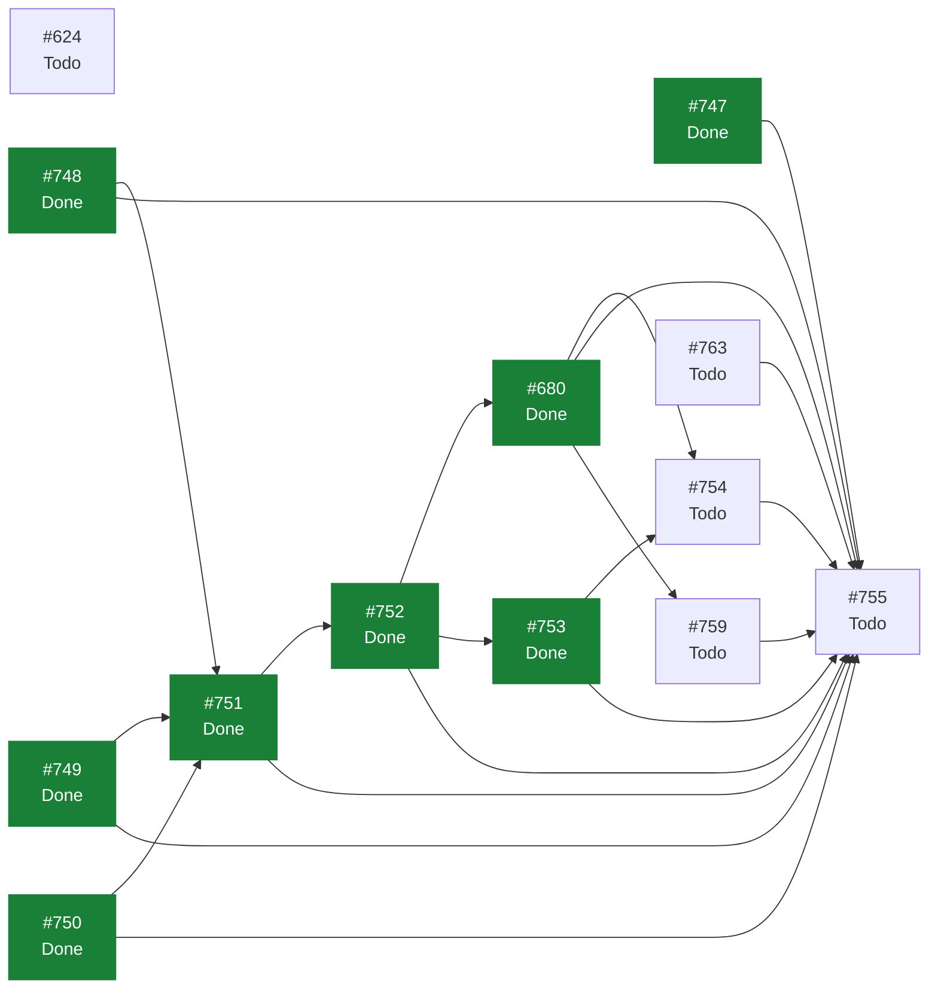

# eVault — Estado del Backlog

> **Documento generado. No editar a mano.**
> Se regenera con `scripts/status.sh` leyendo GitHub, que es la única fuente
> de verdad del estado. Si algo aquí no refleja la realidad, corregirlo en
> GitHub y volver a generar. Las secciones delimitadas como manuales sí se
> editan a mano y el generador las preserva. Ver `docs/GUIDE.md`.

Generado: 2026-10-05
Fuente: [ecamp0s/evault](https://github.com/ecamp0s/evault/issues) y Project «eVault»
Issues: 367 en total, 362 cerrados, 5 abiertos

---

## 1) Objetivo de la iteración

<!-- manual:objetivo -->
**Iteración 20: la vault se abre desde Firefox.** Planificada el 5 de octubre de 2026 (#747).

Es el [#680](https://github.com/ecamp0s/evault/issues/680) entero, con la misma extensión que en Chrome y no con una copia. Quien la va a usar tiene Firefox en Windows, que es justo lo que midió el #716: una extensión de Firefox 155 obtiene el mismo PRF con Windows Hello y abre el envoltorio que guardó la web.

**Se mide antes de decidir y se decide antes de construir**, como en la 18:

- **Tres medidas**: dónde vive la clave sin documento *offscreen*, que incluye el bloqueo del sistema, el portapapeles y el relleno (#748); la firma *unlisted* de Mozilla y la instalación (#749); y si un verificador puede conducir la extensión en Firefox (#750).
- **`ADR-025`** (#751), con las tres delante. Decide la custodia, la instalación con el criterio 1 de `ADR-015` delante, qué deja de valer de `ADR-023` en Firefox y cómo se verifica.
- **Construir sin copiar**: lo propio de Chrome detrás de interfaces (#752), la extensión de Firefox (#680), su verificador (#759), que añadió el ADR, y que la lista de sesiones diga desde qué navegador se abrió (#753), porque hoy diría «Extensión de Chrome».
- **Y en el Firefox de verdad**, con Windows Hello real (#754).

**Se firma con una cuenta de addons.mozilla.org**, que crea quien tiene la vault: Firefox normal solo instala extensiones firmadas por Mozilla.

**Lo que se decidió dejar fuera**, con el motivo en `SPRINT_CONTEXT.md`: **el despliegue automático**, que sigue siendo manual; **la limpieza de la vault real**; **la vía A del #725**; y el [#624](https://github.com/ecamp0s/evault/issues/624), que se queda en el backlog en `Low`.

| Bloque | Issues |
| --- | --- |
| 0, planificar | #747 |
| 1, medir | #748, #749, #750 |
| 2, decidir | #751 |
| 3, construir | #752 → #680 → #759, y #753 |
| 4, en el Firefox de verdad | #754 |
| 5, el cierre | #755 |
<!-- /manual:objetivo -->

## 2) Qué se puede tomar ahora

Issues abiertos sin ningún bloqueante abierto, ordenados por prioridad. El primero de la lista es lo siguiente a tomar.

1. [#754](https://github.com/ecamp0s/evault/issues/754) chore(extension): la extensión en el Firefox de Windows, con Windows Hello real (Medium)
1. [#759](https://github.com/ecamp0s/evault/issues/759) chore(repo): un verificador para la extensión de Firefox (Medium)
1. [#763](https://github.com/ecamp0s/evault/issues/763) bug(web): el Vite del entorno de desarrollo recarga con cada fichero de la cobertura (Medium)
1. [#624](https://github.com/ecamp0s/evault/issues/624) feat(web): reconciliar sin red (Low)

## 3) Backlog

Lo abierto y todo lo de las iteraciones que siguen abiertas.

| Issue | Título | Labels | Estado | Prioridad | Bloqueada por | Bloquea a |
| --- | --- | --- | --- | --- | --- | --- |
| [#624](https://github.com/ecamp0s/evault/issues/624) | feat(web): reconciliar sin red | `feat` `web` | Todo | Low | #619 | — |
| [#680](https://github.com/ecamp0s/evault/issues/680) | feat(extension): la extensión en Firefox | `feat` `extension` `s20` | Done | Medium | #675, #716, #752 | #754, #755, #759 |
| [#747](https://github.com/ecamp0s/evault/issues/747) | docs: planificar la Iteración 20 | `documentation` `s20` | Done | High | — | #755 |
| [#748](https://github.com/ecamp0s/evault/issues/748) | chore(extension): medir dónde vive la clave en una extensión de Firefox | `chore` `extension` `s20` | Done | High | — | #751, #755 |
| [#749](https://github.com/ecamp0s/evault/issues/749) | chore(extension): medir la firma de Mozilla y la instalación en Firefox | `chore` `extension` `s20` | Done | Medium | — | #751, #755 |
| [#750](https://github.com/ecamp0s/evault/issues/750) | chore(repo): medir si un verificador puede conducir la extensión en Firefox | `chore` `extension` `s20` | Done | Medium | — | #751, #755 |
| [#751](https://github.com/ecamp0s/evault/issues/751) | docs: ADR-025, la extensión en Firefox | `documentation` `extension` `s20` | Done | High | #748, #749, #750 | #752, #755 |
| [#752](https://github.com/ecamp0s/evault/issues/752) | refactor(extension): lo propio de Chrome detrás de interfaces | `chore` `extension` `s20` | Done | Medium | #751 | #680, #753, #755 |
| [#753](https://github.com/ecamp0s/evault/issues/753) | feat(api): la lista de sesiones dice desde qué navegador se abrió la extensión | `feat` `api` `web` `s20` | Done | Medium | #752 | #754, #755 |
| [#754](https://github.com/ecamp0s/evault/issues/754) | chore(extension): la extensión en el Firefox de Windows, con Windows Hello real | `chore` `extension` `s20` | Todo | Medium | #680, #753 | #755 |
| [#755](https://github.com/ecamp0s/evault/issues/755) | docs: cerrar la Iteración 20 | `documentation` `s20` | Todo | Medium | #680, #747, #748, #749, #750, #751, #752, #753, #754, #759, #763 | — |
| [#757](https://github.com/ecamp0s/evault/issues/757) | chore(repo): subir brace-expansion por dos alertas de Dependabot | `chore` `dependencies` `s20` | Done | — | — | — |
| [#759](https://github.com/ecamp0s/evault/issues/759) | chore(repo): un verificador para la extensión de Firefox | `chore` `extension` `s20` | Todo | Medium | #680 | #755 |
| [#763](https://github.com/ecamp0s/evault/issues/763) | bug(web): el Vite del entorno de desarrollo recarga con cada fichero de la cobertura | `bug` `web` `s20` | Todo | Medium | — | #755 |

Las iteraciones cerradas no se pintan aquí: sus issues están en GitHub y lo que se aprendió, en `docs/planning/archive/`. Cada issue cuenta en la última iteración que lo lleva, así que el enlace de una puede enseñar alguno más: los que empezaron en ella y se cerraron en otra.

| Iteración | Issues | Dónde verlos |
| --- | --- | --- |
| 19 | 19 | [label `s19`](https://github.com/ecamp0s/evault/issues?q=is%3Aissue+label%3As19) |
| 18 | 16 | [label `s18`](https://github.com/ecamp0s/evault/issues?q=is%3Aissue+label%3As18) |
| 17 | 24 | [label `s17`](https://github.com/ecamp0s/evault/issues?q=is%3Aissue+label%3As17) |
| 16 | 26 | [label `s16`](https://github.com/ecamp0s/evault/issues?q=is%3Aissue+label%3As16) |
| 15 | 26 | [label `s15`](https://github.com/ecamp0s/evault/issues?q=is%3Aissue+label%3As15) |
| 14 | 22 | [label `s14`](https://github.com/ecamp0s/evault/issues?q=is%3Aissue+label%3As14) |
| 13 | 23 | [label `s13`](https://github.com/ecamp0s/evault/issues?q=is%3Aissue+label%3As13) |
| 12 | 20 | [label `s12`](https://github.com/ecamp0s/evault/issues?q=is%3Aissue+label%3As12) |
| 11 | 13 | [label `s11`](https://github.com/ecamp0s/evault/issues?q=is%3Aissue+label%3As11) |
| 10 | 16 | [label `s10`](https://github.com/ecamp0s/evault/issues?q=is%3Aissue+label%3As10) |
| 9 | 16 | [label `s9`](https://github.com/ecamp0s/evault/issues?q=is%3Aissue+label%3As9) |
| 8 | 10 | [label `s8`](https://github.com/ecamp0s/evault/issues?q=is%3Aissue+label%3As8) |
| 7 | 19 | [label `s7`](https://github.com/ecamp0s/evault/issues?q=is%3Aissue+label%3As7) |
| 6 | 16 | [label `s6`](https://github.com/ecamp0s/evault/issues?q=is%3Aissue+label%3As6) |
| 5 | 12 | [label `s5`](https://github.com/ecamp0s/evault/issues?q=is%3Aissue+label%3As5) |
| 4 | 19 | [label `s4`](https://github.com/ecamp0s/evault/issues?q=is%3Aissue+label%3As4) |
| 3 | 14 | [label `s3`](https://github.com/ecamp0s/evault/issues?q=is%3Aissue+label%3As3) |
| 2 | 13 | [label `s2`](https://github.com/ecamp0s/evault/issues?q=is%3Aissue+label%3As2) |
| 1 | 19 | [label `s1`](https://github.com/ecamp0s/evault/issues?q=is%3Aissue+label%3As1) |
| sin iteración | 11 | [sin label de iteración](https://github.com/ecamp0s/evault/issues?q=is%3Aissue+-label%3As20+-label%3As19+-label%3As18+-label%3As17+-label%3As16+-label%3As15+-label%3As14+-label%3As13+-label%3As12+-label%3As11+-label%3As10+-label%3As9+-label%3As8+-label%3As7+-label%3As6+-label%3As5+-label%3As4+-label%3As3+-label%3As2+-label%3As1) |

## 4) Grafo de dependencias

```mermaid
graph LR
  I624["#624<br/>Todo"]
  I680["#680<br/>Done"]
  I747["#747<br/>Done"]
  I748["#748<br/>Done"]
  I749["#749<br/>Done"]
  I750["#750<br/>Done"]
  I751["#751<br/>Done"]
  I752["#752<br/>Done"]
  I753["#753<br/>Done"]
  I754["#754<br/>Todo"]
  I755["#755<br/>Todo"]
  I759["#759<br/>Todo"]
  I763["#763<br/>Todo"]
  I680 --> I754
  I680 --> I755
  I680 --> I759
  I747 --> I755
  I748 --> I751
  I748 --> I755
  I749 --> I751
  I749 --> I755
  I750 --> I751
  I750 --> I755
  I751 --> I752
  I751 --> I755
  I752 --> I680
  I752 --> I753
  I752 --> I755
  I753 --> I754
  I753 --> I755
  I754 --> I755
  I759 --> I755
  I763 --> I755
  classDef hecho fill:#1a7f37,stroke:#1a7f37,color:#fff;
  class I680,I747,I748,I749,I750,I751,I752,I753 hecho;
```

La flecha va del bloqueante al bloqueado. En verde, lo ya cerrado.

## 5) Criterios de salida de la iteración

<!-- manual:salida -->
### Iteración 20

1. **La custodia medida en Firefox** (#748): una clave no extraíble que sobrevive sin tocar nada y llega intacta al popup, y el bloqueo del sistema, el portapapeles con el popup cerrado y el relleno con un gesto, cada uno con su resultado o su alternativa medida.
2. **La firma medida** (#749): el `.xpi` firmado es la build más la firma, se queda instalado al reiniciar Firefox y no se actualiza solo.
3. **`ADR-025` aprobado** (#751), con las tres medidas citadas y lo que se aparta de `ADR-023` dicho uno por uno.
4. **Una sola extensión**: las builds de Chrome y de Firefox salen del mismo `extension/src`, y un test falla si una API propia de un navegador aparece fuera de su módulo (#752).
5. **La de Chrome sigue igual**: `verify-extension` 8 de 8 sobre el master del cierre. **Y la de Firefox tiene su verificador** (#759), que `ADR-025` §2.7 añadió a la iteración, en verde sobre el mismo master.
6. **La sesión de Firefox se lista como de Firefox**, y las de Chrome que ya existen siguen saliendo bien (#753).
7. **La vault se abre desde el Firefox de Windows de quien la va a usar**, con Windows Hello real, contra kastor, y lo que el verificador no cubra se comprueba a mano caso por caso (#754).
8. **kastor desplegada**, con la copia de antes fuera de la máquina y la huella de las entradas idéntica antes y después, y las dos extensiones reconstruidas desde el master del cierre.
<!-- /manual:salida -->

## 6) Riesgos

<!-- manual:riesgos -->
| Riesgo | Estado | Detalle |
| --- | --- | --- |
| **Que Firefox no tenga dónde guardar la clave sin rebajar `ADR-007`** | `Abierto: lo contesta el #748` | La salida probable es Manifest V2 con fondo persistente. Si una `CryptoKey` no extraíble no sobrevive ahí, quedan opciones que `ADR-023` §2.2 ya descartó para Chrome, y el ADR tendría que volver sobre ellas en vez de heredarlas. |
| **Que Firefox no avise del bloqueo del sistema** | `Abierto: lo contesta el #748` | La extensión de Chrome solo bloquea con el estado `locked` de `idle`. Si Firefox no lo da, la extensión se queda abierta con Windows bloqueado hasta los quince minutos de inactividad, y eso lo tiene que decidir `ADR-025`, no descubrirse en el #754. |
| **Firmar es subir el código a Mozilla** | `Abierto: lo contesta el #749` | `ADR-023` §2.6 da como ventaja de la extensión que no la sirve nadie. El #749 mide si lo firmado es exactamente lo construido y si Firefox la puede actualizar por su cuenta. |
| **Que Mozilla retire Manifest V2** | `Abierto, sin fecha` | Mozilla ha dicho que lo mantiene. Si la custodia depende de él, `ADR-025` lo deja escrito como disparador. |
| **El límite de desbloqueos con passkey se comparte** | `Asumido en ADR-023 §5.5` | Cinco por hora y cuenta, entre la web, la extensión y todos los dispositivos. Firefox es un cliente más que tira del mismo límite. |
| **Una pestaña abierta desde antes de un despliegue sigue con el código viejo** | `Abierto, heredado: es un paso de cada despliegue` | El service worker nuevo toma el control, pero una página ya cargada ejecuta su código hasta que se recarga, y ninguna extensión se actualiza sola al desplegar (`ADR-023` §5.3). Que sean de solo lectura es lo que impide que eso cueste datos. |
| **La suite no ve lo que hace MySQL** | `Abierto, sin issue: es una propiedad de la suite` | Los tests corren en SQLite, que no tiene bloqueos de hueco, y el #730 encontró tres sitios del alta que en MySQL morían con dos peticiones a la vez. Lo que se hace a la vez se prueba también contra el MySQL de desarrollo. |
<!-- /manual:riesgos -->
