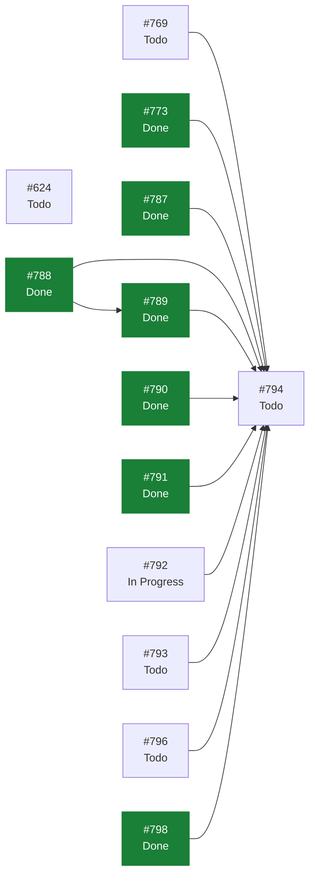

# eVault — Estado del Backlog

> **Documento generado. No editar a mano.**
> Se regenera con `scripts/status.sh` leyendo GitHub, que es la única fuente
> de verdad del estado. Si algo aquí no refleja la realidad, corregirlo en
> GitHub y volver a generar. Las secciones delimitadas como manuales sí se
> editan a mano y el generador las preserva. Ver `docs/GUIDE.md`.

Generado: 2026-10-09
Fuente: [ecamp0s/evault](https://github.com/ecamp0s/evault/issues) y Project «eVault»
Issues: 383 en total, 377 cerrados, 6 abiertos

---

## 1) Objetivo de la iteración

<!-- manual:objetivo -->
**Iteración 21: la vault se usa a diario con menos fricción.** Planificada el 9 de octubre de 2026 (#787).

En la web y en las dos extensiones, con lo que salió de recorrer la aplicación al planificarla, y **con el único bug abierto, el [#773](https://github.com/ecamp0s/evault/issues/773), cerrado en sitios de verdad** y no solo en el verificador: gravatar.com primero, que es donde tiene cuenta quien tiene la vault, y shein.com después.

- **La web**: bloquear a mano, que hoy solo pasa por inactividad o recargando (#788); `/` para buscar (#789); unos primeros pasos que recuerden la clave de recuperación y el passkey, derivados del estado de la cuenta y no guardados (#790); y Exportar e Importar en un menú, con una inicial por host en lugar del mismo globo en todas las filas, **sin favicons**, porque pedirlos diría a un tercero qué hay en la vault (#791).
- **La extensión**: el login en dos pasos de gravatar.com y shein.com, que **empieza por medir** con la función real en la página real, y la primera medida apunta al banner de cookies, que le quita el foco al campo (#773); un generador en el popup que **solo copia**, así que sigue siendo de solo lectura (#792); un atajo para abrir el popup, **si concede `activeTab`**, que es lo primero que se mide (#793); la ventana de desbloqueo de Firefox (#769), medida en la misma sesión que el #773; y **actualizar la de Firefox con un enlace de kastor**, instalando encima de la anterior y **sin `update_url`**, así que `ADR-025` §2.4 no cambia (#796).

**Lo que se decidió dejar fuera**, con el motivo en `SPRINT_CONTEXT.md`: **la limpieza de la vault real** con HIBP, candidata de la 22; **las vaults compartidas**, porque nadie quiere compartir nada aunque ya haya dos cuentas; **la maestra de 12 caracteres**, propuesta y no elegida; y el [#624](https://github.com/ecamp0s/evault/issues/624), en `Low`.

| Bloque | Issues |
| --- | --- |
| 0, planificar | #787 |
| 1, la web | #788 → #789, #790, #791 |
| 2, la extensión | #773, #792, #793, #769, #796 |
| 3, el cierre | #794 |
<!-- /manual:objetivo -->

## 2) Qué se puede tomar ahora

Issues abiertos sin ningún bloqueante abierto, ordenados por prioridad. El primero de la lista es lo siguiente a tomar.

1. [#792](https://github.com/ecamp0s/evault/issues/792) feat(extension): un generador de contraseñas en el popup, que solo copia (Medium) — **en curso**
1. [#796](https://github.com/ecamp0s/evault/issues/796) chore(extension): instalar la extensión de Firefox desde un enlace de kastor, sin quitar la anterior (Medium)
1. [#624](https://github.com/ecamp0s/evault/issues/624) feat(web): reconciliar sin red (Low)
1. [#769](https://github.com/ecamp0s/evault/issues/769) chore(extension): medir una ventana de desbloqueo en Firefox, o reabrir el popup al terminar (Low)
1. [#793](https://github.com/ecamp0s/evault/issues/793) feat(extension): un atajo de teclado para abrir el popup (Low)

## 3) Backlog

Lo abierto y todo lo de las iteraciones que siguen abiertas.

| Issue | Título | Labels | Estado | Prioridad | Bloqueada por | Bloquea a |
| --- | --- | --- | --- | --- | --- | --- |
| [#624](https://github.com/ecamp0s/evault/issues/624) | feat(web): reconciliar sin red | `feat` `web` | Todo | Low | #619 | — |
| [#769](https://github.com/ecamp0s/evault/issues/769) | chore(extension): medir una ventana de desbloqueo en Firefox, o reabrir el popup al terminar | `chore` `extension` `s21` | Todo | Low | — | #794 |
| [#773](https://github.com/ecamp0s/evault/issues/773) | bug(extension): el primer paso de un login en dos pasos no se rellena en sitios reales (shein.com, gravatar.com) | `bug` `extension` `s21` | Done | High | — | #794 |
| [#787](https://github.com/ecamp0s/evault/issues/787) | docs: planificar la Iteración 21 | `documentation` `s21` | Done | High | — | #794 |
| [#788](https://github.com/ecamp0s/evault/issues/788) | feat(web): bloquear la vault a mano, desde el menú y con un atajo | `feat` `web` `s21` | Done | High | — | #789, #794 |
| [#789](https://github.com/ecamp0s/evault/issues/789) | feat(web): atajos de teclado para buscar en la vault | `feat` `web` `s21` | Done | Medium | #788 | #794 |
| [#790](https://github.com/ecamp0s/evault/issues/790) | feat(web): primeros pasos tras crear la cuenta | `feat` `web` `s21` | Done | Medium | — | #794 |
| [#791](https://github.com/ecamp0s/evault/issues/791) | feat(web): Exportar e Importar en un menú, y una inicial por host en lugar del globo | `feat` `web` `s21` | Done | Medium | — | #794 |
| [#792](https://github.com/ecamp0s/evault/issues/792) | feat(extension): un generador de contraseñas en el popup, que solo copia | `feat` `extension` `s21` | In Progress | Medium | — | #794 |
| [#793](https://github.com/ecamp0s/evault/issues/793) | feat(extension): un atajo de teclado para abrir el popup | `feat` `extension` `s21` | Todo | Low | — | #794 |
| [#794](https://github.com/ecamp0s/evault/issues/794) | docs: cerrar la Iteración 21 | `documentation` `s21` | Todo | Medium | #769, #773, #787, #788, #789, #790, #791, #792, #793, #796, #798 | — |
| [#796](https://github.com/ecamp0s/evault/issues/796) | chore(extension): instalar la extensión de Firefox desde un enlace de kastor, sin quitar la anterior | `chore` `extension` `s21` | Todo | Medium | — | #794 |
| [#798](https://github.com/ecamp0s/evault/issues/798) | chore(extension): la instancia y la carpeta de Chrome, en un fichero fuera del repositorio | `chore` `extension` `s21` | Done | High | — | #794 |

Las iteraciones cerradas no se pintan aquí: sus issues están en GitHub y lo que se aprendió, en `docs/planning/archive/`. Cada issue cuenta en la última iteración que lo lleva, así que el enlace de una puede enseñar alguno más: los que empezaron en ella y se cerraron en otra.

| Iteración | Issues | Dónde verlos |
| --- | --- | --- |
| 20 | 16 | [label `s20`](https://github.com/ecamp0s/evault/issues?q=is%3Aissue+label%3As20) |
| 19 | 19 | [label `s19`](https://github.com/ecamp0s/evault/issues?q=is%3Aissue+label%3As19) |
| 18 | 16 | [label `s18`](https://github.com/ecamp0s/evault/issues?q=is%3Aissue+label%3As18) |
| 17 | 24 | [label `s17`](https://github.com/ecamp0s/evault/issues?q=is%3Aissue+label%3As17) |
| 16 | 26 | [label `s16`](https://github.com/ecamp0s/evault/issues?q=is%3Aissue+label%3As16) |
| 15 | 26 | [label `s15`](https://github.com/ecamp0s/evault/issues?q=is%3Aissue+label%3As15) |
| 14 | 22 | [label `s14`](https://github.com/ecamp0s/evault/issues?q=is%3Aissue+label%3As14) |
| 13 | 23 | [label `s13`](https://github.com/ecamp0s/evault/issues?q=is%3Aissue+label%3As13) |
| 12 | 20 | [label `s12`](https://github.com/ecamp0s/evault/issues?q=is%3Aissue+label%3As12) |
| 11 | 13 | [label `s11`](https://github.com/ecamp0s/evault/issues?q=is%3Aissue+label%3As11) |
| 10 | 16 | [label `s10`](https://github.com/ecamp0s/evault/issues?q=is%3Aissue+label%3As10) |
| 9 | 16 | [label `s9`](https://github.com/ecamp0s/evault/issues?q=is%3Aissue+label%3As9) |
| 8 | 10 | [label `s8`](https://github.com/ecamp0s/evault/issues?q=is%3Aissue+label%3As8) |
| 7 | 19 | [label `s7`](https://github.com/ecamp0s/evault/issues?q=is%3Aissue+label%3As7) |
| 6 | 16 | [label `s6`](https://github.com/ecamp0s/evault/issues?q=is%3Aissue+label%3As6) |
| 5 | 12 | [label `s5`](https://github.com/ecamp0s/evault/issues?q=is%3Aissue+label%3As5) |
| 4 | 19 | [label `s4`](https://github.com/ecamp0s/evault/issues?q=is%3Aissue+label%3As4) |
| 3 | 14 | [label `s3`](https://github.com/ecamp0s/evault/issues?q=is%3Aissue+label%3As3) |
| 2 | 13 | [label `s2`](https://github.com/ecamp0s/evault/issues?q=is%3Aissue+label%3As2) |
| 1 | 19 | [label `s1`](https://github.com/ecamp0s/evault/issues?q=is%3Aissue+label%3As1) |
| sin iteración | 12 | [sin label de iteración](https://github.com/ecamp0s/evault/issues?q=is%3Aissue+-label%3As21+-label%3As20+-label%3As19+-label%3As18+-label%3As17+-label%3As16+-label%3As15+-label%3As14+-label%3As13+-label%3As12+-label%3As11+-label%3As10+-label%3As9+-label%3As8+-label%3As7+-label%3As6+-label%3As5+-label%3As4+-label%3As3+-label%3As2+-label%3As1) |

## 4) Grafo de dependencias

```mermaid
graph LR
  I624["#624<br/>Todo"]
  I769["#769<br/>Todo"]
  I773["#773<br/>Done"]
  I787["#787<br/>Done"]
  I788["#788<br/>Done"]
  I789["#789<br/>Done"]
  I790["#790<br/>Done"]
  I791["#791<br/>Done"]
  I792["#792<br/>In Progress"]
  I793["#793<br/>Todo"]
  I794["#794<br/>Todo"]
  I796["#796<br/>Todo"]
  I798["#798<br/>Done"]
  I769 --> I794
  I773 --> I794
  I787 --> I794
  I788 --> I789
  I788 --> I794
  I789 --> I794
  I790 --> I794
  I791 --> I794
  I792 --> I794
  I793 --> I794
  I796 --> I794
  I798 --> I794
  classDef hecho fill:#1a7f37,stroke:#1a7f37,color:#fff;
  class I773,I787,I788,I789,I790,I791,I798 hecho;
```

La flecha va del bloqueante al bloqueado. En verde, lo ya cerrado.

## 5) Criterios de salida de la iteración

<!-- manual:salida -->
### Iteración 21

1. **La web se bloquea a mano**, desde el menú y con un atajo que no choca con Chrome ni con Firefox, por el mismo camino que el bloqueo por inactividad (#788).
2. **`/` busca y `Escape` vacía el buscador**, sin dispararse escribiendo en un campo (#789).
3. **Una cuenta sin clave de recuperación o sin passkey lo ve al abrir la vault**, y la tarjeta desaparece sola cuando deja de ser verdad (#790).
4. **La barra de la vault cabe en una fila a 390 px**, y cada entrada se distingue por su inicial sin una sola petición de red; `verify-large-vault` en verde con sus once límites (#791).
5. **El login de gravatar.com se rellena en Chrome y en Firefox reales**, con las cuatro medidas del #773 en un comentario y su caso en `verify-extension` nacido en rojo; y shein.com, cuando esté disponible la cuenta que lo usa.
6. **El popup genera y copia una contraseña** que se limpia como las demás, en los dos navegadores (#792).
7. **El atajo abre el popup y rellena**, o la medida que diga por qué no (#793).
8. **El #769 medido** en el Firefox de Windows con Windows Hello real, y cambiado solo si alguna opción sirve.
9. **La extensión de Firefox se actualiza desde un enlace de kastor**, encima de la anterior, y la vault se abre después con Windows Hello (#796).
10. **Las dos extensiones reconstruidas e instaladas** desde el master del cierre, y kastor desplegada si alguna PR tocó la API.
<!-- /manual:salida -->

## 6) Riesgos

<!-- manual:riesgos -->
| Riesgo | Estado | Detalle |
| --- | --- | --- |
| **Un verificador en verde no es un sitio real** | `Abierto, heredado: es un método` | El relleno del login en dos pasos salió en verde en `verify-extension` dos veces y falló las dos en shein.com. Lo resolvió el #773 midiendo en las páginas reales: el banner de cookies le quitaba el foco al campo, y la página del verificador no tenía banner. Lo que toca páginas ajenas se sigue comprobando a mano en un sitio de verdad antes de cerrarlo. |
| **Que un atajo choque con uno del navegador** | `Abierto: lo contestan el #788 y el #793` | Un atajo que el navegador se queda no llega a la página ni a la extensión, y falla en silencio. Se comprueba en Chrome y en Firefox sobre Windows, que es donde se usan. |
| **Que abrir el popup con el atajo no conceda `activeTab`** | `Abierto: lo contesta el #793` | El #673 midió que `openPopup()` no lo concede. Sin él el popup no sabe en qué sitio está y no rellena, y entonces el atajo sirve para buscar y copiar, no para rellenar. |
| **Que instalar encima de la versión anterior no funcione** | `Abierto: lo contesta el #796` | El #749 midió que nada actualiza la extensión de Firefox sola, pero no que una versión nueva se instale encima. Si no se puede, el enlace de kastor ahorra pasar el fichero y no quitar la anterior. |
| **Mover Importar rompe un verificador** | `Abierto: lo cubre el #791` | `verify-large-vault` busca un botón cuyo texto es exactamente «Importar». Se adapta en el mismo PR y se ejecuta entero. |
| **Que Mozilla retire Manifest V2** | `Abierto, sin fecha` | La extensión de Firefox guarda la clave en una página de fondo persistente, que solo existe en V2 (`ADR-025` §2.1). Mozilla ha dicho que lo mantiene; si anuncia lo contrario, es el disparador 1 de ese ADR. |
| **Una pestaña abierta desde antes de un despliegue sigue con el código viejo** | `Abierto, heredado: es un paso de cada despliegue` | Y ninguna de las dos extensiones se actualiza sola, y en esta iteración cambian las dos: la de Chrome se reconstruye en su carpeta y la de Firefox se firma con una versión nueva. Que sean de solo lectura es lo que impide que eso cueste datos. |
| **El límite de desbloqueos con passkey se comparte** | `Asumido en ADR-023 §5.5` | Cinco por hora y cuenta, entre la web y las dos extensiones de todos los dispositivos. |
| **La suite no ve lo que hace MySQL** | `Abierto, sin issue: es una propiedad de la suite` | Los tests corren en SQLite, que no tiene bloqueos de hueco (#730). Lo que se hace a la vez se prueba también contra el MySQL de desarrollo. |
<!-- /manual:riesgos -->
